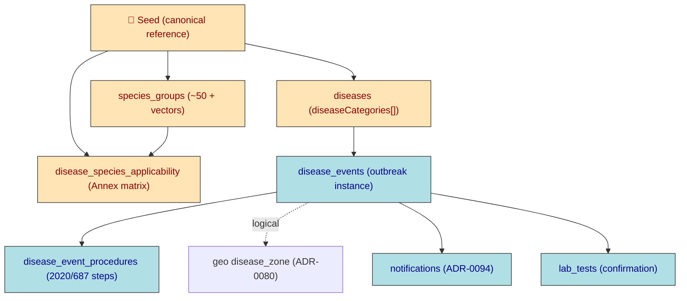

# ADR-0095: AHL Disease Master Data & Disease-Event Procedures (seeded reference)

> The Animal Health Law lists diseases by *category set*, not single category, and applies rules per
> *species group* — your `diseaseCategory` single-enum column and 5-species `SPECIES` enum cannot hold this.
> The listed-disease master data is **canonical jurisdiction reference data** and must be produced by the
> seed script so dev/staging/prod never diverge.

| Key            | Value               |
| -------------- | ------------------- |
| **Status**     | Proposed            |
| **Date**       | 2026-07-13          |
| **Author**     | Architecture Review |
| **Supersedes** | None                |
| **Superseded** | None                |

---

## Context

The four source regulations define the EU animal-health control framework:

- **(EU) 2016/429** (Animal Health Law, AHL) — framework: listing, categorisation, notification/reporting,
  surveillance, eradication programmes, disease-free status, movement.
- **(EU) 2018/1882** — implementing act; *defines categories A–E* and carries the **Annex list of ~75 listed
  diseases × species groups × vectors** (the seed source).
- **(EU) 2018/1629** — Delegated act amending AHL Annex II (the categorisation criteria + list).
- **(EU) 2020/687** — protection measures: suspicion → confirmation → restricted zone → culling →
  disinfection → repopulation, plus B/C disease-control measures.

The existing `diseases` table (ADR-0089 lineage) already carries `diseaseCategory` (A–E), `woahCode`,
`euAnnexRef`, `controlMeasures`, `quarantineDays`, `notifiable` — but three contradictions from the Real
break through:

1. **A disease is in a *set* of categories**, not one. The 1882 Annex shows *Foot-and-mouth disease = A+D+E*,
   *Brucellosis = B+D+E*, *IBR = C+D+E*, *Anthrax = D+E*. A single `disease_category` enum column cannot
   represent this; the control rules (AHL Art 9(1)) apply per category.
2. **Applicability is by *species group*** (Artiodactyla, Bovidae, *Bison ssp.*, *Culicoides spp.* — ~50
   taxonomic groups + vectors), not the 5 traceability species (`SPECIES` = BOVINE/OVINE/CAPRINE/PORCINE/
   EQUINE per ADR-0085 / 2021/520). Different taxonomy → needs a `species_groups` reference.
3. **Procedures are a workflow** (2020/687 chain), not a field. There is no `disease_events` / procedure
   table; the existing `notifications`, `lab_tests`, and geo `disease_zone` (ADR-0080) must be *reused*,
   not duplicated.

Backend ADR deps: disease master data / `diseaseCategory` / `controlMeasures` → ADR-0089; geo disease
zones (restricted/protection/surveillance zones) → ADR-0080; EUDR traceability rules-as-jurisdiction-data
pattern → ADR-0085; notifications → ADR-0094; tRPC → ADR-0032; validators → ADR-0018 / ADR-0019;
permission scoping → ADR-0022 / ADR-0006.

## Decision

**AHL listed-disease master data + species groups + applicability matrix are canonical *reference* data,
owned by the seed script** (`pnpm -C packages/database seed`). They are *not* hand-entered per environment,
so dev/staging/prod are byte-identical. Domain runtime (suspicions, confirmations, outbreaks) lives in
operational tables.

### 1. Extend `diseases` (master data)

- `diseaseCategories disease_category[] notNull` — the **full category set** (e.g. `{A,D,E}`).
- `diseaseCategory disease_category notNull` — kept as **primary** = most severe of the set (A>B>C>D>E).
- `listedDisease boolean notNull default true` — is this an AHL-listed disease?
- `legalBasis varchar` — e.g. `'Reg (EU) 2018/1882 Annex'`.
- (retain `woahCode`, `euAnnexRef`, `controlMeasures`, `quarantineDays`, `notifiable` — all listed
  diseases are `notifiable = true`).

### 2. New `species_groups` reference (the AHL taxonomy)

`id, code, scientificName, commonName, rank (CLASS|ORDER|FAMILY|GENUS|SPECIES|GROUP), parentCode
(self-ref), mapsToSpecies (FK →`species`enum, nullable), isVector boolean, euAnnexRef, isActive, audit`.
Seeded from the ~50 groups + vectors in the 1882 Annex; `mapsToSpecies` links *Bison/Bos/Bubalus ssp.*
→ BOVINE, *Ovis ssp.* → OVINE, etc.

### 3. New `disease_species_applicability` (the Annex matrix, normalised)

`id, diseaseId, speciesGroupId, role (HOST|VECTOR), categories disease_category[] notNull, isActive, audit`;
`unique(diseaseId, speciesGroupId, role)`. Each row = one disease × species/vector × the **category subset**
it is listed under (e.g. Brucellosis × *Bison ssp.* = `{B,D,E}`; × *Perissodactyla* = `{E}`).

### 4. New `disease_events` (the outbreak/investigation instance)

`id, diseaseId, farmId (FK farms, nullable — wild animals), detectedCategory, status
(SUSPICION|CONFIRMED|CONTAINED|RESOLVED|CLOSED), suspectedAt, confirmedAt, resolvedAt,
diseaseZoneId (logical ref → @rocky/geo disease_zone, ADR-0080), competentAuthority, notes, audit`.

### 5. New `disease_event_procedures` (the 2020/687 + AHL step log)

`id, eventId, procedureType, status (PLANNED|IN_PROGRESS|DONE|WAIVED), performedAt, performedBy,
outcome, notes, audit`. `procedureType` enumerates the regulated steps: `SUSPICION_REPORT,
INVESTIGATION, SAMPLING, TRACING, PRELIM_RESTRICTION, PRELIM_DISINFECTION, OFFICIAL_CONFIRMATION,
LAB_DIAGNOSIS, NOTIFY_COMMISSION, ESTABLISH_RESTRICTED_ZONE, PROTECTION_ZONE, SURVEILLANCE_ZONE,
MOVEMENT_RESTRICTION, CULLING, CARCASS_DISPOSAL, CLEANING_DISINFECTION, FALLOWING, REPOPULATION,
SURVEILLANCE_PROGRAMME, ERADICATION_PROGRAMME, DISEASE_FREE_STATUS`.

### Reuse (do not duplicate)

- `notifications` (ADR-0094) — AHL reporting (AHL Art 18–23) + 2020/687 Art 15 notify Commission.
- `lab_tests` (hd) — confirmation diagnosis (2020/687 Art 14).
- geo `disease_zone` (ADR-0080) — protection/surveillance/restricted zones; `disease_events.diseaseZoneId`
  is a **logical** cross-package link (no hard FK; geo owns the table).



## Consequences

### Positive

- AHL categorisation (A–E) and per-species-group applicability are modelled faithfully; control-measure
  selection and zone logic can be driven by data, not code.
- Reference data is identical across environments (seed-owned) — satisfies the "db won't differ in
  production" requirement.
- Reuses `notifications` / `lab_tests` / geo `disease_zone`; no schema duplication.

### Negative / Cost

- Two category representations on `diseases` (`diseaseCategory` primary + `diseaseCategories` array) —
  must stay consistent (seed derives primary from array).
- `species_groups` is a second species taxonomy alongside `SPECIES`; the `mapsToSpecies` bridge must be
  maintained.
- `disease_events.diseaseZoneId` is a logical (non-FK) link to geo — cross-package referential integrity
  is application-enforced.

### Neutral

- WOAH/OIE Terrestrial & Aquatic Manual codes per disease are an *enrichment* task (not in 1882); `woahCode`
  remains nullable until sourced.

## Implementation

- **Owning Bot:** Database Bot (schema + migration + `species_groups`/`disease_species_applicability`) and
  Health Bot (service/repository for `disease_events`/`disease_event_procedures`); seed data authored in
  `packages/database/src/seed/ahl-reference.ts` and wired into `seed.ts`.
- **RobotFarm pass:** update root `AGENTS.md` Bot descriptions (Database Bot, Health Bot) + WORKORDER.
- Seed module `seedAhlReference(db)` is **idempotent** (upsert by unique key: disease `name`, species
  `code`, applicability `(diseaseId, speciesGroupId, role)`), so re-running is safe and prod-identical.
- Replace the inline 16-entry `DISEASE_DEFS` block in `seed.ts` with the AHL full list (the vaccine–disease
  mappings already resolve by disease name, so they keep working).

## Verification (Definition of Done)

```bash
ls apps/docs/content/ADR/0095-ahl-disease-reference-and-events.md   # exists in canonical set
rg -n "ADR-00(80|85|89|94)" 0095-ahl-disease-reference-and-events.md # ≥1 backend dep cited
pnpm --filter @rocky/database typecheck                              # schema compiles
pnpm -C packages/database seed                                       # idempotent; re-run safe
psql … -c "SELECT count(*) FROM diseases WHERE listed_disease;"      # ~75 listed diseases
psql … -c "SELECT count(*) FROM species_groups;"                     # ~50 groups + vectors
psql … -c "SELECT count(*) FROM disease_species_applicability;"      # full Annex matrix
```

## Anti-Patterns (do not repeat)

1. Storing the AHL list as hand-typed rows in each environment's DB — it must be seed-derived.
2. Widening the `SPECIES` enum with AHL taxonomic groups — keep `species_groups` separate; bridge via
   `mapsToSpecies`.
3. Adding a hard FK from `disease_events` to geo `disease_zone` — keep it logical (cross-package).
4. Modelling a disease's category as a single value when the Annex lists a *set*.

## Related ADRs

- **ADR-0089** — disease master-data columns (`diseaseCategory`, `woahCode`, `controlMeasures`).
- **ADR-0080** — geo disease zones (restricted/protection/surveillance zones).
- **ADR-0085** — traceability rules as jurisdiction data (the seed-reference pattern this reuses).
- **ADR-0094** — notification channel routing (AHL reporting reuse).
- **ADR-0032 / ADR-0018 / ADR-0019** — tRPC / validators (procedure APIs to follow).
