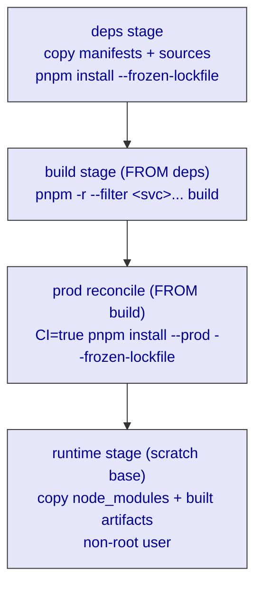

# ADR-0096: Docker Multi-Stage Builds for the Rocky Monorepo

> The repo builds fine on your laptop and detonates in the container — the symptom is not your code,
> it is the *repressed* assumption that the build environment equals the runtime environment. The
> Dockerfile is where that fantasy meets the Real.

| Key | Value |
| --- | --- |
| **Status** | Accepted |
| **Date** | 2026-07-13 |
| **Author** | Architecture Review |
| **Supersedes** | None |
| **Superseded** | None |

---

## Context

Rocky is a pnpm-workspace monorepo: `@rocky/database`, `@rocky/validators`, `@rocky/ui`, the domain
bots, and three *deployable* surfaces — `apps/api` (NestJS tRPC), `apps/web` (Next.js admin), and
`apps/docs` (Nextra docs). Each surface ships as its own image via `docker compose build`.

The build "works on my machine" and then fails inside the container in three distinct ways, all of
which are the same contradiction: **the Dockerfile assumed a pnpm / base-image / filesystem layout
that does not hold once the repo is mounted at `/app` and built by a pinned pnpm**. Concretely:

1. **`pnpm prune` is not what it was.** pnpm 11.10.0 *removed* `-r`/`--recursive` from `prune`
   (`Unknown option: 'recursive'`), and `--filter` on `prune` internally maps to that same removed
   path. Plain `pnpm prune --prod` instead tries to **purge the entire `node_modules` directory** and
   aborts non-interactively (`ERR_PNPM_ABORTED_REMOVE_MODULES_DIR_NO_TTY`). The old
   `pnpm -r prune --prod` production-slimming step is therefore dead.
2. **Hardcoded absolute paths break the mount.** `next.config.ts` had `turbopack: { root:
   "/home/goce/appz/rocky" }`. Locally that path exists; in the container the repo is at `/app`, so
   Turbopack panics `Invalid distDirRoot: ".next". distDirRoot should not navigate out of the
   projectPath.` The build config is environment-coupled.
3. **Base-image user-creation is not portable.** `node:24-slim` is Debian, whose `adduser` treats
   `-S` as *ambiguous* (`Option s is ambiguous (shell, system)`). `node:24-alpine` is BusyBox, where
   `-S` cleanly means *system user*. One command cannot serve both.

Backend / adjacent ADR deps: infrastructure posture → ADR-0047; this record itself follows the
canonical ADR format mandated by ADR-0033.

## Decision

Every deployable surface is built with an **identical three-stage Dockerfile** — `deps` → `build` →
`runtime` — and the production-slimming and user-creation steps are written to be **pnpm-version- and
base-image-agnostic**.

### 1. Three-stage build, shared shape



- **deps**: `COPY` root manifests (`package.json`, `pnpm-lock.yaml`, `pnpm-workspace.yaml`, `.npmrc`)
  - workspace sources, then `pnpm install --frozen-lockfile` (pinned store cache mount).
- **build**: `FROM deps`, copy the surface sources, `pnpm -r --filter <svc>... build`.
- **runtime**: a *fresh* slim base; `COPY --from=build` only `node_modules` (prod-only) + built
  artifacts (`.next` / `dist` / `public`), run as a non-root user.

### 2. Pin pnpm via corepack in every Dockerfile

```dockerfile
RUN corepack enable && corepack prepare pnpm@11.10.0 --activate
```

The version is pinned to match `pnpm-workspace.yaml` so the lockfile and the container toolchain
cannot drift. **Do not use `latest` or an unpinned `pnpm`** — the `prune` breakage above is exactly
the kind of surprise a floating major version introduces.

### 3. Slim to prod with `install --prod`, never `prune`

```dockerfile
RUN CI=true pnpm install --prod --frozen-lockfile
```

`pnpm install --prod` **reconciles `node_modules` to prod-only in place** (removes devDependencies,
keeps production deps) — it does not purge the directory. `CI=true` bypasses any interactive purge
confirmation so the step is non-interactive in containers. This replaces the obsolete
`pnpm -r prune --prod`.

### 4. Non-root users, base-image-correct

- **Debian slim (`web`, `docs`)** — use long forms (Debian's `adduser` makes `-S` ambiguous):

  ```dockerfile
  RUN addgroup --system nodejs && adduser --system --ingroup nodejs appuser && chown -R appuser:nodejs /app
  ```

- **Alpine (`api`)** — BusyBox form is valid:

  ```dockerfile
  RUN addgroup -S nodejs && adduser -S appuser -G nodejs && chown -R appuser:nodejs /app
  ```

### 5. Keep build config environment-portable

`next.config.ts` derives the Turbopack project root from the build working directory, never a literal
path:

```ts
// apps/web/next.config.ts & apps/docs/next.config.ts
const monorepoRoot = process.cwd().split("/").slice(0, -2).join("/")
// …
turbopack: { root: monorepoRoot }
```

`process.cwd()` during `next build` is the app dir (`apps/web` locally, `/app/apps/web` in the
container), so two segments up is always the repo root. No `import.meta.url` / `node:path` value
imports (those forced Next to emit a CJS config that breaks under `"type": "module"`).

### 6. Base image: glibc for Next.js, Alpine is fine for NestJS

- `web` / `docs` use `node:24.14.0-slim` (**glibc**). Next.js uses `@parcel/watcher`, which ships no
  musl prebuilds, so Alpine breaks the build. Keep slim, not Alpine.
- `api` uses `node:24-alpine`. The API is pure-JS NestJS; its only native-ish dependency is the typst
  WASM compiler in `@rocky/pdf`, which is libc-agnostic. Alpine is safe and smaller.

## Consequences

### Positive

- Images build identically on any machine and in CI — no machine-specific paths, no pnpm-version
  drift, no "works on my laptop."
- Production images carry only runtime dependencies (smaller, smaller attack surface), built by a
  reconciliation that cannot wipe `node_modules`.
- Runtime processes run as non-root (`appuser`), satisfying baseline container hardening.

### Negative / Cost

- The three Dockerfiles duplicate the stage shape (no shared base image / BuildKit target reuse yet).
- `pnpm install --prod` re-resolves in the build stage; it is fast (prod deps already present, store
  cache mounted) but is a deliberate deviation from the "prune" idiom most pnpm Docker guides show.
- Base-image split (glibc vs Alpine) means two different user-creation incantations to maintain.

### Neutral

- `CI=true` is set only on the prod-reconcile line (scoped), not globally, so build-stage output is
  unchanged.

## Implementation

- **Owning concern:** root / Overseer (cross-cutting infrastructure). No dedicated Bot owns
  containerization; the Dockerfiles live at `apps/api/Dockerfile`, `apps/web/Dockerfile`,
  `apps/docs/Dockerfile`, and the portability rules touch `pnpm-workspace.yaml` + each `apps/*/next.config.ts`.
- **Files already conforming to this ADR:** all three Dockerfiles (deps/build/prod/runtime stages as
  above), `apps/web/next.config.ts` + `apps/docs/next.config.ts` (`process.cwd()` root), and the
  `@better-auth-ui/*` catalog pins in `pnpm-workspace.yaml`.
- **RobotFarm pass (recommended):** add a one-line pointer that Docker containerization is a
  root-level concern to the root `AGENTS.md` (no new Bot required). Out of scope of writing this ADR.

## Verification (Definition of Done)

```bash
ls apps/docs/content/ADR/0096-docker-multi-stage-build.md          # exists in canonical set
rg -n "ADR-0047|ADR-0033" 0096-docker-multi-stage-build.md          # >=1 infra/docs dep cited
docker compose build                                              # all 3 images build, no prune/TTY/path errors
docker compose up -d                                             # api(:8080) web(:3000) docs(:3002) start
docker run --rm rocky-web id                                      # uid != 0 (runs as appuser)
docker run --rm rocky-api id                                      # uid != 0
docker run --rm rocky-docs id                                     # uid != 0
```

## Anti-Patterns (do not repeat)

1. `pnpm -r prune --prod` in a Dockerfile — pnpm 11 removed `-r` from `prune` (`Unknown option:
   'recursive'`).
2. `pnpm --filter <svc>... prune --prod` — `--filter` on `prune` maps to the same removed recursive
   path and errors identically.
3. Plain `pnpm prune --prod` to slim images — it tries to purge `node_modules` and aborts non-
   interactively. Use `pnpm install --prod --frozen-lockfile` (with `CI=true`).
4. Hardcoding an absolute path in `next.config.ts` `turbopack.root` (e.g. `/home/goce/appz/rocky`) —
   breaks the container mount (`/app`). Derive the root from `process.cwd()`.
5. `import.meta.url` / `node:path` value-imports in `next.config.ts` — Next emits a CJS config that
   fails under `"type": "module"` (`ReferenceError: exports is not defined`).
6. Alpine base for a Next.js image — `@parcel/watcher` has no musl prebuild; the build fails.
7. `adduser -S …` on a Debian-slim image — `-S` is ambiguous (`shell` vs `system`). Use
   `adduser --system --ingroup`.
8. Unpinned `pnpm` / `node` in Dockerfiles — non-reproducible; floating majors reintroduce the
   `prune` breakage.

## Related ADRs

- **ADR-0047** — infrastructure posture (the cluster this build strategy serves).
- **ADR-0033** — documentation / ADR standard (this record's format and location).
