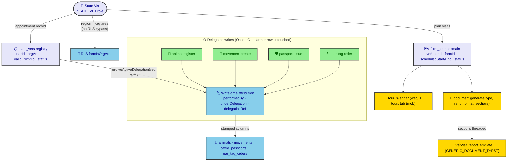
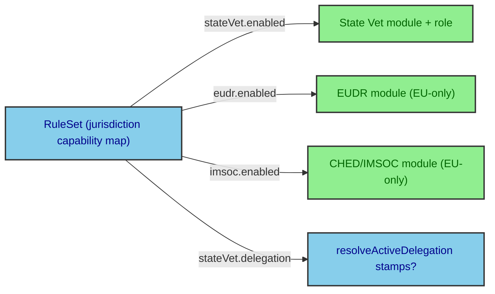

# ADR-0106: State Vet Capability (region-bounded act-on-behalf, tour calendar, section-selectable PDF)

> A state veterinarian is a **region (org-area) regulator**, not a superuser. The missing pieces are an explicit *delegation-of-responsibility* record (so the vet is legally "the farmer" for selected farms) plus a *tour calendar* and *section-selectable PDF* — not an RLS bypass and not a repurposing of the Veterinary-*Station* (`vs_contracts`/`vs_assignments`) layer.

| Key | Value |
| --- | --- |
| **Status** | Proposed |
| **Date** | 2026-07-17 |
| **Author** | Architecture Review |
| **Supersedes** | None |
| **Superseded** | None |

---

## Context

The Rocky AIMCS has **no "act on behalf of a farmer" primitive** and **no tour/calendar entity**. Today a `VETERINARIAN` is already org-scoped with broad write perms via `farmInOrgArea` (ADR-0006), but there is **no record that a vet is "acting as" a specific farmer**, and **no per-farm delegation of the farmer's identity/responsibility**. The `vs_contracts`/`vs_assignments` tables model which Veterinary *Station* services which farm — servicing metadata that feeds **no** RLS and **no** farmer-authority delegation. They are a tempting but **wrong** reuse target (scout-verified).

The regulation mandates a **state-vet registry entity** (a real appointment: who, which region, validity, status). Inspectors who inspect dead animals etc. are typically state vets, so the registry can later feed `inspections.inspector_id`. The force of circumstance: we must add (a) a region-bounded role + regulatory registry, (b) write-time attribution of delegated acts, (c) a tour/visit scheduling domain with a real calendar UI, and (d) a `sections`-selectable PDF pipeline — **without** introducing an RLS bypass, a `current_farm`/impersonation session var, or touching the farmer's `farm_subjects` row. Critically, the capability must be **jurisdiction-gated both ways**: a heavily-regulated country can disable State Vet, and a non-EU country hides EU-only regulation features (EUDR, CHED/IMSOC). The `RuleSet` (ADR-0030) is already the jurisdiction capability map and carries the EU-direction flags (`euAligned`, `eudr.enabled`, `imsoc.enabled`); this ADR extends it uniformly with a bidirectional `stateVet` flag set and a param-driven `modules.visibilityParam` (see Decision).

Backend ADRs this decision depends on (ADR-0033 §D4): auth/session → **ADR-0021**; permission/role UI → **ADR-0022**; row scoping → **ADR-0006**; tRPC → **ADR-0032**; validators → **ADR-0018** / **ADR-0019**; offline sync → **ADR-0015**; outbox/decoupling → **ADR-0012** / **ADR-0014**; runtime/locale → **ADR-0003**; PDF/A-3 → **ADR-0082**; offline signed-QR → **ADR-0084**.

## Decision

**Lead with the ruling:** Add a `STATE_VET` role that is **org-scoped (region = org area)**, carrying a **cloned FARMER permission set + the vet's existing org read/write** — **no RLS bypass** (it reuses `farmInOrgArea`). Back it with a new `state_vets` regulatory registry table (userId ↔ orgAreaId, appointmentRef, validFrom/To, status). Attribute delegated acts at **write time** (Option C): every animal registration / movement / passport / ear-tag the vet performs is stamped `performedBy = vet`, `underDelegation = true`, `delegationRef → state_vets.id`. The farmer's `farm_subjects` row is **never** modified. Add a new `farm_tours` (vet-visit) domain feeding a **real data-bound calendar** (web replaces the demo `calendar-1.tsx`; mobile gets a tours tab) and thread a `sections?: string[]` option through the PDF pipeline with a sample `vet-visit-report` template (GENERIC_DOCUMENT_TYPST).



*Fig. 1 — State vet flows (validated with `mmdc`). Region access reuses existing RLS; the registry is the authoritative appointment; attribution is write-time only; tour + PDF section-selection are independent verticals.*

**Role wiring (concrete):**

- `USER_ROLE.STATE_VET` added to `user-role.ts` + `USER_ROLE_VALUES`; `[USER_ROLE.STATE_VET]: 65` in `role-hierarchy.ts`.
- Added to `ORG_SCOPED_ROLES` (app access level = `organization`), `ORG_READ_ROLE_VALUES` (org-area read via `rlsForFarmColumn`), and `WRITE_ROLE_VALUES` (write `withCheck`).
- `Permissions` const gains `TourRead: "tour:read"`, `TourWrite: "tour:write"`; `seed.ts` `PERMISSION_DEFS`/`ROLE_DEFS`/`ROLE_PERM_MAP.STATE_VET` grant the cloned FARMER + VETERINARIAN set + `tour:*`. WO-101 drift test enforces parity with the `Permissions` const.
- No change to `RLSStage`/`rls.middleware.ts` — **no `current_farm` / impersonation var** is introduced; `state_vets.orgAreaId` is the authoritative region, re-checked at write time by `StateVetRegistryService.resolveActiveDelegation`.

**Feature gating is bidirectional (jurisdiction capability registry).** The kill-switch works **both ways** — a heavily-regulated country disables State Vet, and a non-EU country hides EU-only regulation features (EUDR, CHED/IMSOC). Both directions ride the *same* infrastructure: the `RuleSet` (ADR-0030) is the single jurisdiction capability map and already carries the EU-direction flags (`euAligned`, `eudr.enabled`, `imsoc.enabled`); we add a symmetric `stateVet: { enabled, delegation, tour, pdfSections }` built from `STATE_VET_*` `system_parameters`. Module visibility becomes param-driven: a nullable `modules.visibilityParam` points at a `system_parameters` code, and effective visibility = `isActive && (!visibilityParam || param==="true")`. The `state_vet` module binds `STATE_VET_ENABLED`; the `eudr`/`imsoc` modules bind `EUDR_ENABLED`/`IMSOC_ENABLED` — so EU-only modules auto-hide in non-EU *exactly* like State Vet auto-hides when disabled. `PolicyEngine.evaluate()` mirrors the existing `farmerCanAdminister` block to deny the role/action when the flag is off, and `StateVetRegistryService.resolveActiveDelegation` (T5) refuses to stamp when `stateVet.delegation` is false. **Every flag defaults `false`** → install is safe in any jurisdiction; an island seeds `STATE_VET_ENABLED=true`, an EU jurisdiction seeds `EUDR_ENABLED`/`IMSOC_ENABLED=true`, a non-EU regulated country leaves both off.



*Fig. 2 — Bidirectional jurisdiction gating (validated with `mmdc`). One `RuleSet` flag set drives both the State Vet capability and EU-only feature visibility.*

## Consequences

### Positive

- **Region-bounded, no superuser.** State vet access is identical in shape to the existing org-scoped veterinarian — auditable, RLS-enforced, and impossible to escalate to global.
- **Legally honest audit.** Every delegated act carries `performedBy` + `delegationRef` + `underDelegation`, so the record reads *"state vet acted under delegation for farm X"* without co-opting the farmer's identity.
- **Regulation-compliant registry.** `state_vets` is a first-class entity the regulation mandates, and it is positioned to later feed `inspections.inspector_id`.
- **Reuses, does not fork.** RLS (`farmInOrgArea`), the PDF pipeline (`GENERIC_DOCUMENT_TYPST`, `DocumentRegistry`), and the tRPC/`@Policy` gate are all extended, not replaced.

- **Jurisdiction-safe by default (both directions).** Every gating flag (`STATE_VET_*`, `EUDR_ENABLED`, `IMSOC_ENABLED`) seeds `false`; the same `RuleSet` + `modules.visibilityParam` mechanism that disables State Vet in a regulated country also hides EU-only features in a non-EU country — no env var, no code fork.

### Negative / Cost

- **Four core tables gain 3 nullable columns** (`performedBy`, `delegationRef`, `underDelegation`) — a migration surface, mitigated by nullability (no backfill, no RLS change on those tables).
- **New domain packages** (`state-vet`, `tour`) require a RobotFarm pass (root `AGENTS.md` Child RobotFarm Index + child `AGENTS.md` files) and two new ADR-tracked surfaces.
- **Soft "visit all farms" rule.** Hard enforcement of the "must visit every farm in the region" regulation is deferred; only a coverage report ships.

### Neutral

- The `vs_contracts`/`vs_assignments` (Veterinary *Station*) layer is explicitly **out of scope** and untouched — it is servicing metadata, not delegation.
- The user will supply the exact `vet-visit-report` section contents later; this ADR ships the mechanism + a sample.

## Implementation

**Owning Bots (ADR-0033 §D5):** Database Bot (schema/RLS/seed), Validation Bot (`Permissions` const + Dumb Zod), StateVet Bot (new `packages/domains/state-vet/`), Tour Bot (new `packages/domains/tour/`), API Bot (routers + `nestjs-trpc generate`), PDF Bot (section pipeline + sample template), Admin Bot (web `TourCalendar`), Mobile Bot + Frontend Bot (mobile tours tabs), Docs Bot (this ADR + RobotFarm pass).

**Build sequence (safe order):** **T0 jurisdiction capability registry** (extend `RuleSet` with `stateVet`, seed `STATE_VET_*` + `EUDR_ENABLED`/`IMSOC_ENABLED` params default-false, add `modules.visibilityParam` + module bindings, add `PolicyEngine` gate mirroring `farmerCanAdminister`, make `resolveActiveDelegation` consult the flag, show effective visibility in Feature Flags page) → DB/constants migration → RBAC role+perms seed → `state_vets` registry table + RLS → attribution columns + `StateVetRegistryService` wiring in the 4 domain services → `farm_tours` domain + `tour.router.ts` (regenerate `packages/trpc/src/generated/server.ts`) → `sections?` through `document.api.ts`/`document-template.ts`/`document.service.ts` + `VetVisitReportTemplate` registered in `app.module.ts` → web `TourCalendar` (replace `calendar-1.tsx`, preserve export name) + mobile tours tabs → ADR accept + RobotFarm pass + `pnpm ci:checks` **and full `pnpm build`**.

**RobotFarm pass:** on accept, update root `AGENTS.md` Child RobotFarm Index (add StateVet Bot + Tour Bot), create child `AGENTS.md` for the two new packages (each owns distinct contracts per the Žižekian decision method), and add a WORKORDER item. Governance gate is `pnpm ci:checks` (generate:trpc → check:trpc-boundary → check:adrs → check:md-links → check:agents → check:pdfa → test) **plus** the full `pnpm build` (turbo), which `ci:checks` does not run.

## Verification (Definition of Done)

```bash
# ADR lives in the canonical set, not legacy docs/adr
ls apps/docs/content/ADR/0106-*.md                 # exists
# mermaid validates (design-doc-mermaid skill)
mmdc -i apps/docs/content/ADR/0106-state-vet-capability.md -o /tmp/0106.png -b transparent   # → exit 0
# backend deps cited (ADR-0033 §D4)
rg -n "ADR-00(06|18|19|21|22|32)" apps/docs/content/ADR/0106-state-vet-capability.md   # ≥1
# new role + drift parity
rg -n "STATE_VET" packages/database/src/constants/user-role.ts packages/validators/src/rbac/permissions.ts packages/database/src/seed.ts
pnpm check:drift                                # WO-101 passes (Permissions const == seed)
# pipeline still generates all 7 legacy templates after sections? widening
pnpm test packages/pdf
# full build (not just ci:checks)
pnpm build
```

## Anti-Patterns (do not repeat)

1. **Repurposing `vs_contracts`/`vs_assignments` for delegation.** They are Veterinary-*Station* servicing metadata and feed no RLS or farmer-authority delegation — using them silently breaks the region boundary.
2. **Introducing a `current_farm` / impersonation session var or RLS bypass.** The decision is explicitly region-bounded and write-time-attributed; a global switch re-opens the superuser risk ADR-0006 closed.
3. **Mutating the farmer's `farm_subjects` row (Option A).** Option C attributes at write time without co-opting farmer identity — simpler, reversible, and audit-honest.
4. **Hard-gating tour creation on "visited all farms."** Ambiguous and unenforceable; ship the soft coverage report instead.
5. **Shipping `ci:checks`-green without `pnpm build`.** The known gap means build-rot (e.g. a TS error in a `*.test.ts`) is invisible to `ci:checks` — run the full build.

6. **One-directional gating.** The kill-switch must hide *both* over-regulation (State Vet disabled where not permitted) *and* EU-only features in non-EU jurisdictions. A gating mechanism that only turns things off for the over-regulated is a half-measure — drive both directions from the single `RuleSet` + `modules.visibilityParam` mechanism with `false` defaults.

## Related ADRs

- **ADR-0006** (RLS / row scoping) · **ADR-0003** (RuntimeBuilder/locale) · **ADR-0012 / ADR-0014** (outbox/decoupling) · **ADR-0030** (RuleSet / jurisdiction capability map — the gating backbone).
- **ADR-0015** (offline sync) · **ADR-0018 / ADR-0019** (Diamond-Seal validators) · **ADR-0021** (Auth) · **ADR-0022** (Policy).
- **ADR-0032** (tRPC transport — `AppRouter` the clients consume) · **ADR-0033** (client ADR house standard, this ADR's format).
- **ADR-0082** (PDF/A-3 + PAdES) · **ADR-0084** (offline signed-QR credential) — the PDF pillar's lineage.
