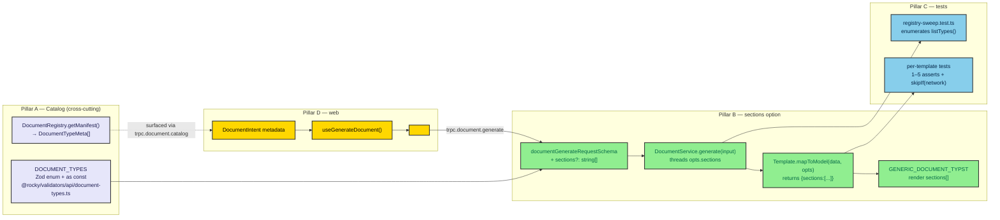

# ADR-0107: PDF Template System (typed catalog, section-selectable generation, parallel test suite)

> Builds the template layer + a parallel-runnable test suite on top of the fixed signing/credential standards (ADR-0082, ADR-0084) — it does not redesign them.
> Client-surface ADRs: note "(standard: ADR-0033)" and cite backend deps (ADR-0033 §D4).

| Key | Value |
| --- | --- |
| **Status** | Superseded |
| **Date** | 2026-07-17 |
| **Author** | Architecture Review |
| **Supersedes** | None |
| **Superseded** | 0082/0084 (the Typst render path shipped the `DocumentTemplate` registry pattern; re-open as a fresh Proposed template-catalog ADR only if the typed `DOCUMENT_TYPES` catalog + `sections` selector is still wanted) |

---

## Context

Rocky's PDF pipeline is **engine-complete** but **template-incomplete**. The signing (PDF/A-3 hybrid + PAdES-LTV, ADR-0082) and the offline credential (Ed25519+CBOR signed-QR, ADR-0084) are fixed standards, but everything *above* them is ad-hoc:

- **No typed document-type catalog.** `documentGenerateRequestSchema.type` is a bare `z.string()`; the `DocumentRegistry` singleton is the *only* runtime source of truth for which types exist. The web cannot enumerate available types or their selectable sections without hard-coding deep-links (the sole form→PDF link today is `apps/web/components/inspections/columns.tsx:90` → `/documents?type=inspection-form&refId=`).
- **The `sections` option was designed but never built.** The state-vet plan (ADR-0106) specified a `sections?: string[]` selector so "any web form produces the appropriate — possibly partial — signed PDF," but `DocumentGenerateInput`, `documentGenerateRequestSchema`, `DocumentService.generate`, and every template's `mapToModel` still take no such parameter.
- **Lopsided tests.** 15 vitest specs cover the engine, sign, and credential layers well, but `movement`, `passport`, and `inspection-form` — the three most form-facing templates — have **zero** tests. The `check:pdfa` CI gate runs only 2 files. The `DocumentRegistry` is a process-wide singleton, so naive parallel test authoring risks cross-test collisions.
- **verapdf is not in the repo** (`command -v verapdf` → not on PATH), so the strict PDF/A-3 conformance gate (`verify:pdfa`) is effectively structural-only and opportunistic.

The force of circumstance: to deliver "any web form → appropriate digitally-signed PDF," we need a **typed catalog** (Pillar A), a threadable **`sections`** selector (Pillar B), a **parallel-safe test suite** that fills the gaps and catches catalog/registration drift (Pillar C), and a **lightweight web binding** that replaces the ad-hoc deep-link (Pillar D) — all without touching ADR-0082/0084.

Backend ADRs this decision depends on: signing/standards → ADR-0082; offline credential → ADR-0084; ADR house standard → ADR-0033 §D4; docs taxonomy → ADR-0052; the `sections` design this ADR implements was first specified in → ADR-0106.

## Decision

Add a **template layer** over the existing engine with four pillars:

**Pillar A — Document-type catalog (single source of truth).** Introduce `DOCUMENT_TYPES` (`as const` array) + `documentTypeEnum` (`z.enum`) + `DocumentTypeMeta` in a new `packages/validators/src/api/document-types.ts`. `documentGenerateRequestSchema.type` becomes `documentTypeEnum`. `@rocky/pdf` gains `@rocky/validators` (leaf-ward; no cycle — `validators` does not import `pdf`). `DocumentRegistry` gains `getManifest(): DocumentTypeMeta[]`; the web reads types/sections via a new `trpc.document.catalog` query.

**Pillar B — `sections` option (threaded).** Add `DocumentFetchOptions { sections?: string[] }`; widen `DocumentTemplate.fetchData(refId, opts?)` / `mapToModel(data, opts?)` (optional, ignored by existing impls → backward-compatible). `DocumentService.generate(input)` threads `sections` through both. `buildDocumentModelInputs` + `GENERIC_DOCUMENT_TYPST` become section-aware (`model.sections:[{title, fields}]` preferred; legacy flat `fields` preserved). Prove it on the existing **passport** template; use it for the scaffolded **vet-visit-report**.

**Pillar C — Parallel test suite.** Fill the 3 missing template tests (`movement`/`passport`/`inspection-form`, mocked repos, offline). Add a **registry sweep** test asserting every registered `type ∈ DOCUMENT_TYPES` + exposes `sections` (auto-extends as templates register; catches drift). Parallel-safety via vitest per-file worker isolation + an `isolatedRegistry()` helper (`DocumentRegistry.resetInstance()`) + unique `FAKE_TYPE` keys. Render asserts stay `skipIf(!networkOk)`. Add `check:pdfa-templates` (template + sweep) to `ci:checks`; the original 2-file `check:pdfa` is untouched.

**Pillar D — Web form→document binding.** A `DocumentIntent` metadata type + `useGenerateDocument()` hook + `<GenerateDocumentButton documentType refId sections?>` component, replacing the ad-hoc `/documents?type=…` deep-link. The web reads available sections from `trpc.document.catalog`.

The architecture below shows how the catalog (shared SSOT) and `sections` thread through the existing generate pipeline without touching the signing/credential standards.



*Fig. 1 — The catalog (Pillar A) is the typed SSOT shared by web + API; `getManifest()` surfaces per-type sections to the web; `sections` (Pillar B) threads through the existing generate pipeline without touching ADR-0082/0084. The test sweep (Pillar C) and web binding (Pillar D) consume the same contract.*

## Consequences

### Positive

- The web can enumerate document types + their selectable sections from one typed catalog (`DocumentType` enum), eliminating the ad-hoc deep-link and stringly-typed `type` everywhere.
- `sections?: string[]` makes "a partial form → a partial document" real, fulfilling ADR-0106's design without per-type `.typ` layouts ("future refinement" deferred).
- Test coverage goes from 3/6 form-facing templates to 6/6, with a drift-catching sweep that fails CI if a template is registered but not cataloged.
- Parallel-safe by construction: per-file worker isolation + `isolatedRegistry()` + unique keys → tests run green offline and in parallel.

### Negative / Cost

- `@rocky/pdf` gains a dependency on `@rocky/validators` (verified leaf-ward, no cycle).
- `DocumentTemplate` interface widens (new optional `opts` + `sections`); 6 templates get a `sections` declaration. One-time churn, backward-compatible.
- The PDF/A-3 + PAdES conformance gate remains **structural-only in CI** (no verapdf in repo); the user must run the desktop verapdf for the heavy gate (by decision).
- `vet-visit-report` ships as a scaffold (catalog + manifest + a `sections` test) with placeholder/TODO content until the real spec is supplied.

### Neutral

- Template registration stays manual (the ~5 coordinated edits) — no auto-registration/scaffolding CLI (deferred by decision).
- `check:pdfa` stays at 2 files; new coverage is a separate `check:pdfa-templates` script wired into `ci:checks`.

## Implementation

Owning Bot: **PDF Bot** (catalog + `sections` thread + tests) with **Validation Bot** (schemas/catalog), **API Bot** (`document.catalog` + `vet-visit-report` registration), **Admin Bot** (web binding), **Docs Bot** (this ADR). RobotFarm pass: update the root `AGENTS.md` PDF Bot description to mention the typed catalog + `sections` + manifest; add the ADR to the `INDEX.md`.

Build order (see plan.md TODO T0–T15): T0 catalog → T1 schema+enum → T2 pdf→validators dep → T3 interface+manifest → T4 service thread → T5 renderer → T6 passport proof → T7 vet-visit-report scaffold → T8 `document.catalog` → T13 web binding → T14 ched-a credential-less guard → T9 missing tests → T10 sweep → T11 parallel helper → T12 `check:pdfa-templates` → T15 ADR + RobotFarm + `pnpm ci:checks` **+ full `pnpm build`**.

## Verification (Definition of Done)

```bash
# catalog + enum exist and the registry surfaces sections
ls packages/validators/src/api/document-types.ts
ls packages/pdf/src/engine/document-registry.ts
rg -n "getManifest" packages/pdf/src/engine/document-registry.ts

# sections threaded end-to-end (schema → service → template → renderer)
rg -n "sections" packages/validators/src/api/document.api.ts packages/pdf/src/services/document.service.ts packages/pdf/src/engine/typst-document.template.ts

# all 6 form-facing templates now have tests; sweep + parallel helper exist
ls packages/pdf/src/templates/{movement,passport,inspection-form}.template.test.ts packages/pdf/src/test/registry-sweep.test.ts packages/pdf/src/test/registry-helper.ts

# new CI gate wired, old 2-file gate untouched
rg -n "check:pdfa-templates" packages/pdf/package.json package.json
rg -n "pdfa3.test.ts|pdf-signer.test.ts" packages/pdf/package.json

# ADR + cross-refs present
ls apps/docs/content/ADR/0107-pdf-template-system.md
rg -n "ADR-00(82|84|33|52|106)" apps/docs/content/ADR/0107-pdf-template-system.md

# full build (ci:checks does NOT run the build — per AGENTS.md)
pnpm build
```

## Anti-Patterns (do not repeat)

1. **Do not redesign ADR-0082/0084.** New templates must emit via the existing pipeline (generic render → `wrapPdfA3` → `PdfSigner` → optional on-document QR). No per-template signing.
2. **Do not add a verapdf dependency or install step.** Offline structural assertions only; the user runs desktop verapdf for the heavy gate.
3. **Do not widen `DocumentTemplate` signatures in a breaking way.** `opts` must stay optional so the 6 existing templates keep compiling; always run full `pnpm build`, not just `ci:checks`.
4. **Do not write the `DocumentRegistry` singleton from parallel test files without isolation.** Use unique `FAKE_TYPE` keys + `isolatedRegistry()`; never assume a clean shared singleton across workers.
5. **Do not stringly-type `type` in the web.** Consume `DocumentType` from `@rocky/validators` + `trpc.document.catalog`; do not hard-code deep-links.

## Related ADRs

- **ADR-0082** — PDF/A-3 hybrid + PAdES-LTV seal (the signing standard this plan builds on; not redesigned).
- **ADR-0084** — offline-verifiable Ed25519+CBOR signed-QR credential (the on-document QR this plan surfaces; not redesigned).
- **ADR-0106** — State Vet capability; first specified the `sections?: string[]` design this ADR implements for `vet-visit-report`.
- **ADR-0033** — ADR house standard (header table + required sections; Proposed→Accepted).
- **ADR-0052** — docs taxonomy (this ADR lives under `content/ADR/`).

## References

### Project documentation standards

- **ROCKY-DOC-STD-001** ([Writing Technical Documents](../how-to/writing-technical-documents.mdx)) —
  the house standard for internal engineering documents. This ADR follows its structure; the
  template catalog documentation and per-template specs also conform.
- **Internal Standard Style** ([`Standardization/internal-standard-style.md`](../Standardization/internal-standard-style.md)) —
  house style guide for formatting, clause numbering, and terminology. Generated documents (passport,
  movement, inspection form) use its terminology conventions consistent with the domain models.
- **ADR-0052** — Documentation Architecture (Diátaxis). The document template reference lives
  under `reference/` (factual description of each template type and its format).
- **Writing ISO-Compatible Documentation** ([`Standardization/writing-iso-compatible-documentation.md`](../Standardization/writing-iso-compatible-documentation.md)) —
  discipline that generated PDFs may need to follow when they must meet regulatory formatting
  requirements (e.g. CHED-A, sanitary certificates).

### ISO quality & document management

- **ISO 9001:2015** — Quality Management Systems (clause 7.5: Documented Information; clause 4.4:
  QMS processes). Generated PDFs are controlled documented outputs — each template must have
  documented creation (who produces it), review (who approves it), and revision tracking. The
  catalog's `DocumentTypeMeta` includes version/revision metadata for this purpose.
- **ISO 690:2010** — Bibliographic References. Generated documents may cite external regulations,
  standards, or sources; this standard governs the citation format embedded in those PDFs.
- **ISO 704:2009** — Terminology Work. Field labels, status values, and data groupings across all
  document templates must use consistent terminology with the domain models to avoid ambiguity for
  signatories and inspectors.

### Information presentation & ergonomics

- **ISO 9241-12:1998** — Presentation of Information (information organisation, grouping, sorting,
  visual coding). Directly applies to PDF document layout: table headers, data-grouping, header
  hierarchy, label consistency, colour-as-supplement-only.
- **ISO 9241-110:2006** — Dialogue Principles (suitability for the task). A slaughterhouse movement
  PDF and a disease-outbreak alert PDF serve different readers under different urgency — template
  layout must match the task context.
- **ISO 9241-210:2019** — Human-centred design for interactive systems (user needs analysis,
  context-of-use, design evaluation). Informs the template catalog design process: who reads which
  document, which data fields are needed, in what order.
- **ISO 9241-151:2008** — Guidance on World Wide Web User Interfaces. Applies to the `/verify` and
  `/documents` web pages that surface and present generated PDFs.
- **ISO 9241-161:2016** — Visual User Interface Elements (labels, status indicators, reading order).
  Applies to the credential/status UI embedded in PDF visual elements (QR legend, status badge
  placement).
