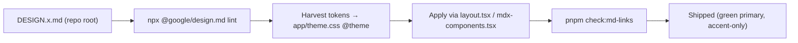

# ADR-0109: DESIGN.md Files as Non-Governing Visual-Token References for the Docs Theme

> Establish a permanent convention for authoring, linting, harvesting, and changing the standardized `DESIGN*.md` design systems in the docs theme — without making them governing standards. (standard: ADR-0033)

| Key | Value |
| --- | --- |
| **Status** | Proposed |
| **Date** | 2026-07-19 |
| **Author** | Architecture Review |
| **Supersedes** | None |
| **Superseded** | None |

---

## Context

The repository ships seven standardized design-system specs at the root, all in the
`@google/design.md` front-matter format (`version` / `name` / `description` / `colors` /
`typography` / `rounded` / `spacing` / `components`, with tokens referenced as
`{colors.primary}` etc.):

- `DESIGN.sentry.md` — violet-midnight + electric-lime
- `DESIGN.wise.md` — Wise fintech
- `DESIGN.vercel.md` — Vercel
- `DESIGN.opencode.md`, `DESIGN.clay.md`, `DESIGN.posthog.md`, `DESIGN.neobrutalsm.md`

These are useful **visual-token references** for the Rocky docs site (`apps/docs`), but they are
**not the governing standard**. The docs theme is governed by the Diátaxis taxonomy
([ADR-0052](/ADR/0052-documentation-architecture)), the ADR house standard
([ADR-0033](/ADR/0033-frontend-mobile-adr-standard)), and the RobotFarm `AGENTS.md` contracts;
behaviour is benchmarked against the `iso-9241-*` skills and built on `@rocky/ui` primitives.

Precedent already exists: [ADR-0108](/ADR/0108-menu-navigation-ergonomics) treats
`DESIGN.vercel.md` as a *"scoped, non-governing visual-token reference … Harvest only the
[subset]."* — but that ruling is scoped to `apps/web`. There is **no permanent, repo-wide
convention** for the docs theme. The current state is ad-hoc: `apps/docs/app/theme.css`
hand-mirrors only `--sentry-violet` / `--sentry-violet-deep` with comments, and there is no
documented rule for how to author, lint, apply, or change a DESIGN system in the docs.

The symptom the Real is pressing: a developer who wants to apply a DESIGN system to the docs
has no rulebook, which leads to either (a) a full rebrand that contradicts the stated *"Rocky
green stays primary"* contract, or (b) unmanaged token copying that silently drifts from the
source DESIGN file.

Backend / client dependencies (ADR-0033 §D4): documentation taxonomy **ADR-0052**; ADR house
standard **ADR-0033**; precedent **ADR-0108** (non-governing DESIGN reference). The docs theme
layer itself (`app/theme.css`, Tailwind v4 CSS-first) is the surface this decision governs.

## Decision

1. **`DESIGN*.md` are non-governing visual-token references, not standards.** They specify
   *look*, not *behaviour*. Harvest only the tokens you need; the `iso-9241-*` skills,
   ADR-0033, and `@rocky/ui` remain the benchmark and primitive source. This codifies the
   ADR-0108 stance across **all** seven design files, not just Vercel.
2. **Harvest → `theme.css` flow.** Tokens are hand-mapped into
   `apps/docs/app/theme.css` (`:root` / `.dark` oklch values → `@theme inline` →
   `@layer base`). **Rocky green (hue 152) stays the PRIMARY brand color.** A DESIGN system's
   accent (e.g. Sentry violet) is permitted **only as a secondary accent** (docs banner) — never
   as primary. This matches the existing `theme.css` comment and `app/layout.tsx`
   `<Head color={hue:152}>` + Rubik font loading.
3. **Inline-code citation rule.** DESIGN files live at the repo root, *outside* `content/`.
   They MUST be cited in docs by **inline-code path** (`` `DESIGN.sentry.md` ``), **never as
   markdown links** — a real link to a file outside `content/` resolves to a non-existent path
   and fails `check:md-links` (per `apps/docs/AGENTS.md` + ADR-0023 / 0030). Zero internal
   markdown links to DESIGN files exist today; keep it that way.
4. **Lint.** `npx @google/design.md lint DESIGN.md` checks `broken-ref`, `contrast-ratio`,
   `orphaned-tokens`. The linter is not installed; run it via `npx` on demand. Optional
   convenience script: `pnpm lint:design`.
5. **Token-scale caveat.** DESIGN files use **different** token-scale names — Sentry uses
   `xxl` / `section`; Wise uses `2xl` / `3xl`. Mappings are explicit per file; do **not** assume
   a uniform scale or blindly rename tokens.
6. **Hydration guardrail.** The `data-rc-*` hydration warning is a **stale `.next` antd-cache
   phantom** (per `apps/docs/AGENTS.md`) — fix by `rm -rf apps/docs/.next`, **not** by editing
   `app/layout.tsx`.



## Consequences

### Positive

- A permanent, discoverable convention replaces ad-hoc token copying.
- Codifies the ADR-0108 precedent repo-wide (no second design authority introduced).
- The inline-code citation rule keeps `check:md-links` green.
- Optional lint catches token drift / broken refs / low-contrast pairs.
- Green-primary contract is preserved explicitly.

### Negative / Cost

- Harvest is **manual** (no automated DESIGN→CSS transform) — accepted as deliberate.
- `npx @google/design.md lint` needs network on first run (binary fetched on demand).
- DESIGN files remain outside `content/`, so they are never directly linkable from docs.

### Neutral

- No change to `@rocky/ui`, Nextra, or the Diátaxis taxonomy.
- Does not block a future, separate decision to fully rebrand (Option A) — that would need its
  own ADR that supersedes this one.

## Implementation

- **Owning Bot:** Docs Bot (`apps/docs/`, per root Child RobotFarm Index).
- **RobotFarm pass:** update `apps/docs/AGENTS.md` "Repo-root source documents" subsection to
  catalogue `DESIGN*.md` as non-governing visual-token references; add the how-to
  `use-design-md-theme.mdx`; link both from `how-to/index.mdx`. (Standard: ADR-0033 D2 / D5.)

## Verification (Definition of Done)

```bash
ls apps/docs/content/ADR/0109-design-md-theme-workflow.md   # ADR exists in canonical set
pnpm --filter docs exec check:adrs                          # expect: ✓ 109 ADRs conform to ADR-0033.
pnpm check:md-links                                          # expect: 0 broken
rg -n "DESIGN\.(sentry|wise|vercel)" apps/docs/content/how-to/use-design-md-theme.mdx  # cited inline-code, NOT as [link](...)
rg -n "ADR-0052|ADR-0033|ADR-0108" apps/docs/content/ADR/0109-design-md-theme-workflow.md  # ≥1 backend/taxonomy dep cited
```

## Anti-Patterns (do not repeat)

1. Do not make any `DESIGN*.md` the governing standard — it specifies look, not behaviour.
2. Do not markdown-link a DESIGN file from docs (fails `check:md-links`); use inline-code.
3. Do not rebrand the docs to a DESIGN system's primary color — Rocky green (hue 152) stays
   primary; accent only.
4. Do not edit `app/layout.tsx` to "fix" the `data-rc-*` hydration warning — purge `.next`.
5. Do not assume uniform token scales across DESIGN files (Sentry `xxl/section` ≠ Wise `2xl/3xl`).

## Related ADRs

- **ADR-0052** — Documentation Architecture (Diátaxis taxonomy that places ADRs + how-tos).
- **ADR-0033** — ADR house standard; this ADR conforms to it.
- **ADR-0108** — Menu & Navigation Ergonomics (precedent: `DESIGN.vercel.md` as non-governing
  visual-token reference).
