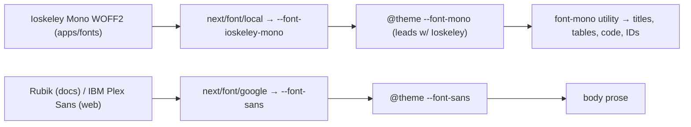

# ADR-0110: Typography — Ioskeley Mono for code/data (shared) + per-app sans (Rubik docs / IBM Plex Sans web)

> Adopt Ioskeley Mono (open-source Berkeley-Mono-alike) as the shared monospace face for
> code, identifiers, and numeric/data tables across the docs site and web admin; keep the
> per-app sans faces (Rubik for docs, IBM Plex Sans for web). Scoped, non-governing per
> ADR-0109; Rocky green stays primary. Benchmarks the `iso-9241-*` skills. (standard: ADR-0033)

| Key | Value |
| --- | --- |
| **Status** | Accepted |
| **Date** | 2026-07-19 |
| **Author** | Architecture Review |
| **Supersedes** | None |
| **Superseded** | None |

---

## Context

The web admin and docs site render dense regulatory data — ear-tag codes, farm/holder IDs,
numeric columns, status tokens, and code blocks. A **common, legible monospace** makes those
scannable and aligns digits; but mono on long prose slows scanning, so application must be
**scoped, not universal**.

We adopted **Ioskeley Mono**, an open-source Berkeley-Mono-alike, as that mono face. It is
**self-hosted as WOFF2** via `next/font/local` from `apps/fonts/IoskeleyMono` (weights
400/500/600/700 + italics) — no external/CDN request, `display: swap` handled by `next/font`.
The sans faces stay **app-specific**: **Rubik** for docs (per ADR-0109) and **IBM Plex Sans**
for web (pre-existing). This is a typographic / visual-token choice governed by ADR-0109's
*non-governing* principle — Rocky green (hue 152) remains the primary brand; fonts are
harvested, scoped references, not a rebrand.

Backend / client dependencies (ADR-0033 §D4): design-system primitives **UI Bot
(`@rocky/ui`)**; docs theme **ADR-0052**; house standard **ADR-0033**; non-governing token
precedent **ADR-0109**; ergonomics benchmark **ADR-0105 / ADR-0108**; benchmarks: repo
`iso-9241-*` skills (12 / 110 / 143 / 151 / 161 / 171).

## Decision

1. **Shared mono = Ioskeley Mono, self-hosted.** `next/font/local` from
   `apps/fonts/IoskeleyMono/*.woff2` (Regular/Medium/SemiBold/Bold + italics) →
   `--font-ioskeley-mono`. No Google/CDN fetch (licensing + airgap). `next/font` subsets the
   face and sets `display: swap`, so no FOUT/CLS.
2. **Per-app sans, not unified.** Docs = **Rubik** (`next/font/google` → `--font-rubik`);
   web = **IBM Plex Sans** (`next/font/google` → `--font-plex-sans`). These are the local
   UI/body faces; they are intentionally not the same typeface.
3. **Token plumbing (Tailwind v4 `@theme`).** Both apps expose `--font-sans` / `--font-mono`.
   `--font-mono` **leads with `--font-ioskeley-mono`** in both `globals.css` files; `body`
   uses `--font-sans`; mono is **opt-in** via the `font-mono` utility. System fallback stacks
   remain after the variable.
4. **Application scope — intentional, not universal.**
   - **docs:** Nextra code blocks + any `font-mono` usage resolve to Ioskeley Mono.
   - **web:** page titles (`PageHeader` `<h1>` → `font-mono`), data tables (`TableCard`
     `CardContent` → `font-mono`), and the existing `font-mono` spots (stat-tile numbers,
     verify page, farm-ID labels, feature-flags, ear-tags) now render Ioskeley. Long-form
     prose + body stay IBM Plex Sans.
5. **Non-governing (ADR-0109).** Typography is a visual-token reference; Rocky green stays
   primary; no rebrand. Harvested from `DESIGN*.md` references where applicable. Respect
   licensing: Ioskeley Mono (open-source) + Rubik (OFL).
6. **Accessibility invariant.** Reduced-motion (ISO 9241-171 / WCAG 2.3.3) is preserved in
   `globals.css`; mono is **never the sole carrier of meaning** (ISO 9241-12 §7.5); labels,
   titles, and table labels stay distinguishable from their data (ISO 9241-161 §8.21 / §8.44 /
   §8.47).



## Consequences

### Positive

- Fixed-width mono aligns digits / IDs for ear-tag codes, farm IDs, and numeric columns
  (ISO 9241-12 §5.7 "fixed font with constant spacing for numeric lists"; §5.8 Tables).
- Self-hosted, subset, `display: swap` → no FOUT/CLS, no external request (airgap-friendly).
- Label / title / table roles remain distinguishable (ISO 9241-161 §8.21 / §8.44 / §8.47);
  scoped use keeps prose scannable (ISO 9241-12 §4 legibility/comprehensibility).
- Single mono source for code + data across docs/web → consistent reading of identifiers.

### Negative / Cost

- Two font stacks to maintain per app; the Ioskeley WOFF2 must stay committed in
  `apps/fonts` and be re-verified when weights change.
- Mono on long prose hurts scan speed — hence scoped. The **full-mono preview** (`body →
  var(--font-mono)`) is explicitly a *temporary* evaluation aid and is reverted before commit.

### Neutral

- No change to `@rocky/ui` primitives; `Table` / `Card` consume tokens via `className`.
- Does not block a future rebrand (that would need its own superseding ADR).

## Implementation

- **Owning Bot:** **Docs Bot** (`apps/docs/`, layout + theme) + **Admin Bot** (`apps/web/`,
  layout + `PageHeader` / `TableCard`), per the RobotFarm index and ADR-0033 §D5. **UI Bot**
  consulted for the `@rocky/ui` primitives that consume the tokens.
- **RobotFarm pass:** add this ADR; add a typography note to `apps/docs/AGENTS.md` and
  `apps/web/AGENTS.md`; link from `content/ADR/INDEX.md`.

## Verification (Definition of Done)

```bash
ls apps/docs/content/ADR/0110-typography-ioskeley-mono.md     # ADR exists in canonical set
pnpm --filter docs exec check:adrs                              # 110 ADRs conform to ADR-0033
rg -n "font-ioskeley-mono" apps/docs/app/globals.css apps/web/app/globals.css   # token leads --font-mono
rg -n "next/font/local"   apps/docs/app/layout.tsx apps/web/app/layout.tsx       # self-hosted, no CDN
test -f apps/fonts/IoskeleyMono/IoskeleyMono-Regular.woff2                              # asset present
rg -n "ISO 9241-171|WCAG 2.3.3" apps/web/app/globals.css                             # reduced-motion preserved
pnpm check:md-links                                                          # 0 broken
```

## Anti-Patterns (do not repeat)

1. Do not load Ioskeley (or any font) from a CDN/Google — must be self-hosted WOFF2
   (`apps/fonts`), for licensing + airgap (ADR-0109 non-governing spirit).
2. Do not make fonts governing / rebrand to a non-green primary — Rocky green stays primary
   (ADR-0109).
3. Do not apply full-mono to long prose / `body` universally — scoped use only; the
   `body → var(--font-mono)` flip is a temporary preview, revert it before commit.
4. Do not use colour as the sole coding (ISO 9241-12 §7.5) — structure is carried by
   mono/weight, not colour alone.
5. Do not edit `app/layout.tsx` to "fix" the `data-rc-*` hydration warning — purge `.next`
   (ADR-0109 §6 / docs `AGENTS.md`).
6. Do not hand-roll a mono component in `@rocky/ui` — consume the `font-mono` utility / tokens.

## Related ADRs

- **ADR-0109** — DESIGN.md as non-governing visual-token references (the scoping principle
  this ADR inherits).
- **ADR-0108** — Menu & Navigation Ergonomics (ISO-9241-aligned; mono on data surfaces).
- **ADR-0105** — Frontend Conformity & UX Controls (ergonomics benchmark, ROCKY-FE-001).
- **ADR-0037** — Design System & Theming (Web & Mobile).
- **ADR-0033** — ADR house standard; this ADR conforms to it.
- **ADR-0052** — Documentation Architecture (Diátaxis; ADRs live in `content/ADR/`).
