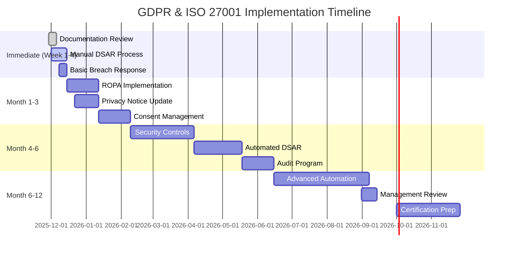
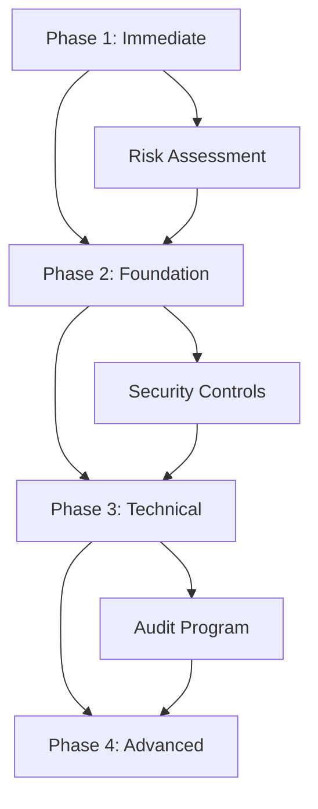

# GDPR and ISO 27001 Compliance Implementation Roadmap

**Version:** 1.0  
**Date:** 2025-11-29  
**Document Owner:** Compliance Team  
**Classification:** Internal Use Only  

---

## Executive Summary

This roadmap provides a comprehensive 12-month implementation plan for achieving GDPR and ISO 27001 compliance for PBX (Private Branch Exchange) systems. Based on extensive compliance gap analysis and existing templates, this plan distinguishes between immediate implementation opportunities (documentation and manual processes) versus gradual implementation requiring technical automation.

**Current Compliance Status:** ~40% compliant  
**Target Compliance Date:** Q4 2026  
**Implementation Budget:** To be determined  
**Risk Level:** Medium (manageable with proper execution)

### Key Deliverables

- ✅ Complete ROPA (Records of Processing Activities)
- ✅ DPIA (Data Protection Impact Assessment) completed
- ✅ DSAR (Data Subject Access Request) procedures operational
- ✅ Breach response procedures implemented
- ✅ ISO 27001 Statement of Applicability published
- ✅ Information Security Policy implemented
- ✅ Risk assessment and treatment plans active

---

## Implementation Timeline Overview

---

## WEEK 1-4: IMMEDIATE IMPLEMENTATION (Quick Wins)

### Phase 1.1: Documentation Review and Gap Analysis (Week 1)

**Objective:** Establish baseline compliance and identify immediate gaps

| Task ID | Action Items                             | Resources Required                    | Time (Hours) | Success Criteria                     | Dependencies |
| ------- | ---------------------------------------- | ------------------------------------- | ------------ | ------------------------------------ | ------------ |
| T1.1.1  | Review existing GDPR Article 30 records  | Compliance officer, Template reviewer | 2            | All processing activities identified | None         |
| T1.1.2  | Complete data inventory using templates  | IT team, Business owners              | 3            | Complete data flow mapping           | T1.1.1       |
| T1.1.3  | Identify high-risk processing activities | DPO, Legal team                       | 2            | Risk prioritization completed        | T1.1.2       |
| T1.1.4  | Set up compliance tracking spreadsheet   | Compliance team                       | 1            | Tracking system operational          | None         |

**Risk Mitigation:**

- **Data collection delays:** Schedule dedicated workshops with business units
- **Incomplete inventory:** Implement follow-up validation process
- **Scope creep:** Define clear boundary of PBX systems only

**Immediate Actions:**

- [ ] Audit all existing compliance documentation
- [ ] Create master compliance tracker
- [ ] Identify available resources and constraints
- [ ] Establish communication protocols

### Phase 1.2: Manual DSAR Process Implementation (Week 2-3)

**Objective:** Establish basic DSAR handling capability using existing templates

| Task ID | Action Items                               | Resources Required             | Time (Hours) | Success Criteria                       | Dependencies |
| ------- | ------------------------------------------ | ------------------------------ | ------------ | -------------------------------------- | ------------ |
| T1.2.1  | Customize DSAR template for organization   | Legal team, Compliance officer | 2            | Template adapted to local requirements | None         |
| T1.2.2  | Set up DSAR intake process (email/portal)  | IT team, Admin staff           | 3            | Functional intake mechanism            | None         |
| T1.2.3  | Train customer service on DSAR handling    | HR, Customer service manager   | 2            | Team competent in basic DSAR process   | T1.2.1       |
| T1.2.4  | Create DSAR response workflow              | Process owner, Legal team      | 2            | Clear step-by-step process documented  | T1.2.1       |
| T1.2.5  | Establish identity verification procedures | Security team, Legal team      | 2            | Secure verification process            | T1.2.1       |

**Risk Mitigation:**

- **Response time failures:** Implement escalation procedures
- **Identity verification gaps:** Establish multiple verification methods
- **Data handling errors:** Create clear separation of duties

**Manual Process Steps:**

1. Receive DSAR request via email/form
2. Log request in DSAR tracking spreadsheet
3. Verify requester identity using multiple methods
4. Identify relevant call recordings and metadata
5. Compile data and apply necessary redactions
6. Obtain legal approval for response
7. Send response within 30-day deadline
8. Update tracking log and close request

### Phase 1.3: Basic Breach Response Procedures (Week 3-4)

**Objective:** Establish minimum viable breach notification procedures

| Task ID | Action Items                           | Resources Required           | Time (Hours) | Success Criteria                         | Dependencies |
| ------- | -------------------------------------- | ---------------------------- | ------------ | ---------------------------------------- | ------------ |
| T1.3.1  | Create breach assessment checklist     | Legal team, Security officer | 2            | Clear assessment criteria                | None         |
| T1.3.2  | Establish breach notification contacts | Management team, Legal team  | 1            | Contact list current and tested          | None         |
| T1.3.3  | Draft breach notification templates    | Legal team, PR team          | 3            | Templates for 72-hour and 30-day notices | T1.3.1       |
| T1.3.4  | Train response team on procedures      | Security team, Legal team    | 2            | Team competent in breach response        | T1.3.1       |
| T1.3.5  | Test breach response simulation        | All stakeholders             | 2            | Successful simulation completed          | T1.3.2       |

**Risk Mitigation:**

- **Communication failures:** Establish redundant notification channels
- **Timeline management:** Create automated reminders and tracking
- **Legal compliance:** Regular legal review of procedures

**Breach Response Workflow:**

1. Detect potential breach incident
2. Contain and assess scope of incident
3. Evaluate risk to data subjects
4. Notify supervisory authority within 72 hours
5. Notify affected data subjects (if high risk)
6. Document all actions taken
7. Implement corrective measures

### Phase 1.4: DPO Documentation Setup (Week 4)

**Objective:** Establish Data Protection Officer role and documentation

| Task ID | Action Items                                | Resources Required     | Time (Hours) | Success Criteria                           | Dependencies |
| ------- | ------------------------------------------- | ---------------------- | ------------ | ------------------------------------------ | ------------ |
| T1.4.1  | Assess need for DPO appointment             | Legal team, Management | 1            | DPO requirement assessment complete        | None         |
| T1.4.2  | Create DPO role description                 | HR, Legal team         | 2            | Clear role definition and responsibilities | T1.4.1       |
| T1.4.3  | Establish DPO independence measures         | Management, Legal team | 2            | Independence safeguards documented         | T1.4.1       |
| T1.4.4  | Create DPO contact and reporting procedures | Admin staff, DPO       | 1            | Contact mechanisms established             | T1.4.1       |

---

## MONTH 1-3: FOUNDATION BUILDING

### Phase 2.1: ROPA Implementation (Month 1)

**Objective:** Complete Records of Processing Activities using existing templates

| Task ID | Action Items                                | Resources Required         | Time (Hours) | Success Criteria                     | Dependencies |
| ------- | ------------------------------------------- | -------------------------- | ------------ | ------------------------------------ | ------------ |
| T2.1.1  | Populate ROPA template with PBX data        | IT team, Process owners    | 6            | All processing activities documented | Phase 1.1    |
| T2.1.2  | Map data flows for each processing activity | Business analysts, IT      | 8            | Complete data flow documentation     | T2.1.1       |
| T2.1.3  | Validate ROPA completeness                  | Compliance team, Legal     | 4            | All required fields completed        | T2.1.2       |
| T2.1.4  | Implement ROPA update procedures            | Process owners, Compliance | 3            | Regular update process established   | T2.1.3       |

**Sub-Task Breakdown:**

**Week 1:** Core Processing Activities

- Document call recording processing (2 hours)
- Map call metadata processing (2 hours)
- Document voicemail processing (2 hours)

**Week 2:** Supporting Activities

- Document user account management (2 hours)
- Map system administration activities (2 hours)
- Document audit and monitoring processes (2 hours)

**Week 3:** Third-Party Processing

- Identify all processors and sub-processors (3 hours)
- Map international data transfers (3 hours)
- Document contractual obligations (2 hours)

**Week 4:** Validation and Maintenance

- Review and validate ROPA entries (2 hours)
- Create update procedures and schedules (2 hours)

**Success Criteria:**

- [ ] All PBX-related processing activities documented
- [ ] Data flow mapping complete for all activities
- [ ] Legal bases identified for each processing activity
- [ ] Regular update procedures established

**Risk Mitigation:**

- **Scope completeness:** Use systematic data inventory approach
- **Accuracy validation:** Implement dual-review process
- **Maintenance compliance:** Establish quarterly review cycle

### Phase 2.2: Privacy Notice and Cookie Policy Update (Month 2)

**Objective:** Update privacy notices using client-facing templates

| Task ID | Action Items                            | Resources Required             | Time (Hours) | Success Criteria              | Dependencies |
| ------- | --------------------------------------- | ------------------------------ | ------------ | ----------------------------- | ------------ |
| T2.2.1  | Review existing privacy notices         | Legal team, Compliance officer | 3            | Gap analysis complete         | None         |
| T2.2.2  | Customize privacy notice template       | Legal team, Web team           | 4            | Updated notice published      | T2.2.1       |
| T2.2.3  | Create cookie policy for web interfaces | Web team, Legal team           | 3            | Cookie policy implemented     | T2.2.2       |
| T2.2.4  | Update call consent scripts             | Telephony team, Legal team     | 2            | Consent scripts updated       | T2.2.2       |
| T2.2.5  | Test notice implementation              | QA team, Compliance            | 2            | All notices working correctly | T2.2.3       |

**Implementation Details:**

**Week 1: Privacy Notice Review**

- Audit current privacy notices across all touchpoints
- Identify gaps and inconsistencies
- Document required changes

**Week 2: Template Customization**

- Adapt template to organizational specifics
- Include all required GDPR information
- Ensure language clarity and accessibility

**Week 3: Call Consent Scripts**

- Update pre-call consent messages
- Test script functionality
- Train call center staff

**Week 4: Cookie Policy Implementation**

- Implement cookie consent mechanism
- Publish comprehensive cookie policy
- Test functionality across devices

**Success Criteria:**

- [ ] Privacy notice covers all GDPR Article 13 requirements
- [ ] Cookie policy implemented for web interfaces
- [ ] Call consent scripts properly updated
- [ ] All notices reviewed by legal counsel

### Phase 2.3: Consent Management Implementation (Month 3)

**Objective:** Establish consent management for call recording and processing

| Task ID | Action Items                         | Resources Required         | Time (Hours) | Success Criteria                    | Dependencies |
| ------- | ------------------------------------ | -------------------------- | ------------ | ----------------------------------- | ------------ |
| T2.3.1  | Implement consent logging system     | IT team, Telephony team    | 8            | Functional consent tracking         | None         |
| T2.3.2  | Create consent withdrawal procedures | Process owner, Legal team  | 4            | Clear withdrawal process            | T2.3.1       |
| T2.3.3  | Update consent scripts and messages  | Telephony team, Legal team | 3            | Clear consent requests              | T2.3.1       |
| T2.3.4  | Train staff on consent procedures    | HR, Process owner          | 3            | Staff competent in consent handling | T2.3.3       |
| T2.3.5  | Test consent system functionality    | QA team, Compliance        | 2            | System tested and validated         | T2.3.2       |

**Consent Management Workflow:**

1. Caller receives consent request before call recording
2. Caller provides explicit consent (opt-in only)
3. Consent decision logged in system
4. Call recording proceeds only with valid consent
5. Consent records maintained per retention policy
6. Withdrawal requests processed within 24 hours

**Success Criteria:**

- [ ] Consent logging system operational
- [ ] Clear consent withdrawal procedures
- [ ] Staff trained on consent requirements
- [ ] System validates consent before recording

---

## MONTH 4-6: TECHNICAL IMPLEMENTATION

### Phase 3.1: Security Controls Implementation (Month 4-5)

**Objective:** Implement ISO 27001 security controls for PBX systems

| Task ID | Action Items                          | Resources Required          | Time (Hours) | Success Criteria               | Dependencies |
| ------- | ------------------------------------- | --------------------------- | ------------ | ------------------------------ | ------------ |
| T3.1.1  | Implement access controls             | IT security, PBX admin      | 12           | Role-based access implemented  | Phase 2.1    |
| T3.1.2  | Configure encryption for data at rest | IT security, Infrastructure | 10           | All sensitive data encrypted   | T3.1.1       |
| T3.1.3  | Set up security monitoring            | Security team, IT ops       | 8            | Security monitoring active     | T3.1.2       |
| T3.1.4  | Implement secure backup procedures    | IT ops, Backup admin        | 6            | Encrypted backups with testing | T3.1.3       |
| T3.1.5  | Configure audit logging               | IT security, Compliance     | 8            | Comprehensive audit trail      | T3.1.4       |

**Implementation Details:**

**Week 1-2: Access Control Implementation**

- Create role-based access matrix for PBX systems
- Implement multi-factor authentication
- Configure session management controls
- Set up privileged access monitoring

**Week 3: Encryption Implementation**

- Configure database encryption for call metadata
- Implement file-level encryption for recordings
- Set up key management procedures
- Test encryption functionality

**Week 4: Security Monitoring**

- Deploy SIEM solution for PBX security events
- Configure alerting for security incidents
- Set up log aggregation and retention
- Implement security dashboards

**Week 5: Backup and Audit**

- Implement encrypted backup procedures
- Configure comprehensive audit logging
- Test backup restoration procedures
- Set up log retention policies

**Success Criteria:**

- [ ] All access to PBX systems controlled and monitored
- [ ] Data encrypted at rest and in transit
- [ ] Security monitoring provides real-time alerts
- [ ] All security events logged and retained

**Risk Mitigation:**

- **Access control failures:** Implement compensating controls
- **Encryption key management:** Use hardware security modules
- **Monitoring gaps:** Implement layered monitoring approach

### Phase 3.2: Automated DSAR Processing (Month 5-6)

**Objective:** Implement automated DSAR system to replace manual processes

| Task ID | Action Items                        | Resources Required           | Time (Hours) | Success Criteria            | Dependencies |
| ------- | ----------------------------------- | ---------------------------- | ------------ | --------------------------- | ------------ |
| T3.2.1  | Design automated DSAR workflow      | Development team, Compliance | 8            | Workflow design complete    | Phase 1.2    |
| T3.2.2  | Develop DSAR request portal         | Web development team         | 16           | Functional request portal   | T3.2.1       |
| T3.2.3  | Implement data retrieval automation | Database team, PBX admin     | 12           | Automated data compilation  | T3.2.2       |
| T3.2.4  | Create response generation system   | Development team, Legal      | 10           | Automated response creation | T3.2.3       |
| T3.2.5  | Test and validate automated system  | QA team, Compliance          | 8            | System tested and approved  | T3.2.4       |

**Automation Features:**

- Self-service DSAR request portal
- Automated identity verification
- Intelligent data discovery and compilation
- Automated response generation
- Progress tracking and notifications
- Integration with PBX systems

**Success Criteria:**

- [ ] DSAR requests can be submitted online
- [ ] Automated identity verification functional
- [ ] Data compilation automated for common requests
- [ ] Response generation includes required legal text

### Phase 3.3: ISO 27001 Audit Program (Month 6)

**Objective:** Establish internal audit program for ISO 27001 compliance

| Task ID | Action Items                             | Resources Required                | Time (Hours) | Success Criteria           | Dependencies |
| ------- | ---------------------------------------- | --------------------------------- | ------------ | -------------------------- | ------------ |
| T3.3.1  | Develop audit schedule and scope         | Compliance team, Internal auditor | 6            | Annual audit plan complete | Phase 3.1    |
| T3.3.2  | Create audit checklists for ISO controls | Internal auditor, Process owners  | 8            | Detailed audit procedures  | T3.3.1       |
| T3.3.3  | Train internal audit team                | Training provider, HR             | 8            | Audit team competent       | T3.3.2       |
| T3.3.4  | Conduct first internal audit             | Audit team, Process owners        | 12           | First audit completed      | T3.3.3       |
| T3.3.5  | Implement audit finding remediation      | Process owners, Compliance        | 6            | Findings addressed         | T3.3.4       |

**Audit Program Structure:**

- Annual audit schedule covering all ISO 27001 controls
- Risk-based audit prioritization
- Standardized audit methodologies
- Finding tracking and remediation procedures
- Management reporting on audit results

**Success Criteria:**

- [ ] Annual audit plan established and approved
- [ ] Internal audit team trained and competent
- [ ] First internal audit completed successfully
- [ ] Audit findings tracked and remediated

---

## MONTH 6-12: ADVANCED IMPLEMENTATION

### Phase 4.1: Business Continuity Implementation (Month 7-8)

**Objective:** Implement business continuity and disaster recovery for PBX systems

| Task ID | Action Items                               | Resources Required                       | Time (Hours) | Success Criteria              | Dependencies |
| ------- | ------------------------------------------ | ---------------------------------------- | ------------ | ----------------------------- | ------------ |
| T4.1.1  | Conduct business impact analysis           | Business continuity team, Process owners | 12           | BIA completed for PBX systems | Phase 3.1    |
| T4.1.2  | Develop continuity and recovery strategies | IT team, Business owners                 | 16           | Recovery strategies defined   | T4.1.1       |
| T4.1.3  | Implement backup and recovery systems      | IT ops, Infrastructure                   | 20           | Recovery capabilities tested  | T4.1.2       |
| T4.1.4  | Create continuity procedures               | Process owners, Compliance               | 8            | Procedures documented         | T4.1.3       |
| T4.1.5  | Test and validate recovery procedures      | All stakeholders                         | 12           | Successful recovery tests     | T4.1.4       |

**Recovery Objectives:**

- PBX System: RTO 4 hours, RPO 15 minutes
- Call Recording: RTO 8 hours, RPO 1 hour
- Voicemail: RTO 4 hours, RPO 15 minutes
- Database: RTO 2 hours, RPO 5 minutes

**Success Criteria:**

- [ ] Business impact analysis completed
- [ ] Recovery strategies tested and validated
- [ ] Continuity procedures documented and tested
- [ ] Recovery time objectives met in testing

### Phase 4.2: Incident Management System (Month 9)

**Objective:** Implement comprehensive incident management for security and privacy

| Task ID | Action Items                              | Resources Required        | Time (Hours) | Success Criteria                     | Dependencies |
| ------- | ----------------------------------------- | ------------------------- | ------------ | ------------------------------------ | ------------ |
| T4.2.1  | Implement incident management platform    | IT team, Security team    | 10           | Incident tracking system operational | Phase 3.1    |
| T4.2.2  | Create incident classification procedures | Security team, Compliance | 6            | Clear classification criteria        | T4.2.1       |
| T4.2.3  | Establish incident response workflows     | Security team, Legal      | 8            | Response procedures documented       | T4.2.2       |
| T4.2.4  | Train incident response team              | HR, Security team         | 8            | Team trained on procedures           | T4.2.3       |
| T4.2.5  | Conduct incident response simulation      | All stakeholders          | 6            | Simulation successful                | T4.2.4       |

**Incident Types Covered:**

- Security incidents affecting PBX systems
- Privacy breaches involving call data
- System outages affecting data availability
- Policy violations by staff
- Third-party security incidents

**Success Criteria:**

- [ ] Incident management system operational
- [ ] Clear incident classification and response procedures
- [ ] Response team trained and competent
- [ ] Incident response tested and validated

### Phase 4.3: Supplier Management (Month 10-11)

**Objective:** Implement comprehensive supplier security and privacy management

| Task ID | Action Items                           | Resources Required        | Time (Hours) | Success Criteria                  | Dependencies |
| ------- | -------------------------------------- | ------------------------- | ------------ | --------------------------------- | ------------ |
| T4.3.1  | Identify all PBX-related suppliers     | Procurement, IT           | 6            | Complete supplier inventory       | None         |
| T4.3.2  | Assess supplier security and privacy   | Security team, Compliance | 12           | Security assessments completed    | T4.3.1       |
| T4.3.3  | Implement supplier due diligence       | Procurement, Legal        | 8            | Due diligence process established | T4.3.2       |
| T4.3.4  | Update contracts with security clauses | Legal, Procurement        | 10           | Updated contracts implemented     | T4.3.3       |
| T4.3.5  | Establish ongoing supplier monitoring  | Compliance, Procurement   | 6            | Monitoring procedures active      | T4.3.4       |

**Supplier Categories:**

- VoIP service providers
- Call recording vendors
- Cloud infrastructure providers
- Managed service providers
- Telecommunications carriers
- Software vendors

**Success Criteria:**

- [ ] All suppliers assessed for security and privacy
- [ ] Due diligence procedures implemented
- [ ] Contracts updated with security requirements
- [ ] Ongoing monitoring procedures established

### Phase 4.4: Management Review and Continuous Improvement (Month 12)

**Objective:** Conduct management review and establish continuous improvement processes

| Task ID | Action Items                              | Resources Required                | Time (Hours) | Success Criteria                   | Dependencies |
| ------- | ----------------------------------------- | --------------------------------- | ------------ | ---------------------------------- | ------------ |
| T4.4.1  | Compile compliance performance metrics    | Compliance team, IT               | 8            | Performance dashboard complete     | All phases   |
| T4.4.2  | Conduct management review meeting         | Executive team, Compliance        | 4            | Review completed with action items | T4.4.1       |
| T4.4.3  | Update compliance program based on review | Compliance team, Process owners   | 6            | Program improvements implemented   | T4.4.2       |
| T4.4.4  | Plan ISO 27001 certification preparation  | Compliance team, Management       | 4            | Certification roadmap approved     | T4.4.3       |
| T4.4.5  | Establish continuous improvement process  | Compliance team, All stakeholders | 6            | Improvement process operational    | T4.4.4       |

**Performance Metrics:**

- DSAR response time compliance rate
- Security incident response times
- Audit finding remediation rates
- Staff training completion rates
- Policy compliance rates
- Supplier assessment completion rates

**Success Criteria:**

- [ ] Comprehensive performance metrics dashboard
- [ ] Management review completed with commitments
- [ ] Compliance program improvements identified and implemented
- [ ] Continuous improvement process established

---

## RISK MITIGATION STRATEGY

### High-Priority Risks and Mitigations

| Risk                                      | Impact | Likelihood | Mitigation Strategy               | Contingency Plan            |
| ----------------------------------------- | ------ | ---------- | --------------------------------- | --------------------------- |
| **DSAR Response Failures**                | High   | Medium     | Automated processing + escalation | Legal counsel standby       |
| **Security Breach During Implementation** | High   | Medium     | Layered security + monitoring     | Incident response team      |
| **Staff Resistance to New Procedures**    | Medium | High       | Training + change management      | Alternative procedures      |
| **Technical Implementation Delays**       | Medium | Medium     | Detailed project planning         | Resource augmentation       |
| **Compliance Budget Overruns**            | Medium | Low        | Phased implementation             | Scope prioritization        |
| **Regulatory Changes**                    | Medium | Low        | Legal monitoring                  | Rapid adaptation procedures |

### Implementation Dependencies

### Success Criteria Framework

**Phase Success Criteria:**

- [ ] **Phase 1 (Week 1-4):** Manual processes operational, documentation complete
- [ ] **Phase 2 (Month 1-3):** Core GDPR requirements implemented, foundation established
- [ ] **Phase 3 (Month 4-6):** Technical controls operational, audit program active
- [ ] **Phase 4 (Month 6-12):** Full operational capability, certification ready

**Overall Success Criteria:**

- [ ] 100% GDPR Article 30 compliance
- [ ] 100% DSAR response within 30 days
- [ ] 95% security control implementation
- [ ] Zero unresolved high-risk findings
- [ ] Staff training completion rate > 95%

---

## RESOURCE REQUIREMENTS

### Human Resources

| Role                          | Time Commitment | Duration  | Key Responsibilities                            |
| ----------------------------- | --------------- | --------- | ----------------------------------------------- |
| **DPO/Privacy Officer**       | 50%             | 12 months | Overall compliance oversight, GDPR requirements |
| **ISO 27001 Project Manager** | 75%             | 9 months  | Project coordination, technical implementation  |
| **Security Analyst**          | 100%            | 6 months  | Security controls implementation                |
| **Compliance Analyst**        | 75%             | 12 months | Documentation, monitoring, reporting            |
| **IT Administrator**          | 50%             | 6 months  | Technical implementation, system configuration  |
| **Legal Counsel**             | 25%             | 12 months | Legal review, regulatory guidance               |
| **HR/Training Manager**       | 50%             | 6 months  | Staff training, change management               |

### Technology Requirements

| Technology              | Purpose                   | Implementation Timeline | Cost Estimate    |
| ----------------------- | ------------------------- | ----------------------- | ---------------- |
| **DSAR Portal**         | Automated DSAR processing | Month 5-6               | To be determined |
| **SIEM Solution**       | Security monitoring       | Month 4                 | To be determined |
| **Encryption Solution** | Data protection           | Month 4                 | To be determined |
| **Backup System**       | Business continuity       | Month 7-8               | To be determined |
| **Audit Tool**          | Compliance monitoring     | Month 6                 | To be determined |

### Budget Considerations

**Immediate Costs (Month 1-4):**

- Staff time for documentation and process development
- Legal consultation for template customization
- Basic security tools and configurations

**Technical Implementation (Month 4-8):**

- Security software and hardware
- Development resources for automation
- Training and certification programs

**Ongoing Costs (Month 8-12):**

- Audit and certification preparation
- Continuous monitoring and maintenance
- Regular training and updates

---

## MONITORING AND REPORTING

### Key Performance Indicators (KPIs)

| KPI                            | Target                | Measurement Method         | Reporting Frequency |
| ------------------------------ | --------------------- | -------------------------- | ------------------- |
| **DSAR Response Time**         | 100% within 30 days   | DSAR tracking system       | Weekly              |
| **Security Incident Response** | <4 hours for critical | Incident management system | Real-time           |
| **Policy Compliance Rate**     | >95%                  | Internal audits            | Monthly             |
| **Training Completion Rate**   | >95%                  | Training records           | Monthly             |
| **Audit Finding Remediation**  | 100% within 30 days   | Audit tracking system      | Weekly              |
| **Data Retention Compliance**  | 100% automated        | System logs                | Daily               |

### Reporting Structure

**Weekly Reports:**

- DSAR processing status
- Security incidents and responses
- Project milestone progress

**Monthly Reports:**

- Compliance metrics dashboard
- Audit finding status
- Training completion rates
- Budget vs. actual expenditure

**Quarterly Reports:**

- Management review of compliance status
- Risk assessment updates
- Supplier assessment results
- Policy and procedure updates

**Annual Reports:**

- Complete compliance assessment
- ISO 27001 readiness evaluation
- Cost-benefit analysis
- Strategic planning for following year

---

## APPENDICES

### Appendix A: Template Implementation Matrix

| Template              | Customization Required | Implementation Effort | Priority | Status |
| --------------------- | ---------------------- | --------------------- | -------- | ------ |
| DSAR Template         | Medium                 | 2 hours               | High     | Ready  |
| DPIA Template         | High                   | 8 hours               | High     | Ready  |
| Security Controls     | High                   | 40 hours              | High     | Ready  |
| Retention Policy      | Medium                 | 4 hours               | Medium   | Ready  |
| Privacy Settings      | High                   | 16 hours              | Medium   | Ready  |
| Consent Logs          | Low                    | 1 hour                | High     | Ready  |
| Audit Logs            | Medium                 | 3 hours               | Medium   | Ready  |
| Deletion Certificates | Low                    | 1 hour                | High     | Ready  |

### Appendix B: Legal and Regulatory References

- GDPR Articles 5, 6, 13, 15, 17, 30, 32, 35
- ISO/IEC 27001:2022 Controls A.5-A.18
- ISO/IEC 27701:2019 Privacy Extension
- National data protection laws
- Telecommunications regulations
- Industry-specific requirements

### Appendix C: Contact Information

**Compliance Team:**

- DPO: [TO BE FILLED]
- ISO 27001 Project Manager: [TO BE FILLED]
- Legal Counsel: [TO BE FILLED]
- Security Officer: [TO BE FILLED]

**External Resources:**

- Certification Body: [TO BE IDENTIFIED]
- Legal Advisor: [TO BE SELECTED]
- Technical Consultant: [TO BE ENGAGED]
- Training Provider: [TO BE CONTRACTED]

---

**Document Approval:**

| Role        | Name            | Signature | Date       |
| ----------- | --------------- | --------- | ---------- |
| Prepared by | Compliance Team |           | 2025-11-29 |
| Reviewed by | Legal Team      |           |            |
| Approved by | Management      |           |            |

---

*This document is subject to regular review and update. Next review date: 2026-02-29*
