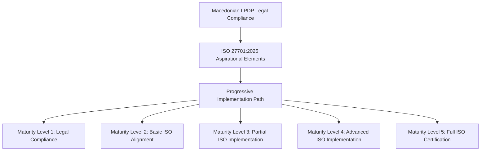

# Macedonian LPDP / ISO 27701:2025 Header System Documentation

## Overview

This documentation provides a comprehensive guide to the Macedonian LPDP / ISO 27701:2025 header system, which implements a progressive compliance approach for organizations operating under Macedonian jurisdiction.

### Key Features

* **Dual Compliance Framework**: Supports Macedonian LPDP legal compliance as primary focus with ISO 27701:2025 aspirational elements
* **Progressive Enhancement**: Allows organizations to start with legal compliance and gradually implement ISO requirements
* **Maturity Assessment**: Includes 5-level maturity model for tracking ISO compliance progression
* **Comprehensive Validation**: Built-in compliance validation for both legal and ISO requirements

## System Architecture



## Header Structure

### Core Macedonian LPDP Elements (Required)

The following elements are mandatory for Macedonian LPDP compliance:

1. **document_title**: Заглавие на документот
2. **document_identifier**: Идентификатор на документот  
3. **version_number**: Број на верзија
4. **date_of_issue**: Датум на издавање
5. **author_organization**: Автор/Организација
6. **document_type**: Тип на документот
7. **scope**: Обем и применливост
8. **purpose**: Цел на документот
9. **applicability**: Применливост
10. **references**: Референци
11. **approval**: Одобрување
12. **review_date**: Датум на преглед
13. **distribution_list**: Листа за дистрибуција
14. **confidentiality_level**: Ниво на доверливост
15. **change_history**: Историја на промени

### Macedonian LPDP Specific Elements

These elements address specific requirements of the Macedonian Law on Personal Data Protection:

* **legal_basis_mk**: Правна основа според Законот за заштита на личните податоци
* **dpo_contact_mk**: Контакт на одговорно лице за заштита на личните податоци
* **supervisory_authority**: Надзорно тело (Дирекција за заштита на личните податоци)
* **processing_activities**: Активности на обработка на лични податоци
* **data_categories**: Категории на лични податоци
* **processing_purposes**: Цели на обработка
* **storage_locations**: Локации на складирање
* **transfer_mechanisms**: Механизми за пренос
* **security_measures_mk**: Мерки за безбедност според македонското законодавство
* **retention_periods_mk**: Рокови на задржување според македонското законодавство

### ISO 27701:2025 Aspirational Elements (Optional)

These elements support progressive ISO compliance:

1. **pii_controller**: PII Controller Information
2. **pii_processor**: PII Processor Information  
3. **lawful_basis**: Lawful Basis for Processing
4. **privacy_impact_assessment**: Privacy Impact Assessment Status
5. **data_protection_officer**: Data Protection Officer Contact
6. **retention_schedule**: Data Retention Schedule
7. **cross_border_transfers**: Cross-Border Data Transfer Information
8. **security_measures**: Technical and Organizational Security Measures
9. **data_subject_rights**: Data Subject Rights Procedures
10. **breach_notification**: Data Breach Notification Procedures
11. **training_requirements**: Privacy Training Requirements
12. **audit_requirements**: Audit and Review Requirements
13. **third_party_agreements**: Third Party Processor Agreements
14. **risk_assessment**: Privacy Risk Assessment Status

## Implementation Phases

### Phase 1: Legal Foundation (Weeks 1-24)

**Objective**: Establish Macedonian LPDP legal compliance

**Tasks**:

* Conduct comprehensive Macedonian LPDP gap analysis
* Implement legal compliance headers with Macedonian LPDP as primary focus
* Create evidence tracking system for legal requirements
* Validate legal competency and compliance procedures
* Prepare audit readiness framework for Macedonian legal compliance

**Expected Outcomes**:

* Full Macedonian LPDP compliance
* Legal compliance indicators implemented
* Evidence tracking system operational
* Audit readiness for Macedonian authorities

### Phase 2: ISO Mapping (Weeks 25-48)

**Objective**: Map Macedonian LPDP controls to ISO 27701:2025 requirements

**Tasks**:

* Assess current state vs ISO 27701:2025 requirements
* Map Macedonian LPDP legal controls to ISO 27701:2025 controls
* Implement progressive header updates with ISO aspiration indicators
* Develop maturity assessment framework (1-5 levels)
* Create ISO gap closure roadmap and timeline

**Expected Outcomes**:

* Control mapping completed
* Maturity assessment framework operational
* Gap closure roadmap approved
* ISO aspiration indicators implemented

### Phase 3: Certification Preparation (Weeks 49-72)

**Objective**: Prepare for ISO 27701:2025 certification

**Tasks**:

* Complete ISO 27701:2025 control implementation
* Finalize evidence compilation for certification
* Conduct pre-certification assessment and validation
* Prepare documentation for external ISO audit
* Implement continuous improvement processes

**Expected Outcomes**:

* Full ISO 27701:2025 compliance
* Certification-ready documentation
* Continuous improvement processes established

## Header Options and Configuration

### Basic Macedonian LPDP Header

```yaml
---
document_title: "Privacy Policy"
document_identifier: "PRIV-POL-001"
version_number: "1.0"
date_of_issue: "2025-01-01"
author_organization: "Example Organization"
document_type: "Privacy Policy"
scope: "Organization-wide privacy protection"
purpose: "Ensure compliance with Macedonian LPDP"
applicability: "All employees and contractors"
references:
  - "Macedonian LPDP"
  - "GDPR"
approval:
  approved_by: "John Doe, Legal Director"
  approval_date: "2025-01-01"
  compliance_status: "Macedonian LPDP Compliant"
review_date: "2026-01-01"
distribution_list:
  - "Legal Department"
  - "Compliance Officer"
  - "Data Protection Officer"
confidentiality_level: "Public"
change_history:
  - version: "1.0"
    date: "2025-01-01"
    description: "Initial release - Macedonian LPDP compliant"
legal_compliance:
  primary_standard: "Macedonian LPDP"
  compliance_level: "Full"
  last_compliance_review: "2025-01-01"
  next_compliance_review: "2026-01-01"
---
```

### Advanced Header with ISO Aspirational Elements

```yaml
---
document_title: "Data Protection Policy"
document_identifier: "DPP-001"
version_number: "1.0"
date_of_issue: "2025-01-01"
author_organization: "Example Organization"
document_type: "Data Protection Policy"
scope: "Comprehensive data protection framework"
purpose: "Macedonian LPDP compliance with ISO 27701:2025 aspirations"
applicability: "All data processing activities"
references:
  - "Macedonian LPDP"
  - "GDPR"
  - "ISO 27701:2025"
approval:
  approved_by: "John Doe, Legal Director"
  approval_date: "2025-01-01"
  compliance_status: "Macedonian LPDP Compliant, ISO Aspirational"
review_date: "2026-01-01"
distribution_list:
  - "Legal Department"
  - "Compliance Officer"
  - "Data Protection Officer"
  - "IT Security Team"
confidentiality_level: "Internal"
change_history:
  - version: "1.0"
    date: "2025-01-01"
    description: "Initial release - Macedonian LPDP compliant with ISO aspirations"
legal_compliance:
  primary_standard: "Macedonian LPDP"
  compliance_level: "Full"
  last_compliance_review: "2025-01-01"
  next_compliance_review: "2026-01-01"
iso_27701_2025:
  compliance_status: "Aspirational"
  implementation_level: "Level 1 - Legal Compliance (Macedonian LPDP)"
  target_level: "Level 5 - Full ISO 27701:2025 Certification"
  maturity_assessment:
    current_level: 1
    target_level: 5
    assessment_date: "2025-01-01"
    next_assessment: "2026-01-01"
  pii_controller:
    name: "Example Organization"
    contact: "privacy@example.com"
    address: "Organization Address"
    implementation_status: "Planned"
  pii_processor:
    name: "N/A (if applicable)"
    contact: "N/A"
    implementation_status: "Not Applicable"
  lawful_basis:
    primary_basis: "Legal Obligation (Macedonian LPDP)"
    secondary_basis: "Contractual Necessity"
    implementation_status: "Partially Implemented"
  privacy_impact_assessment:
    status: "Not Yet Conducted"
    planned_date: "TBD"
    implementation_status: "Planned"
  data_protection_officer:
    name: "Jane Smith"
    contact: "dpo@example.com"
    implementation_status: "Appointed"
  retention_schedule:
    status: "Macedonian LPDP Compliant"
    iso_alignment: "Partial"
    implementation_status: "Partially Implemented"
  cross_border_transfers:
    status: "Macedonian LPDP Compliant"
    iso_alignment: "Partial"
    implementation_status: "Partially Implemented"
  security_measures:
    technical_measures: "Implemented per Macedonian LPDP"
    organizational_measures: "Implemented per Macedonian LPDP"
    iso_alignment: "Partial"
    implementation_status: "Partially Implemented"
  data_subject_rights:
    procedures: "Macedonian LPDP Compliant"
    iso_alignment: "Partial"
    implementation_status: "Partially Implemented"
  breach_notification:
    procedures: "Macedonian LPDP Compliant"
    iso_alignment: "Partial"
    implementation_status: "Partially Implemented"
  training_requirements:
    status: "Basic Training Implemented"
    iso_alignment: "Partial"
    implementation_status: "Partially Implemented"
  audit_requirements:
    status: "Basic Audit Procedures"
    iso_alignment: "Partial"
    implementation_status: "Partially Implemented"
  third_party_agreements:
    status: "Macedonian LPDP Compliant"
    iso_alignment: "Partial"
    implementation_status: "Partially Implemented"
  risk_assessment:
    status: "Basic Risk Assessment"
    iso_alignment: "Partial"
    implementation_status: "Partially Implemented"
---
```

## Maturity Assessment Framework

The system implements a 5-level maturity model for tracking ISO 27701:2025 compliance progression:

### Level 1: Legal Compliance

* **Focus**: Macedonian LPDP compliance

* **Characteristics**: Basic legal requirements met, no ISO-specific controls
* **Implementation Status**: "Macedonian LPDP Compliant"

### Level 2: Basic ISO Alignment

* **Focus**: Initial ISO 27701:2025 mapping

* **Characteristics**: Control mapping completed, basic ISO elements identified
* **Implementation Status**: "ISO Mapping Completed"

### Level 3: Partial ISO Implementation

* **Focus**: Core ISO controls implementation

* **Characteristics**: Key ISO controls implemented, partial evidence available
* **Implementation Status**: "Core ISO Controls Implemented"

### Level 4: Advanced ISO Implementation

* **Focus**: Comprehensive ISO controls implementation

* **Characteristics**: Most ISO controls implemented, comprehensive evidence
* **Implementation Status**: "Advanced ISO Implementation"

### Level 5: Full ISO Certification

* **Focus**: Certification readiness

* **Characteristics**: All ISO controls implemented, full evidence compilation
* **Implementation Status**: "Certification Ready"

## Implementation Status Indicators

The system uses standardized status indicators to track implementation progress:

* **Not Applicable**: Control not relevant to organization
* **Planned**: Control planned but not yet implemented
* **Partially Implemented**: Control partially implemented
* **Fully Implemented**: Control fully implemented
* **Certification Ready**: Control ready for certification audit

## Validation and Compliance Checking

### Legal Compliance Validation

The system validates compliance with Macedonian LPDP requirements:

```python
validation = generator.validate_header_compliance(header_data)
print(f"Legal Compliance: {validation['legal_compliance']['compliance_status']}")
print(f"Missing Elements: {validation['legal_compliance']['missing_elements']}")
```

### ISO Compliance Validation

For headers with ISO aspirational elements:

```python
validation = generator.validate_header_compliance(header_data)
print(f"ISO Compliance: {validation['iso_compliance']['compliance_status']}")
print(f"Missing ISO Elements: {validation['iso_compliance']['missing_elements']}")
```

## Practical Implementation Examples

### Example 1: Basic Privacy Policy

```yaml
---
document_title: "Employee Privacy Policy"
document_identifier: "EMP-PRIV-001"
version_number: "1.0"
date_of_issue: "2025-01-15"
author_organization: "Tech Solutions Ltd"
document_type: "Privacy Policy"
scope: "Privacy protection for all employees"
purpose: "Ensure compliance with Macedonian LPDP for employee data"
applicability: "All employees and HR personnel"
references:
  - "Macedonian LPDP"
  - "Labor Law"
approval:
  approved_by: "Maria Ivanova, HR Director"
  approval_date: "2025-01-15"
  compliance_status: "Macedonian LPDP Compliant"
review_date: "2026-01-15"
distribution_list:
  - "HR Department"
  - "Legal Department"
  - "All Employees"
confidentiality_level: "Internal"
change_history:
  - version: "1.0"
    date: "2025-01-15"
    description: "Initial release"
legal_compliance:
  primary_standard: "Macedonian LPDP"
  compliance_level: "Full"
  last_compliance_review: "2025-01-15"
  next_compliance_review: "2026-01-15"
---
```

### Example 2: Data Processing Agreement with ISO Aspirations

```yaml
---
document_title: "Data Processing Agreement"
document_identifier: "DPA-001"
version_number: "1.0"
date_of_issue: "2025-02-01"
author_organization: "Tech Solutions Ltd"
document_type: "Data Processing Agreement"
scope: "Agreement for processing personal data with third parties"
purpose: "Establish compliant data processing relationships"
applicability: "All third-party data processors"
references:
  - "Macedonian LPDP"
  - "GDPR"
  - "ISO 27701:2025"
approval:
  approved_by: "Ivan Petrov, Legal Director"
  approval_date: "2025-02-01"
  compliance_status: "Macedonian LPDP Compliant, ISO Aspirational"
review_date: "2026-02-01"
distribution_list:
  - "Legal Department"
  - "Procurement Department"
  - "Data Protection Officer"
confidentiality_level: "Confidential"
change_history:
  - version: "1.0"
    date: "2025-02-01"
    description: "Initial release with ISO aspirations"
legal_compliance:
  primary_standard: "Macedonian LPDP"
  compliance_level: "Full"
  last_compliance_review: "2025-02-01"
  next_compliance_review: "2026-02-01"
iso_27701_2025:
  compliance_status: "Aspirational"
  implementation_level: "Level 2 - Basic ISO Alignment"
  target_level: "Level 5 - Full ISO 27701:2025 Certification"
  maturity_assessment:
    current_level: 2
    target_level: 5
    assessment_date: "2025-02-01"
    next_assessment: "2026-02-01"
  third_party_agreements:
    status: "Macedonian LPDP Compliant"
    iso_alignment: "Partial"
    implementation_status: "Partially Implemented"
  security_measures:
    technical_measures: "Implemented per Macedonian LPDP"
    organizational_measures: "Implemented per Macedonian LPDP"
    iso_alignment: "Partial"
    implementation_status: "Partially Implemented"
---
```

## Integration with Existing Systems

### Template Integration

The header generator can be integrated with existing template systems:

```python
# Generate header for existing template
generator = MacedonianLPDPHeaderGenerator()
header = generator.generate_base_header(
    document_title="Existing Policy",
    document_identifier="EXIST-001",
    author_organization="Organization Name",
    document_type="Policy",
    scope="Existing policy scope",
    purpose="Existing policy purpose",
    applicability="Existing applicability",
    include_iso_elements=True  # Add ISO elements
)

# Update existing document with new header
markdown_document = generator.generate_markdown_document(header, existing_content)
```

### Batch Processing

For updating multiple documents:

```python
import glob
from pathlib import Path

generator = MacedonianLPDPHeaderGenerator()

# Process all markdown documents in a directory
for md_file in glob.glob("documents/*.md"):
    with open(md_file, 'r', encoding='utf-8') as f:
        content = f.read()
    
    # Extract existing header or create new one
    if content.startswith("---"):
        # Parse existing header and update
        header_end = content.find("---", 3)
        if header_end != -1:
            existing_header_yaml = content[3:header_end].strip()
            existing_header = yaml.safe_load(existing_header_yaml)
            updated_header = generator.update_existing_header(existing_header, include_iso_elements=True)
            updated_content = generator.generate_markdown_document(updated_header, content[header_end+3:].strip())
            
            # Save updated document
            with open(md_file, 'w', encoding='utf-8') as f:
                f.write(updated_content)
```

## Best Practices

### Header Management

1. **Version Control**: Always maintain version history in change_history
2. **Regular Reviews**: Update review_date annually or as required by regulations
3. **Compliance Tracking**: Use implementation_status indicators consistently
4. **Progressive Enhancement**: Start with legal compliance, add ISO elements gradually

### Documentation Standards

1. **Clear Titles**: Use descriptive document titles
2. **Unique Identifiers**: Implement consistent document identifier system
3. **Comprehensive Scope**: Clearly define document scope and applicability
4. **Detailed Change History**: Document all significant changes

### Compliance Monitoring

1. **Regular Validation**: Validate headers using built-in compliance checker
2. **Maturity Tracking**: Update maturity_assessment regularly
3. **Gap Analysis**: Identify missing elements for continuous improvement
4. **Audit Preparation**: Maintain complete evidence for both legal and ISO compliance

## Troubleshooting

### Common Issues

1. **Missing Required Elements**: Ensure all Macedonian LPDP required elements are present
2. **Invalid YAML**: Validate YAML syntax before processing
3. **Version Conflicts**: Maintain consistent version numbering
4. **Compliance Gaps**: Use validation tools to identify missing elements

### Validation Tools

```python
# Validate header compliance
generator = MacedonianLPDPHeaderGenerator()
validation = generator.validate_header_compliance(header_data)

if validation['legal_compliance']['compliance_status'] != 'Compliant':
    print(f"Legal compliance issues: {validation['legal_compliance']['missing_elements']}")

if 'iso_27701_2025' in header_data and validation['iso_compliance']['compliance_status'] != 'Fully Compliant':
    print(f"ISO compliance issues: {validation['iso_compliance']['missing_elements']}")
```

## Future Enhancements

### Planned Features

1. **Automated Gap Analysis**: AI-powered gap identification and remediation suggestions
2. **Integration with Compliance Platforms**: Connect with existing GRC systems
3. **Multi-language Support**: Support for Macedonian and English headers
4. **Advanced Reporting**: Comprehensive compliance dashboards and reports
5. **Audit Trail Enhancement**: Detailed change tracking and approval workflows

### Roadmap

* **Q1 2025**: Core header generator with legal compliance
* **Q2 2025**: ISO aspirational elements and maturity framework
* **Q3 2025**: Validation tools and compliance checking
* **Q4 2025**: Integration capabilities and batch processing
* **2026**: Advanced features and platform integrations

## Conclusion

The Macedonian LPDP / ISO 27701:2025 header system provides a comprehensive framework for organizations to achieve legal compliance while progressively working toward ISO certification. By implementing this system, organizations can:

1. Ensure full compliance with Macedonian LPDP requirements
2. Track progress toward ISO 27701:2025 certification
3. Maintain comprehensive documentation for audits
4. Support continuous improvement in privacy management
5. Demonstrate commitment to international privacy standards

The progressive approach allows organizations to start with legal compliance and gradually implement ISO requirements at their own pace, ensuring a smooth transition from legal compliance to international certification.
