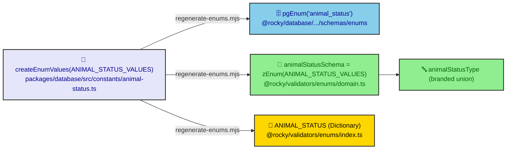
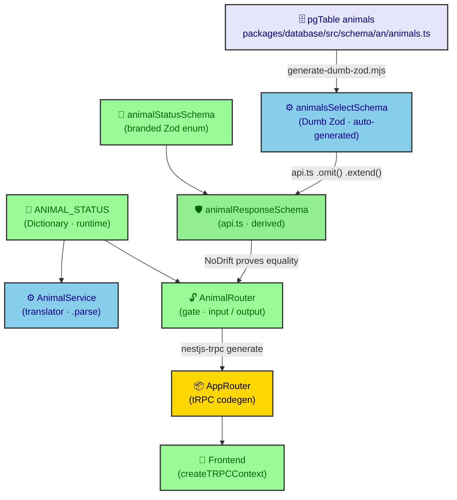

# Diamond Seal — End-to-End Type Safety — Part 1: Type Contracts

> **Reference:** ROCKY-DS 001:2026(E) &nbsp;•&nbsp; **Edition:** First edition &nbsp;•&nbsp; **Date:** 2026 &nbsp;•&nbsp; **ICS:** 35.080

---

## Foreword

This document was prepared by Technical Committee ROCKY/TC 01, Software architecture, Subcommittee SC 1, Type safety and validation.

The Diamond Seal is the internal architecture doctrine that governs how a PostgreSQL row becomes a wire object without redefinition or drift. It is implemented across the packages `@rocky/database`, `@rocky/validators`, `@rocky/trpc`, and the domain services, and is ratified by the architecture decision records cited in Clause 2.

Any feedback or questions on this document should be directed to the RobotFarm Architecture Overseer.

---

## Introduction

Rocky exposes its domain model to frontends through tRPC. The same types a client consumes on the wire and the enums it switches on are not copies of the database schema — they are **derived** from it and **proven** equal to it at compile time. This document specifies that derivation and the conformance rules that keep the two descriptions identical.

This document builds directly upon ADR-0011 (layer boundaries), ADR-0018 (Guillotine construction), and ADR-0019 (two type contracts). It does not restate their rationale; it specifies the requirements they impose.

---

## 1 Scope

This document specifies the type-contract requirements for end-to-end type safety in Rocky: the single source of truth for enums, the derivation of row types from Drizzle schemas, the compile-time proof that derived types equal their named counterparts, and the layer boundaries that prevent redefinition.

This document does not apply to event payload schemas (`@rocky/validators/events`) or the runtime validation of untrusted external input outside the tRPC boundary. Reserved forward-looking rules for vendor/integration adapters are specified in Clause 10 and become normative only when such an adapter is introduced.

---

## 2 Normative references

The following documents are referred to in the text in such a way that some or all of their content constitutes requirements of this document. For dated references, only the cited edition applies. For undated references, the latest edition of the referenced document (including any amendments) applies.

- ADR-0011, *Diamond Seal Layer Boundaries* (layer import/behaviour contracts)
- ADR-0018, *API Validator Schema Design* (Diamond Seal Guillotines)
- ADR-0019, *Two Type Contracts — The Dialectic from Postgres to tRPC Client* (type-flow model)

---

## 3 Terms and definitions

For the purposes of this document, the following terms and definitions apply.

### 3.1 internal contract

the description of the PostgreSQL row, expressed as Dumb Zod in `@rocky/database/zod`, auto-generated from the `pgTable`.

### 3.2 external contract

the wire shape, expressed as Zod schemas in `@rocky/validators/api` (`*.api.ts`), which the tRPC procedures consume 1:1 as input and output.

### 3.3 Dumb Zod

the Zod schema produced automatically from a `pgTable` through `createSelectSchema` / `createInsertSchema`.

### 3.4 branded enum

a Zod enum that `zEnum()` produces only from a `DbEnumValues` branded array, so that an unbranded literal array cannot form an enum.

### 3.5 Guillotine

the compile-time proof (`NoDrift` / `ActivateGuillotines`) that the inferred type of a schema equals a named type, enforced at build time.

### 3.6 translator

the domain service that maps a database row to the external contract by calling the api response schema's `.parse()`.

### 3.7 gate

the tRPC router that enforces the external contract 1:1 as procedure input and output and unwraps the service `Result<T, E>`.

### 3.8 single source of truth (SSOT)

the one definition from which all derived artifacts are generated, such that no literal is duplicated.

### 3.9 sovereign enum

an enum whose value set Rocky controls, stored as a PostgreSQL `pgEnum` and fanned out per Clause 5.2.

### 3.10 vendor enum

an enum whose value set an external party controls; stored as a `text()` column and validated at the Zod boundary, never as a PostgreSQL `pgEnum` (see Clause 10).

---

## 4 General principle — two contracts, no third

### 4.1 Two contracts

The system shall expose exactly two type contracts: the internal contract (3.1) and the external contract (3.2). No third source of truth shall exist.

NOTE 1 The generated tRPC client (L6) is a codegen projection of the external contract; it is not an independent definition.

### 4.2 Derivation, not redefinition

The external contract shall be **derived** from the internal contract through `omit`, `pick`, and `extend`, and shall not be re-authored field by field.

### 4.3 End-to-end equality

The tRPC client consumed by frontends shall be the generated `AppRouter` type only. Frontends shall not import Dumb Zod or `*.api.ts` types directly.

---

## 5 Enum single source of truth

### 5.1 One literal

Every enum shall be defined once as a branded array through `createEnumValues()` in `packages/database/src/constants/*`.

### 5.2 Fan-out by script

The script `scripts/regenerate-enums.mjs` shall generate, from that one array, all of the following artifacts:
a) the Drizzle `pgEnum` definition in `@rocky/database/.../schemas/enums`;
b) the branded Zod enum (`zEnum`) and its inferred type in `@rocky/validators/enums/domain.ts`;
c) the Dictionary constant re-exported from `@rocky/validators/enums/index.ts` for runtime use.

### 5.3 Forgery guard

`zEnum()` shall accept only a `DbEnumValues` branded array. An unbranded literal array shall fail type-check.

### 5.4 Per-enum proof

Each generated enum schema shall carry a `NoDrift<z.infer<schema>, Type>` alias, and `domain.ts` shall activate all such aliases through `ActivateGuillotines`.

### 5.5 Sovereign vs vendor enum

An enum is **sovereign** (3.9) when Rocky controls its value set; it shall follow 5.2 in full. An enum is **vendor** (3.10) when an external party controls its value set; it shall not be stored as a PostgreSQL `pgEnum` type and shall instead be validated at the Zod boundary as a `text()` column (see Clause 10).

### 5.6 Generator prefix skip

The generator shall skip `pgEnum` generation for any `createEnumValues()` constant whose name is prefixed `vendor-` (or otherwise marked as vendor). The sovereign/vendor distinction shall thus be enforced by the generator, not by convention.

**Figure 1 — Enum single-source fan-out**

> Key
> 1 📜 SSOT branded array
> 2 🗄️ PostgreSQL enum
> 3 🔏 branded Zod validator + type
> 4 📖 runtime Dictionary for switches
> 5 🔤 inferred branded union

---

## 6 Row-type derivation

### 6.1 Dumb Zod is generated

`animalsSelectSchema` / `animalsInsertSchema` (and their peers) shall be produced by `scripts/generate-dumb-zod.mjs` from the `pgTable` and shall not be edited by hand.

### 6.2 Api schema derives

The api response and request schemas shall be built from Dumb Zod (for example `animalsSelectSchema.omit({ createdBy: true, validTo: true }).extend({ status: animalStatusSchema, … })`). The repository shall return `typeof table.$inferSelect` verbatim.

### 6.3 Translator maps rows

The service shall translate a returned row to the external contract by calling the api response schema's `.parse()`. The service shall not re-validate input that the router has already validated.

---

## 7 Drift prevention

### 7.1 Guillotine per schema

Every `*.api.ts` file shall declare `NoDrift<z.infer<schema>, NamedType>` aliases for its response and request schemas and shall activate them through `ActivateGuillotines`. `ActivateGuillotines<[]>` (an empty tuple) shall be rejected.

### 7.2 Field-coverage proof

A schema whose output is a view of a Dumb Zod select schema shall additionally be proven with `AssertFieldCoverage`, so that a database column the api schema silently drops severs the build.

### 7.3 Build gate

The project build shall fail when any Guillotine alias resolves to a drift tuple rather than `true`.

---

## 8 Layer boundaries

### 8.1 Router gate

The router (L5) shall import the external contract from `@rocky/validators/api`, the branded enums and Dictionary from `@rocky/validators/enums`, and error maps from `@rocky/validators/errors`. The router shall **not** import `@rocky/database` or `@rocky/database/constants` directly.

### 8.2 Service translator

The service (L4) may import the external contract from `@rocky/validators/api` and the Dictionary from `@rocky/database/constants`. The service shall **not** import Dumb Zod (`@rocky/database/zod`). The service shall access the database only through its own-domain repository; it shall **not** import `@rocky/database` (the Drizzle client or table definitions) directly.

### 8.3 Repository purity

The repository (L4) may import tables and constants from `@rocky/database`. The repository shall **not** import any `@rocky/validators/*` package.

### 8.4 Magic strings prohibited

A router or service shall reference enum values through the branded Dictionary (for example `ANIMAL_STATUS.ALIVE`), never through a literal string.

### 8.5 Module-wiring exception

The layer bans in 8.1 to 8.3 prohibit business-logic imports across the boundary. They do **not** prohibit NestJS dependency-injection wiring: a domain's `*.module.ts` may import another domain's exported service or repository to construct the DI graph. The ban applies to `*.service.ts` and `*.repository.ts`, not to `*.module.ts`.

---

## 9 Wire transport

### 9.1 Serialization

The tRPC transport shall use superjson so that coerced types (for example `Date` via `z.coerce.date()`) survive the wire and match the api schema's inferred output on the client.

### 9.2 Single client type

The frontend shall consume only the generated `AppRouter` type. The two-contract model shall be invisible to the client, which is the intended boundary.

**Figure 2 — The Validation Circle (type flow)**

> Key
> 1 🗄️ PostgreSQL table (SSOT of the row)
> 2 ⚙️ Dumb Zod (internal contract, auto-generated)
> 3 🛡️ api schema (external contract, derived)
> 4 ⚙️ service translator (`.parse` row → api shape)
> 5 🔓 router gate (input/output 1:1)
> 6 📦 generated `AppRouter` (codegen)
> 7 📱 frontend consumer
> 8 📖 branded Dictionary / 🔏 branded Zod enum

---

## 10 Reserved — vendor integration contract (forward-looking)

This clause is informative until a vendor/integration adapter is merged; at that point its requirements become normative. Rocky has **no vendor integrations today**. The clause exists so that the day one arrives, the commune already knows the ritual and the two-contract model is not broken by an external party's chaos.

### 10.1 Vendor enums are `text()`, never `pgEnum`

A vendor enum (3.10) shall be stored as a `text()` column and validated at the Zod boundary. Its `createEnumValues()` constant shall be prefixed `vendor-` so that `regenerate-enums.mjs` skips `pgEnum` generation for it (5.6).

### 10.2 Vendor-enum barrel

The vendor-enum Dictionary may be re-exported from a dedicated `@rocky/validators/vendor-enums` barrel. That barrel shall be a pure re-export (no new values), mirroring `@rocky/validators/enums/index.ts`.

### 10.3 Three-component bridge contract

Each vendor integration shall implement three components:

a) `Validated<Vendor>Bridge` — `z.parse()` of raw, untrusted webhook/SDK payload;
b) `Trusted<Vendor>Bridge` — zero-overhead `as` cast for already-parsed SDK data;
c) `<Vendor>TypeGuards` — `safeParse`-based runtime guards.

Mandatory methods: `validatePayload`, `extractCanonical`, `toCanonical`, `verifyAuth?`.

### 10.4 The Symptomal Remainder

At the integration border, `z.any()` / `z.unknown()` may legitimately appear where the external schema is genuinely open. These shall be **quarantined** in `@rocky/validators/integrations` and shall never propagate into `@rocky/validators/api` or `@rocky/database`. They are the named remainder of the system, not a defect to be forcefully eliminated.

### 10.5 Integration isolation

Vendor schemas shall never be imported by routers or services directly. They shall be re-exported through the api layer (the router shall not import `@rocky/validators/integrations` per 8.1). The integration zone is the quarantine; the api zone is the embassy.

---

## Annex A (normative) — Conformance checklist

A implementation shall satisfy all of the following before it is accepted:

a) Every enum literal is defined once via `createEnumValues()` and fanned out by `scripts/regenerate-enums.mjs` (5.1, 5.2).
b) `zEnum()` receives only a branded `DbEnumValues` array (5.3).
c) Each enum schema carries a `NoDrift` alias activated by `ActivateGuillotines` (5.4).
d) Dumb Zod is auto-generated and unedited (6.1).
e) The api schema is derived from Dumb Zod, not redefined (6.2).
f) The service maps rows via the api response schema's `.parse()` and does not re-validate input (6.3).
g) Every `*.api.ts` declares and activates Guillotines; empty activation is rejected (7.1).
h) `AssertFieldCoverage` guards any select-derived response schema (7.2).
i) The router does not import `@rocky/database`; the service does not import `@rocky/database` (DB client) or Dumb Zod and reaches the database only via its own repository; the repository does not import validators (8.1–8.3).
j) Enum values are referenced via the Dictionary, never as magic strings (8.4).
k) The transport uses superjson and the frontend consumes only `AppRouter` (9.1, 9.2).
l) The generator skips `pgEnum` emission for vendor-prefixed enum constants (5.6).
m) The layer bans permit `*.module.ts` DI wiring across domains while forbidding cross-domain business logic (8.5).

## Annex B (informative) — Two-form enum rule

The router may use enums in exactly two forms:

1. **Branded Zod enum schemas** (`*Schema`) — for type inference when the router needs an enum type. The api schema already uses them; the router rarely needs them directly.
2. **The Dictionary** (`ANIMAL_STATUS`, `RIDE_STATUS`, …) — for runtime switches and lookups inside the router's thin logic, for example `if (input.status === ANIMAL_STATUS.PENDING)`.

The Dictionary and the branded schema originate from the same `createEnumValues()` array; they cannot disagree.

## Annex C (normative) — Import-boundary matrix (Visa Matrix)

The following table is the consolidated import constitution. A consumer (row) **may** import only the packages listed under "May import"; it **shall not** import any package listed under "Shall not import". Rows tagged (RESERVED) apply only after the corresponding adapter is introduced (Clause 10).

| Consumer | May import | Shall not import |
| --- | --- | --- |
| `@rocky/database/src/zod` (Dumb Zod) | `@rocky/database/schemas`, `@rocky/database/constants` | any `@rocky/validators/*` |
| `@rocky/database/src/schemas` (pgTable, pgEnum) | `drizzle-orm/pg-core`, `@rocky/database/constants`, `@rocky/database/enums` | any `@rocky/validators/*` |
| `@rocky/validators/src/enums` | `@rocky/database/constants`, `@rocky/validators/_enum-helper` | `@rocky/database/zod` |
| `@rocky/validators/src/api` (`*.api.ts`) | `@rocky/database/zod`, `@rocky/validators/enums`, `zod` | `@rocky/database`, `@rocky/validators/events`, `@rocky/validators/integrations` (RESERVED) |
| `packages/domains/*/repositories` | `@rocky/database`, `@rocky/database/zod`, `@rocky/domains-shared` | `@rocky/validators/api`, `@rocky/validators/events` (RESERVED) |
| `packages/domains/*/services` | `@rocky/validators/api`, `@rocky/database/constants` (Dictionary only), `@rocky/domains-shared`, own-domain `repositories/` (relative) | `@rocky/database` (client/tables), `@rocky/database/zod`, `@rocky/validators/events` (RESERVED), `@rocky/validators/integrations` (RESERVED) |
| `apps/api/src/routers` | `@rocky/validators/api`, `@rocky/validators/enums`, `@rocky/validators/errors`, `@rocky/trpc`, domain services | `@rocky/database`, `@rocky/database/zod`, `@rocky/validators/events` (RESERVED), `@rocky/validators/integrations` (RESERVED) |
| `@rocky/validators/src/integrations` (RESERVED) | vendor SDK types, `zod`, `@rocky/validators/utils/type-bridge` | `@rocky/database`, `@rocky/validators/api` |
| `@rocky/validators/src/vendor-enums` (RESERVED) | `@rocky/database/constants` (Dictionary re-export only) | `@rocky/validators/api` |

NOTE The module-wiring exception (8.5) permits `*.module.ts` files to import other domains' exported services/repositories for DI even where the table above forbids business-logic imports.

**Enforcement.** This matrix is enforced automatically by `scripts/check-layers.mjs` (`pnpm check:layers`), wired into `ci:checks` as a CI gate. A standard without a machine is fetishistic disavowal — the guard is the symptom's return-preventer; it fails the build on any Annex C row violation in `packages/domains/*/services`, `packages/domains/*/repositories`, or `apps/api/src/routers`.

---

## Bibliography

[1] ADR-0011, *Diamond Seal Layer Boundaries*. RobotFarm architecture decision record.
[2] ADR-0018, *API Validator Schema Design (Diamond Seal Guillotines)*. RobotFarm architecture decision record.
[3] ADR-0019, *Two Type Contracts — The Dialectic from Postgres to tRPC Client*. RobotFarm architecture decision record.
[4] `packages/database/src/constants/_brand.ts` — `createEnumValues` / `DbEnumValues` branding.
[5] `packages/validators/src/_enum-helper.ts` — branded `zEnum()` forgery guard.
[6] `packages/validators/src/utils/type-bridge.ts` — `NoDrift` / `ActivateGuillotines` / `AssertFieldCoverage`.
[7] `scripts/regenerate-enums.mjs` — single enum fan-out script (with vendor-prefix skip, 5.6).
[8] `packages/validators/src/api/animals.api.ts` — Dumb-Zod-derived schema with Guillotine.
[9] `packages/trpc/src/index.ts` — `AppRouter` re-export and superjson transformer.
