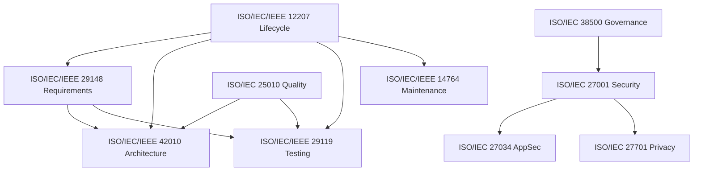

# Software-Engineering ISO Standards Map

> **Status:** Reference (facts). This document is a *map*, not a management-system claim. It threads
> the relevant ISO/IEC software-engineering standards into Rocky's standards layer "here and there"
> and points to the C4/UML diagrams that make the architecture explicit. Governing ADR: **ADR-0104**.

## Introduction

Rocky's conformity story is broader than information security and privacy. The engineering of the
system is itself subject to an ISO/IEC body of knowledge covering lifecycle, architecture, quality,
testing, maintenance, and secure development. This map summarises that ecosystem and records, for
each standard, where it is referenced in Rocky's layer. It shall be read alongside
`apps/docs/content/explanation/system-architecture/index.mdx` (the C4/UML diagrams) and the
`compliance/` posture docs.

## Scope

This document describes which ISO/IEC engineering standards apply to Rocky and where each is
referenced. It is applicable to the architecture, documentation, and guardian layers of the
repository. It contains only statements of fact and cross-references; it does not establish new
controls.

## Conformity posture

This map records engineering-standards *alignment* only. Rocky's governing conformity posture for
information security and privacy is set by [ADR-0067](../ADR/0067-isms-posture-iso27001-27701-roadmap.md)
and the canonical Statement of Applicability ([`isms-policy.md`](../compliance/isms-policy.md),
ROCKY-ISMS-001). Rocky does **not** claim certification under ISO 9001 (quality management) or the
Global Social Compliance Programme (GSCP); those regimes are out of scope for this document and for
Rocky's conformity claim. References to quality-management or supply-chain-social-compliance
standards in this map are informative orientation, not certified-QMS assertions.

## Standards map

| ISO/IEC standard | Subject | Where referenced in Rocky's layer |
| --- | --- | --- |
| ISO/IEC/IEEE 42010 | Architecture description | C4/UML diagrams (`explanation/system-architecture/`); ADR architecture descriptions |
| ISO/IEC 19505 | UML | UML diagrams (use-case, class, sequence, activity) in `explanation/system-architecture/` |
| ISO/IEC 25010 | Product quality model (SQuaRE) | SoA / TOMs quality section; `rocky-toms.md` |
| ISO/IEC 25012 | Data quality model | `PII_FIELD_REGISTRY`; data-quality controls in `rocky-toms.md` |
| ISO/IEC/IEEE 12207 | Software life cycle processes | RobotFarm workflow (AGENTS.md); per-domain lifecycles |
| ISO/IEC/IEEE 15288 | System life cycle processes | System-of-systems view where software meets field/regulatory process |
| ISO/IEC/IEEE 29148 | Requirements engineering | ADR `Context` sections; requirement traceability |
| ISO/IEC/IEEE 29119 | Software testing | `ci:checks` + vitest; `runbooks/` |
| ISO/IEC/IEEE 14764 | Software maintenance | Maintenance/evolution discipline; change-mgmt procedure (A.8.32) |
| ISO/IEC/IEEE 15939 | Measurement process | Engineering metrics; quality dashboards |
| ISO/IEC 15504 / 330xx | Process assessment | Maturity reference for the guardian-gated workflow |
| ISO 9001 / ISO/IEC/IEEE 90003 | Quality management | Conformity orientation only — the documentation guardians reflect a quality-management discipline; Rocky does not hold ISO 9001 certification. |
| ISO/IEC 38500 | Governance of IT | `isms-policy.md` (ISMS governance, ADR-0067) |
| ISO/IEC 20000-1 | IT service management | BCP/ICT readiness (A.5.29/.30); `runbooks/` |
| ISO/IEC 27001 / 27002 | ISMS / controls | `isms-policy.md` (canonical SoA) |
| ISO/IEC 27034 | Application security | SoA A.8.25–.28; secure SDLC |
| ISO/IEC 27701 | Privacy information management | PIMS extension of the SoA; GDPR/legal docs |
| ISO 31000 / ISO/IEC 27005 | Risk management | `rocky-risk-assessment.md` / `rocky-risk-treatment-plan.md` |
| ISO/IEC 17788 / 22123 | Cloud computing | Physical-controls provider attestation (A.7.*); shared responsibility |
| ISO/IEC 42001 | AI management system | Noted for future AI features (not in scope yet) |

## Crosswalk to the local legal layer

The Macedonian personal-data-protection law is carried as a bilingual source
(`mk_lpdp_bilingual_en_mk.json`) and crosswalked in the `MACEDONIAN_LPDP_*` controls matrix. Albanian
Law 124 is intentionally **out of scope** for this plan (carried from a separate project); its field
exists in `VALIDATED_CROSSWALK` for future use only.

## Figures

**Figure 1 — Standards relationship map (software engineering core).** Drawn from the supplied
compendium; mirrors the C4/UML diagram set in `explanation/system-architecture/`.

## Bibliography

- ISO/IEC/IEEE 42010:2011 — Architecture description.
- ISO/IEC 19505 — Unified Modeling Language (UML).
- ISO/IEC 25010:2023 — Systems and software quality models.
- ISO/IEC 25012:2008 — Data quality model.
- ISO/IEC/IEEE 12207 — Software life cycle processes.
- ISO/IEC/IEEE 29148 — Requirements engineering.
- ISO/IEC/IEEE 29119 — Software testing.
- ISO/IEC 27001:2022 / ISO/IEC 27002:2022 — Information security.
- ISO/IEC 27034 — Application security.
- ISO/IEC 27701:2019 — Privacy information management.
- ISO/IEC 38500 — Governance of IT.
- ISO/IEC 20000-1 — Service management.
- ISO 31000 — Risk management.
- ISO/IEC 17788 / 22123 — Cloud computing.
- ISO/IEC 42001 — AI management system.
- ISO/IEC Directive Part 2 — Principles and rules for the structure and drafting of ISO documents (Annex A checklist).

## Related

- `explanation/system-architecture/index.mdx` — the C4/UML diagrams this map accompanies.
- `compliance/isms-policy.md` — the canonical Statement of Applicability.
- ADR-0052 — documentation architecture (Diátaxis taxonomy).
- ADR-0067 — ISMS / PIMS posture roadmap.
- ADR-0104 — governs this map and the diagram set.
