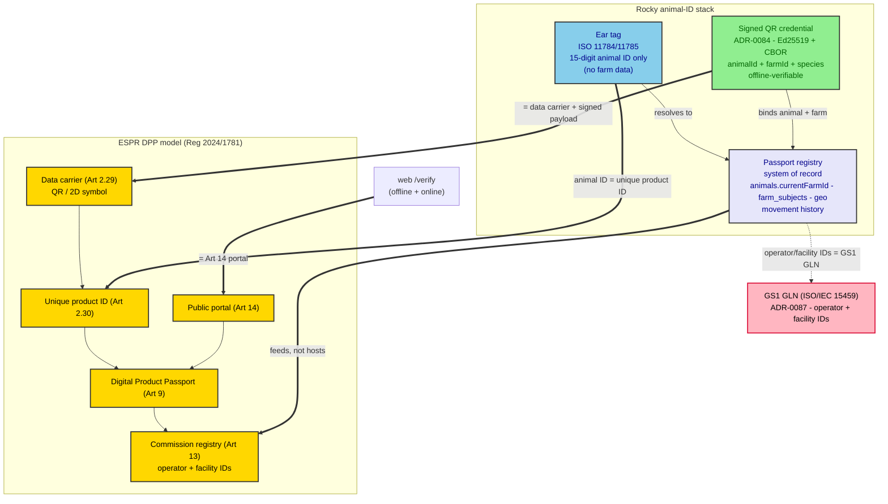

# Animal-ID and the ESPR Digital Product Passport

How Rocky's three-layer animal-identification stack (ear tag, signed QR, passport registry)
maps onto the EU's **Digital Product Passport (DPP)** model in Regulation (EU) 2024/1781 (ESPR) —
and why the physical ear tag deliberately carries **no farm data**.

## Three layers, one animal

| Layer | Standard | Carries farm data? | Why |
| --- | --- | --- | --- |
| **Ear tag** | ISO 11784/11785 (15-digit electronic ID) — `ISO_11784_15` in `makeEarTagSchema` | No — animal ID only | minimal, stable, standards-bound |
| **Signed QR credential** | Ed25519 + canonical CBOR (ADR-0084) | Yes — `animalId + farmId + species` | it is an *offline credential*, not a bare ID |
| **Passport registry** | system of record (`animals.currentFarmId`, `farm_subjects`, geo, movement history) | Yes — full traceability | the value-chain context lives here |

## Why the ear tag omits farm data

The farm/ownership link lives in the **registry**, not the tag. Four reasons this is correct, not a gap:

1. **Capacity** — ISO 11784/11785 is exactly 15 digits (3-digit country code + 12-digit national ID). No room for facility data.
2. **Mutability** — farm/ownership changes over the animal's life (movements, sales). Embedded data would go stale; the registry stays current.
3. **Privacy** — owner/farm data should not sit on a publicly scannable, non-cryptographic tag.
4. **The tag *points at* the record; the record *has* the farm** — the "feeds, not hosts" pattern.

So the ear tag is a minimal, stable **unique animal key**; the signed QR credential binds animal + farm + species cryptographically; the registry holds the full history.

## Why this already conforms to ESPR

The signed QR *is* an ESPR-style DPP (ADR-0086):

- **Data carrier + unique product ID** — Art 2(29)/(30), Art 9/10 → the signed QR (ADR-0084).
- **Registry with operator/facility IDs** — Art 13 → Rocky's passport registry (Rocky *feeds*, the Commission *hosts*).
- **Public portal** — Art 14 → web `/verify` (offline + online).
- **Operator/facility IDs** — Art 12 → pinned to **GS1 GLN** (ISO/IEC 15459 equivalent) in ADR-0087.

**Scope reality:** cattle are **out of ESPR scope** (Art 1(2)(e)). The alignment is preemptive — it positions Rocky to *feed* downstream animal-derived-product DPPs (leather 4203, footwear 6401–6405, meat), whose operators need 15459/GS1-shaped IDs. It is not a conformity obligation for cattle.

## Identifier standard (ADR-0087)

`operatorId` / `facilityId` in the credential are **GS1 GLN**-shaped (or the documented self-issued CIN fallback). The source standards are collected in `docs/reference/`:
`docs/reference/04_Quick_Guide_UniqueLabeling.by_.ISOIEC15459-r220823-neu.pdf`,
`docs/reference/GS1-Enabling-DPP-White-Paper-1.pdf`, `docs/reference/iso-iec-15459-1-2014.yaml`.

## Related

- [ADR-0084 — Offline-verifiable Signed QR Credentials](/ADR/0084-offline-signed-qr-credentials)
- [ADR-0086 — ESPR DPP Alignment](/ADR/0086-esp-r-digital-product-passport-alignment)
- [ADR-0087 — ESPR Art 12 Operator/Facility Identifier Scheme](/ADR/0087-espr-art12-operator-facility-identifier-scheme)
- Parent regulation: `docs/reference/OJ_L_202401781_EN_TXT.pdf`
