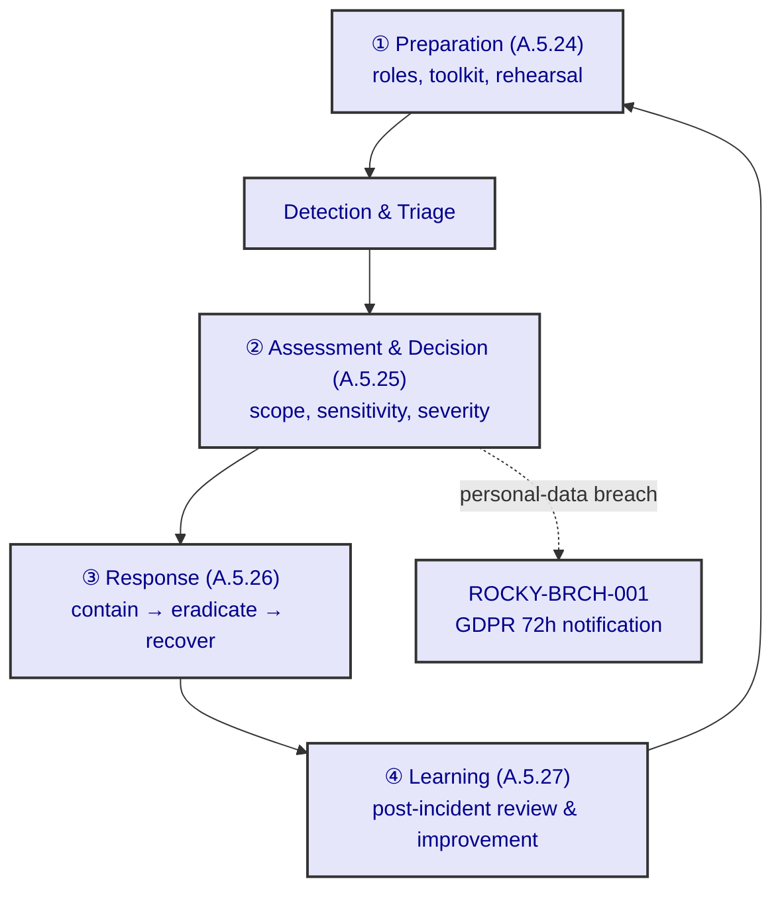

# Information Security Incident Response Plan — Rocky

> _sniffs_ The GDPR breach flow (ROCKY-BRCH-001) is the **law** — it owns the
> 72-hour notification. This plan is the **ISO** wrapper around it: preparation,
> assessment, response and — the usual gap — learning. It does not replace the
> breach procedure; it contains it.

| Document field | Value |
| --- | --- |
| **Title** | Information Security Incident Response Plan — Rocky |
| **Reference** | ROCKY-IRP-001 |
| **Version** | 0.1.0-draft (ISO wrapper; detection mechanism present) |
| **Status** | Draft — procedure authored; dedicated alerting workflow to be operationalised |
| **Owner** | Docs Bot, co-owned with Audit / Execution Bots |
| **Classification** | Internal — Reference |
| **Next review** | On ADR-0097 acceptance; thereafter on each incident-post-review |
| **Related** | ADR-0097 (governing, A.5.24–.27); ADR-0072 (breach charter); ADR-0007 (tamper-evident audit); ADR-0067 (ISMS roadmap); ROCKY-BRCH-001 (GDPR breach flow, complemented not replaced); [Statement of Applicability — ROCKY-ISMS-001](./isms-policy.md) (A.5.24–.27) |

---

## 1. Purpose

This plan establishes Rocky's information security incident response across the four ISO/IEC 27001:2022
themes — **preparation** (A.5.24), **assessment and decision** (A.5.25), **response** (A.5.26) and
**learning** (A.5.27). It is the ISO management wrapper; the personal-data breach notification flow
(ROCKY-BRCH-001, ADR-0072) remains the governing legal procedure for breaches and is complemented, not
replaced, by this plan.

## 2. Scope

- **In scope:** all information security incidents affecting Rocky's confidentiality, integrity or
  availability — unauthorised access, bulk read or disclosure attempts, tampering, availability loss.
- **Out of scope as primary owner:** the GDPR 72-hour notification mechanics. Those are owned by
  ROCKY-BRCH-001; this plan triggers and feeds that procedure when a personal-data breach is assessed.

## 3. Terms and definitions

- **event** — an observed occurrence in a system or network (A.5.24).
- **incident** — a suspected or confirmed breach of security leading to, or threatening, compromise.
- **severity** — the classification (low / medium / high / critical) driving response and notification.
- **post-incident review** — the learning step (A.5.27) that closes the loop.

## 4. Normative references

- ISO/IEC 27001:2022 — Annex A.5.24, A.5.25, A.5.26, A.5.27.
- ISO/IEC 27701:2025 — A.3.11 / A.3.12 (PIMS incident management, served by ROCKY-BRCH-001).
- ADR-0097 — the governing decision for this plan.
- ADR-0072 — personal data breach notification workflow (the legal procedure this plan complements).
- ADR-0007 — tamper-evident audit (the evidence store).
- ROCKY-BRCH-001 — Personal Data Breach Notification Procedure.

## 5. Incident response lifecycle

Figure 1 shows the lifecycle. Each phase is described in Clauses 6–9.

**Figure 1 — Information security incident response lifecycle**

## 6. Preparation (A.5.24)

1. Incident response roles shall be assigned: an incident owner, a technical lead, and a notifier.
2. The tamper-evident audit store (ADR-0007) shall be the evidence source for every incident.
3. A lightweight runbook and contact tree shall be maintained and rehearsed at least annually.

## 7. Assessment and decision (A.5.25)

1. On a suspected incident, the scope (records/endpoints affected), sensitivity (special-category
   health data weighs highest) and risk to rights and freedoms shall be assessed.
2. Severity shall be assigned from the assessment; severity decides whether ROCKY-BRCH-001 is triggered.
3. The decision and its rationale shall be recorded in the audit store.

## 8. Response (A.5.26)

1. **Containment** — restrict the actor's access (RLS/RBAC already enforce least privilege; revoke the
   compromised session/credential).
2. **Eradication** — remove the cause (patch, rotate secret, quarantine asset).
3. **Recovery** — restore from the reproducible state (scripts/db-recreate.sh) and verify integrity via
   the hash chain.
4. If the incident is a personal-data breach, ROCKY-BRCH-001 (GDPR Art 33/34) shall be invoked for the
   72-hour authority notification.

## 9. Learning (A.5.27 — the common gap)

1. A **post-incident review** shall be held for every medium-or-above incident.
2. The review shall record root cause, what worked, what failed, and at least one improvement action.
3. Improvement actions shall be tracked to closure and shall feed back into Clause 6 (preparation).
4. The review summary shall be recorded in the audit store so the learning is itself evidence.

## 10. Relationship to the Statement of Applicability

Controls **A.5.24, A.5.25, A.5.26, A.5.27** in ROCKY-ISMS-001 are recorded as **PLANNED**; this plan is
added as their evidence. The plan makes the PLANNED controls defensible as governance-authored. The
PIMS equivalents **A.3.11 / A.3.12** remain served by ROCKY-BRCH-001 and are not flipped by this plan.

## 11. Bibliography

- ISO/IEC 27001:2022 — Information security management systems — Requirements.
- ISO/IEC 27701:2025 — Extension to ISO/IEC 27001 and ISO/IEC 27002 for privacy information management.
- Regulation (EU) 2016/679 (GDPR) — Art 33 / 34 (breach notification).
- ADR-0097 — Information Security Incident Response Plan (governing).
- ADR-0072 — Personal Data Breach Notification Workflow.
- ADR-0007 — Tamper-evident audit.
- ROCKY-BRCH-001 — Personal Data Breach Notification Procedure.
- [Statement of Applicability — ROCKY-ISMS-001](./isms-policy.md).
