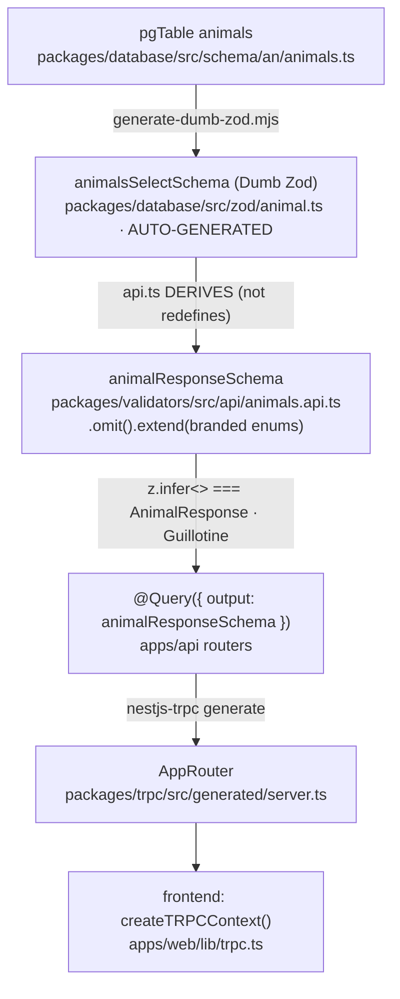

# The Validation Circle — End-to-End Type Safety

> _sniffs_ This is the **sublated** center of the Diamond Seal, Comrade. The tRPC
> types your frontend consumes are not a *copy* of the Drizzle schema — they are
> **derived from** it, then **proven** to agree at compile time. One definition,
> two views, zero drift. Here is the whole circle, naked.

## The one claim that matters

There are **exactly two type contracts** in Rocky (ADR-0019):

1. **Internal contract** — `@rocky/database/zod` ("Dumb Zod"), auto-generated from the `pgTable`.
2. **External contract** — `@rocky/validators/api` (`*.api.ts`), the wire shape.

The tRPC client (L6) is a **codegen projection** of contract #2. So when the
frontend sees `AnimalResponse` or `animalStatusType`, it is seeing
`z.infer<typeof animalResponseSchema>` / `z.infer<typeof animalStatusSchema>` —
which were *sculpted* from the Drizzle table. Nothing is hand-typed twice. The
"validation circle" (ADR-0011 Fig. 1 literally calls it *"the Diamond Seal as a
validation circle"*) is the loop that keeps those two contracts identical.

## Enums: one literal, three artifacts

Enums have a single source of truth in `packages/database/src/constants/*.ts`
via the branded `createEnumValues()`:

```ts
// packages/database/src/constants/_brand.ts
export function createEnumValues<T extends readonly string[]>(values: T): DbEnumValues<T> {
  return Object.freeze([...values]) as unknown as DbEnumValues<T>;
}
```

One script, `scripts/regenerate-enums.mjs`, fans that one frozen array out into
**three** artifacts that can never drift from each other:

| Artifact | Package | Purpose |
| --- | --- | --- |
| `pgEnum('animal_status', …)` | `@rocky/database/.../schemas/enums` | the Postgres ENUM type |
| `animalStatusSchema = zEnum(ANIMAL_STATUS_VALUES)` | `@rocky/validators/enums/domain.ts` | branded Zod enum + `animalStatusType` |
| `export { ANIMAL_STATUS } from "@rocky/database/constants"` | `@rocky/validators/enums/index.ts` | the Dictionary, for runtime switches |

The forgery-guard is `zEnum()` (`packages/validators/src/_enum-helper.ts`): it
accepts **only** a branded `DbEnumValues<T>`. An unbranded literal array fails
type-check, so you cannot hand-roll an enum that disagrees with the database.
The generator also stamps a `NoDrift<z.infer<schema>, Type>` per enum inside
`domain.ts` and activates them all with `ActivateGuillotines`.

So the enum a router switches on (`ANIMAL_STATUS.ALIVE`), the Zod schema that
validates the wire value (`animalStatusSchema`), and the Postgres column type
(`animal_status`) are **all the same frozen array**.

## Row types: the circle itself



Concrete derivation from `animals.api.ts`:

```ts
export const animalResponseSchema = animalsSelectSchema
  .omit({ createdBy: true, validTo: true })
  .extend({ status: animalStatusSchema, sex: sexSchema, birthType: birthTypeSchema.nullable() })
  .strip();
export type AnimalResponse = z.infer<typeof animalResponseSchema>;
```

The Guillotine at the foot of that file **forces compile-time identity**:

```ts
type _drift_animalResponse = NoDrift<z.infer<typeof animalResponseSchema>, AnimalResponse>;
export type _AnimalGuillotines = ActivateGuillotines<[_drift_animalResponse, /* …7 more */ ]>;
```

`NoDrift` is `AssertEqual` (higher-kinded type equality); `ActivateGuillotines`
constrains the tuple to `true[]`. Any widening or narrowing between the
Drizzle-derived schema and the named type **severs the build**. `type-bridge.ts`
also ships `AssertFieldCoverage` to catch a DB column the api schema silently
drops.

## The translation point — where Postgres becomes wire

- **Repository (L4)** returns `typeof animalsTable.$inferSelect` verbatim and
  **never imports validators** (ADR-0011 L4 repo ban).
- **Service (L4)** translates: `return animalResponseSchema.parse(animal)` —
  DB row → `AnimalResponse`. It receives already-validated `CreateAnimalRequest`
  (typed by the api schema) and does **no re-validation** (LAW 1: "Router does
  NOT think; Service does NOT re-validate").
- **Router (L5)** is the gate: schema = `.input()` / `.output()` 1:1, then
  `return unwrap(result)`. It imports the api schema and the Dictionary,
  **never `@rocky/database`** (hard ban — "the tether").

## Why it is *truly* end-to-end

1. **One definition.** `pgTable → Dumb Zod → api schema → tRPC codegen`. Enums:
   `constants → pgEnum + branded Zod + dictionary barrel`. No duplicated literals.
2. **Compile-time proof, not convention.** The Guillotine makes
   `z.infer<schema> === Type` a compiler constraint; `AssertFieldCoverage` catches
   dropped columns.
3. **superjson.** `Date` coercion (`z.coerce.date()`) survives the wire because the
   transport uses superjson (`packages/trpc/src/superjson.ts`), so the frontend's
   `birthDate: Date` actually matches the api schema's output type — not a
   serialized string.
4. **Layer bans prevent drift at the seam.** Routers can't reach `@rocky/database`,
   services can't import Dumb Zod, repos can't import validators — so the only
   place a type could be redefined is the api schema, where the Guillotine catches it.

The net effect: the "tRPC types and enums" your frontend consumes are *literally
the same Zod-inferred types* that were sculpted from Drizzle. The Diamond Seal
doesn't mirror the schema — it derives from it and then proves the derivation holds.

## The two-form enum rule (what routers may touch)

Per ADR-0011 §L5, the router may use enums in exactly two forms:

1. **Branded Zod enum schemas** (`*Schema`) — for type inference when the router
   needs an enum type. The router rarely needs these directly; the `api.ts`
   schema already uses them.
2. **The Dictionary** (`ANIMAL_STATUS`, `RIDE_STATUS`, …) — for runtime switches /
   lookups inside the router's thin logic (`if (input.status === ANIMAL_STATUS.PENDING)`).

- **NEVER magic strings** — `'pending'` is a CRIME.
- **NEVER define enums in routers** — they are synthesized in `database/constants`,
  branded in `validators/enums`.

## Key references

- **ADR-0011** — Diamond Seal layer boundaries (the "validation circle", Fig. 1)
- **ADR-0019** — Two Type Contracts (the type-flow diagram with file:line cites)
- **ADR-0018** — API Validator Schema Design (Guillotine construction)
- `packages/validators/src/utils/type-bridge.ts` — `NoDrift` / `ActivateGuillotines` / `AssertFieldCoverage`
- `packages/validators/src/_enum-helper.ts` — branded `zEnum()` forgery-guard
- `packages/database/src/constants/_brand.ts` — `createEnumValues` / `DbEnumValues`
- `scripts/regenerate-enums.mjs` — the single enum fan-out script
- `packages/validators/src/api/animals.api.ts` — concrete Dumb-Zod-derived schema + Guillotine
- `packages/database/src/zod/animal.ts` — AUTO-GENERATED Dumb Zod
- `apps/web/lib/trpc.ts` — `createTRPCContext<AppRouter>()` frontend consumption
