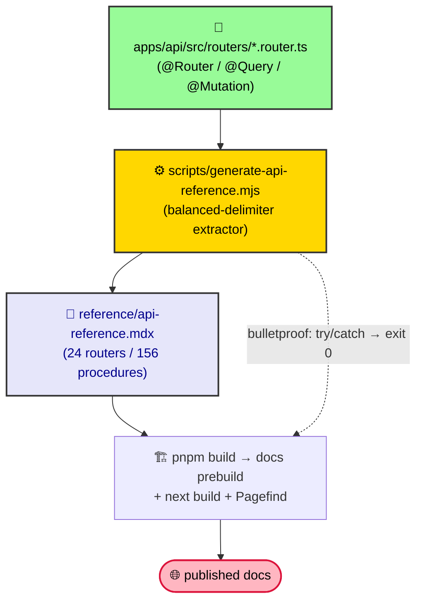

# Generate the API Reference

The docs ship a **deterministic, dependency-free** API reference
(`reference/api-reference.mdx`) generated from the tRPC router source — *not*
from Nextra's `<TSDoc>` component. This page is how.

## Why this exists

Nextra's `<TSDoc>` turns TS types into property / parameter / return tables,
but under **Next 16 + Turbopack** it fails to resolve the
`next-mdx-import-source-file` virtual module and **cratered `pnpm build`**.
Instead we extract the surface ourselves from
`apps/api/src/routers/*.router.ts`. The decision and the Turbopack rot are
tracked in [ADR-0052](/ADR/0052-documentation-architecture).

## The flow



## Run it

```bash
pnpm gen:api-reference
```

That writes `apps/docs/content/reference/api-reference.mdx` from the current
router sources. You rarely need to run it by hand — it is wired into the
docs `build` **prebuild**, so every `pnpm build` (or
`pnpm --filter docs build`) regenerates the page *before* `next build`:

```jsonc
// apps/docs/package.json
"build": "node ../../scripts/generate-api-reference.mjs && next build"
```

## What it extracts

For each router (`@Router({ alias })`) and each `@Query` / `@Mutation`
procedure, the generator records:

| Field | Source |
| --- | --- |
| Router | `@Router({ alias: "…" })` |
| Procedure | the method name |
| Kind | `Query` (read) or `Mutation` (write) |
| Input | the decorator's `input:` Zod schema |
| Output | the decorator's `output:` Zod schema |

All schemas come from `@rocky/validators` (the Diamond Seal API contracts),
so the reference stays in lock-step with the real boundary.

## When it updates

| You changed… | Result |
| --- | --- |
| add / rename a `@Query` or `@Mutation` | appears / disappears on next `pnpm build` |
| change a procedure's `input:` / `output:` schema | the row updates automatically |
| add a whole new `*.router.ts` | a new `## <alias>` section appears |

No manual edit of `api-reference.mdx` is needed — change the **source**
(router decorators), not the output.

## Reading the output (extraction gotchas)

The extractor is regex + balanced-delimiter, tuned for this codebase:

- **Inline `z.object({…})` inputs/outputs** (e.g. `iot` router) are captured
  *whole* and collapsed to a single line, so a multi-line schema never breaks
  the Markdown table row.
- **Nested delimiters** (`{}` `[]` `()`) are balanced, so
  `z.object({ id: z.uuid() }).extend(x.shape)` extracts correctly.
- **Anchors** are lowercased: `## earTag` links as `#eartag`, not `#earTag`.

The script is **bulletproof** — any parse error is caught and it exits `0`,
so it can never break the docs build.

## Don't hand-edit the generated page

`reference/api-reference.mdx` is a derived artifact. Edits are overwritten on
the next build. To change what's documented, edit the router decorators in
`apps/api/src/routers/*.router.ts` and re-run (or let `pnpm build` do it).

## Guardrail

If the published reference looks stale, run `pnpm gen:api-reference` and
inspect `apps/api/src/routers/*.router.ts` — the page is always a faithful
reflection of that source. See
[ADR-0052](/ADR/0052-documentation-architecture) for the architecture and the
why-not-`<TSDoc>` rationale.
