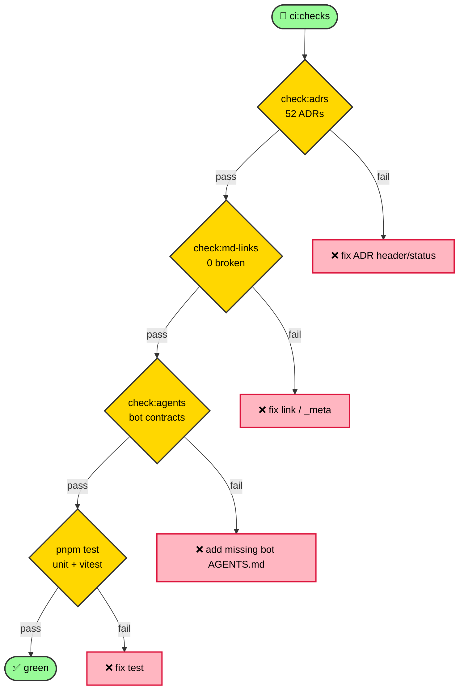

# Run the Guardians

The docs + code have automated guardians wired into `pnpm ci:checks`. Run them locally before pushing.

## The chain


```bash
pnpm ci:checks
```
Expands to:
1. `pnpm generate:trpc` — regenerate `AppRouter` from `nestjs-trpc` decorators.
2. `pnpm check:trpc-boundary` — enforce the tRPC layer-boundary (no leaking server types to clients).
3. `pnpm check:adrs` — every `NNNN-*.md` in `content/ADR/` conforms to [ADR-0033](/ADR/0033-frontend-mobile-adr-standard).
4. `pnpm check:md-links` — every internal markdown link in `content/` resolves.
5. `pnpm test` — the unit/doc-test suite.

## Individual runs (faster feedback)
| You changed… | Run |
| --- | --- |
| an ADR | `pnpm check:adrs` |
| any doc link | `pnpm check:md-links` |
| a tRPC router | `pnpm generate:trpc && pnpm check:trpc-boundary` |
| anything | `pnpm test` |

## Reading a failure
- `check:adrs` prints the offending file + which rule failed (H1 format, header table, status value, missing section). Fix the ADR; re-run.
- `check:md-links` prints `BROKEN internal link(s)` with `file:line -> raw`. It *warns* (not fails) on `_meta` key mismatches and anchor misses. Only broken links set exit code 1.
- `generate:trpc` fails if a router is missing `@Output` (see [ADR-0032](/ADR/0032-trpc-output-schema-ts6059)).

## Add your own guardian
Follow [Write a docs guardian script](/how-to/write-docs-guardian) — pure Node, dependency-free, chained in `ci:checks` before `pnpm test`.

## Guardrail
A red CI means one of these failed. Don't merge until `pnpm ci:checks` is green. See the [Documentation Architecture](/ADR/0052-documentation-architecture) ADR for the governance model.
