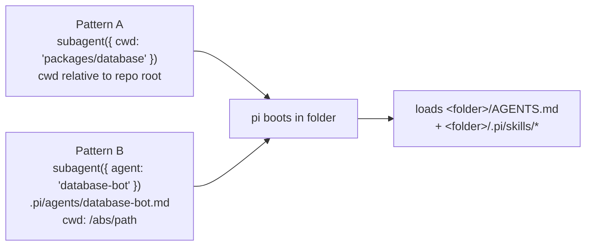

# Spawn a role-scoped subagent (RobotFarm Role Folders)

Rocky's bot contracts already live in per-directory `AGENTS.md` files (one per RobotFarm bot — see the Child RobotFarm Index in the root `AGENTS.md`). A *Role Folder* is just that bot folder: when a subagent runs with its working directory set to the folder, pi auto-loads that folder's `AGENTS.md` as its system context and discovers any per-role skills under `<folder>/.pi/skills/`. No new `CLAUDE.md` or separate agent tree is required.

## When to use this

Spawn a role-scoped subagent whenever you want a child session constrained to a single bot's contract — its scope, conventions, and skills — instead of the whole-repo context. Use it for schema changes (Database Bot), Zod edits (Validation Bot), router work (API Bot), domain logic, doc recipes, and so on.

## The two patterns



### Pattern A — spawn-param `cwd` (relative to repo root)

Pass `cwd` as a spawn parameter. Its base is the **project root** (`process.cwd()` of the parent), so a repo-relative path resolves correctly:

```
subagent({ agent: "scout", cwd: "packages/database", task: "..." })
```

The child pi boots in `packages/database`, walks up loading context files, and lands on `packages/database/AGENTS.md` as the most specific (highest-priority) context.

### Pattern B — named `.pi/agents/<bot>.md` (absolute `cwd`)

For high-traffic bots there is a pre-created named agent at `.pi/agents/<name>-bot.md` (e.g. `database-bot.md`, `validation-bot.md`, `api-bot.md`). Invoke it by name:

```
subagent({ agent: "database-bot", task: "..." })
```

Each named agent carries `cwd: /home/goce/appz/rocky/packages/database` (an **absolute** path) plus `spawning: false` and `auto-exit: true`, so it scopes to the folder without you passing `cwd` each time.

## Per-role skills (`.pi/skills/`)

Drop bot-specific skills at `<folder>/.pi/skills/<name>/SKILL.md`. They load automatically whenever that folder is the active `cwd` — via both Pattern A and Pattern B. Example already in place:

- `packages/database/.pi/skills/db-migration/SKILL.md` — the Database Bot's migration workflow (Drizzle `generate` → `fix-rls-sql.mjs` → `psql` → `seed`, plus the drizzle-kit `$N`-placeholder bug).

pi-core discovers these through `loadSkills({ cwd: <folder>, includeDefaults: true })` — the skill's scope is reported as `project`.

## The `subagent` tool (pi-herdr-subagents)

The `subagent` tool comes from the **pi-herdr-subagents** extension (install with `pi install npm:pi-herdr-subagents`; it runs inside **herdr**, the required terminal mux — `HERDR_ENV=1` plus the herdr CLI). It reads `.pi/agents/*.md`, supports the `cwd` parameter, and is the tool that consumes the `-bot` role agents and the per-role `.pi/skills`. Both Pattern A and Pattern B above use it.

If a `subagent({ agent: "database-bot" })` call ever returns `Unknown agent`, the call hit a different `subagent` backend (one whose agent list is the skill-subagent registry, not `.pi/agents/*.md`). Confirm pi-herdr-subagents is the active extension in that session — `pi list` should show `npm:pi-herdr-subagents` and no other subagents extension. The `cwd`→`AGENTS.md` loading itself was verified independently (see Verify it).

## Verify it

A dependency-free test exercises the real pi modules (no network, no multiplexer, no API key):

```bash
node --test .pi/test/role-folders.test.ts
```

It asserts three things: the role folder's `AGENTS.md` is loaded as a context file when `cwd` is that folder; a per-role skill at `<cwd>/.pi/skills/<name>/SKILL.md` is discovered; and skills are scoped to `cwd` (the role skill is **not** visible from an unrelated folder).

## Gotchas

- **Frontmatter `cwd` must be absolute.** In a named `.pi/agents/<bot>.md`, `getAgentConfigDir()` returns `PI_CODING_AGENT_DIR` or `~/.pi/agent`, so a *relative* frontmatter `cwd` (e.g. `cwd: ./packages/database`) would wrongly resolve under `~/.pi/agent`. Use an absolute path, or rely on Pattern A's spawn-param `cwd` (base = repo root).
- **`AGENTS.md` wins by specificity.** Context files are appended most-specific-last, so the folder's own `AGENTS.md` overrides the root's for that child — exactly what you want for role isolation.
- **The pre-existing `.pi/test/*` (extension-suite copy) is not runnable as-is** - its `../pi-extension` import target is missing here. The `role-folders.test.ts` above is self-contained and does not depend on it.

See the [Documentation Architecture](/ADR/0052-documentation-architecture) ADR for the taxonomy and [ADR-0033](/ADR/0033-frontend-mobile-adr-standard) for the ADR standard. The authoritative contract list is the root `AGENTS.md` Child RobotFarm Index.
