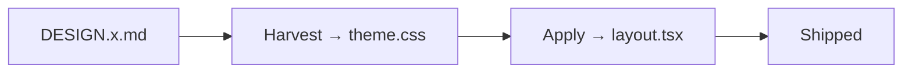
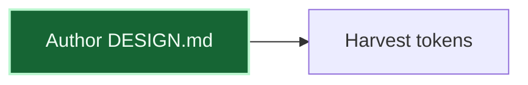

# Use Mermaid Diagrams

The docs site renders [Mermaid](https://mermaid.js.org) diagrams natively from fenced code
blocks — no client component, no `<Mermaid>` wrapper, no extra import. Diagrams render
client-side via `@theguild/remark-mermaid` (wired in `apps/docs/app/mdx-components.tsx`).

## Basic usage

Use a ```` ```mermaid ```` fence. Keep the opening fence immediately followed by `mermaid`
with **no leading whitespace** before the diagram body:

````md

````

## Supported shapes

Flowcharts (`flowchart` / `graph`), sequence diagrams (`sequenceDiagram`), state diagrams
(`stateDiagram-v2`), class diagrams, ER diagrams, and Gantt charts all work. Prefer
`flowchart` for architecture/decision diagrams.

## Style for contrast

Diagrams inherit the Nextra theme. For ADRs, prefer high-contrast, explicitly-colored nodes
over Mermaid's default pastel palette:



## Validate complex diagrams

Before embedding a large diagram, lint it locally if `mmdc` is available:

```bash
npx -y @mermaid-js/mermaid-cli -i diagram.mmd -o /dev/null   # syntax check only
```

A syntax error renders as an error block at build/runtime, so validate first for anything
non-trivial.

## Citation rule still applies

If a diagram references a repo-root `DESIGN*.md` file, cite it by **inline-code path** inside
the prose (never as a markdown link) — see
[Use a DESIGN.md Theme](/how-to/use-design-md-theme). Diagrams themselves may show the bare
filename as a node label.
