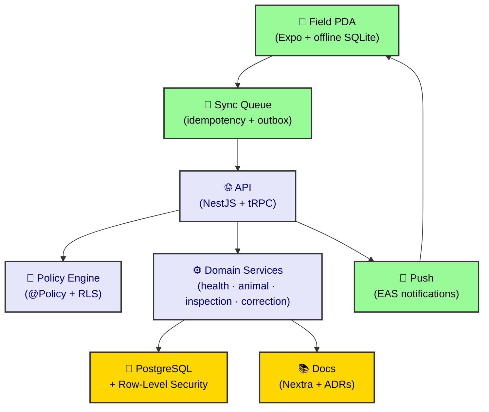

# Rocky Documentation

Welcome to the **Rocky** documentation site. This site is built with
[Nextra](https://nextra.site) and the Nextra Docs Theme, served from
`apps/docs/` on port **3002** ([http://localhost:3002](http://localhost:3002), `DOCS_PORT`).

## Sections

- [Get Started](/get-started) — scaffold and local development
- Architecture decision records live under `docs/adr/`

> [!TIP]
>
> Content is authored as MDX files in the `content/` directory. Add a new
> `.mdx` file there and it appears automatically in the sidebar.
