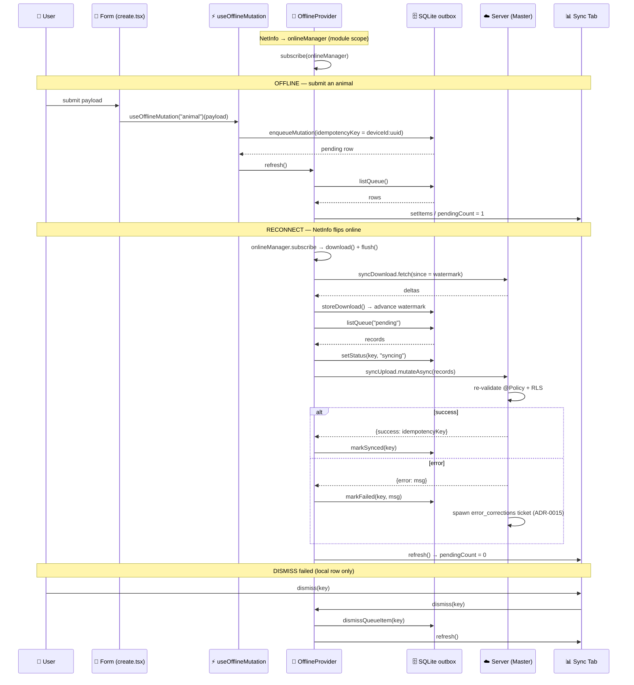
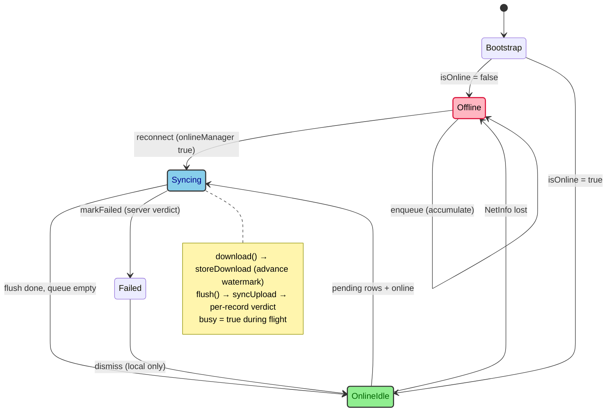

# Offline Sync Architecture (Mobile PDA)

| Key            | Value                                                                                                                       |
| -------------- | --------------------------------------------------------------------------------------------------------------------------- |
| **Status**     | Living document · extracted from `apps/mob/lib/offline/*` + `providers/offline-provider.tsx`                                  |
| **Date**       | 2026-07-10                                                                                                                  |
| **Author**     | Mobile Bot                                                                                                                  |
| **Scope**      | The offline-first subsystem of the Rocky PDA (`apps/mob`) — local SQLite cache, outbox, network-gated sync, `OfflineProvider` |
| **Companion**  | **ADR-0036 (Offline-first Sync Architecture)** · ADR-0015 (PDA Sync Conflict Resolution via Error Corrections) · ADR-0035 (Mobile rendering/data-fetching) |
| **Maintained** | Via RobotFarm pass — keep the component map and diagrams in sync with `lib/offline/*` when the offline layer changes          |

> The PDA is **offline-first**: it writes locally and reconciles with the Server on (re)connect. The
> Server is the **Master**; the phone is an optimistic worker that trusts nothing about its own writes.
> Conflicts surface as `failed` outbox items; the Server adjudicates and (on error) spawns a
> human-reviewed `error_corrections` ticket (ADR-0015).

## 1. Component map

| Module          | File                                       | Responsibility                                                                                                                              |
| --------------- | ------------------------------------------ | ------------------------------------------------------------------------------------------------------------------------------------------ |
| Local DB        | `lib/offline/db.ts`                        | `getLocalDb()` opens `rocky_offline.db` (raw `expo-sqlite`, no ORM). Migrates `sync_queue`, `local_cache`, `sync_meta`, `query_cache`. Exposes `IS_WEB` (native-only guard). |
| Outbox          | `lib/offline/sync-queue.ts`                | `enqueueMutation` / `listQueue` / `setStatus` / `markSynced` / `markFailed` / `dismissQueueItem`; cache `storeDownload` (advances `watermark`); `getMeta`/`setMeta`; `uuidv4`. |
| Device identity | `lib/offline/device-id.ts`                 | `getDeviceId()` from `expo-secure-store` (stable per install) → idempotency prefix.                                                        |
| Query persistence | `lib/offline/persist.ts`                 | `getQueryPersister()` = `createSyncStoragePersister` over `query_cache` (ADR-0036 d5); wired via `persistQueryClient` in `trpc-provider.tsx`. |
| Sync brain      | `providers/offline-provider.tsx`           | `OfflineProvider` + `useOffline()`. Owns deviceId, outbox state, NetInfo→`onlineManager` wiring, network-gated `download`/`flush`, heal-on-reconnect, bootstrap. |
| Write primitive | `lib/offline/use-offline-mutation.ts`      | `useOfflineMutation(type)` → enqueues + drains immediately if online. Adopted by every domain sweep (WO-094/095/096).                        |
| Server sync     | `packages/domains/sync` + `apps/api/src/routers/sync.router.ts` | `syncUpload` (accepts outbox, returns per-record `results[]`) + `syncDownload` (deltas since `watermark`).                            |

## 2. The `OfflineProvider` — sync brain

Mounted **inside `TRPCProvider`** (needs `trpc` context). It is the central nervous system of the
offline layer.

### 2.1 Connectivity wiring (module scope)

At import, it binds NetInfo to TanStack Query's global `onlineManager` once:

```ts
onlineManager.setEventListener((setOnline) =>
  NetInfo.addEventListener((state) =>
    setOnline(!!state.isConnected && state.isInternetReachable !== false)));
```

This is what `useOfflineMutation` reads via `onlineManager.isOnline()` to decide whether to flush
immediately.

On top of that, it binds `AppState` to TanStack Query's global `focusManager` once, so stale
read queries **refetch when the app returns to the foreground**:

```ts
focusManager.setEventListener((setFocused) => {
  const sub = AppState.addEventListener("change", (s) => setFocused(s === "active"));
  return () => sub.remove();
});
```

Both wirings are guarded by module-scope booleans (`_netinfoWired`, `_focusWired`)
so they execute exactly once at import, regardless of how many `OfflineProvider`
instances mount. Together with the network-regain flush (§2.4) this is the offline-first
**read** path: reads pause while offline (`onlineManager`) and refresh on foreground
return (`focusManager`), while the outbox (`flush`, §2.3) carries the writes.

### 2.2 The context surface (`useOffline()`)

`{ deviceId, items, pendingCount, isOnline, isBusy, flush, download, dismiss, refresh }`. Screens
(the Sync tab) and the write primitive consume it.

### 2.3 The three verbs

- **`refresh()`** — reads `listQueue()` from SQLite → `setItems`. On web: `setItems([])` (native-only guard).
- **`download()`** — _if online_, `syncDownload.fetch({ since: watermark })` → `storeDownload()`
  materializes `local_cache` and advances the `watermark`. Best-effort: transient errors are swallowed;
  it still `refresh()`es.
- **`flush()`** — _if online_ and the queue has `pending` rows: marks them `syncing`, POSTs
  `syncUpload`, then applies the Server's per-record verdict — `success → markSynced`,
  `error → markFailed`. A hard network failure marks all pending `failed`.

### 2.4 The two effects

- **Heal-on-reconnect:** `onlineManager.subscribe` → on `true`, runs `download()` then `flush()`.
  Automatic outbox drain when signal returns.
- **Bootstrap:** on mount, resolves `deviceId`, then `download()` (pull) → `flush()` (push stragglers)
  → `refresh()` (load outbox into UI).

### 2.5 Native-only guard (`IS_WEB`)

Every DB-touching verb short-circuits on web (`typeof document !== "undefined"`). The PDA's offline
brain is **asleep in a browser** — it only wakes on a simulator/device. This followed the
`SharedArrayBuffer is not defined` crash from `expo-sqlite` v56's web entry (which needs a
cross-origin-isolated context). Web is a dev-only UI surface, not an acceptance target. See
**apps/mob/AGENTS.md → "WO-082 Acceptance — Native Verification"**.

### 2.6 Background periodic sync (WO-092)

On top of the network-regain flush (heal-on-reconnect, §2.4), a **scheduled** `expo-background-fetch`
task drains the outbox even when the app is backgrounded/killed. `lib/offline/background-sync.ts` defines
the `rocky-background-sync` task: `TaskManager.defineTask` invokes a drain callback that `OfflineProvider`
registers on mount (via a ref, since the native task runs outside the React tree) — the drain is
`download()` + `flush()`. `registerBackgroundSync()` is idempotent and **skipped on web** (the offline
subsystem is native-only; `expo-background-fetch` has no web entry). `app.json` carries the
`expo-background-fetch` plugin (iOS `UIBackgroundModes: fetch`). Deps: `expo-background-fetch` +
`expo-task-manager` (SDK 56). **NOTE:** `expo-background-fetch` is **deprecated in SDK 56** in favour of
`expo-background-task` — migration is future cleanup.

## 3. Server-as-Master conflict model (ADR-0015)

`flush` does **not** decide outcomes. It ships the outbox; the Server re-validates `@Policy` + RLS and
returns `results[]`. On `error`, the row becomes `failed` **and the Server spawns a human-reviewed
`error_corrections` ticket**. `dismiss(key)` deletes only the **local** row — the server ticket
outlives it. The client is a faithful proposer, never a co-author.

## 4. Idempotency

Every queued record carries `idempotency_key = deviceId:uuid` (set in `enqueueMutation`). So even
though both the bootstrap **and** the reconnect effect may call `flush`, the Server dedupes by key —
the double-trigger is a symptom already neutralized by structure.

## 5. Diagrams

### 5.1 Sequence — the WO-082 cycle



### 5.2 State machine — the provider's life



## 6. Verification

- **Native run (the only runtime gate):** `pnpm --filter mob dev` → `i`/`a` in Expo CLI; exercise
  offline submit → reconnect → `pending → synced`; confirm cache survives restart. Procedure + evidence
  in **apps/mob/AGENTS.md → "WO-082 Acceptance — Native Verification"**.
- **CI-substitutable half (harness):** `apps/mob` `tsc --noEmit` → exit 0, plus the WO-106 doctrine
  doc-test (`pnpm --filter docs test:offline`, 11/11) which exercises the REAL `lib/offline/*` against
  mocked `expo-sqlite` / `expo-secure-store`.

## 7. Cross-references

- ADR-0036 — Offline-first Sync Architecture (the decision record)
- ADR-0015 — PDA Sync Conflict Resolution via Error Corrections (server-side ticket model)
- ADR-0035 — Mobile rendering / data-fetching target
- `apps/mob/AGENTS.md` — Offline Subsystem Contract + WO-082 Acceptance (Native Verification)
- `apps/docs/content/workorder.md` — WO-082 / WO-094 / WO-095 / WO-096
- ADR-0043 — Push Notifications, Background Sync & Deep-link (the `notification-provider` deep-link +
  offline-parity flow calls `useOffline().download()` first; WO-091/092/093 implementation status there)
