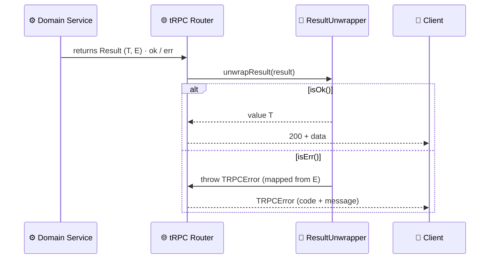

> *Adapted from the Diamond Seal `@repo/*` doctrine to the Rocky `@rocky/*` monorepo — package scope `@repo/*` → `@rocky/*` and tooling `bun` → `pnpm`. This reflects the **actual** codebase: the `Result` monad (`ok`/`err`/`isError`/`Result`) lives in `@rocky/domains-shared`. The `AGENTS.md` Error Sovereignty import-ownership table now matches this doctrine (Result from `@rocky/domains-shared`, tRPC maps from `@rocky/validators/errors` + `createResultUnwrapper` from `@rocky/trpc`).*

# The Law of the Result Monad & Error Sovereignty

> *"The philosophers have only interpreted the validators; the point is to move Result to domains-shared."*

**Status:** Active Doctrine
**Date:** 2026-05-09
**Author:** System Architecture Review
**Decision:** The `Result` monad (`ok`, `err`, `isError`, `Result<T,E>`) and shared error codes (`SHARED_ERRORS`) are owned by `@rocky/domains-shared` (L4), NOT `@rocky/validators` (L1). Domain error codes live in `packages/domains/[domain]/src/`. TRPC error mappings live in `packages/validators/src/errors/`. These are separate concerns. The Panopticon enforces both.

---

## Table of Contents

1. [The Ideological Contradiction](#1-the-ideological-contradiction)
2. [The Absolute Truth of the Imports](#2-the-absolute-truth-of-the-imports)
3. [The Bootstrapping Sequence](#3-the-bootstrapping-sequence)
4. [Error Code Hyperinflation](#4-error-code-hyperinflation)
5. [The Branching Logic Test](#5-the-branching-logic-test)
6. [The Great Consolidation](#6-the-great-consolidation)
7. [The Architectural Split — Church and State](#7-the-architectural-split--church-and-state)
8. [Panopticon Enforcement](#8-panopticon-enforcement)
9. [The Philosophical Victory](#9-the-philosophical-victory)

---

## 1. The Ideological Contradiction

Look at the imports in a typical domain service:

```typescript
// ❌ WRONG — The Capitalist Illusion (Schizophrenic Imports)
import { err, ok, type Result } from "@rocky/validators";
import { SHARED_ERRORS } from "@rocky/validators/errors";
```

This is **schizophrenia**. The `Result` monad (`ok`, `err`) and its method (`unwrap()`) are part of the exact same concept. Why is one coming from `domains-shared` and the others from `validators`?

This happens because of an incomplete migration. The `Result` type was moved from `validators` to `domains-shared`, but imports were never updated across the codebase. TypeScript panics because `dist` folders are stale.

### The Root Cause

**Validators (L1) DO NOT OWN ERRORS OR RESULTS.** The Domain (L4) owns them.

The `validators` package is Layer 1 — autonomous schemas. It validates shapes. It does not define business logic, error handling, or the Result monad. Those are domain concerns.

---

## 2. The Absolute Truth of the Imports

Under the purified Diamond Seal architecture, every domain file MUST follow this pattern:

```typescript
// ✅ CORRECT — The Marxist-Materialist Reality
import {
  err,
  ok,
  type Result,
  SHARED_ERRORS,
} from "@rocky/domains-shared";
import { GEO_ERRORS, type GeoErrorCode } from "./geo.errors"; // Local domain errors!
```

**EVERYTHING** related to the generic Result monad — `ok`, `err`, `Result`, `isError` — MUST be imported from `@rocky/domains-shared`.

**EVERYTHING** related to domain-specific error codes — `GEO_ERRORS`, `RIDE_ERRORS`, etc. — MUST live in the domain package itself (`packages/domains/[domain]/src/errors/[domain].errors.ts`).

**NOTHING** from `@rocky/validators/errors` or `@trpc/(server|client)` may be imported by any domain file.

### Import Ownership Table

| Symbol                                     | Correct Import Source               | Wrong Import Source          |
| ------------------------------------------ | ----------------------------------- | ---------------------------- |
| `ok`, `err`, `Result`, `isError`                | `@rocky/domains-shared`              | `@rocky/validators` ❌        |
| `SHARED_ERRORS`                            | `@rocky/domains-shared`              | `@rocky/validators/errors` ❌ |
| `GEO_ERRORS`, `RIDE_ERRORS`, etc.          | `./[domain].errors` (local)         | `@rocky/validators/errors` ❌ |
| `RIDE_TRPC_ERROR_MAP`                      | `@rocky/validators/errors` (L1 only) | Any domain file ❌           |
| `TRPCError`                                | Routers only (L3/L5)                | Any domain file ❌           |

---

## 3. The Bootstrapping Sequence

When `dist` folders are stale or the Result type has been moved, execute this sequence to restore the means of production:

### Step 1: Clean the Slate

```bash
# Run from the root of the monorepo
rm -rf packages/*/dist
```

Delete old, corrupted build artifacts so the compiler doesn't hallucinate.

### Step 2: Verify Exports in `domains-shared`

Ensure `packages/domains/shared/src/index.ts` exports the full Result monad:

```typescript
// packages/domains/shared/src/index.ts
export * from "./result"; // exports Result, ok, err, fromAsyncThrowable, isError
export * from "./errors"; // exports SHARED_ERRORS
```

### Step 3: Build the Bedrock

Build `domains-shared` FIRST — everything else depends on its `Result` type:

```bash
cd packages/domains/shared
pnpm build
```

### Step 4: Build the Validators

Validators depends on `domains-shared` for the `Result` type in API contracts:

```bash
cd packages/validators
pnpm build
```

### Step 5: Fix All Domain Imports

Use a subagent to scan and fix all files in `packages/domains/`:

> **Agent Prompt:**
> "We have moved the Result monad. Scan all files in `packages/domains/`.
>
> 1. Remove ANY imports of `Result`, `ok`, `err`, `isError`, or `SHARED_ERRORS` from `@rocky/validators` or `@rocky/validators/errors`.
> 2. Add those exact imports to the existing `@rocky/domains-shared` import statement.
> 3. Run `pnpm exec tsc --noEmit`. Do not stop until the domain compiles."

---

## 4. Error Code Hyperinflation

We are suffering from the illusion that every single `try/catch` block deserves its own uniquely named gravestone.

Look at this bureaucratic nightmare:

```typescript
// ❌ WRONG — Error Code Hyperinflation
export const RIDE_ERRORS = {
  NO_SHOW_CONFIG_CREATE_FAILED: "NO_SHOW_CONFIG_CREATE_FAILED",
  NO_SHOW_CONFIG_UPDATE_FAILED: "NO_SHOW_CONFIG_UPDATE_FAILED",
  NO_SHOW_APPROVAL_CREATE_FAILED: "NO_SHOW_APPROVAL_CREATE_FAILED",
  LATE_ARRIVAL_CONFIG_CREATE_FAILED: "LATE_ARRIVAL_CONFIG_CREATE_FAILED",
  LATE_ARRIVAL_CONFIG_UPDATE_FAILED: "LATE_ARRIVAL_CONFIG_UPDATE_FAILED",
  PASSENGER_TELEGRAM_SETTINGS_CREATE_FAILED:
    "PASSENGER_TELEGRAM_SETTINGS_CREATE_FAILED",
  // ... and it goes on and on!
} as const;
```

Does the frontend React application care if the database failed specifically on `LATE_ARRIVAL_CONFIG_CREATE_FAILED` versus `NO_SHOW_CONFIG_CREATE_FAILED`? **No.** The frontend displays a red toast: *"Failed to save settings."*

By creating a unique error code for every database operation, you:

- **Bloat bundle size** with hundreds of unused string constants
- **Destroy developer experience** with a 200-line error file
- **Create a maintenance nightmare** where every new table column needs a new error code

---

## 5. The Branching Logic Test

**Should you create an error code for every possible known error?**

**NO.** You only create a distinct Error Code if the consumer (Frontend, another Service) needs to execute **different branching logic** (`if/else`) based on that specific code.

### GOOD — Necessary Distinct Errors

| Error Code               | Why Distinct?                                 |
| ------------------------ | --------------------------------------------- |
| `INSUFFICIENT_FUNDS`     | Frontend pops up "Top Up Wallet" modal        |
| `USER_NOT_VERIFIED`      | Frontend redirects to OTP verification screen |
| `PROMO_CODE_EXPIRED`     | Frontend highlights promo input in red        |
| `DRIVER_TOO_FAR`         | Frontend shows "No drivers nearby" map state  |
| `RIDE_ALREADY_CANCELLED` | Frontend suppresses duplicate cancel button   |

### BAD — Useless Hyper-Specific Errors

| Error Code                                  | Problem                                 |
| ------------------------------------------- | --------------------------------------- |
| `NO_SHOW_CONFIG_CREATE_FAILED`              | Frontend just shows generic error toast |
| `DATABASE_ERROR_DURING_USER_CREATION`       | Frontend just shows generic error toast |
| `LATE_ARRIVAL_CONFIG_UPDATE_FAILED`         | Frontend just shows generic error toast |
| `PASSENGER_TELEGRAM_SETTINGS_CREATE_FAILED` | Frontend just shows generic error toast |

**Rule of thumb:** If the frontend would show the same UI for two different error codes, they should be the SAME error code.

---

## 6. The Great Consolidation

### Universal Infrastructure Errors

If the database fails, or an external API returns 500, use `DATABASE_ERROR` or `EXTERNAL_SERVICE_ERROR`. Pass the specific context in the **message** or **details** payload, not the error code:

```typescript
// ✅ CORRECT — Generic code, descriptive message
export const rideErr = {
  configSaveFailed: (configType: string, details?: string) =>
    err(new RideError(RIDE_ERRORS.DATABASE_ERROR, `Failed to save ${configType} config: ${details}`)),
};
```

### Universal State Errors

Instead of `INVALID_TICKET_STATUS`, `INVALID_RIDE_STATUS`, `INVALID_PAYOUT_STATUS`, use `INVALID_STATE` or `INVALID_STATUS_TRANSITION` and put the specific entity in the error message.

### Target Error File Size

| Domain Complexity     | Target Error Codes                  |
| --------------------- | ----------------------------------- |
| Simple CRUD           | 3-5 codes                           |
| Medium business logic | 5-10 codes                          |
| Complex state machine | 10-15 codes                         |
| Anything above 15     | **You have hyperinflation. Prune.** |

---

## 7. The Architectural Split — Church and State



Domain error files currently contain an **ideological contradiction**: they mix the **Domain Truth** (error code strings) with the **API Translation** (TRPC error maps).

This violates the Panopticon. Domains must not know about TRPC.

### The Split

#### A. Domain Error Codes → `packages/domains/[domain]/src/errors/[domain].errors.ts`

```typescript
// packages/domains/rides/src/ride.errors.ts
import { err } from "@rocky/domains-shared";

export const RIDE_ERRORS = {
  RIDE_NOT_FOUND: "RIDE_NOT_FOUND",
  DRIVER_TOO_FAR: "DRIVER_TOO_FAR",
  INSUFFICIENT_FUNDS: "INSUFFICIENT_FUNDS",
  INVALID_STATE: "INVALID_STATE",
  DATABASE_ERROR: "DATABASE_ERROR",
} as const;

export type RideErrorCode = (typeof RIDE_ERRORS)[keyof typeof RIDE_ERRORS];

export class RideError extends Error {
  constructor(public readonly code: RideErrorCode, message?: string) {
    super(message ?? code);
    this.name = "RideError";
  }
}

// Real domain errors carry `.code` (see packages/domains/movement/src/errors).
// neverthrow's `err` takes ONE argument — wrap the coded error, never two strings.
export const rideErr = {
  rideNotFound: (id: string) => err(new RideError("RIDE_NOT_FOUND", `Ride ${id} not found`)),
  driverTooFar: (distance: number) => err(new RideError("DRIVER_TOO_FAR", `Driver is ${distance}m away`)),
  insufficientFunds: (balance: number) => err(new RideError("INSUFFICIENT_FUNDS", `Balance ${balance} insufficient`)),
  invalidState: (entity: string, from: string, to: string) => err(new RideError("INVALID_STATE", `Cannot transition ${entity} from ${from} to ${to}`)),
  dbError: (operation: string, details?: string) => err(new RideError("DATABASE_ERROR", `DB failed on ${operation}: ${details}`)),
};
```

#### B. TRPC Mapper → `packages/validators/src/errors/[domain].errors.ts`

```typescript
// packages/validators/src/errors/ride.errors.ts
import type { TRPCErrorCode } from "../trpc-mapping";
import type { RideErrorCode } from "@rocky/domains-rides";

export const RIDE_TRPC_ERROR_MAP: Record<
  RideErrorCode,
  { code: TRPCErrorCode; message: string }
> = {
  RIDE_NOT_FOUND: { code: "NOT_FOUND", message: "Ride not found" },
  DRIVER_TOO_FAR: { code: "BAD_REQUEST", message: "Driver is too far away" },
  INSUFFICIENT_FUNDS: { code: "BAD_REQUEST", message: "Insufficient funds" },
  INVALID_STATE: { code: "CONFLICT", message: "Invalid state transition" },
  DATABASE_ERROR: {
    code: "INTERNAL_SERVER_ERROR",
    message: "Internal server error",
  },
};
```

**Key rule:** The TRPC mapper imports the **type** from the domain. The domain knows nothing about the TRPC mapper.

---

## 8. Enforcement

> **Note:** there is **no** tool called `panopticon` in this repo — the name is a
> placeholder carried over from the original Diamond Seal doctrine. The laws below are
> guarded by two real machines, described at the end of this section.

### Law A: Transport Agnosticism (Import Ban)

All 5 Domain layers now ban these imports:

| Layer                      | Banned Pattern                                               |
| -------------------------- | ------------------------------------------------------------ |
| Domain Module Wiring (L4)  | `/^@trpc\/(server\|client)/`                                 |
| Repository Bedrock (L4)    | `/^@trpc\/(server\|client)/`                                 |
| Service Isolation (L4)     | `/^@trpc\/(server\|client)/`, `/^@repo\/validators\/errors/` |
| Domain Infrastructure (L4) | `/^@trpc\/(server\|client)/`, `/^@repo\/validators\/errors/` |
| Domain Support (L4)        | `/^@trpc\/(server\|client)/`, `/^@repo\/validators\/errors/` |

### Law B: Error Sovereignty (Import Ban)

Domain files may not import from `@rocky/validators/errors`. Error codes are owned by the domain.

### Law C: Structural Content Scan

A pass should scan all `packages/domains/` files for forbidden patterns:

| Pattern          | Violation                                                     |
| ---------------- | ------------------------------------------------------------- |
| `TRPC_ERROR_MAP` | Domain knows about HTTP/tRPC error mappings                   |
| `TRPCError`      | Domain throws HTTP errors instead of returning `Result<T, E>` |

These should be caught even if the import comes through a barrel export that bypasses the
regex-based import checker.

### Enforcement status

Two real machines guard these laws — neither is named `panopticon`:

1. **Doc-test guard** — `apps/docs/scripts/verify-result-doctrine.mjs` (run via
   `pnpm --filter docs test:doctrine`; see `TESTING_DOCTRINE.md`) re-parses the import
   blocks in this doc and asserts every `@rocky/*` symbol resolves to a real export, and
   that `createResultUnwrapper` maps a coded domain `Result<E>` to a `TRPCError`. It keeps
   *this doc's* claims honest, but it does **not** scan domain source.
2. **Layer-boundary guard** — `scripts/check-layers.mjs`, wired into `pnpm ci:checks` as
   `check:layers` (standard **ROCKY-DS 001:2026(E)**, Visa Matrix Annex C). This is the
   real machine that fails the build on import-boundary violations. Its encoded rows
   currently cover the DB/validator bans:
   - domain **services** SHALL NOT import `@rocky/database` (except `/constants`);
   - domain **repositories** SHALL NOT import `@rocky/validators/api` or `/events`;
   - **routers** SHALL NOT import `@rocky/database` (any subpath), `/events`, or `/integrations`.

> **Implemented (2026-07):** Laws A–C are now machine-enforced. `scripts/check-layers.mjs`
> (run via `pnpm check:layers`, part of `pnpm ci:checks`) gained a domain-scope row that bans
> `@trpc/(server|client)` and `@rocky/validators/errors` inside `packages/domains/*/src`. A full
> scan confirms zero violations in the real codebase, so the doctrine is now self-enforcing
> rather than convention-held. While wiring this, the row regex anchoring was also corrected:
> it had been matching a leading `/packages` that `path.relative()` does not emit, so the whole
> guard was silently vacuous before — it now actually fires.

---

## 9. The Philosophical Victory

By enforcing these rules, the Domain becomes **transport-agnostic**:

```txt
Domain Service
  → returns Result<T, E>
    → tRouter maps E to TRPCError
    → GraphQL resolver maps E to GraphQLError
    → REST controller maps E to HTTP 4xx/5xx
    → gRPC handler maps E to status codes
    → CLI maps E to exit codes
```

The Domain Service does not change. Not one line. Whether you expose tRPC, GraphQL, REST, gRPC, or a CLI — the domain remains a **pure, untouchable mathematical model of your business**.

### The Three Pillars

1. **Result Monad Sovereignty** — `ok`/`err`/`isError`/`Result` live in `@rocky/domains-shared`, not validators
2. **Error Code Parsimony** — Only create distinct codes for UI branching logic; consolidate CRUD failures
3. **Church and State** — Domain error codes in `packages/domains/`, TRPC mappings in `packages/validators/`

---

## Execution Checklist

- [ ] Run Bootstrapping Sequence (Steps 1-4) to rebuild `dist` folders
- [ ] Dispatch subagent to fix all domain imports (`Result`, `ok`, `err`, `isError`, `SHARED_ERRORS` → `@rocky/domains-shared`)
- [ ] Prune error code hyperinflation in all domain error files
- [ ] Split mixed error files: domain codes → `packages/domains/[domain]/src/`, TRPC maps → `packages/validators/src/errors/`
- [ ] Run `pnpm exec tsc --noEmit` — must pass
- [ ] Run `panopticon check` — must pass
- [ ] Commit with message: `feat(architecture): enforce Result monad sovereignty and error code parsimony`
