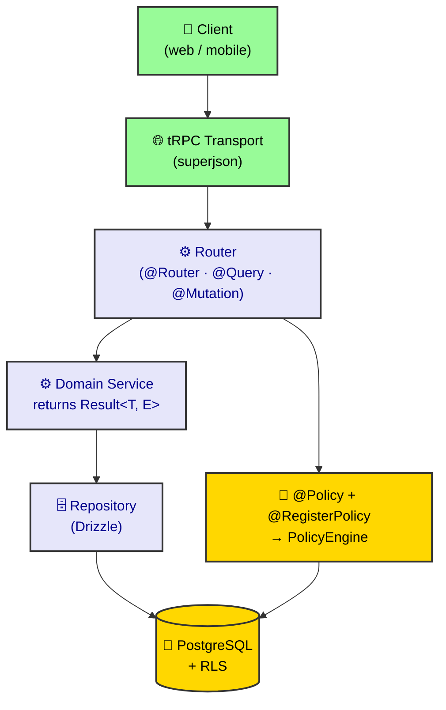

# Router Design — Canonical Blueprint

> *Adapted from the Diamond Seal `@repo/*` doctrine to the Rocky `@rocky/*` monorepo — package scope `@repo/*` → `@rocky/*` and tooling `bun` → `pnpm`. Example entities are illustrative.*

This is the **canonical blueprint** for tRPC routers — the "what right looks like" companion to [Router Patterns & Anti-Patterns](./router-patterns.md) (the exhaustive list) and [Result Monad & Error Sovereignty](./result-monad-and-error-sovereignty.md) (the error model). Read this first; reach for the others when something breaks.

---

## Panopticon Rule Registry

> **`Panopticon` is the codename for Rocky's standards/guard regime** — the CI guardians
> (`pnpm ci:checks`) plus the doctrine docs that keep the router/import/error boundaries
> from silently re-diverging. It is **not** a single tool or package; "`Panopticon LAW*`"
> is shorthand for a rule whose enforcement lives in one of the real machines below.
> Where a `LAW*` has no machine yet, it is marked **convention-only** — the symptom
> returns if the guard is never built.

| `LAW*`  | Rule | Real enforcement |
| -------- | ----- | ---------------- |
| `LAW1`  | Router import boundaries — routers may import only from `@rocky/validators/*`, `@rocky/domains-*`, `@rocky/trpc`, `@rocky/authorization` (Policy/Public), `@nestjs/common`, `nestjs-trpc`, `@trpc/server`; **never** `@rocky/database` (any subpath), `/events`, `/integrations` | ✅ `scripts/check-layers.mjs` — Visa Matrix Annex C router row. Run via `pnpm check:layers` (part of `pnpm ci:checks`). |
| `LAW3I` | No hardcoded enum strings — use branded constants | ❌ convention-only (recommended in `packages/validators/AGENTS.md`; no machine guard yet) |
| `LAW5S` | Micro-router line limit — routers ≤200 lines | ❌ convention-only (no `max-lines` rule yet) |
| `LAW19B`| Router unwrapping — must use `createResultUnwrapper`, no `result.data` access | ❌ convention-only (doctrine: `result-monad-and-error-sovereignty.md` §7; not source-scanned by `check-layers`) |
| `LAW4`  | Queue discipline | ❌ convention-only (`@rocky/execution` design) |
| `law30` | NAPI: force `z.strictObject()` in `api/` and `events/` validators | ❌ convention-only (recommended in `packages/validators/AGENTS.md`; no lint rule yet) |

The only machine-enforced `LAW*` today is **`LAW1`**. The other five are documented
intent, not build gates — a future structural scan (extending `check-layers.mjs` or a
lint rule) would promote them from convention to machine.

---

## 1. Scope

This blueprint specifies the canonical structure and obligations of tRPC routers in the Rocky `@rocky/*` monorepo. It is the "what right looks like" companion to [Router Patterns & Anti-Patterns](./router-patterns.md) and [Result Monad & Error Sovereignty](./result-monad-and-error-sovereignty.md). It does not cover domain service internals, schema design, or frontend consumption.

## 2. Normative references

- ADR-0018 — Frontend/backend contract (typed boundaries).
- ADR-0022 — Error Sovereignty / Result Monad doctrine.
- ADR-0032 — tRPC output schema (TS6059 orphan `@Output` rule).
- ADR-0066 — Error Sovereignty (domain `Result<T,E>`, no `result.data`).
- [Router Patterns & Anti-Patterns](./router-patterns.md) — exhaustive pattern/anti-pattern catalogue (informative).

## 3. Terms and definitions

- **router** — the Layer-5 Diplomat translating between the frontend (tRPC procedures) and the domain (services returning `Result<T,E>`).
- **query / mutation** — the two procedure kinds a router exposes.
- **policy** — the `@Policy()` / `@Public()` decorator that gates a procedure (see Authorization Bot).
- **principal** — the canonical runtime actor (see Authorization Bot).

## The Contract (Diamond Seal Layer 5)

A Router is a **Diplomat**. It stands at the outermost edge of the backend and translates between two worlds:

- **Frontend world** — tRPC procedures, JSON, `Promise<ApiOutput>`.
- **Domain world** — service calls, `Result<T, E>`, canonical types.

Its *entire* job is a five-step pipeline:

```
Receive request → Validate input → Hand to service → Unwrap Result → Return response
```

The Router **does not think, decide, or contain business logic.** Every deviation from that pipeline is an ideological crime (see below).

---

## Canonical Blueprint



Every router file MUST look like this. Deviations require a written exception.

```typescript
/**
 * <Entity> Router — tRPC endpoints for <domain> operations.
 * Diamond Seal Layer 5: Application layer. Diplomat only.
 */

import { Inject, Injectable } from '@nestjs/common';
import { Ctx, Input, Mutation, Query, Router, UseMiddlewares } from 'nestjs-trpc';
import { TRPCError } from '@trpc/server';
import { createResultUnwrapper } from '@rocky/trpc';
import {
  type Create<Entity>Input,
  type <Entity>Output,
  type <EntityId>Input,
  create<Entity>InputSchema,
  <entity>OutputSchema,
  <entity>IdInputSchema,
  successOutputSchema,
} from '@rocky/validators/api';
import { <DOMAIN>_TRPC_ERROR_MAP } from '@rocky/validators/errors';
import { <Entity>Service } from '@rocky/domains-<domain>';
import type { AppContext } from '../';
import { RequireAdminMiddleware } from '../middlewares';
import { Policy } from '@rocky/authorization';

// Unwrapper is module-level — NOT a class property (see Crimes).
const unwrapResult = createResultUnwrapper(<DOMAIN>_TRPC_ERROR_MAP);

// Mappers are standalone functions — NOT private methods (see Crimes).
function mapToOutput(db: DbEntity): <Entity>Output {
  return <entity>OutputSchema.parse({ id: db.id, name: db.name });
}

// Auth boundary: @Policy ABOVE @Router, alias MUST match.
@Policy({ alias: '<domain>.<entity>', authenticated: true })
@Router({ alias: '<domain>.<entity>' })
@Injectable()
export class <Entity>Router {
  constructor(
    @Inject(<Entity>Service)
    private readonly _service: <Entity>Service,
  ) {}

  @Query({ output: <entity>ListOutputSchema })
  async list(@Ctx() ctx: AppContext): Promise<<Entity>ListOutput> {
    const result = await this._service.getAll(ctx.tenantId);
    return unwrapResult(result);
  }

  @Query({ input: <entity>IdInputSchema, output: <entity>OutputSchema.nullable() })
  async getById(@Input() input: <EntityId>Input): Promise<<Entity>Output | null> {
    const result = await this._service.getById(input.id);
    return unwrapResult(result);
  }

  @UseMiddlewares(RequireAdminMiddleware)
  @Mutation({ input: create<Entity>InputSchema, output: <entity>OutputSchema })
  async create(
    @Input() input: Create<Entity>Input,
    @Ctx() ctx: AppContext,
  ): Promise<<Entity>Output> {
    if (!ctx.user) throw new TRPCError({ code: 'UNAUTHORIZED' }); // auth scaffolding only
    const result = await this._service.create(input, ctx.tenantId);
    return unwrapResult(result);
  }
}
```

**Non-negotiable markers:** `@Policy` above `@Router` (matching alias) · module-level `unwrapResult` · `output:` on every procedure · explicit `Promise<>` return type · mappers as standalone functions · ≤200 lines.

---

## Ideological Crimes

These are the betrayals that break the design. Full catalogue in [Router Patterns & Anti-Patterns](./router-patterns.md).

### Crime 1 — The Orphan `@Output` (TS6059 / circular dependency)

A `@Query`/`@Mutation` with no `output:` forces `nestjs-trpc` to import the backend router **class** to infer the return type. That drags backend source into client builds (TS6059) and, if you "fix" it by depending on `@rocky/api` from `@rocky/trpc`, creates a **circular dependency**. Every procedure **must** declare `output:`. This is build-blocking, not a style nit.

### Crime 2 — Private Helper Methods (stray-comma syntax crash)

`nestjs-trpc` scans *all* methods. A private mapper with no decorator yields an empty string, and the generator joins with commas → **stray comma → syntax error in `generated/server.ts`**. Keep ALL mappers as standalone module-level functions.

### Crime 3 — Manual Unwrap / `result.data` Access

`result.unwrap()` or `result.data` in a router bypasses the TRPC error-map. Use `createResultUnwrapper(...)` (module-level) and let it map `E` → `TRPCError`. (Panopticon `LAW19B`.)

### Crime 4 — Business Logic in the Router

Any `if (ride.status === 'CANCELLED')`, conflict check, or domain rule belongs in the **service**. The router may only do auth scaffolding (`if (!ctx.user) throw ...`).

### Crime 5 — Crossing the Import Border

Routers import **only** from: `@rocky/validators/api`, `@rocky/validators/enums`, `@rocky/validators/errors`, `@rocky/domains-*`, `@rocky/trpc`, `@rocky/authorization`, `@rocky/domains-shared`, `@nestjs/common`, `nestjs-trpc`, `@trpc/server`, and local `../middlewares`/`../`. **Never** `@rocky/database`, `@rocky/database/zod`, `@rocky/validators/events`, or the event/execution bus. (Panopticon `LAW1`.)

### Crime 6 — Missing or Mismatched `@Policy`

No `@Policy`/`@Public` → `PolicyResolver` cannot resolve the procedure → `PrincipalGuard` rejects it. A mismatch between `@Policy` alias and `@Router` alias means no policy resolves → request rejected. Defer `permission` until permissions are seeded.

### Crime 7 — God Routers (>200 lines)

Split into micro-routers with dot-notation aliases (`<domain>.<entity>`). (Panopticon `LAW5S`.)

---

## The Boundary (Router vs Service vs Repository)

| Concern            | Router                    | Service                    | Repository              |
| ------------------ | ------------------------- | -------------------------- | ----------------------- |
| Input validation   | `@Input()` decorator      | `safeParse()` w/ API schema| `validate()` w/ DB schema|
| Auth scaffolding   | ✅ `if (!ctx.user)`       | ❌                         | ❌                      |
| Business logic     | ❌                        | ✅ all                    | ❌                      |
| DB access          | ❌                        | ❌ (via repo)             | ✅ Drizzle              |
| Event publishing   | ❌                        | ✅ only layer that publishes| ❌                    |
| Result unwrapping  | ✅ `unwrapResult()`       | returns `Result<T, E>`    | returns `Result<T, E>` |
| Return types       | API Output types          | `Result<T, ErrorCode>`    | `Result<T, ErrorCode>` |

---

## Related

- [Router Patterns & Anti-Patterns](./router-patterns.md) — the full P1–P10 / AP0–AP19 catalogue.
- [Result Monad & Error Sovereignty](./result-monad-and-error-sovereignty.md) — `ok`/`err` in `@rocky/domains-shared`, error-code parsimony, Church/State split.
