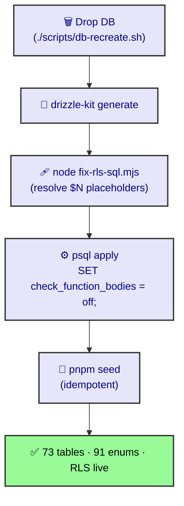

# DB Recreate & RLS

Stand up the dev DB from scratch: `./scripts/db-recreate.sh` (wipes + Drizzle push + `fix-rls-sql.mjs` + seed). Target: `192.168.1.109:5432/tbot`.

## Procedure


1. `cd packages/database && pnpm generate` — emit migration SQL.
2. `node ../../scripts/fix-rls-sql.mjs` — rewrite RLS `$N` placeholders + `${...}` templates to literals.
3. The script prepends `SET check_function_bodies = off;` before applying (so `farm_org_id` compiles before `farms` exists).
4. `pnpm seed` — idempotent seed.

## Two gotchas (learned)
- **`check_function_bodies = off`** — functions referencing not-yet-defined tables fail compile under the default `on`. Off makes compile lazy (validates at first RLS call).
- **RLS `$N`** — `drizzle-kit` leaves `$1`/`$2` and unresolved `${isRoleIn(...)}`. `fix-rls-sql.mjs` resolves them; source tables that emit literal `ARRAY[...]` via `sql.raw` skip the post-process.

## Verify
```sql
SELECT count(*) FROM pg_policies;            -- expect ~49
SELECT to_regclass('sm.device_tokens');      -- expect a regclass
```
