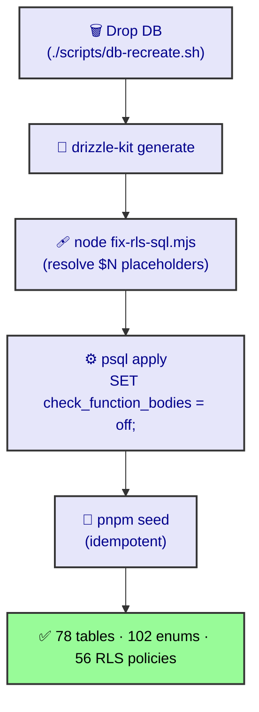

# DB Recreate & RLS

Stand up the dev DB from scratch: `./scripts/db-recreate.sh` (wipes + Drizzle push + `fix-rls-sql.mjs` + seed). Target: `192.168.1.109:5432/tbot`.

## Procedure


1. `cd packages/database && pnpm generate` — emit migration SQL.
2. `node ../../scripts/fix-rls-sql.mjs` — rewrite RLS `$N` placeholders + `${...}` templates to literals.
3. The script prepends `SET check_function_bodies = off;` before applying (so `farm_org_id` compiles before `farms` exists).
4. `pnpm seed` — idempotent seed.

## Two gotchas (learned)
- **`check_function_bodies = off`** — functions referencing not-yet-defined tables fail compile under the default `on`. Off makes compile lazy (validates at first RLS call).
- **RLS `$N`** — `drizzle-kit` leaves `$1`/`$2` and unresolved `${isRoleIn(...)}`. `fix-rls-sql.mjs` resolves them; source tables that emit literal `ARRAY[...]` via `sql.raw` skip the post-process.

## Seed scope & idempotency

`pnpm seed` writes the demo dataset behind the admin UI and the Vet/Sanitary smoke
test. It is designed for a **dropped** DB — `db-recreate.sh` drops first, so a fresh
run is clean. Re-running bare `pnpm seed` against an already-populated or stress-seeded
DB can abort on duplicate keys in Sections 6/7 (those inserts are intentionally
non-idempotent for a dropped DB). For a clean state, always use
`./scripts/db-recreate.sh` (or `--seed-only` only when the schema is already applied
and the DB is empty).

The seed also writes **Section 8 admin demo data** — `cattle_passports`, `vs_contracts`,
`vs_assignments`, `farm_books`, `error_corrections`, `pda_devices`, `iot_devices`,
`sensor_readings`, `notifications`, `audit_log` — so those admin pages are populated
out of the box. Three pages stay empty by design: `movement-lineage`, `subjects`, and
`sync` are interaction-gated (they fill from user actions / a selected region+farm
filter), not from seed data.

## Verify
```sql
SELECT count(*) FROM information_schema.tables
  WHERE table_schema='public' AND table_type='BASE TABLE';   -- expect 78
SELECT count(*) FROM pg_type WHERE typtype='e';              -- expect 102 (enums)
SELECT count(*) FROM pg_policies;                            -- expect 56
SELECT to_regclass('sm.device_tokens');      -- expect a regclass
```
