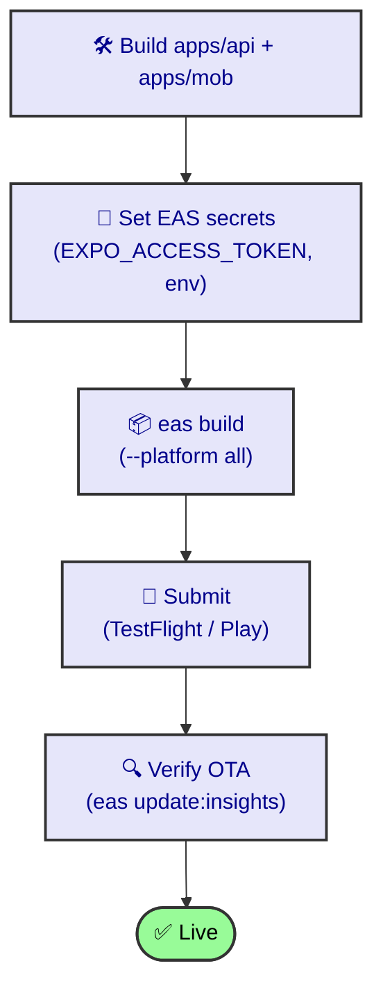

# Deploy (EAS)

Mobile builds ship via Expo Application Services. Cloud is **special-command only** — never a default `pnpm build`.

## Discipline
- EAS project: `@gocenik/rocky`.
- Cloud builds: explicit `pnpm build:cloud:*` / `pnpm submit:*` — never implied.
- Server push (Expo notifications) needs `EXPO_ACCESS_TOKEN` in `apps/api/.env`; `sendExpoPush` silently skips if absent.

## Steps (skeleton — expand me)

1. `pnpm --filter mob build:cloud:preview` (internal preview).
2. `pnpm --filter mob submit:*` (TestFlight / Play Store).
3. For the API: standard Node deploy of `apps/api`.

> Status: **seed** — flesh out with the real EAS profile names + submit flow.
