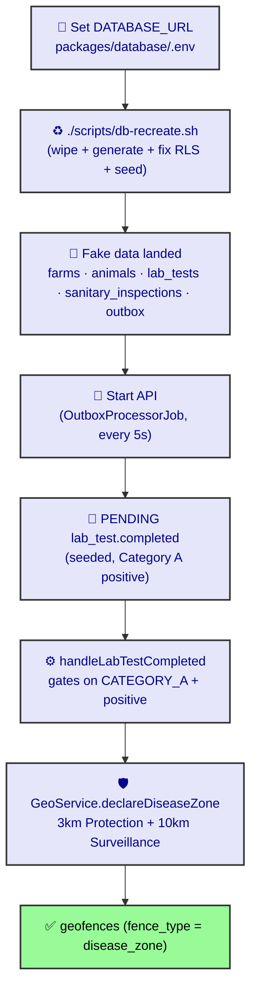

# Veterinary & Sanitary Smoke Test

End-to-end check that the Veterinary & Sanitary expansion (ADR-0088 → ADR-0093) is
wired correctly: seed the fake data, then watch the **ADR-0092 Zone-of-Alienation**
automation draw a 3 km / 10 km disease zone from a positive Category A lab result.

Target: a **fresh VM database** (PostgreSQL + PostGIS). On an empty DB,
`./scripts/db-recreate.sh` is *initialisation*, not a migration of live data — it
wipes + regenerates the schema from current code + seeds. Do **not** point it at a
populated production instance.

## Flow



## Prerequisites

- A running PostgreSQL instance **with PostGIS** on the VM.
- `packages/database/.env` present with `DATABASE_URL` pointing at the VM DB
  (copy `packages/database/.env.example`).
- The Rocky API build is available (`pnpm -C apps/api build` or run via the dev
  script).

## Step 1 — Apply schema + seed

```bash
# from repo root
./scripts/db-recreate.sh
```

This drops the DB, regenerates a single migration from current code, resolves the
drizzle-kit RLS `$N` placeholders (`scripts/fix-rls-sql.mjs`), applies it, and runs
`pnpm -C packages/database seed`. On a fresh DB it ends with the full schema + seed
data. If the schema is already applied and you only want to re-seed:

```bash
./scripts/db-recreate.sh --seed-only
# or directly:
pnpm -C packages/database seed
```

## Step 2 — Verify the seed landed

```bash
psql "$DATABASE_URL" -c "
SELECT 'diseases(categorised)' t, count(*) FROM diseases WHERE disease_category IS NOT NULL
UNION ALL SELECT 'farms(test)', count(*) FROM farms WHERE farm_id LIKE '2000%'
UNION ALL SELECT 'animals(test)', count(*) FROM animals WHERE ear_tag_number LIKE '1000%'
UNION ALL SELECT 'lab_tests', count(*) FROM lab_tests
UNION ALL SELECT 'sanitary_inspections', count(*) FROM sanitary_inspections
UNION ALL SELECT 'outbox(lab_test.completed)', count(*) FROM outbox_events WHERE type='lab_test.completed';
"
```

Expect: 16 categorised diseases, 3 test farms (one slaughterhouse `200000001`, two
origin farms `200000002`/`200000003`), 3 test animals, 3 lab tests, 1 sanitary
inspection, 1 `lab_test.completed` outbox event.

The Category A trigger row:

```bash
psql "$DATABASE_URL" -c "
SELECT lt.id, d.name, lt.result, lt.farm_id
FROM lab_tests lt JOIN diseases d ON d.id = lt.disease_id
WHERE lt.result = 'positive' AND d.disease_category = 'category_a';
"
```

Expect one row: **Anthrax** (positive) on farm `200000002` (Green Valley Farm,
which carries GPS so the zone can be drawn).

## Step 3 — Start the API

The `OutboxProcessorJob` polls `outbox_events` every 5 seconds
(`@Cron("*/5 * * * * *")`) and dispatches by event `type`. Start the API:

```bash
pnpm -C apps/api dev
# or the project's API start script
```

## Step 4 — Watch the zone draw

Within ~10 seconds the seeded `lab_test.completed` event is processed:
`handleLabTestCompleted` gates on `DISEASE_CATEGORY.CATEGORY_A` + `TEST_RESULT.POSITIVE`,
then calls `GeoService.declareDiseaseZone`, which draws the AHL Protection (3 km) and
Surveillance (10 km) circles around Green Valley Farm.

```bash
psql "$DATABASE_URL" -c "
SELECT id, name, fence_type, farm_id, is_active
FROM geofences WHERE fence_type = 'disease_zone' ORDER BY name;
"
```

Expect **two** rows — `… — Protection (3 km)` and `… — Surveillance (10 km)` — both
`is_active = true`, `farm_id = 200000002`.

Confirm the outbox event was consumed:

```bash
psql "$DATABASE_URL" -c "
SELECT type, status, delivery_attempts FROM outbox_events WHERE type='lab_test.completed';
"
```

Expect `status = completed`.

## Step 5 (optional) — Verify the movement block

With the disease zone active, a movement whose origin is inside the zone must be
refused by `MovementService.runDiseaseZoneCheck` (the AHL lockdown). Record a
movement from farm `200000002` (in the zone) to `200000003` via the tRPC
`movement.create` endpoint and expect a rejection citing the active disease zone.

## Troubleshooting

- **No `disease_zone` geofences appeared.** Check the outbox event status. If
  `status = failed`, read the API logs for `Zone-of-Alienation` — the most common
  cause is the origin farm lacking a `location` (GPS). The seed sets GPS on farms
  `200000002`/`200000003`; re-run `--seed-only` if the DB was seeded before that
  change.
- **Outbox event still `pending` after >10s.** The API (and its
  `OutboxProcessorJob`) is not running, or `diseaseZoneEnabled` is off. Start the
  API and confirm the cron is registered.
- **Seed skipped with "tables not found".** The new schema is not applied on this
  DB — run `./scripts/db-recreate.sh` (it applies the schema first).

## References

- [ADR-0092: Zone-of-Alienation Automation](/ADR/0092-zone-of-alienation-automation)
- [ADR-0088: Veterinary & Sanitary Module Expansion](/ADR/0088-veterinary-sanitary-module-expansion)
- [ADR-0089: Disease Master Data (AHL categories / WOAH)](/ADR/0089-disease-master-data-ahl-categories-woah)
- [ADR-0090: Sanitary Inspections (ante/post-mortem)](/ADR/0090-sanitary-inspections-ante-post-mortem)
- [DB Recreate & RLS](/runbooks/db-recreate)
