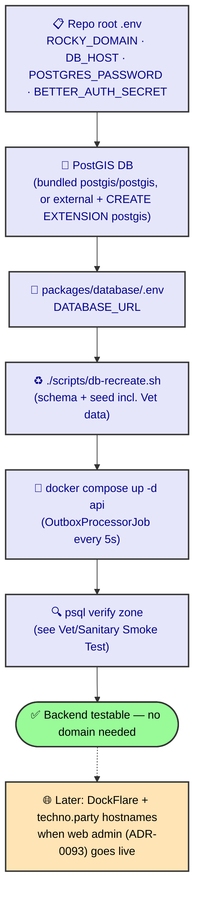

# VM Prep & Domain

How to stand Rocky up on a **remote VM** and what the domain actually requires. Read this
before you `docker compose up` on the VM — most of the domain anxiety is a fetish.

## The one fact that dissolves the confusion

The repo's ingress is **DockFlare** (Cloudflare Tunnel). Every service in
`docker-compose.yml` carries `dockflare.*` labels and hangs off the external
`cloudflare-net` network. So:

- `ROCKY_DOMAIN` drives the hostnames: `api.<domain>`, `admin.<domain>`,
  `docs.<domain>`. Set `ROCKY_DOMAIN=techno.party` → the app lives at
  `api.techno.party` / `admin.techno.party` / `docs.techno.party` — all
  **tertiary (3-level)**, which is what this Cloudflare setup allows.
- **Hard constraint — tertiary only:** this Cloudflare setup permits **only
  third-level domains**. So `ROCKY_DOMAIN` MUST be the bare registered zone
  (`techno.party`), never a sub-namespace like `rocky.techno.party` or
  `mobile.techno.party` — those would make `api.rocky.techno.party` /
  `api.mobile.techno.party` **fourth-level**, which is rejected. The compose
  already templates `api.${ROCKY_DOMAIN}`, so `ROCKY_DOMAIN=techno.party` yields
  the allowed tertiary hosts with no compose edit.
- **Cloudflare precondition (the only real one):** the *registered domain*
  (`techno.party`) must be a **Cloudflare zone you control** (NS at CF + a CF
  token for DockFlare). You manage `techno.party` as the zone; `api.`/`admin.`/
  `docs.` are just DNS/Tunnel records under it.

If you do **not** own a registered domain you can add as a CF zone, you cannot
Satisfy the tertiary-only rule with a delegated subdomain. Then either (a) register
your own domain (e.g. `rocky.dev`) and use that as `ROCKY_DOMAIN`, or (b) have the
zone owner add `techno.party` as a CF zone and share it with you.

## You do NOT need a domain to test the backend

This is the calming truth — *waves hands frantically*. The Veterinary & Sanitary
smoke test (seed + watch the [ADR-0092](/ADR/0092-zone-of-alienation-automation)
zone draw) needs only:

- a **PostGIS** database,
- `./scripts/db-recreate.sh` (schema + seed),
- the **API running** (the `OutboxProcessorJob` polls every 5s),
- `psql` to watch the zone.

No public hostname. The `db` container already publishes `5432`. So: stand up the
VM, run DB + API, do the seed + zone test **without touching DNS/Cloudflare**.
Defer the DockFlare / `techno.party` hostname decision until the web admin
([ADR-0093](/ADR/0093-dual-dashboards-vet-vs-epidemiologist)) goes live — that is
the first thing that actually needs a browser-reachable hostname.

## Prep checklist



### 1. Repo root `.env` (the four mandatory vars)

```
ROCKY_DOMAIN=techno.party            # MUST be the bare zone — tertiary-only CF
DB_HOST=db                            # or your external PostGIS host
POSTGRES_PASSWORD=<strong>
BETTER_AUTH_SECRET=$(openssl rand -base64 32)
```

See `.env.example` for the full set (DockFlare CF token, optional `CORS_ORIGINS` /
`TRUSTED_ORIGINS` / `AUTH_BASE_URL` overrides — all derive from `ROCKY_DOMAIN`).

### 2. PostGIS — non-negotiable

`GeoService.declareDiseaseZone` and the seed's `ST_MakePoint` call PostGIS at
runtime. The bundled `db` is `postgis/postgis:18-3.6-alpine` (extension
pre-enabled) — start it with `docker compose --profile local-db up -d db`. If you
use an **external** DB, you must `CREATE EXTENSION postgis;` yourself or the zone
draw dies.

### 3. `packages/database/.env`

`db-recreate.sh` reads `DATABASE_URL` from here (not the root `.env`):

```
DATABASE_URL=postgresql://tbot:<pw>@<db-host>:5432/tbot
```

### 4. Schema + seed

```bash
./scripts/db-recreate.sh            # wipes -> regenerates schema -> fixes RLS -> seeds
# or, schema already applied:
./scripts/db-recreate.sh --seed-only
```

The seed includes the Veterinary & Sanitary fake data + a `lab_test.completed`
outbox event (see [Veterinary & Sanitary Smoke Test](/runbooks/veterinary-sanitary-smoke-test)).

### 5. Start the API

```bash
docker compose up -d api
```

`OutboxProcessorJob` consumes the seeded event within ~5s and auto-draws the
3 km / 10 km disease zone.

### 6. Verify (no domain needed)

Run the [Veterinary & Sanitary Smoke Test](/runbooks/veterinary-sanitary-smoke-test)
— `psql` against the DB (`docker compose exec db psql -U tbot -d tbot`).

## If you skip DockFlare (no ingress)

`docker-compose.yml` references the external `cloudflare-net` network. If you do
not run DockFlare, either `docker network create cloudflare-net` so
`docker compose up api` does not error, or strip the `dockflare.*` labels / network
from the services. The backend test still runs; you just reach it via the VM's
internal network / `psql`, not a public hostname.

## Latent gap — remember, don't fix yet

`apps/api/src/auth/auth.ts` sets **no** `crossSubDomain` and **no** cookie
`domain`. When the web admin (`admin.techno.party`) later reads the session
set by `api.techno.party`, server-side auth will break — Better Auth must
scope the cookie to `.techno.party` with `crossSubDomain: true`. This is
gated behind [ADR-0093](/ADR/0093-dual-dashboards-vet-vs-epidemiologist)
(frontend deferred), so flag it, don't fix it now.

## Related

- [DB Recreate & RLS](/runbooks/db-recreate)
- [Veterinary & Sanitary Smoke Test](/runbooks/veterinary-sanitary-smoke-test)
- [Deploy (EAS)](/runbooks/deploy)
