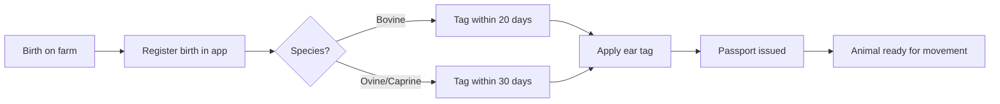

# Birth Registration

Register a new animal birth in the Rocky system and apply the required ear tag.

> **Diagram (text equivalent):** Birth registration flow — a birth occurs on the farm, the birth is registered in the app, then the species is checked: bovine animals must be tagged within 20 days and ovine/caprine within 30 days; after the ear tag is applied a passport is issued (cattle) and the animal becomes ready for movement.

## When to Do This

Register a birth whenever a new calf, lamb, or kid is born on your farm. You must register the birth and apply ear tags within the legal deadline for the species.

## Requirements

- The animal must be born on your farm
- You need ear tag codes (ordered in advance — see [Ear Tag Orders](/user-guide/animals/ear-tag-orders))
- For cattle: the passport will be issued automatically after tagging

## Step-by-Step

1. Open the app → **Animals** tab
2. Tap **+** (add animal)
3. Select **Birth Registration**
4. Enter the ear tag code
5. Select the species from the dropdown
6. Enter the date of birth
7. Select the breed (if known)
8. Add any notes (e.g., twin birth, health observations)
9. Confirm the registration

> **Tip:** The deadline starts from the date of birth, not the date you open the app. Register as soon as possible.

## What Happens Next

- The animal is registered in the national system
- A passport is issued automatically for cattle
- The animal is now ready for movement recording
- You will receive a confirmation notification

---

### Feature Gap

{/*GAP-001: The system does not yet support bulk registration of multiple calves from a single birth event. Currently each calf must be registered individually.*/}

> **Note:** This page describes the current workflow. [GAP-001] Bulk birth registration is not yet available — each calf must be registered individually.
