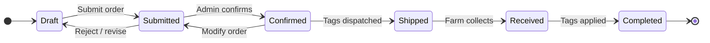

# Ear Tag Orders

Order and collect ear tags for your animals through the Rocky system.

> **Diagram (text equivalent):** Ear tag order lifecycle — an order moves Draft to Submitted (on submit) to Confirmed (admin confirms) to Shipped (tags dispatched) to Received (farm collects) to Completed (tags applied). Revert paths exist: Submitted to Draft on reject or revise, and Confirmed to Submitted on modify.

## When to Do This

Order ear tags when you need tags for new animals, replacements for lost tags, or additional stock. Orders must be placed before you need the tags — allow time for processing and shipping.

## Requirements

- You must have a registered farm account
- You need to know the quantity and type of tags required (male, female, or unisex)
- Tag orders are managed by your local agricultural office

## Step-by-Step

1. Open the app → **Animals** tab
2. Tap **Ear Tag Orders**
3. Tap **New Order**
4. Select the tag type: **Male**, **Female**, or **Unisex**
5. Enter the quantity
6. Review the order summary
7. Tap **Submit**

### Track Your Order

1. Go to **Ear Tag Orders** in the Animals tab
2. The order status is displayed: Draft → Submitted → Confirmed → Shipped → Received → Completed
3. Tap an order to view details

### Collect Tags

1. When the status changes to **Shipped**, tags are ready for collection
2. Visit your local agricultural office
3. Present your order confirmation
4. Confirm receipt in the app

## What Happens Next

- The order is sent to your local agricultural office for confirmation
- Tags are dispatched once confirmed
- You receive a notification when tags are ready for collection
- After applying tags, mark the order as completed

---

### Feature Gap

{/*GAP-002: The system does not yet support tag re-orders from the farm without admin intervention. Currently, only an admin can confirm and process orders.*/}

> **Note:** This page describes the current workflow. [GAP-002] Tag re-orders from the farm without admin intervention are not yet available.
