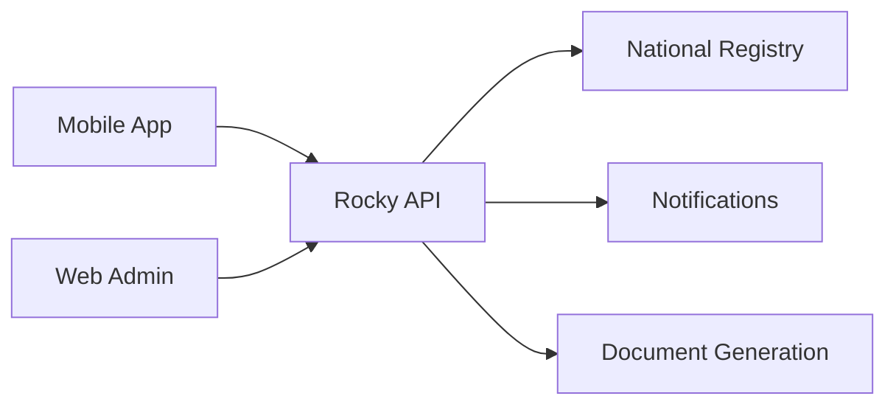

# Welcome to Rocky

Rocky is the national livestock tracking system for North Macedonia. It helps farmers and veterinarians manage animal identification, movements, health records, and regulatory compliance.

## The System at a Glance

> **Diagram (text equivalent):** System architecture — the mobile app and the web admin panel both call the Rocky API, which in turn connects to the National Registry, the Notifications service, and the Document Generation service.

## What You Need

- A smartphone (iOS or Android) for the mobile app
- Internet connection for real-time sync (offline mode also available)
- Your farm registration details
- Your keeper identification number

## Key Responsibilities

As a farmer or veterinarian using Rocky, you are responsible for:

1. Registering animal births within the legal deadline
2. Recording all movements within 7 days
3. Reporting notifiable diseases immediately
4. Keeping animal data accurate and up to date

> **First time?** Start with [Account Setup](/user-guide/getting-started/account-setup) to create your account and sign in.
