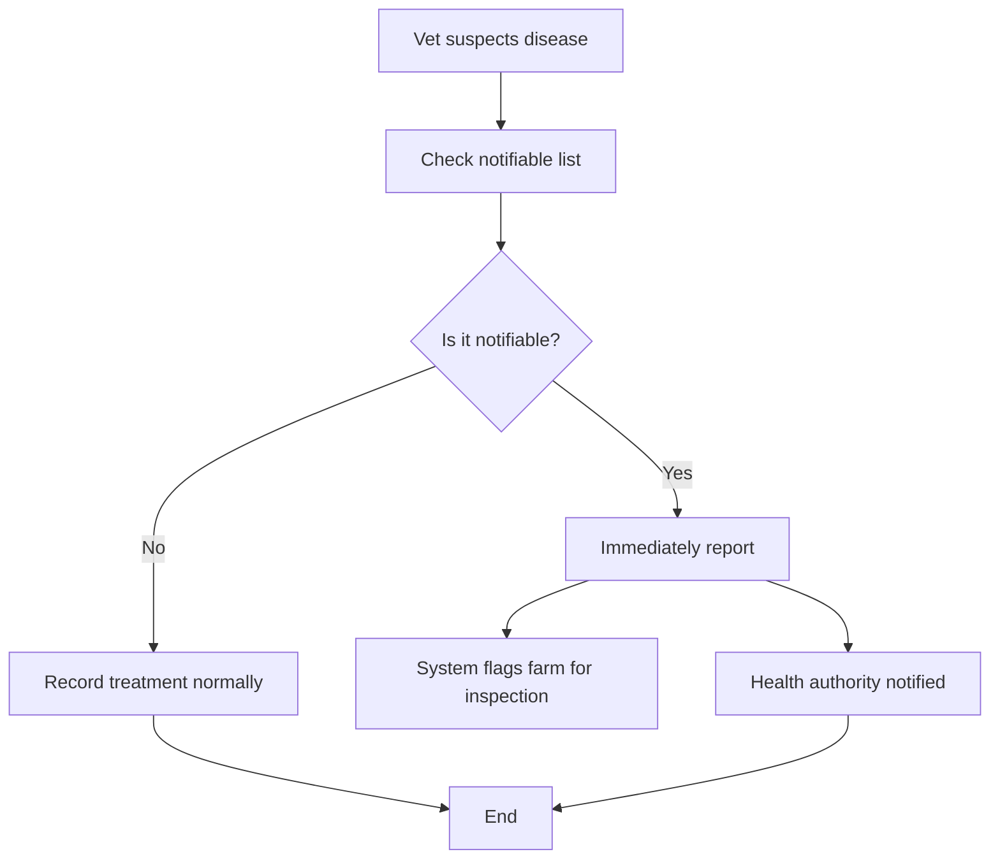

# Notifiable Diseases

Report a suspected notifiable disease immediately through the Rocky system.

> **Diagram (text equivalent):** Notifiable disease reporting — a veterinarian suspects a disease and checks the notifiable list; if it is not notifiable the case is recorded as a normal treatment and ends, but if it is notifiable the vet reports immediately, the system flags the farm for inspection and notifies the health authority, then ends.

## When to Do This

Report immediately if you suspect an animal has a notifiable disease. Do not wait for lab confirmation — report on suspicion.

## Requirements

- The animal must be registered in the system
- You must be a registered veterinarian or farmer
- You need to know which disease is suspected

## Step-by-Step

1. Open the app → **Health** tab
2. Tap **+** (new record)
3. Select **Notifiable Disease Report**
4. Search for the animal by ear tag code
5. Select the suspected disease from the notifiable disease list
6. Enter the date of first symptoms (if known)
7. Describe the symptoms and observations
8. Indicate whether lab samples have been taken
9. Confirm the report

> **Critical:** Notifiable disease reports are sent immediately to the health authorities. Do not delay reporting while waiting for lab results.

## What Happens Next

- The health authority is notified immediately
- The farm is flagged for inspection
- A veterinarian will contact you for follow-up
- Movement restrictions may be applied to the farm
- Lab tests may be ordered to confirm the diagnosis

---

### Feature Gap

{/*GAP-004: The system does not yet send push notifications to nearby veterinarians when a notifiable disease is reported. Currently, notifications go only to the reporting user and authorities.*/}

> **Note:** This page describes the current workflow. [GAP-004] Push notifications to nearby veterinarians are not yet available.
