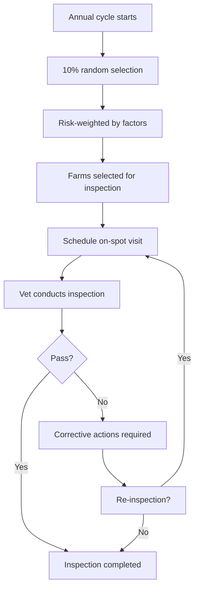

# Risk Analysis

Learn how the Rocky inspection system selects farms for on-spot visits using risk-weighted random selection.

> **Diagram (text equivalent):** Risk analysis — the annual cycle starts with a 10 percent random selection of farms, weighted by risk factors, producing the farms selected for inspection; each is scheduled for an on-spot visit where a veterinarian conducts the inspection. A pass completes the inspection; a fail requires corrective actions and may trigger re-inspection before completion.

## When to Do This

As a farmer, you do not initiate the risk analysis — it runs automatically each year. As a veterinarian or administrator, you can run the risk analysis to select farms for inspection.

## How Risk Analysis Works

- Runs annually at the start of each calendar year
- Selects approximately 10% of registered farms
- Selection is weighted by risk factors:
  - Farm size and animal count
  - Previous inspection history
  - Notifiable disease reports in the area
  - Compliance history
  - Species present on the farm

## Step-by-Step

### Run Risk Analysis (Veterinarian / Admin)

1. Log in to the **Web Admin** panel
2. Go to **Inspections** → **Risk Analysis**
3. Review the current year's parameters
4. Click **Run Analysis**
5. Review the selected farms
6. Confirm the selection

### View Your Farm's Risk (Farmer)

1. Open the mobile app
2. Go to **Account** → **Farm Profile**
3. Your risk score is displayed (if available)

## What Happens Next

- Selected farms are notified of their inspection
- Inspections are scheduled throughout the year
- Results are recorded and influence next year's risk analysis

---

### Feature Gap

{/*GAP-006: The system does not yet show a farmer-facing dashboard with their own risk score. Farmers currently cannot see their risk score in the mobile app.*/}

> **Note:** This page describes the current workflow. [GAP-006] A farmer-facing risk score dashboard is not yet available.
