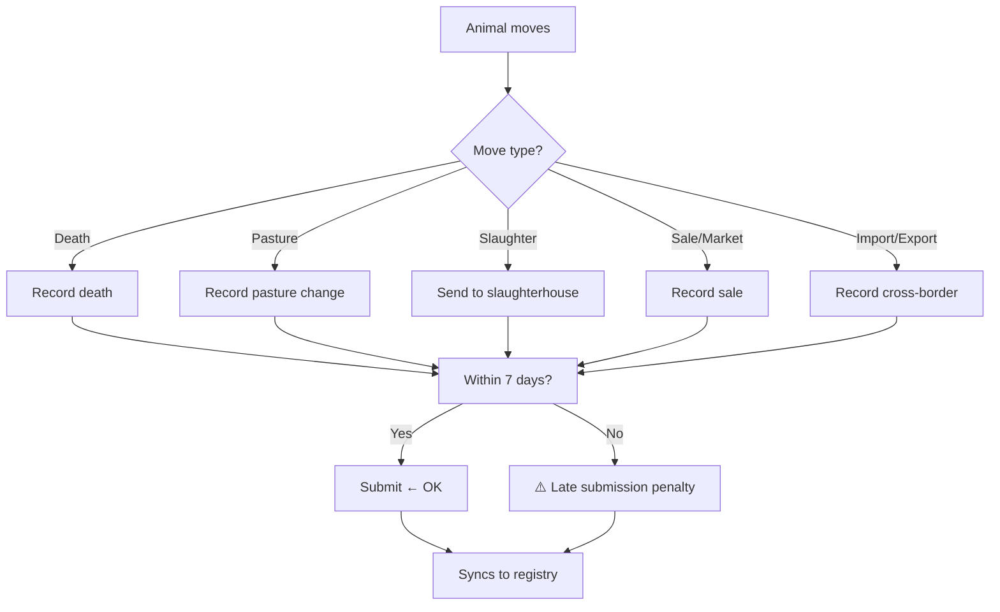

# Movements

When must you record a movement? This section covers every type of animal movement and the deadlines for recording them.

> **Diagram (text equivalent):** Movement recording — when an animal moves, the move type is determined (death, pasture change, slaughter, sale or market, or import or export); each must be submitted within 7 days. On-time submission is accepted and syncs to the registry; late submission incurs a penalty and then also syncs to the registry.

## When to Do This

Record a movement whenever an animal changes location or status. Under EU Implementing Regulation 2021/520 Article 3, you must record movements within **7 days** of the event.

## Types of Movements

| Movement | Description | Deadline |
|----------|-------------|----------|
| [Death](/user-guide/movements/death) | Animal dies on farm, in transit, or at slaughter | 7 days |
| [Pasture](/user-guide/movements/pasture) | Change of pasture location | 7 days |
| [Slaughter](/user-guide/movements/slaughter) | Animal sent to slaughterhouse | 7 days |
| [Market / Sale](/user-guide/movements/market) | Animal sold or moved through a market | 7 days |
| [Import / Export](/user-guide/movements/import-export) | Cross-border movement | 7 days |

## Key Rules

- The 7-day window starts from the date of movement, not the date you open the app
- Animals must be tagged before any movement (Article 13(4))
- Late submissions may incur penalties under national law

---

### Feature Gap

{/*GAP-003: The system does not yet show a dashboard with pending movements and countdown to the 7-day deadline. Users must manually track deadlines.*/}

> **Note:** This page describes the current workflow. [GAP-003] A pending-movements dashboard with countdown to deadline is not yet available.
