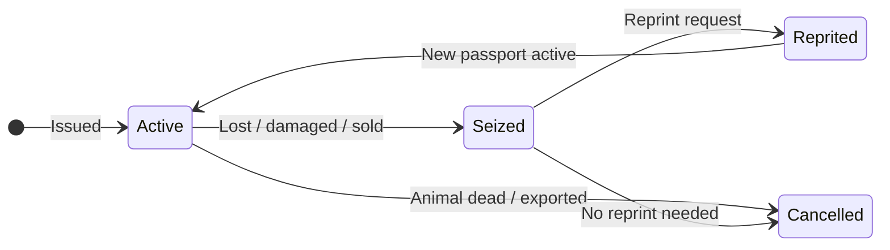

# Cattle Passport Lifecycle

Manage the lifecycle of cattle passports in Rocky.

> **Diagram (text equivalent):** Cattle passport lifecycle — a passport becomes Active when issued; from Active it can move to Seized (lost, damaged, or sold) or Cancelled (animal dead or exported). A Seized passport can be Reprinted (reprint request then a new passport becomes Active) or Cancelled (no reprint needed).

## When to Do This

A passport is required for every bovine animal. It serves as the animal's identity document throughout its life.

## Passport States

| State | Meaning |
|-------|---------|
| **Active** | Passport is valid and current |
| **Seized** | Passport has been lost, damaged, or surrendered |
| **Reprinted** | A replacement passport has been issued |
| **Cancelled** | Passport is no longer valid (animal died, exported) |

## Start Here

- [Apply for Passport](/user-guide/passports/apply) — Request a new passport
- [Seized / Lost Passport](/user-guide/passports/seized) — Report a lost or damaged passport
