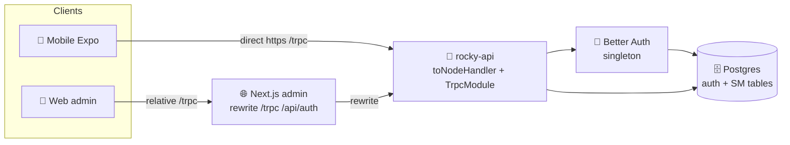
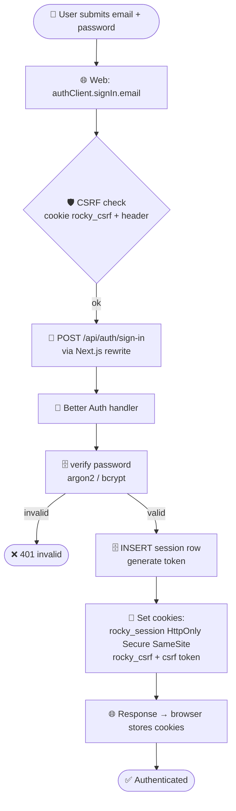
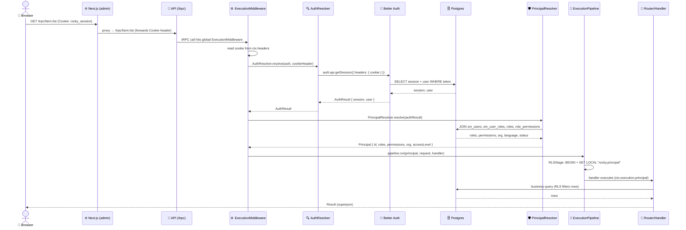

# Authentication & Authorization Architecture

> *"The point is not to add Better Auth. The point is to resolve the contradiction between identity and authorization."*

---

## Target Architecture

```
HTTP / Cron / RabbitMQ / CLI
         │
         ▼
┌────────────────────┐
│ Authentication     │  ← packages/auth: Cookie → Better Auth → AuthResult
│ Resolver           │
└────────┬───────────┘
         │ AuthResult { session, user }
         ▼
┌────────────────────┐
│ Principal          │  ← packages/authorization: SM user + RBAC → Principal
│ Resolver           │
└────────┬───────────┘
         │ Principal { id, roles, permissions, org, accessLevel, claims }
         ▼
┌────────────────────┐
│ Runtime            │  ← packages/execution: locale, traceId, tenant, clock
│ Builder            │
└────────┬───────────┘
         │ ExecutionContext { principal, request, runtime }
         ▼
┌─────────────────────────────────────────────────┐
│              Execution Pipeline                  │
│                                                  │
│  ExecutionMiddleware  →  begin pipeline          │
│  ├─ RLSStage          →  BEGIN + SET LOCAL (tx)   │
│  ├─ PolicyStage       →  PolicyResolver (global) │
│  │   └─ Reads @Policy() + @RegisterPolicy()      │
│  │   └─ Evaluates action/authenticated/roles     │
│  ├─ Handler executes → business logic            │
│  │   └─ Principal passed to domain services      │
│  │   └─ pgPolicy enforces row-level security     │
│  └─ COMMIT / ROLLBACK                            │
└─────────────────────────────────────────────────┘
```

## Authentication Flow — Every Step

> The architecture splits identity from authorization. **Better Auth** answers *"who is this?"*
> (session + user). **`PrincipalResolver`** answers *"what may they do?"* (SM profile, roles,
> permissions, org). The two are joined per-request inside `ExecutionMiddleware`. This section
> traces **every packet** of that journey and names the exact file/function that processes it.

### Topology — where packets travel



**Key.** Two client topologies converge on one API:
- **Web admin** never talks to the API directly — it calls its own Next.js origin, and
  `apps/web/next.config.ts` *rewrites* `/trpc/*` and `/api/auth/*` to `API_URL`. The browser
  sends the session cookie same-origin; Next.js forwards it upstream.
- **Mobile (Expo)** calls the API directly over HTTPS and forwards the session cookie manually
  (see *Mobile* below).

### The Better Auth instance (the identity authority)

`packages/auth/src/better-auth.ts` exports `Auth.getInstance(config)` — an **idempotent singleton**,
one Better Auth server for the whole monorepo. Configuration:

- `advanced.cookiePrefix: "rocky"` → cookies are named `rocky_session`, `rocky_csrf`, …
- `advanced.crossSubDomainCookies` is enabled **only when an explicit shared parent domain is set**
  (`AUTH_COOKIE_DOMAIN` → `ROCKY_DOMAIN`). Better Auth does *not* derive the parent from `baseURL`,
  so without this the cookie is pinned to the raw `api` host and is invisible to `admin.`/`docs.`.
- `emailAndPassword: { enabled: true, sendResetPassword }` — password reset is hooked (currently a
  `console.info` placeholder; wire real email there).
- **Server plugins:** `admin({ adminRoles: ["SUPER_ADMIN"], roles: _authRoles })` and `expo()`.
- **No `customSession` plugin.** The SM-profile/role/permission enrichment is *deliberately* not done
  here — it lives in `PrincipalResolver` (identity/auth boundary discipline). The admin-plugin role
  vocabulary (`SUPER_ADMIN`, `VD_ADMIN`, `VD_STAFF`, `VETERINARIAN`, `TECHNICIAN`, `FARMER`,
  `SLAUGHTERHOUSE_OP`, `MARKET_OP`, `SUPPLIER`) is Better Auth's *account*-level role, distinct from
  the SM RBAC `roles`/`permissions` resolved later.
- Database: `drizzleAdapter(db, { provider: "pg", schema: { user, session, account, verification } })`.

The API mounts this instance in `apps/api/src/main.ts`:
`app.getHttpAdapter().use("/api/auth", toNodeHandler(auth))`.

### Bootstrap — wiring Better Auth into nestjs-trpc

> The community `@mguay/nestjs-better-auth` tutorial reaches the same goal with a *per-router*
> `AuthMiddleware` that throws `Unauthorized` and a `basePath: "/api/trpc"`. **Rocky deliberately
> diverges** (see *Recipe vs Rocky* at the end): a custom `AuthResolver`/`PrincipalResolver` split,
> a **global** middleware, `basePath: "/trpc"`, and anonymous-by-default. The steps below document
> *our* wiring.

**1. Dependencies.** The Nest↔tRPC bridge is `nestjs-trpc`. Better Auth is **not** pulled in via a
third-party Nest wrapper — it lives in our own `packages/auth` (`Auth.getInstance` singleton) and is
resolved by `packages/authorization` (`PrincipalResolver`) and `packages/execution`
(`ExecutionPipeline`). There is no `@mguay/nestjs-better-auth` dependency in this repo.

**2. tRPC module config.** `apps/api/src/trpc/trpc.module.ts` bootstraps tRPC with one `basePath` and
**global** middlewares:

```ts
TRPCModule.forRoot({
  context: AppContextProvider,
  basePath: "/trpc",
  transformer: superjson,
  globalMiddlewares: [ExecutionMiddleware, PolicyResolver], // auth + per-procedure policy
  onError: TrpcErrorHandler,
});
```

**3. Expose the request in the context.** Unlike the recipe (which hands `req`/`res` to the context),
our `AppContextProvider` normalises the incoming Express headers into a Web `Headers` object so the
middleware can read the cookie uniformly:

```ts
@Injectable()
export class AppContextProvider implements TRPCContext {
  create(opts: CreateExpressContextOptions): AppContext {
    return {
      headers: new Headers(opts.req.headers as Record<string, string>),
      user: null,
      session: null,
    };
  }
}
```

**4. Auth middleware (global).** `ExecutionMiddleware` is the equivalent of the recipe's
`AuthMiddleware`, but it is registered once in `globalMiddlewares` (so it wraps **every** procedure)
and it does **not** throw on a missing session:

```ts
async use(opts: MiddlewareOptions<AppContext>) {
  const { ctx, next } = opts;

  // 1. Resolve authentication from the cookie
  const cookieHeader = ctx.headers?.get?.("cookie") ?? "";
  const authResult = await AuthResolver.resolve(this.auth, cookieHeader);

  // 2. Resolve principal (handles anonymous automatically → ANONYMOUS)
  const principal = await this.principalResolver.resolve(authResult);

  // 3. Run inside ExecutionPipeline (RLS transaction + events)
  return this.pipeline.run(principal, request, async (_principal) => {
    ctx.execution = { principal: _principal, request, runtime } satisfies ExecCtx;
    return next({ ctx });
  });
}
```

The `ANONYMOUS` principal flows through; per-procedure access is then enforced by the second global
middleware, `PolicyResolver` (driven by `@Policy()`).

**5. Apply the middleware.** Because it lives in `globalMiddlewares`, there is **no** per-router
`@UseMiddlewares(AuthMiddleware)` — every `/trpc` call is automatically authenticated-or-anonymous
before the handler runs. Routers opt into *required* auth by decorating procedures with
`@Policy({ ... })`.

**6. Web client.** `apps/web/lib/trpc.ts` builds the client on a **relative** URL (the Next.js
gateway) and forwards the cookie with `credentials: "include"`:

```ts
function getBaseUrl(): string {
  if (typeof window !== "undefined") return "";          // browser → Next.js origin → rewrite → API
  return process.env.API_URL ?? "http://localhost:8080";  // SSR → direct API
}

httpBatchLink({
  url: `${getBaseUrl()}/trpc`,
  transformer,
  fetch(url, options) {
    return fetch(url, { ...options, credentials: "include" });
  },
});
```

**7. Next.js rewrites.** `apps/web/next.config.ts` proxies both the tRPC path and the Better Auth
path to the API. This is the critical step that lets the Secure, HttpOnly session cookie reach the
backend across origins:

```ts
async rewrites() {
  const apiUrl = process.env.API_URL || "http://localhost:8080";
  return [
    { source: "/trpc/:path*",      destination: `${apiUrl}/trpc/:path*` },
    { source: "/api/auth/:path*",  destination: `${apiUrl}/api/auth/:path*` },
  ];
}
```

**8. Mobile client.** `apps/mob` calls the API **directly** (no gateway). `trpc-provider.tsx` forwards
the session cookie manually: `headers["cookie"] = authClient.getCookie()` (the `expoClient` stores the
cookie in `SecureStore`). No `expo-origin` header is used — the cookie *is* the credential.

**Recipe vs Rocky — key divergences**

| Aspect | Community recipe | Rocky |
|--------|------------------|-------|
| Better Auth Nest wrapper | `@mguay/nestjs-better-auth` `AuthService` | custom `packages/auth` singleton + `AuthResolver` |
| `basePath` | `/api/trpc` | `/trpc` |
| Middleware scope | per-router `@UseMiddlewares(AuthMiddleware)` | global `globalMiddlewares: [ExecutionMiddleware, PolicyResolver]` |
| No-session behavior | throws `Unauthorized` | resolves `ANONYMOUS` principal; `@Policy()` enforces |
| Client lib | `createTRPCReact` (`@trpc/react-query`) | `createTRPCContext` (`@trpc/tanstack-react-query`) |
| Context shape | `{ req, res }` | `{ headers: Headers, user, session }` |


### Packet 1 — Sign-in (email / password)



| # | Packet | From → To | What happens | Where |
|---|---------|-----------|--------------|-------|
| 1 | `authClient.signIn.email({ email, password })` | Browser → Web client | Client plugin `twoFactorClient`/`adminClient` wrap the call; CSRF token read from `rocky_csrf` cookie and sent as `x-csrf-token` header | `apps/web/lib/auth-client.ts` → `createRockyAuthClient` |
| 2 | `POST /api/auth/sign-in` (body + `x-csrf-token`) | Web (relative) → Next.js → API | Next.js rewrite proxies to `API_URL/api/auth/*`; cookie header forwarded | `apps/web/next.config.ts` (`/api/auth/:path*` rewrite) |
| 3 | Better Auth auth handler | API `/api/auth` | `toNodeHandler(auth)` dispatches; CSRF validated against `rocky_csrf` | `apps/api/src/main.ts` |
| 4 | password verify | Better Auth → Postgres | argon2/bcrypt compare against `user` row | `@better-auth` core |
| 5 | session create | Better Auth → Postgres | `INSERT` into `session` (token, userId, expiresAt, ip, ua) | `@better-auth` core |
| 6 | `Set-Cookie` ×2 | API → Browser | `rocky_session` (HttpOnly, Secure, SameSite=Lax, `domain=.rocky` when cross-subdomain) + `rocky_csrf` (csrf token) | `packages/auth/src/better-auth.ts` (`crossSubDomainCookies`) |
| 7 | cookie stored | Browser | Subsequent same-origin requests auto-send `rocky_session` | browser |

### Packet 2 — Every authenticated tRPC request (session → Principal)

This is the hot path. **Every** `/trpc/*` call resolves identity the same way:



| # | Packet | From → To | What happens | Where |
|---|---------|-----------|--------------|-------|
| 1 | `useQuery(trpc.farm.list.queryOptions())` | Browser → Web client | Relative `/trpc` URL + `credentials: "include"` (cookie auto-sent) | `apps/web/lib/trpc.ts` |
| 2 | `GET /trpc/farm.list` | Web → API | Next.js rewrite forwards the request **including the `Cookie` header** | `apps/web/next.config.ts` |
| 3 | tRPC request | API `TrpcModule` | `basePath: "/trpc"`, global middlewares `[ExecutionMiddleware, PolicyResolver]` | `apps/api/src/trpc/trpc.module.ts` (see `@docs/nestjs-trpc.md`) |
| 4 | read cookie | `ExecutionMiddleware` | `cookieHeader = ctx.headers.get("cookie")` | `apps/api/src/trpc/middlewares/execution.middleware.ts` |
| 5 | `AuthResolver.resolve(auth, cookieHeader)` | → Better Auth | `auth.api.getSession({ headers: new Headers({ cookie }) })` → `AuthResult { session, user }` (or `null`) | `packages/auth/src/auth.resolver.ts` |
| 6 | `PrincipalResolver.resolve(authResult)` | → Postgres | Load SM user by Better Auth `user.id`; `JOIN sm_user_roles → roles → role_permissions`; read `organizationId`, `language` (default `MK`), `status` (default `ACTIVE`) | `packages/authorization/src/principal/principal.resolver.ts` |
| 7 | `Principal { id, roles, permissions, organization, accessLevel, … }` | ← `PrincipalResolver` | Anonymous request yields the `ANONYMOUS` principal (no throw) | same |
| 8 | `ExecutionPipeline.run(principal, request, handler)` | → RLS | `RLSStage` opens a transaction and `SET LOCAL "rocky.principal"` (via CLS) so `pgPolicy` enforces row-level security | `packages/execution/src/execution-pipeline.ts`, `rls/rls.stage.ts` |
| 9 | handler runs | Router | `ctx.execution.principal` is the canonical actor; `PolicyResolver` (2nd global middleware) evaluates `@Policy()` before the procedure body | routers + `apps/api/src/trpc/middlewares/policy.resolver.ts` |
| 10 | business query + result | → Postgres → Browser | RLS-scoped rows returned; response serialized with `superjson` | domain service / repository |

> **The tRPC mounting itself** (`TrpcModule.forRoot`, `basePath: "/trpc"`, `globalMiddlewares`,
> `AppContext`) is documented in `@docs/nestjs-trpc.md`. `ExecutionMiddleware` is the single entry
> point that turns an HTTP cookie into a `Principal`.

### Sign-up · Password reset · Sign-out

| Flow | Endpoint | Notes |
|------|----------|-------|
| Sign-up | `POST /api/auth/sign-up` | Creates the Better Auth `user`; Better Auth starts a session and sets the same `rocky_*` cookies. SM profile (roles/org) is provisioned separately. |
| Forgot password | `POST /api/auth/forget-password` | Triggers `sendResetPassword` — currently a `console.info` placeholder in `better-auth.ts`; wire real email + token URL. |
| Reset password | `POST /api/auth/reset-password` | Validates the token and updates the password hash. |
| Sign-out | `POST /api/auth/sign-out` | Better Auth clears `rocky_session` + `rocky_csrf` (Set-Cookie with expired dates). |

### Web gateway specifics

- `apps/web/next.config.ts` rewrites `/trpc/:path*` and `/api/auth/:path*` → `API_URL`.
- `apps/web/proxy.ts` uses `getSessionCookie(request)` (the Better Auth helper, **not** a hard-coded
  name) purely for UX redirects; it does **not** terminate auth.
- `apps/web/lib/trpc.ts` sets `credentials: "include"` so the browser forwards the session cookie on
  every `/trpc` call.

### Mobile (Expo) specifics

- `apps/mob/lib/auth.ts` builds the client with `expoClient({ cookiePrefix: "rocky", storage: SecureStore })`.
- `apps/mob/providers/trpc-provider.tsx` calls `authClient.getCookie()` and sets `headers["cookie"]` on
  every request (web platform uses `credentials: "include"` instead). This is the cookie-forwarding
  mechanism the API's `ExecutionMiddleware` expects — **there is no `expo-origin` header**.
- `apps/mob/providers/session-provider.tsx` surfaces the resolved session to React.

### 2FA / Organization (current wiring note)

The **client** registers `twoFactorClient()` and `organizationClient()`, but the **server** instance
currently enables only `admin` + `expo`. If 2FA or organization endpoints are required at runtime, add
the matching server plugin (`twoFactor(...)` / `organization(...)`) in `better-auth.ts` — otherwise
those client calls hit unimplemented routes.

### Environment variables

| Var | Consumed by | Effect |
|-----|------------|--------|
| `BETTER_AUTH_SECRET` | `better-auth.ts` | Session signing secret (required). |
| `BETTER_AUTH_URL` | `auth.ts` (`baseURL`) | Public API origin; drives Secure-cookie requirements. |
| `AUTH_COOKIE_DOMAIN` / `ROCKY_DOMAIN` | `auth.ts` → `cookieDomain` | Shared parent domain; enables `crossSubDomainCookies`. |
| `TRUSTED_ORIGINS` | `better-auth.ts` | CSRF origin allow-list. |
| `CORS_ORIGINS` | `apps/api/src/config.ts` → `main.ts` CORS | Browser origin allowed with `credentials: true`. |
| `BASE_SERVICE_URL` | `auth.ts` | Internal server→server base URL (Next.js SSR → API). |
| `API_URL` / `NEXT_PUBLIC_API_URL` | web `next.config.ts` + `trpc.ts` | Gateway/rewrite target — where `/trpc` and `/api/auth` are proxied (the `API_URL` in the topology). |
| `EXPO_PUBLIC_API_URL` | mobile `trpc-provider.tsx` / `auth.ts` | Direct API origin the Expo app calls (the mobile edge in the topology). |


## Package Layout

```
packages/
  auth/                         ← Authentication
    src/
      better-auth.ts            ← Auth singleton instance
      auth.resolver.ts          ← Cookie → Better Auth → AuthResult
      auth.module.ts            ← @Global() NestJS module
      client.ts                 ← createRockyAuthClient()

  authorization/                ← Principal + Policy
    src/
      principal/
        principal.ts            ← Principal interface + class
        principal.resolver.ts   ← AuthResult → Principal
        principals.ts           ← ANONYMOUS, SYSTEM
      policies/
        policy.decorator.ts     ← @Policy({ action, authenticated, ... })
        policy.registry.ts      ← Static Map: "alias.method" → PolicyMetadata
        register-policy.decorator.ts  ← @RegisterPolicy("alias")
        engine.ts               ← PolicyEngine.evaluate(principal, policy)
      authorization.module.ts   ← @Global() NestJS module

  execution/                    ← Runtime pipeline
    src/
      execution-context.ts      ← ExecutionContext, RequestContext, RuntimeContext
      execution-pipeline.ts     ← Composable ExecutionStage[]
      runtime.builder.ts        ← Locale, traceId, tenant
      events/
        execution-events.ts     ← ExecutionStarted/Completed/Failed
        event-emitter.ts        ← In-process pub/sub
      outbox/
        outbox-publisher.ts     ← OutboxEventPublisher
      repositories/
        business-rule.repository.ts ← BusinessRuleRepository
      services/
        execution.service.ts    ← ExecutionService
      rls/
        rls.stage.ts            ← BEGIN + SET LOCAL via transaction
      execution.module.ts       ← @Global() NestJS module

  database/                     ← Schemas, migrations
    src/
      database.provider.ts      ← Transparent tx vs global db via CLS

  domains/                      ← Business logic (receives Principal)
    animal/ eartag/ farm/ movement/ health/
    inspection/ archive/ passport/ correction/
    notification/ organization/ user/ subject/

apps/
  api/
    src/
      trpc/
        middlewares/
          execution.middleware.ts  ← Pipeline entry point
          policy.resolver.ts      ← Global policy evaluation
          logging.middleware.ts
      routers/                    ← 20 tRPC routers (use @Policy decorators)
      jobs/                       ← Cron jobs (CorrectionConsistency, Retention, RiskAnalysis)
```

## Principal Interface

```typescript
export interface Principal {
  readonly id: string;             // SM user ID
  readonly username: string;
  readonly roles: ReadonlyArray<string>;
  readonly permissions: ReadonlyArray<string>;
  readonly organization: { readonly id: string } | null;
  readonly accessLevel: "all" | "organization" | "own";
  readonly claims: Readonly<Record<string, unknown>>;
  hasPermission(permission: string): boolean;
  hasRole(role: string): boolean;
  isAdmin(): boolean;
}
```

## @Policy Decorator System

```typescript
// Router — declares ACTIONS, not permissions
@Router({ alias: "farm" })
@RegisterPolicy("farm")
@Policy({ authenticated: true })
export class FarmRouter {
  @Query(...) async list() {}       // any authenticated user

  @Mutation(...)
  @Policy({ action: "eartag:order" })
  async placeOrder() {}              // + eartag:order permission
}

// PolicyResolver (global middleware) evaluates at runtime:
//   PolicyRegistry.get("farm.list") → { authenticated: true }
//   PolicyEngine.evaluate(principal, policy) → { allowed: true/false }
```

### Decorator Order (Critical)

```typescript
@Router({ alias: "farm" })          // 3rd (nestjs-trpc registration)
@RegisterPolicy("farm")             // 2nd (scans @Policy metadata, registers)
@Policy({ authenticated: true })    // 1st (sets metadata via Reflect)
export class FarmRouter {}
```

## Auth → AuthZ Boundary

```
IDENTITY (packages/auth)
  "Who is this?"
  - Better Auth sessions
  - NEVER knows roles/permissions/orgs

AUTHORIZATION (packages/authorization)
  "What may they do?"
  - RBAC, policy engine, @Policy()
  - NEVER knows about animals/eartags/farms

EXECUTION (packages/execution)
  "What is the runtime environment?"
  - RLS, transactions, audit, tracing
  - DatabaseProvider via CLS
```

## Error Sovereignty Doctrine

1. **Neverthrow** — `Result<T, E>` from domain services
2. **Error code parsimony** — consolidate to `NOT_FOUND`, `FORBIDDEN`, `DATABASE_ERROR`
3. **Church and State** — services return `Result`, routers map to `TRPCError`

## Migration Status (July 2026)

| Phase                   | Status | Notes                                                                                                                                                            |
| ----------------------- | ------ | ---------------------------------------------------------------------------------------------------------------------------------------------------------------- |
| 1: Scaffold Packages    | ✅ Done | auth, authorization, execution packages created                                                                                                                  |
| 2: Principal + Pipeline | ✅ Done | Principal, PrincipalResolver, ExecutionPipeline, DatabaseProvider                                                                                                |
| 3: Migrate Routers      | ✅ Done | All 20 routers use ctx.execution.principal — stacked middleware removed                                                                                          |
| 4: @Policy Decorator    | ✅ Done | PolicyRegistry, @RegisterPolicy(), PolicyResolver global middleware                                                                                              |
| 5: Cleanup              | ✅ Done | Legacy columns deprecated (@deprecated tags), passwordHash nullable, auth relations in central relations.ts, tRPC types regenerated (20 routers, 93+ procedures) |

## Database

- 68 tables, 87 enums, 8 pgRoles, 156 indexes, 68 FKs, 39 RLS policies
- Host: `192.168.1.109:5432/tbot`, User: `tbot`
- Schema changes: `scripts/db-recreate.sh` (full reset) or Drizzle Kit migrations

## Key Architecture Decisions

| ADR  | Decision                                            |
| ---- | --------------------------------------------------- |
| 0001 | Auth vs Authorization: separate packages            |
| 0002 | Principal as canonical actor                        |
| 0003 | Composable execution pipeline stages                |
| 0004 | Policy actions not permissions                      |
| 0005 | Transport adapters in apps/ (not reusable packages) |
| 0006 | RLS via transactional connection (SET LOCAL)        |
| 0007 | Audit via lifecycle events                          |
| 0008 | Testing Doctrine                                    |
