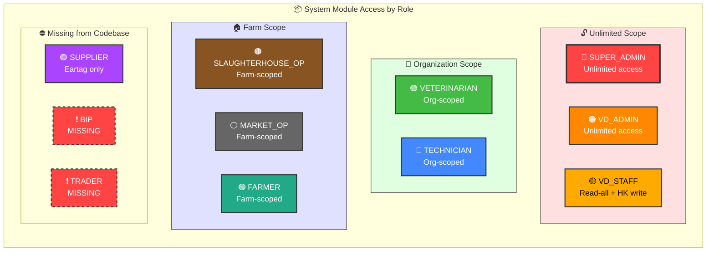

# RBAC Access Diagrams — AIMCS Permission Mapping

Derived from `ŽIŽEKIAN_ANALYSIS_OF_THE_EVIDENCE.md` and the original SM.PDF / FS documents.

---

## Diagram 1: System Module Access by Role

Which roles can access which system modules, with scope annotations.



---

## Diagram 2: Resource × Action Permission Matrix

Every role's access to each resource:action pair. Checkmark = has permission. Scope annotation in parentheses.

```mermaid
flowchart LR
    classDef sa fill:#FF4444,stroke:#333,stroke-width:2px,color:white
    classDef va fill:#FF8800,stroke:#333,stroke-width:2px,color:white
    classDef vs fill:#FFAA00,stroke:#333,stroke-width:2px,color:black
    classDef vet fill:#44BB44,stroke:#333,stroke-width:2px,color:white
    classDef tech fill:#4488FF,stroke:#333,stroke-width:2px,color:white
    classDef sup fill:#AA44FF,stroke:#333,stroke-width:2px,color:white
    classDef sl fill:#885522,stroke:#333,stroke-width:2px,color:white
    classDef mk fill:#666666,stroke:#333,stroke-width:2px,color:white
    classDef fr fill:#22AA88,stroke:#333,stroke-width:2px,color:white
    classDef missing fill:#FF6666,stroke:#333,stroke-width:1px,stroke-dasharray:3 3,color:white
    classDef resource fill:#EEEEEE,stroke:#333,stroke-width:1px,color:#333

    SM{⚙️ System Management} --> SA_SA["SUPER_ADMIN: all"]
    SM --> VA_VA["VD_ADMIN: all"]
    SM --> VS_VS["VD_STAFF: read"]

    HK[📋 HK Module] --> HK_SA["SUPER_ADMIN: all"]
    HK --> HK_VA["VD_ADMIN: all"]
    HK --> HK_VS["VD_STAFF: read, write, confirm_import"]
    HK --> HK_VET["VETERINARIAN: read"]

    FARM[🏠 Farms] --> FARM_SA["SUPER_ADMIN: all"]
    FARM --> FARM_VA["VD_ADMIN: all"]
    FARM --> FARM_VS["VD_STAFF: read, write"]
    FARM --> FARM_VET["VETERINARIAN: read"]
    FARM --> FARM_TECH["TECHNICIAN: read"]

    ANIMAL[🐄 Animals] --> ANIM_SA["SUPER_ADMIN: all"]
    ANIMAL --> ANIM_VA["VD_ADMIN: all"]
    ANIMAL --> ANIM_VS["VD_STAFF: read"]
    ANIMAL --> ANIM_VET["VETERINARIAN: register, read, write, death (org)"]
    ANIMAL --> ANIM_TECH["TECHNICIAN: register (org)"]
    ANIMAL --> ANIM_SL["SLAUGHTERHOUSE_OP: register death (farm)"]
    ANIMAL --> ANIM_FR["FARMER: read (own)"]

    EARTAG[🏷️ Ear Tags] --> ET_SA["SUPER_ADMIN: all"]
    EARTAG --> ET_VA["VD_ADMIN: all"]
    EARTAG --> ET_VS["VD_STAFF: generate, supply, view_all_orders"]
    EARTAG --> ET_VET["VETERINARIAN: order, allocate (org)"]
    EARTAG --> ET_TECH["TECHNICIAN: order (org)"]
    EARTAG --> ET_SUP["SUPPLIER: collect_orders, confirm_delivery"]
    EARTAG --> ET_FR["FARMER: order (own)"]

    MOVE[🔄 Movements] --> MV_SA["SUPER_ADMIN: all"]
    MOVE --> MV_VA["VD_ADMIN: all"]
    MOVE --> MV_VS["VD_STAFF: read"]
    MOVE --> MV_VET["VETERINARIAN: read, write (org)"]
    MOVE --> MV_MK["MARKET_OP: write arrivals/departures (farm)"]
    MOVE --> MV_FR["FARMER: read (own)"]

    SLAUGHTER[🔪 Slaughter] --> SL_SA["SUPER_ADMIN: all"]
    SLAUGHTER --> SL_VA["VD_ADMIN: all"]
    SLAUGHTER --> SL_VS["VD_STAFF: read"]
    SLAUGHTER --> SL_SL_OP["SLAUGHTERHOUSE_OP: register (farm)"]

    PASTURE[🌿 Pasture] --> PS_SA["SUPER_ADMIN: all"]
    PASTURE --> PS_VA["VD_ADMIN: all"]
    PASTURE --> PS_VET["VETERINARIAN: declare (org)"]
    PASTURE --> PS_FR["FARMER: declare (own)"]

    class SA_SA,SM,SA_SA,HK_SA,FARM_SA,ANIM_SA,ET_SA,MV_SA,SL_SA,PS_SA sa
    class VA_VA,HK_VA,FARM_VA,ANIM_VA,ET_VA,MV_VA,SL_VA,PS_VA va
    class VS_VS,HK_VS,FARM_VS,ANIM_VS,ET_VS,MV_VS,SL_VS vs
    class HK_VET,FARM_VET,ANIM_VET,ET_VET,MV_VET,PS_VET vet
    class FARM_TECH,ANIM_TECH,ET_TECH tech
    class ET_SUP sup
    class ANIM_SL,SL_SL_OP sl
    class MV_MK mk
    class ANIM_FR,ET_FR,MV_FR,PS_FR fr
    class SM,HK,FARM,ANIMAL,EARTAG,MOVE,SLAUGHTER,PASTURE resource
```



---

## Diagram 3: Scope Resolution & Permission Checking Flow

How access is determined at request time — current state vs. what's missing.

```mermaid
flowchart LR
    Start([📥 Incoming Request]) --> Auth[🔐 Authenticate<br/>better-auth session]
    Auth --> Session[📄 Session Enrichment<br/>Load user + roles + permissions<br/>from customSession plugin]
    Session --> HasPerm{@RequirePermission<br/>decorator present?}

    HasPerm -->|No ❌| NoCheck[⚠️ No permission check runs<br/>Request passes through unchecked]
    HasPerm -->|Yes ✅| CheckPerm{Does session.permissions<br/>include required permission?}

    CheckPerm -->|No| Deny[⛔ TRPCError FORBIDDEN<br/> Insufficient permissions ]
    CheckPerm -->|Yes| ScopeCheck{Scope type?}

    ScopeCheck -->|Unlimited| Allow[✅ Allow — SUPER_ADMIN, VD_ADMIN, VD_STAFF]
    ScopeCheck -->|Org-scoped| OrgCheck{Does request farmId<br/> match users scopeOrgId <br/> commune area?}
    ScopeCheck -->|Farm-scoped| FarmCheck{Does request farmId<br/>match user's scopeFarmId?}

    OrgCheck -->|No| DenyScope[⛔ TRPCError FORBIDDEN<br/> Not authorized for this area ]
    OrgCheck -->|Yes| Allow2[✅ Allow]
    FarmCheck -->|No| DenyScope2[⛔ TRPCError FORBIDDEN<br/> Not your farm ]
    FarmCheck -->|Yes| Allow3[✅ Allow]

    subgraph Missing["🧱 What's Missing (The Real)"]
        M1[❌ No @RequirePermission decorator]
        M2[❌ No scope resolution in middleware]
        M3[❌ No seed data for permissions table]
        M4[❌ No seed for role→permission mappings]
        M5[❌ Missing SUPPLIER, BIP, TRADER roles]
    end

    NoCheck -.->|Reveals gap| Missing

    classDef start fill:#90EE90,stroke:#333,stroke-width:2px,color:darkgreen
    classDef process fill:#87CEEB,stroke:#333,stroke-width:2px,color:darkblue
    classDef decision fill:#FFD700,stroke:#333,stroke-width:2px,color:black
    classDef allow fill:#90EE90,stroke:#333,stroke-width:2px,color:darkgreen
    classDef deny fill:#FFB6C1,stroke:#DC143C,stroke-width:2px,color:black
    classDef missing fill:#FFB6C1,stroke:#DC143C,stroke-width:2px,stroke-dasharray:5 5,color:black

    class Start start
    class Auth,Session process
    class HasPerm,CheckPerm,ScopeCheck,OrgCheck,FarmCheck decision
    class Allow,Allow2,Allow3 allow
    class Deny,DenyScope,DenyScope2,NoCheck deny
    class M1,M2,M3,M4,M5 missing
```


---

## Diagram 4: Role → Action Summary (Per-Role Detail)

```mermaid
flowchart LR
    classDef admin fill:#FF4444,stroke:#333,stroke-width:2px,color:white
    classDef staff fill:#FFAA00,stroke:#333,stroke-width:2px,color:black
    classDef vet fill:#44BB44,stroke:#333,stroke-width:2px,color:white
    classDef tech fill:#4488FF,stroke:#333,stroke-width:2px,color:white
    classDef sup fill:#AA44FF,stroke:#333,stroke-width:2px,color:white
    classDef op fill:#885522,stroke:#333,stroke-width:2px,color:white
    classDef market fill:#666666,stroke:#333,stroke-width:2px,color:white
    classDef farmer fill:#22AA88,stroke:#333,stroke-width:2px,color:white
    classDef missing fill:#FF6666,stroke:#333,stroke-width:1px,stroke-dasharray:3 3,color:white
    classDef scopeNode fill:#EEEEEE,stroke:#333,stroke-width:1px,color:#333

    SA[🔴 SUPER_ADMIN]
    SA --> SA_ALL[✅ Everything — all modules,<br/>all resources, all actions,<br/>no scope restrictions]
    SA --> SA_AUDIT[📋 Including: sm:audit:read,<br/>sm:sysparams:write]

    VA[🟠 VD_ADMIN]
    VA --> VA_ALL[✅ Nearly everything<br/>same as SUPER_ADMIN minus<br/>system config write]

    VS[🟡 VD_STAFF]
    VS --> VS_R[✅ Read access to all modules]
    VS --> VS_HK[✏️ HK: write, confirm_import, import]
    VS --> VS_ET[🏷️ Eartag: generate, supply, allocate]
    VS --> VS_SM[⚙️ SM: users/roles/orgs read]

    VET[🟢 VETERINARIAN]
    VET --> VET_SCOPE[🏢 Scope: Organization area]
    VET --> VET_AN[🐄 Animal: register, read, death]
    VET --> VET_MV[🔄 Movement: read, write]
    VET --> VET_ET[🏷️ Eartag: order, allocate]
    VET --> VET_PS[🌿 Pasture: declare]
    VET --> VET_R[📖 Read: HK, farms]

    TECH[🔵 TECHNICIAN]
    TECH --> TECH_SCOPE[🏢 Scope: Organization area]
    TECH --> TECH_AN[🐄 Animal: register]
    TECH --> TECH_ET[🏷️ Eartag: order]
    TECH --> TECH_MV[🔄 Movement: read]
    TECH --> TECH_R[📖 Read: farms]

    SUP[🟣 SUPPLIER]
    SUP --> SUP_SCOPE[🔓 Scope: Organization]
    SUP --> SUP_ET[🏷️ Eartag: collect_orders,<br/>confirm_delivery]
    SUP --> SUP_NOTE[⚠️ MISSING from codebase!]

    SL[🟤 SLAUGHTERHOUSE_OP]
    SL --> SL_SCOPE[🏠 Scope: Own farm only]
    SL --> SL_AN[🔪 Slaughter: register]
    SL --> SL_READ[🐄 Animal: read]

    MK[⚪ MARKET_OP]
    MK --> MK_SCOPE[🏠 Scope: Own farm only]
    MK --> MK_MV[🔄 Movement: write<br/> arrivals & departures at market]

    FR[🟢 FARMER]
    FR --> FR_SCOPE[🏠 Scope: Own farm only]
    FR --> FR_AN[🐄 Animal: read - own]
    FR --> FR_ET[🏷️ Eartag: order - own farm]
    FR --> FR_MV[🔄 Movement: read - own]
    FR --> FR_PS[🌿 Pasture: declare - own]

    BIP[❗ BIP - Border Inspection]
    BIP --> BIP_MV[🔄 Movement: import/export]
    BIP --> BIP_NOTE[⛔ MISSING from codebase]

    TRADER[❗ TRADER]
    TRADER --> TRADER_MV[🔄 Movement: write<br/> purchase/sale transactions ]
    TRADER --> TRADER_NOTE[⛔ MISSING from codebase]

    class SA,SA_ALL,SA_AUDIT admin
    class VA,VA_ALL staff
    class VS,VS_R,VS_HK,VS_ET,VS_SM staff
    class VET,VET_SCOPE,VET_AN,VET_MV,VET_ET,VET_PS,VET_R vet
    class TECH,TECH_SCOPE,TECH_AN,TECH_ET,TECH_MV,TECH_R tech
    class SUP,SUP_SCOPE,SUP_ET,SUP_NOTE sup
    class SL,SL_SCOPE,SL_AN,SL_READ op
    class MK,MK_SCOPE,MK_MV market
    class FR,FR_SCOPE,FR_AN,FR_ET,FR_MV,FR_PS farmer
    class BIP,BIP_MV,BIP_NOTE,TRADER,TRADER_MV,TRADER_NOTE missing
    class VET_SCOPE,TECH_SCOPE,SUP_SCOPE,SL_SCOPE,MK_SCOPE,FR_SCOPE scopeNode
```



---

### Key

| Scope | Meaning |
|-------|---------|
| 🔓 Unlimited | Can access any resource in the system |
| 🏢 Organization | Scoped to farms within their org's assigned communes |
| 🏠 Farm | Scoped to their own farm(s) only |

| Color | Role Category |
|-------|--------------|
| 🔴/🟠/🟡 | Administration (unlimited scope) |
| 🟢/🔵 | Field operations (org-scoped) |
| 🟤/⚪/🟢 | Farm-scoped actors |
| 🟣/🔴 dashed | Missing roles |
