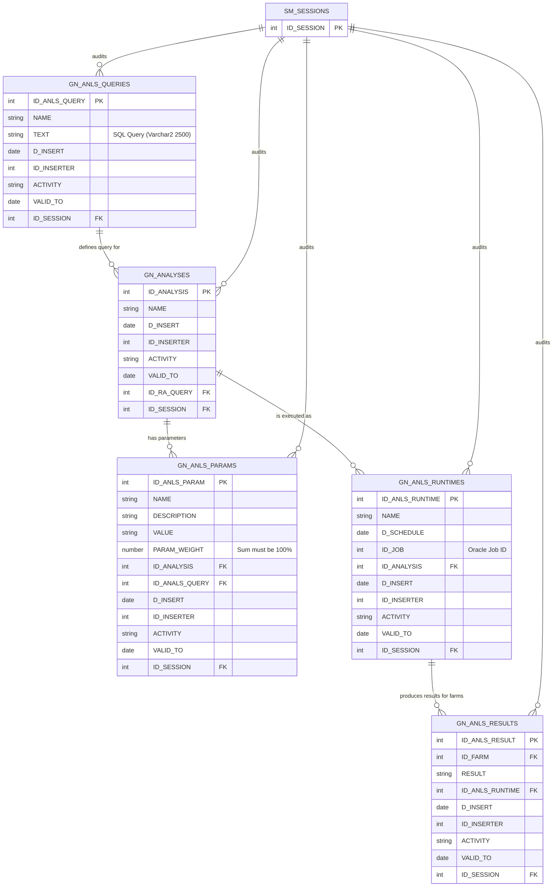
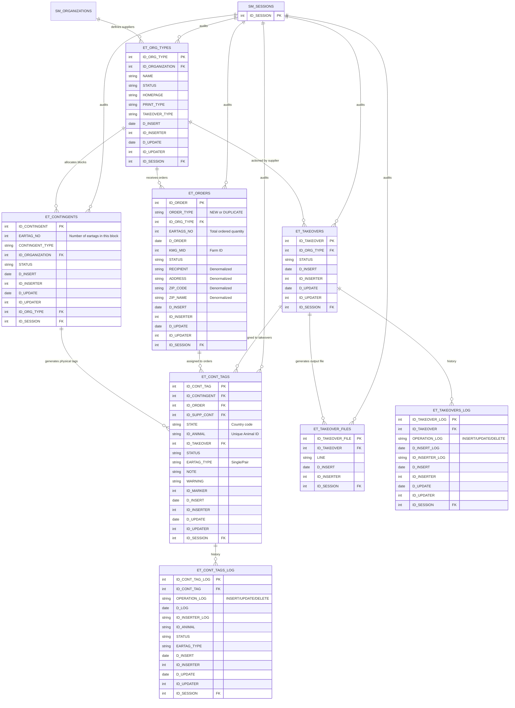

These two files, `Analises.PDF` and `Eartags.PDF`, are **Oracle Designer Table Definition reports** (just like `SM.PDF`, `HK.PDF`, etc.). They contain the exact physical database schemas. Since they are database reports and not functional workflows, they do not contain graphical flowcharts, but they contain precise ER relationships and deep data constraints.

Below are the extractions for both modules—reconstructed as **Mermaid ER Diagrams**, **Detailed Table Definitions**, and **Implicit Business Rules** embedded within the database schema.

---

### Document 1: `Analises.PDF` (Risk Analysis Module)

#### Part 1: ER Diagram (Mermaid)

This schema allows the CPC to define reusable database queries (`GN_ANLS_QUERIES`), assign them to risk analyses (`GN_ANALYSES`), parameterize them with weighted criteria (`GN_ANLS_PARAMS`), schedule their execution (`GN_ANLS_RUNTIMES`), and store the final calculated risk results for each farm (`GN_ANLS_RESULTS`).

#### Part 2: Detailed Table Data & Business Rules

*(Derived from the Table Definition report)*

**1. `GN_ANLS_QUERIES` (Risk Analysis Queries)**

* **PK:** `ID_ANLS_QUERY`
* **Columns:** `NAME`, `TEXT` (The actual SQL query, up to 2500 characters), `D_INSERT`, `ID_INSERTER`, `ACTIVITY`, `VALID_TO`, `ID_SESSION`.
* **Business Rule:** The `TEXT` column holds the actual SQL query that is executed to retrieve farms for the risk analysis.

**2. `GN_ANALYSES` (Risk Analyses Definitions)**

* **PK:** `ID_ANALYSIS`
* **Columns:** `NAME`, `D_INSERT`, `ID_INSERTER`, `ACTIVITY`, `VALID_TO`, `ID_RA_QUERY` (FK to `GN_ANLS_QUERIES`), `ID_SESSION`.
* **Business Rule:** Links a named Risk Analysis definition to a specific SQL query.

**3. `GN_ANLS_PARAMS` (Risk Analysis Parameters)**

* **PK:** `ID_ANLS_PARAM`
* **Columns:** `NAME`, `DESCRIPTION`, `VALUE`, `PARAM_WEIGHT`, `ID_ANALYSIS` (FK), `ID_ANALS_QUERY` (FK), `D_INSERT`, `ID_INSERTER`, `ACTIVITY`, `VALID_TO`, `ID_SESSION`.
* **Explicit Business Rule:** The `PARAM_WEIGHT` column defines the weight of each parameter. **The sum of all parameter weights for a single risk analysis must equal 100%.** The database uses a `PERCENT` domain for this field.

**4. `GN_ANLS_RUNTIMES` (Executions of Risk Analyses)**

* **PK:** `ID_ANLS_RUNTIME`
* **Columns:** `NAME`, `D_SCHEDULE` (Date when the RA is scheduled to run), `ID_JOB` (Foreign key to an Oracle DBMS Job that is created for the scheduled task), `ID_ANALYSIS` (FK), `D_INSERT`, `ID_INSERTER`, `ACTIVITY`, `VALID_TO`, `ID_SESSION`.
* **Business Rule:** Risk analyses can be scheduled as **Oracle Database Jobs**. The `ID_JOB` column links this record to the actual background scheduled job in the Oracle database.

**5. `GN_ANLS_RESULTS` (Risk Analysis Results)**

* **PK:** `ID_ANLS_RESULT`
* **Unique Key:** `GRT_UK` (`ID_FARM`, `ID_ANLS_RUNTIME`) ensures that the same farm is not calculated multiple times in the same run.
* **Columns:** `ID_FARM` (FK to `HK_KMG`), `RESULT` (The final calculated score/status), `ID_ANLS_RUNTIME` (FK), `D_INSERT`, `ID_INSERTER`, `ACTIVITY`, `VALID_TO`, `ID_SESSION`.
* **Business Rule:** Once a risk analysis is executed, the result for each farm is stored here. The unique constraint prevents duplicate results for a farm within the same execution.

---

### Document 2: `Eartags.PDF` (Ear Tag Management Module)

#### Part 1: ER Diagram (Mermaid)

This schema manages the lifecycle of ear tags from supplier definitions, ordering (new/duplicate), taking possession of the tags, and auditing the status of each individual tag.

#### Part 2: Detailed Table Data & Business Rules

**1. `ET_ORG_TYPES` (Ear Tag Supplier & Type Configuration)**

* **PK:** `ID_ORG_TYPE`
* **Columns:** `ID_ORGANIZATION` (FK to `SM_ORGANIZATIONS`), `NAME`, `STATUS`, `HOMEPAGE`, `PRINT_TYPE` (defines the output file format), `TAKEOVER_TYPE`, `D_INSERT`, `ID_INSERTER`, `D_UPDATE`, `ID_UPDATER`, `ID_SESSION`.

**2. `ET_CONTINGENTS` (Ear Tag Contingents/Blocks)**

* **PK:** `ID_CONTINGENT`
* **Columns:** `EARTAG_NO` (The number of ear tags in this allocated block), `CONTINGENT_TYPE`, `ID_ORGANIZATION` (FK to `SM_ORGANIZATIONS`), `D_INSERT`, `ID_INSERTER`, `D_UPDATE`, `ID_UPDATER`, `ID_ORG_TYPE` (FK), `STATUS`, `ID_SESSION`.
* **Business Rule:** This defines a block of *unassigned* physical tags assigned to a specific Supplier (Organization). `ID_ORG_TYPE` links it to the specific ear tag type/supplier.

**3. `ET_ORDERS` (Ear Tag Orders)**

* **PK:** `ID_ORDER`
* **Columns:** `ORDER_TYPE` (Values: NEW or DUPLICATE), `ID_ORG_TYPE` (FK), `EARTAGS_NO` (Quantity ordered), `D_ORDER`, `KMG_MID` (The farm ID placing the order), `STATUS`, `RECIPIENT`, `ADDRESS`, `ZIP_CODE`, `ZIP_NAME`, `D_INSERT`, `ID_INSERTER`, `D_UPDATE`, `ID_UPDATER`, `ID_SESSION`.
* **Business Rule:** The address fields (`RECIPIENT`, `ADDRESS`, `ZIP_CODE`, `ZIP_NAME`) are explicitly **denormalized**. The schema notes: *"user denormalization to support duplicates special cases"*. This means if a user orders duplicate tags to be sent to a farm *different* from the one registered to the keeper, the order holds a hard copy of the physical address to print on the shipping label, independent of the central address registry.

**4. `ET_CONT_TAGS` (Individual Ear Tags)**

* **PK:** `ID_CONT_TAG`
* **Columns:** `ID_CONTINGENT` (FK), `ID_ORDER` (FK), `ID_SUPP_CONT` (FK), `STATE` (Country code), `ID_ANIMAL` (Animal ID), `ID_TAKEOVER` (FK), `STATUS`, `EARTAG_TYPE` (Single or Pair), `NOTE`, `WARNING`, `ID_MARKER` (Marker responsible), `D_INSERT`, `ID_INSERTER`, `D_UPDATE`, `ID_UPDATER`, `ID_SESSION`.
* **Explicit Database Check Constraint:**
  * `CHECK_STATUS_KZ`: The database strictly enforces the `STATUS` column to only contain one of the following values: `'ZACETNI'` (Initial), `'PROSTA'` (Free/Available), `'PREVZETA'` (Taken over), `'PREKLICANA'` (Canceled), `'MIR OVANJE'` (Dormant/Inactive), `'VELJAVNA'` (Valid), `'DOBAVLJENA'` (Delivered), `'STORNO_NAROC'` (Order cancelled).
* **Business Rule:** This is the master table for tracking every single ear tag. It can be bound to a Contingent (`ID_CONTINGENT`), an Order (`ID_ORDER`), or a Supplier Takeover (`ID_TAKEOVER`).

**5. `ET_TAKEOVERS` (Supplier Takeover Actions)**

* **PK:** `ID_TAKEOVER`
* **Columns:** `ID_ORG_TYPE` (FK), `STATUS`, `D_INSERT`, `ID_INSERTER`, `D_UPDATE`, `ID_UPDATER`, `ID_SESSION`.
* **Business Rule:** Represents the physical act of the supplier "taking over" the order (collecting the data to print/physically produce the tags). It locks the order so it cannot be modified by the end user, and triggers the linking of `ET_CONT_TAGS` to `ID_TAKEOVER`.

**6. `ET_TAKEOVER_FILES` (Supplier Export Files)**

* **PK:** `ID_TAKEOVER_FILE`
* **Columns:** `ID_TAKEOVER` (FK), `ID_INSERTER`, `D_INSERT`, `LINE` (Varchar2 3000).
* **Business Rule:** This table stores the **exact ASCII text lines** of the flat file that was generated and sent to the supplier at the time of the takeover. This allows the system to exactly replicate the file later if needed (as defined in the functional specs).

**7. `ET_CONT_TAGS_LOG` & `ET_TAKEOVERS_LOG` (Journal Tables)**

* **PK:** `ID_CONT_TAG_LOG` / `ID_TAKEOVER_LOG`
* **Columns:** Mirror the base table columns, plus `OPERATION_LOG` (INSERT/UPDATE/DELETE), `ID_INSERTER_LOG` (user who performed the audit action), and `D_LOG` (the timestamp of the audit event).
* **Business Rule:** These tables provide a full **audit trail**. Every time the status, assignment, or details of an ear tag or takeover change, the previous state is preserved in these audit tables with a timestamp and the user who performed the action.

---

### Summary of how these integrate into the whole system

* **`Analises.PDF`** defines the infrastructure for **Instance no. 18: On spot inspections** workflow from the previous `Workflow 17-04-03.pdf`. The `GN_ANALYSES` and `GN_ANLS_RESULTS` tables physically store the risk analysis logic and the selected farms, which drive the printing of inspection forms.
* **`Eartags.PDF`** defines the physical backend for **Instances no. 4, 5, 6, and 7** (First allocation, routine allocation, replacement, and withdrawal). The `ET_ORDERS` and `ET_CONT_TAGS` tables directly mirror the functional business rules you previously analyzed, including the complex `ID_ORG_TYPE` bridges for supplier management and the denormalized address data for shipping replacement tags to the right location.
