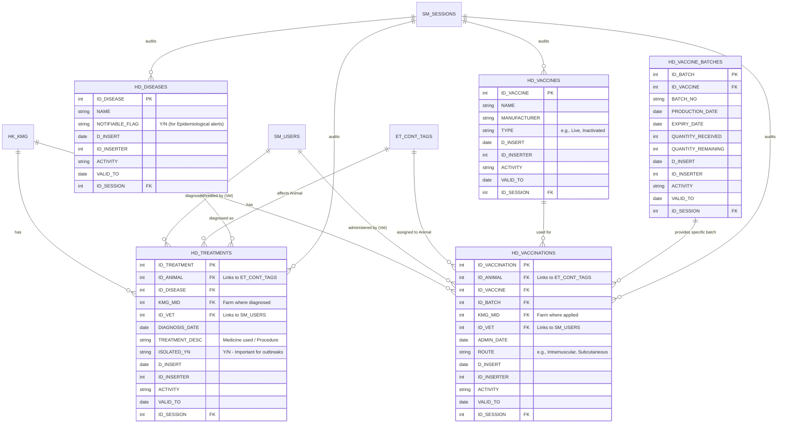

Based on the existing architecture you've shared, adding **Diseases**, **Vaccinations**, and formal **Veterinary interactions** is a logical next step.

The good news is that **Veterinarians (Vets and VIs)** already exist implicitly in your system (`SM_USERS` and `HK_SUBJ`), and the `HK_KMG_SUBJ` bridge table already supports defining their **role** (e.g., `VET`, `VI`, `VETERINARIAN`).

What you need to add are: **Disease master data**, **Vaccine data**, and **Transactional health events** (diagnoses, treatments, vaccinations).

Here is how you should logically proceed, designed to be 100% compatible with the Oracle Designer patterns seen in your PDFs.

---

### Part 1: Logical Architecture & Mermaid ER Diagram

You have a solid foundation: `HK_KMG` (Farms) and `ID_ANIMAL` (tracked via `ET_CONT_TAGS`). Health data should be centered around the **Animal**, the **Administering Vet**, and the **Farm where it happened**.

---

### Part 2: Detailed Table Definitions (Oracle Designer Style)

Using the exact patterns from your `SM`, `HK`, and `ANALYSES` PDFs:

**1. `HD_DISEASES` (Master Disease Code Table)**

* **PK:** `ID_DISEASE`
* **Columns:**
  * `NAME` (varchar2 50, Unique) - e.g., "Bovine Tuberculosis", "Foot and Mouth Disease"
  * `NOTIFIABLE_FLAG` (varchar2 1) - Defines if this disease requires immediate epidemiological reporting to the VI/CPC.
  * `D_INSERT`, `ID_INSERTER`, `ACTIVITY`, `VALID_TO`, `ID_SESSION` (Standard auditing).
* **Business Rule:** Can only be set to inactive (`VALID_TO`); never hard-deleted, as it belongs to historical animal health records.

**2. `HD_VACCINES` (Master Vaccine Code Table)**

* **PK:** `ID_VACCINE`
* **Columns:**
  * `NAME` (varchar2 50) - e.g., "Rinderpest Vaccine"
  * `MANUFACTURER` (varchar2 50)
  * `TYPE` (varchar2 15) - e.g., "Live", "Killed"
  * `D_INSERT`, `ID_INSERTER`, `ACTIVITY`, `VALID_TO`, `ID_SESSION`.

**3. `HD_VACCINE_BATCHES` (Stock Inventory)**

* **PK:** `ID_BATCH`
* **Columns:**
  * `ID_VACCINE` (FK to `HD_VACCINES`)
  * `BATCH_NO` (varchar2 30, Unique) - The manufacturer's physical batch number.
  * `EXPIRY_DATE`
  * `QUANTITY_RECEIVED` (number) - Units received at VS/CPC.
  * `QUANTITY_REMAINING` (number) - Units still available for use (calculations happen via triggers).
  * `D_INSERT`, `ID_INSERTER`, `ACTIVITY`, `VALID_TO`, `ID_SESSION`.
* **Business Rule:** When a veterinarian uses a dose in `HD_VACCINATIONS`, a trigger must decrement `QUANTITY_REMAINING` on the corresponding batch automatically.

**4. `HD_VACCINATIONS` (Transactional Animal Event)**

* **PK:** `ID_VACCINATION`
* **Columns:**
  * `ID_ANIMAL` (FK to `ET_CONT_TAGS` or your `GN_ANIMALS` table).
  * `ID_VACCINE` (FK to `HD_VACCINES`)
  * `ID_BATCH` (FK to `HD_VACCINE_BATCHES`)
  * `KMG_MID` (FK to `HK_KMG`, representing the farm where the animal was when vaccinated).
  * `ID_VET` (FK to `SM_USERS` - the veterinarian performing the act).
  * `ADMIN_DATE` (date, cannot be in the future).
  * `ROUTE` (varchar2 30) - e.g., "Subcutaneous", "Oral".
  * `D_INSERT`, `ID_INSERTER`, `ACTIVITY`, `VALID_TO`, `ID_SESSION`.

**5. `HD_TREATMENTS` (Transactional Diagnosis/Treatment)**

* **PK:** `ID_TREATMENT`
* **Columns:**
  * `ID_ANIMAL` (FK to `ET_CONT_TAGS`)
  * `ID_DISEASE` (FK to `HD_DISEASES`) - Only required if diagnosing a disease; not used for routine checkups.
  * `KMG_MID` (FK to `HK_KMG`).
  * `ID_VET` (FK to `SM_USERS`).
  * `DIAGNOSIS_DATE` (date).
  * `TREATMENT_DESC` (varchar2 500) - Text field for the vet to write notes.
  * `ISOLATED_YN` (varchar2 1) - Triggers an alert for the VS/VI if a notifiable disease is suspected.
  * `D_INSERT`, `ID_INSERTER`, `ACTIVITY`, `VALID_TO`, `ID_SESSION`.

**6. Log / Journal Tables (Optional but recommended)**

* Because `HD_VACCINATIONS` and `HD_TREATMENTS` are critical regulatory data, you should create `HD_VACCINATIONS_LOG` and `HD_TREATMENTS_LOG` tables. These are exact copies of the base tables plus a `LOG_OPERATION` (INSERT, UPDATE, DELETE) and `LOG_DATE`, matching the `ET_CONT_TAGS_LOG` pattern from your `Eartags.PDF`. This ensures you can prove exactly who changed a vaccination date or added a disease diagnosis.

---

### Part 3: How this fits into your existing `SM` and `HK` modules

* **Veterinary Users already exist!** You do not need a new `VETERINARIANS` table.
  * Vets are **`SM_USERS`** (they have a login and privileges).
  * Their physical address, name, and ID number are stored in **`HK_SUBJ`**.
  * Their assignment to a farm is defined in **`HK_KMG_SUBJ`** with `ROLE = 'VET'`, `VI`, or `VETERINARIAN`.
  * *Business Rule:* When entering a vaccination on the PDA or Web Form, the system should only allow users who possess the `VET` role for the current farm to save the record.

* **Extending the `PDA` and Central Data Sync (from your `TPC_PDA` spec):**
  * You must expand the PDA database schema to include `HD_DISEASES`, `HD_VACCINES`, and `HD_VACCINATIONS`.
  * The existing **PDA synchronization process** (Incremental download/upload) will naturally handle health data.
  * **Business Rule for Data Entry:** When the Vet is on the farm with the PDA, they scan the animal's ear tag, select the `VACCINATE` option, choose the `HD_VACCINE` from the drop-down, and enter the `ADMIN_DATE`.

* **Extension of the `Eartags` Module:**
  * You currently track `ID_ANIMAL` in `ET_CONT_TAGS`. You should create a `GN_ANIMALS` table (if you don't have one) with `ID_ANIMAL` as PK, `KMG_MID` (current holding), `BIRTH_DATE`, `SEX`, and `MOTHER_ID`.
  * The `HD_VACCINATIONS` and `HD_TREATMENTS` tables link directly to this `ID_ANIMAL`.

### Part 4: Key Business Rules / Validation Checks to add

To "proceed logically," you must define these specific business rules in your application logic and/or database triggers:

1. **Vaccination Age Checks:** You cannot vaccinate an animal against Disease X if it is younger than `3 months` (make this a `SM_SYS_PARAMS` setting).
2. **Batch Expiry Check:** The system must prevent a vet from administering a vaccine if the `EXPIRY_DATE` on `HD_VACCINE_BATCHES` is passed.
3. **Outbreak Trigger:** If `HD_TREATMENTS` is inserted with an `ID_DISEASE` where `NOTIFIABLE_FLAG = 'Y'`, the system should immediately flag that farm for the CPC and VI (using the `GN_ANALYSES` risk analysis module you already have).
4. **Stock Reconciliation:** The Central CPC must be able to run a report joining `HD_VACCINE_BATCHES` and `HD_VACCINATIONS` to check if `QUANTITY_RECEIVED` equals `QUANTITY_REMAINING + total_doses_administered`. If it doesn't balance, it flags a theft/loss of vaccine.

**Next Steps:**
Because your system is built on **Oracle**, you can create these new tables in the `SIR_MK` container exactly as you did with the `ANALYSES` and `EARTAGS` modules. I would recommend first creating the Master Tables (`HD_DISEASES`, `HD_VACCINES`), then `HD_VACCINE_BATCHES` (inventory), and finally the Event Tables (`HD_VACCINATIONS`, `HD_TREATMENTS`). As always, ensure every table has the mandatory `ID_SESSION` foreign key for audit trail traceability.
