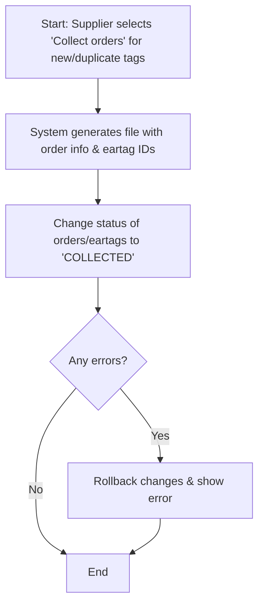
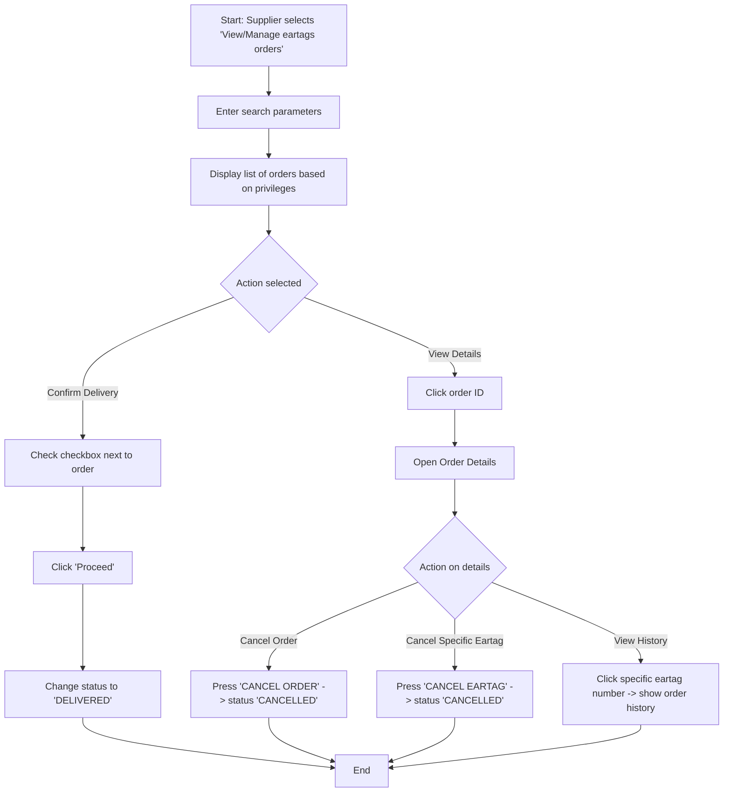

### Part 1: Diagrams (Process Flows - Reconstructed as Mermaid)

The PDF describes 6 main process flows. Here are their textual descriptions and reconstructed Mermaid flowcharts:

#### 1. Process: Generating New Ear Tag Numbers (VD User)

**Description:** VD user opens the form, enters the count and description, confirms, and the system generates new unique numbers with a status of `NEW`.

```mermaid
graph TD
    A[Start: VD User selects 'Generate new ear tag numbers'] --> B[Open web form]
    B --> C[Enter number of eartags to generate]
    C --> D[Enter description (optional)]
    D --> E[Click 'Proceed' and confirm]
    E --> F{System validation}
    F -->|Success| G[Generate new numbers with status 'NEW']
    G --> H[Display statistics to user]
    F -->|Failure| I[Rollback changes & show error message]
    H --> J[End]
    I --> J
```

#### 2. Process: Defining Supplier Contingent of New Eartags

**Description:** VD user selects a supplier, generates a block of numbers (`AVAILABLE`), and downloads them as a `.txt` file.

```mermaid
graph TD
    A[Start: VD User selects 'Generate supplier eartags contingent'] --> B[Select Supplier]
    B --> C[Enter number of eartags to assign]
    C --> D[Enter description (optional)]
    D --> E[Click 'Proceed' and confirm]
    E --> F{System validation}
    F -->|Success| G[Assign numbers with status 'AVAILABLE' to supplier]
    G --> H[Prompt user to save .txt file]
    F -->|Failure| I[Rollback changes & show error message]
    H --> J[Store file in database for re-download]
    J --> K[End]
    I --> K
```

#### 3. Process: Placing Order for New Eartags

**Description:** Ordinary user (farmer) or VD/Vet Station selects supplier/count, enters optional farm ID, validates rules, accepts terms, and places the order.

```mermaid
graph TD
    A[Start: User selects 'Placing orders for new eartags'] --> B[Select Supplier (hidden if only one)]
    B --> C[Enter number of eartags to order]
    C --> D[Enter Farm ID (Optional, based on user type)]
    D --> E[Click 'Proceed']
    E --> F{Check business rules}
    F -->|Fail| G[Display error/stop]
    F -->|Pass| H[Show Order Preview]
    H --> I[Check two agreement checkboxes]
    I --> J[Click 'Proceed' to place order]
    J --> K[Save order to database]
    K --> L[Offer to print order or place another]
    L --> M[End]
```

#### 4. Process: Placing Order for Duplicate Eartags

**Description:** Similar to new orders, but the specific animal ID, state, and duplicate type must be provided. Can optionally append to an existing order.

```mermaid
graph TD
    A[Start: User selects 'Placing orders for duplicate eartags'] --> B[Enter State, Ear Tag ID, Duplicate Type]
    B --> C[Enter optional description]
    C --> D[Enter Farm ID (Optional, based on user type)]
    D --> E[Enter Sending Address (Optional)]
    E --> F{Append to existing order?}
    F -->|Yes| G[Select existing order]
    F -->|No| H[Proceed]
    G --> H
    H --> I{Check business rules}
    I -->|Fail| J[Display error/stop]
    I -->|Pass| K[Show Order Preview]
    K --> L[Check two agreement checkboxes]
    L --> M[Click 'Proceed' to place order]
    M --> N[Save order to database]
    N --> O[Offer to print order or place another]
    O --> P[End]
```

#### 5. Process: Supplier's Retrieval of Orders (New/Duplicate)

**Description:** Supplier collects all pending orders for them, generating an export file with order details and specific ID lists. Status changes to `COLLECTED`.



#### 6. Process: Reviewing / Managing Placed Orders (Supplier Delivery)

**Description:** Supplier views orders, confirms delivery (`DELIVERED`), cancels orders/eartags, and views ID history.



---

### Part 2: Database Related Data (Inferred Data Structures)

*Note: The document does not provide a visual E-R diagram. Based on the text descriptions of the processes and forms, the following database tables and fields are implied:*

**1. `EARTAGS` (Master Tag Table)**

* `state` (Text, e.g., MK)
* `eartag_number` (Char(8), Primary Key, starts from 10000001)
* `check_digit` (Integer, calculated - see Business Rules)
* `status` (Enum: NEW, AVAILABLE, COLLECTED, DELIVERED, CANCELLED)
* `supplier_id` (FK, links to the supplier this contingent belongs to)
* `date_generated` (Timestamp)
* `date_assigned_to_supplier` (Timestamp)

**2. `SUPPLIERS` (Vendor Table)**

* `supplier_id` (PK)
* `supplier_name` (Text)

**3. `EARTAG_ORDERS` (Order Header)**

* `order_id` (PK)
* `user_id` (FK, who placed the order)
* `supplier_id` (FK, selected supplier)
* `farm_id` (FK, optional, linked to payer/receiver)
* `description` (Text, optional)
* `order_date` (Timestamp)
* `status` (Enum: NEW, COLLECTED, DELIVERED, CANCELLED)
* `address_to_send_to` (Text, only for duplicate tags if farm ID not used)
* `type` (Enum: NEW_ORDER, DUPLICATE_ORDER)

**4. `EARTAG_ORDER_ITEMS` (Order Details)**

* `order_id` (FK)
* `eartag_number` (FK) - *Note: For new orders, this might only be filled during the "Collection" step by the system.*
* `duplicate_type` (Enum: SINGLE, BOTH) - *For duplicate orders only*
* `additional_description` (Text)

**5. `SUPPLIER_CONTINGENTS` (History of Assigned Blocks)**

* `contingent_id` (PK)
* `supplier_id` (FK)
* `start_tag_number`
* `end_tag_number`
* `quantity`
* `internal_doc_number` (Text, optional)
* `file_path` (URL to the generated `.txt` file)

---

### Part 3: Business Rules (Detailed Textual Extractions)

The PDF explicitly details the following business rules governing this module:

#### A. Ear Tag Number Generation Rules

1. **Structure:** Ear tag numbers must have exactly **8 digits**, with the last digit being a check digit.
2. **Check Digit Formula:** The check digit is automatically generated using the formula:
   `Check digit = mod 10 of sum of (3*dig1 + 5*dig2 + 7*dig3 + 11*dig4 + 13*dig5 + 17*dig6 + 19*dig7)`
3. **Range:** The ear tag numbering sequence starts from `10000001` to ensure a fixed length.

#### B. Supplier Contingent Rules

1. **Single Assignment:** Each supplier contingent of ear tag numbers can only be set once (though the output `.txt` file is saved in the database and can be re-downloaded via the web interface).

#### C. Ordering New Eartags - Validation Rules

1. **Permissions:** The user must have the appropriate privilege to insert data for a specific farm (if farm ID is provided).
2. **Maximum Quantity Formula (if farm ID provided):**
   `no_eartags_to_be_ordered = (number of female animals on farm) - (no. of remaining eartags for this farm from previous orders)`
3. **Farm Validity:** The farm ID must be valid for ordering (e.g., eartags cannot be ordered for fictitious farm IDs, slaughterhouses, etc.).
4. **Time Constraints (if farm ID provided):**
   * There must be a **120-day gap** between the current order and the last valid (non-cancelled) order for this farm ID (this is a system parameter and can be changed).
   * A farm is limited to a **maximum of 4 orders** of new eartags per year.
5. **Idempotency:** The same order must be entered only once (to prevent errors caused by browser "Back" and "Reload" buttons).

#### D. Ordering Duplicate Eartags - Validation Rules

1. **Idempotency:** The same order must be entered only once (prevents browser reload errors).
2. **Animal Status:** The animal for which a duplicate eartag is requested **must be alive**.
3. **Ownership Validation:** If a farm ID is entered, the animal must currently be registered on that farm.
4. **Permissions:** If a farm ID is entered, the user must have privileges to enter data for that farm.
5. **Farm Validity:** The farm ID must be valid (not a fictitious ID or slaughterhouse).

#### E. Automatically Putting New Eartags on an Order (Supplier Collection)

When a supplier collects orders for *new* eartags, the system automatically assigns numbers:

1. For each order in the collection, it checks how many eartags were ordered.
2. It pulls the exact number of *still available* ear tag numbers assigned to that supplier.
3. These numbers are assigned to the order (and placed in the output file) and sorted in **ascending order**.
4. If the supplier does not have enough `AVAILABLE` ear tags, or if a system error occurs, an error is printed and all database changes are rolled back.

#### F. Rules for Appending Duplicate Eartags to an Existing Order

If a user chooses to append duplicate eartags to an *existing* order, the following conditions must be met:

1. The "original" order must belong to the current user.
2. The "original" order must still be valid (status `NEW`, not `CANCELLED`) and must **not** have been collected by the supplier yet.
3. All other standard duplicate eartag ordering rules must also pass validation.

#### G. Viewing Limitations (Data Privileges)

1. **Ordinary User:** Can only view orders for eartags placed by themselves or their own organization.
2. **Supplier:** Can only view orders placed specifically for them (they cannot see orders for other suppliers).
3. **VD (Veterinary Directorate):** Has unrestricted access to view all orders without privilege-based restrictions.

#### H. Rules for Canceling Orders or Specific Eartags

1. **Who can cancel:** An eartag order can only be cancelled by the user who placed the order, or by a VD user.
2. **Timing:** The order can only be cancelled if no further processing activities have occurred (specifically, if the supplier **has not yet collected** the order).
3. **Item Cancellation:** The same rules apply when cancelling a specific individual ear tag on an order. Users have the option to cancel a specific eartag without canceling the entire remaining order.
