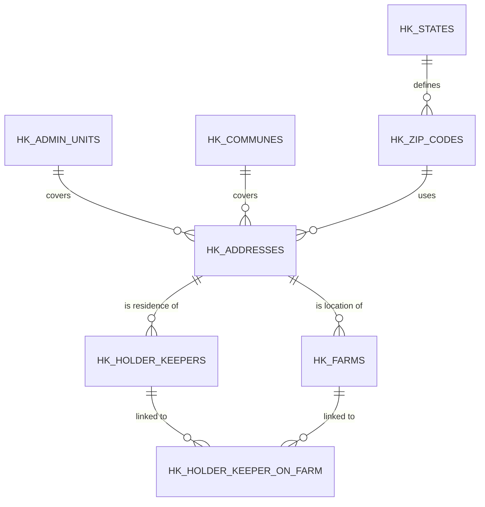
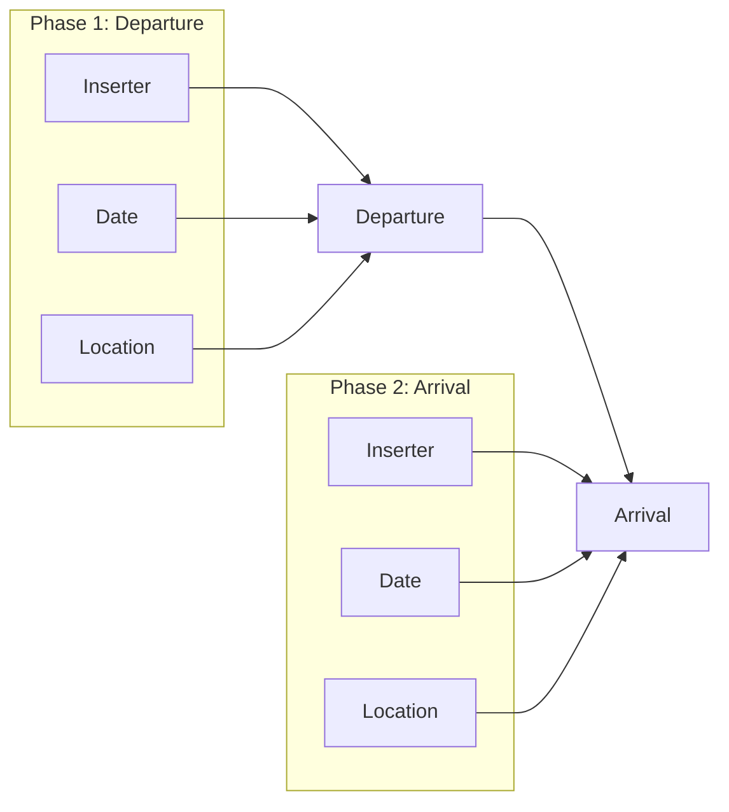
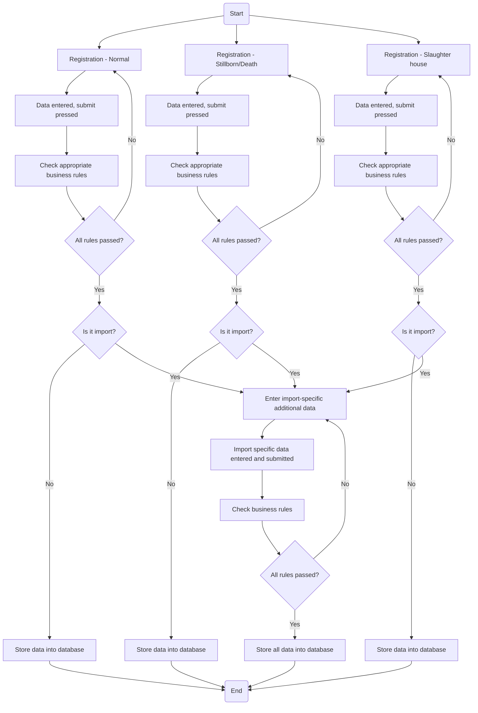
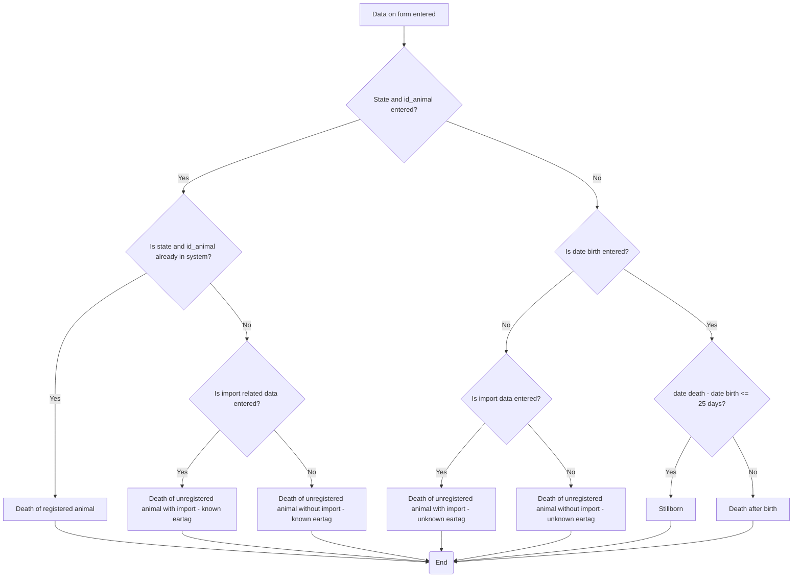

### Document 1: `FS - HK_MK(v1.0).pdf` (Holder Keepers Module)

#### Part 1: Diagrams (Mermaid)

**Diagram 1: HK Data Structure Hierarchy (Page 5)**
This diagram describes the dependencies required to enter complex data (e.g., you cannot insert a farm without first having a valid address).



**Diagram 2: Data Entry Process Flow (Page 6 & 7)**
This illustrates two entry approaches: **Top-down** (start with HK on farm, drill down if underlying data is missing) and **Bottom-up** (enter code tables first).

```mermaid
graph TD
    subgraph "HK on Farm"
        A(Start) --> B[Select holder keeper]
        B --> C{Does HK exist and valid?}
        C -->|No| D[Go to HK Data]
        C -->|Yes| E[Select farm data]
        E --> F{Does farm exist and valid?}
        F -->|No| G[Go to Farm Data]
        F -->|Yes| H[Commit changes into database]
        H --> I[Data saved]
        I --> J(End)
    end

    subgraph "HK Data"
        D --> K[Insert/Update HK specific data]
        K --> L[HK specific data entered]
        L --> M[Select HK's address]
        M --> N{Does address exist and valid?}
        N -->|No| O[Go to Address Data]
        N -->|Yes| P[Commit HK data into database]
        P --> Q[HK data saved]
    end

    subgraph "Farm Data"
        G --> R[Insert/Update farm specific data]
        R --> S[Farm specific data entered]
        S --> T[Select farm's address]
        T --> U{Does address exist and valid?}
        U -->|No| V[Go to Address Data]
        U -->|Yes| W[Commit farm data into database]
        W --> X[Farm data saved]
    end

    subgraph "Address Data"
        O & V --> Y[Insert/Update address specific data]
        Y --> Z[Address specific data entered]
        Z --> AA[Select zip code]
        AA --> AB{Does zip code exist and valid?}
        AB -->|No| AC[Go to State Data]
        AB -->|Yes| AD[Select commune (optional)]
        AD --> AE[Select admin unit (optional)]
        AE --> AF[All address data entered]
        AF --> AG(Commit / Return to caller)
        AG --> P
        AG --> W
        AG --> Q
    end
    H --> J
```

---

#### Part 2: Data Structures & Textual Definitions

*(Derived from Sections "Data validation and business rules" Page 8-9)*

1. **Administrative Units:** `ID_ADMIN_UNIT` (Unique Number), `NAME` (Unique). Cannot be deleted, only deactivated (`VALID_TO`).
2. **Communes:** `ID_COMMUNE` (Unique Number), `NAME` (Unique). Cannot be deleted, only deactivated.
3. **States:** `ID_STATE` (3-digit Number, Unique), `NAME` (Unique), `SHORT_NAME` (2 chars, Unique - ISO code). Cannot be deleted, only deactivated.
4. **Zip Codes:** `ID_ZIP_CODE` (Unique), `NAME` (Unique). Must have a valid, currently active State. Cannot be deleted, only deactivated.
5. **Addresses:** `HS_MID` (ID Address, Unique). Must have a valid Zip Code. Optional fields: `X_COORDINATE`, `Y_COORDINATE`, `Z_COORDINATE`, `ID_COMMUNE`, `ID_ADMIN_UNIT`. `OWNER` field signals origin (direct insert, PDA, or flat file).
6. **Farms (KMG):** `KMG_MID` (9-digit number, Unique).
    * *Formula:* First 4 digits = City/Settlement ID; Second 4 digits = Counter in city; 9th digit = Check digit.
    * *Check digit:* `mod 10 of sum of (3*dig1 + 5*dig2 + 7*dig3 + 11*dig4 + 13*dig5 + 17*dig6 + 19*dig7 + 23*dig8)`.
    * Lowest number: `100000014` (to ensure fixed length).
    * Must have a valid Address. Can define Superior Farm hierarchy (`KMG_MID_SUP`). `TYPE` can be: KMG (ordinary), PAS (pasture), VPS (village pasture), KLA (slaughter house), FAIR (fair), VET (veterinary station), BRD (border pass).
7. **Holder Keepers (SUBJ):** `ID_SUBJ` (Unique Number). Must have a valid Address. `OWNER` field signals origin.
8. **HK on Farm (KMG_SUBJ):** `ID_KMG_SUBJ` (Unique Number). Must have a valid Holder Keeper and a valid Farm. `ROLE` must be defined. `OWNER` field signals origin. If `FIELD_CHANGED` flag is set, system prevents document production until VD approves the changes.

---

#### Part 3: Structural Business Rules

1. **No Hard Deletes:** Data cannot be physically deleted from any code table. Records must be logically deactivated via `VALID_TO` or `ACTIVITY` flags.
2. **Mandatory Parent Data:** All complex tables (farms, HK) require the underlying base tables (addresses, zip codes) to exist first before insertion.
3. **Data Source Ownership:** The `OWNER` or `SOURCE` field must track whether a record was directly inserted, imported via flat files (`HK_IMP`), or synced via PDA (`HK_PDA`).
4. **Transfer Lock:** Once a record from a flat file or PDA is marked for transfer to "real" tables and the transfer button is pressed, it cannot be retransferred even if the write failed.

---

### Document 2: `FS -registration_MK(v0.91).pdf` (Registration and Movements)

#### Part 1: Diagrams (Mermaid)

**Diagram 1: Basic Two-Phase Structure of a Movement (Page 3)**



**Diagram 2: General Animal Registration Process (Page 4)**



**Diagram 3: Decision Tree for Death/Stillborn Scenario Detection (Page 14)**



---

#### Part 2: Textual Data Fields & Structures

*(Derived from process descriptions on Pages 5-12)*

1. **Normal Registration Fields:** Farm ID, State/Eartag, Date of Birth, Sex, Breed, Mother's state & ID, Father's state & ID, Insemination document number, Date of Insemination, Marker's ID, Date of Marking, Import State/Date (optional).
2. **Death/Stillborn Fields:** Farm ID (where died), Farm ID (where taken to), State/Eartag, Date of Death, Date of Birth, Sex, Breed, Mother's state & ID, Father's state & ID, Import State/Date (optional).
3. **Slaughtering Fields:** State/Eartag, Farm Departure ID, Farm Arrival ID, Date of Arrival at slaughterhouse, Date of Slaughtering, Slaughter Number, Mass Type (live weight or warm halves), Mass, Import State/Date.
4. **Pasture Fields:** Farm ID of origin, Farm ID of pasture, Date of Departure to pasture, Expected Date of Return, Type (mountain or village pasture), List of Animals.
5. **Arrival/Departure Fields:** State/Eartag, Farm Departure ID, Farm Arrival ID, Date of Arrival/Departure, Import State/Date.

---

#### Part 3: Detailed Business Rules

**A. Rules for "Normal" Animal Registration (Page 13)**

1. **User Privilege:** User must have privileges to register animals on the specified farm.
2. **Date Limits:** The Date of Registration cannot be set in the future.
3. **Eartag Validity:** Only a valid and *new* eartag (not previously applied) can be used for a "normal" registration.
4. **Mother Validity:**
    * At the time of birth, the mother must be on the farm where the birth occurred.
    * The mother must be alive at the time of birth.
    * The mother must be at least **17 months old** (System Parameter, adjustable) to give birth.
    * The gap between two calving dates must be at least as long as the `CalvingPeriod` system parameter (e.g., 120 days).
5. **Integrity:** A mother cannot be her own mother. A mother cannot be male; a father cannot be female.
6. **Date of Birth:** Cannot be set to the future.

**B. Rules for Death/Stillborn (Page 14-15)**

1. **Scenarios:** The system must use the Decision Tree (Diagram 3 above) to decide whether the record is a "Death of registered animal", "Stillborn", "Death after birth", or "Death of unregistered animal".
2. **Threshold:** A "Stillborn" is defined by the formula: `Date Death - Date Birth <= 25 days` (where 25 is a system parameter). If the age is greater than 25 days, it is treated as "Death after birth".

**C. Rules for Pasture Movements (Page 15)**

1. **Animal Eligibility:** Only animals currently present at the "home" farm can be added to the pasture list at the time of insertion.
2. **Prohibition:** Animals cannot be automatically transferred from *one* pasture to another. A separate movement declaration is required for that.
3. **Declaration Invalidity:** A "Pasture" cannot be used as the *departure* farm in any movement declaration.
4. **Conflict Management:** If an unexpected movement (e.g., a departure from pasture not registered in the declaration) occurs during the pasture period, all remaining pending pasture declarations for that animal become invalid.

**D. Rules for Slaughtering (Page 15)**

1. **Minimum Age:** An animal cannot be slaughtered if it is younger than **25 days** (Adjustable system parameter).
2. **Farm Restrictions:** If a user belongs to an organization that operates on a single farm (e.g., farmers, slaughterhouses), only that specific `farm_arrival_id` can be used. Otherwise, the farm must be within the user's operational permissions.
3. **Arrival Correction:** If an animal is signaled as departed to Slaughterhouse `B`, but arrives at Slaughterhouse `C` within +/- 2 days of the departure date, the system will automatically correct the movement so that it departed to Slaughterhouse `C`. The original data is stored in notes.

**E. Rules for Arrival (Page 15)**

1. **Unregistered Departure Farm:** If the farm of departure is not registered in the system, the system parameter `100000014` must be entered as the ID. In this case, all related fields (holder keeper name, address, zip code) must be manually entered.
2. **Unregistered Arrival Farm:** If the farm of arrival is not registered, the system parameter `100000027` must be entered. Again, all related fields must be manually supplied.
3. **Farm Privileges:** If the user's organization operates on a single farm, only that specific ID can be used in the `farm_arrival` field.
