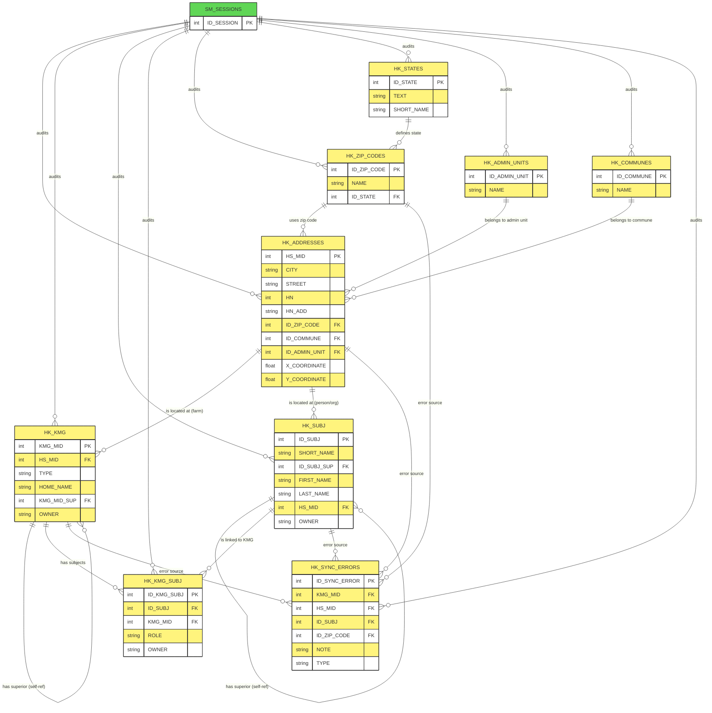

---

### Part 1: Complete ER Diagram (Mermaid)

This diagram represents the exact entities and relationships shown on Page 1 of the PDF. I have grouped them geographically (addresses, communes, states) and functionally (farm holdings/KMG, subjects, and roles). I included the green `SM_SESSIONS` table as it acts as the central audit/session link.

---

### Part 2: Detailed Database Table Data (Textual Extraction)

Below is the comprehensive list of the **9 specific HK module tables** (plus a reference to the imported `SM_SESSIONS` table) defined in the Oracle Designer report.

#### 1. `HK_ADDRESSES` (Physical Addresses)

* **PK:** `HS_MID`
* **Columns:** `CITY` (varchar2 30), `STREET` (varchar2 50), `HN` (number 4, house number), `HN_ADD` (varchar2 1, house number suffix, e.g., 'a'), `ID_ZIP_CODE` (FK), `ID_COMMUNE` (FK), `ID_ADMIN_UNIT` (FK), `X_COORDINATE`, `Y_COORDINATE`, `Z_COORDINATE` (number 10,3 for geospatial data), `D_INSERT`, `ID_INSERTER`, `ACTIVITY`, `VALID_TO`, `ID_SESSION` (FK), `OWNER` (varchar2 5, e.g. 'SIR' or 'RKG').
* **FKs:** `ID_ZIP_CODE` → `HK_ZIP_CODES.ID_ZIP_CODE`, `ID_COMMUNE` → `HK_COMMUNES.ID_COMMUNE`, `ID_ADMIN_UNIT` → `HK_ADMIN_UNITS.ID_ADMIN_UNIT`, `ID_SESSION` → `SM_SESSIONS.ID_SESSION`.

#### 2. `HK_ADMIN_UNITS` (Administrative Units)

* **PK:** `ID_ADMIN_UNIT`
* **Columns:** `NAME` (varchar2 50), `AU_ID` (number 10), `OWNER`, `D_INSERT`, `ID_INSERTER`, `ACTIVITY`, `VALID_TO`, `ID_SESSION` (FK).
* **FK:** `ID_SESSION` → `SM_SESSIONS.ID_SESSION`.

#### 3. `HK_COMMUNES` (Municipalities/Communes)

* **PK:** `ID_COMMUNE`
* **Columns:** `NAME` (varchar2 50), `OWNER`, `D_INSERT`, `ID_INSERTER`, `ACTIVITY`, `VALID_TO`, `ID_SESSION` (FK).
* **FK:** `ID_SESSION` → `SM_SESSIONS.ID_SESSION`.

#### 4. `HK_KMG` (Farms/Holdings)

* **PK:** `KMG_MID`
* **Columns:** `HS_MID` (FK, link to address), `TYPE` (varchar2 10, farm type), `HOME_NAME` (varchar2 50), `KMG_MID_SUP` (FK, self-reference for superior farm), `D_INSERT`, `ID_INSERTER`, `ACTIVITY`, `VALID_TO`, `ID_SESSION` (FK), `OWNER`.
* **FKs:** `HS_MID` → `HK_ADDRESSES.HS_MID`, `KMG_MID_SUP` → `HK_KMG.KMG_MID`, `ID_SESSION` → `SM_SESSIONS.ID_SESSION`.

#### 5. `HK_KMG_SUBJ` (Farm/Subject Relationship - Roles)

* **PK:** `ID_KMG_SUBJ`
* **Columns:** `ID_SUBJ` (FK), `KMG_MID` (FK), `ROLE` (varchar2 30), `D_INSERT`, `ID_INSERTER`, `ACTIVITY`, `VALID_TO`, `ID_SESSION` (FK), `OWNER`.
* **FKs:** `ID_SUBJ` → `HK_SUBJ.ID_SUBJ`, `KMG_MID` → `HK_KMG.KMG_MID`, `ID_SESSION` → `SM_SESSIONS.ID_SESSION`.

#### 6. `HK_STATES` (Countries / States)

* **PK:** `ID_STATE`
* **Unique Key:** `SHORT_NAME` (varchar2 3)
* **Columns:** `TEXT` (varchar2 50, full name), `SHORT_NAME` (varchar2 3), `D_INSERT`, `ID_INSERTER`, `ACTIVITY`, `VALID_TO`, `ID_SESSION` (FK).
* **FK:** `ID_SESSION` → `SM_SESSIONS.ID_SESSION`.

#### 7. `HK_SUBJ` (Subjects - People/Organizations)

* **PK:** `ID_SUBJ`
* **Columns:** `SHORT_NAME` (varchar2 50), `SHORT_NAME_1` (alternate language name), `ID_SUBJ_SUP` (FK, self-reference for superior subject), `FIRST_NAME`, `FIRST_NAME_1`, `LAST_NAME`, `LAST_NAME_1`, `HS_MID` (FK, link to address), `VAT_NO` (number 10), `PHONE_NO`, `D_INSERT`, `ID_INSERTER`, `ACTIVITY`, `VALID_TO`, `ID_SESSION` (FK), `OWNER`.
* **FKs:** `HS_MID` → `HK_ADDRESSES.HS_MID`, `ID_SUBJ_SUP` → `HK_SUBJ.ID_SUBJ`, `ID_SESSION` → `SM_SESSIONS.ID_SESSION`.

#### 8. `HK_SYNC_ERRORS` (Synchronization Error Log)

* **PK:** `ID_SYNC_ERROR`
* **Columns:** `KMG_MID` (FK), `HS_MID` (FK), `ID_SUBJ` (FK), `ID_ZIP_CODE` (FK), `JN_ID` (number), `NOTE` (varchar2 4000), `TYPE` (varchar2 128), `D_INSERT`, `ID_INSERTER`, `ACTIVITY`, `VALID_TO`, `ID_SESSION` (FK).
* **FKs:** `ID_SESSION` → `SM_SESSIONS.ID_SESSION`. (All other FK columns are optional and serve as contextual identifiers for the error).

#### 9. `HK_ZIP_CODES` (ZIP / Postal Codes)

* **PK:** `ID_ZIP_CODE`
* **Columns:** `NAME` (varchar2 50), `ID_STATE` (FK), `OWNER`, `D_INSERT`, `ID_INSERTER`, `ACTIVITY`, `VALID_TO`, `ID_SESSION` (FK).
* **FKs:** `ID_STATE` → `HK_STATES.ID_STATE`, `ID_SESSION` → `SM_SESSIONS.ID_SESSION`.

#### 10. `SM_SESSIONS` (Imported System Session Table)

* (This table is directly imported from the `SM` module, as seen in the previous PDF. It serves as the central auditing FK for all HK tables).
* **PK:** `ID_SESSION`
* **FK (from HK tables):** `ID_SESSION` → `SM_SESSIONS.ID_SESSION`.

---

### Part 3: Structural Business/Data Rules (Derived from Schema)

The `HK.PDF` schema defines several specific data governance and structural business rules for managing farms and keepers:

1. **Centralized Address Registry:** Instead of duplicating address data across farms and subjects, the system uses a centralized `HK_ADDRESSES` table (keyed by `HS_MID`). Both farms (`HK_KMG`) and subjects (`HK_SUBJ`) point to this single address record. This enforces data consistency for geographic locations.
2. **Hierarchical Farm Structure:** The `HK_KMG` table includes a self-referential foreign key (`KMG_MID_SUP`). This allows the system to model farm hierarchies (e.g., a main farm with multiple sub-farms, or organizational structures under a single holding).
3. **Hierarchical Subject Structure:** The `HK_SUBJ` table includes a self-referential foreign key (`ID_SUBJ_SUP`). This supports parent/child relationships for organizations, allowing the tracking of a main company and its subsidiaries, or a head of household and their dependents.
4. **Many-to-Many Role-Based Linking:** Instead of embedding a simple "Owner ID" inside the farm table, the schema uses a dedicated bridge table: `HK_KMG_SUBJ`. This allows a **single farm (`KMG_MID`)** to have multiple people/organizations (`ID_SUBJ`) with specific, definable **`ROLES`** (e.g., owner, manager, veterinarian, accountant). It also allows one person to have roles in multiple farms.
5. **Geospatial Mapping Support:** The `HK_ADDRESSES` table explicitly includes columns for `X_COORDINATE`, `Y_COORDINATE`, and `Z_COORDINATE` (Number 10,3). This indicates the system is architected to support physical map integration and precise geolocation of farms and addresses.
6. **Multi-Source Data Ownership (`OWNER` column):** Most tables include an `OWNER` column (Varchar2 5). The comments explicitly state this tracks whether the record originated from **`SIR`** (the system itself) or **`RKG`** (an external registry or legacy system). This allows the system to merge data from multiple authoritative sources without collisions.
7. **Synchronization Error Handling:** The `HK_SYNC_ERRORS` table acts as a dedicated dead-letter queue/error log. If data fails to sync between the PDA and central database (as seen in earlier functional specs), errors are recorded here. It holds optional FKs to `KMG_MID`, `HS_MID`, `ID_SUBJ`, and `ID_ZIP_CODE`, allowing the central system to pinpoint exactly which record failed synchronization based on the `TYPE` and error `NOTE`.
8. **Strict Audit Trail Integration:** As with the SM module, every single table here is audited. The `ID_SESSION` foreign key is mandatory (`NOT NULL`) on every table, enforcing traceability from the user login and module access (`SM_SESSIONS`) down to every address change, farm creation, or role assignment.
