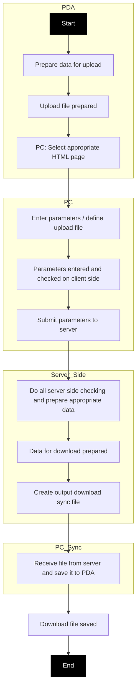
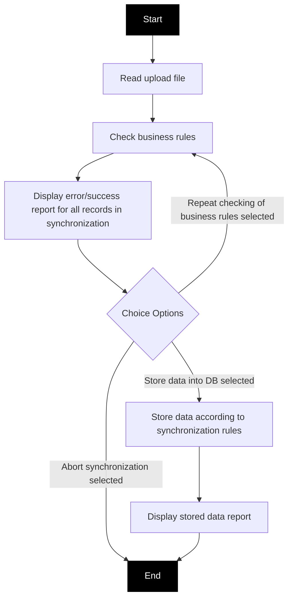
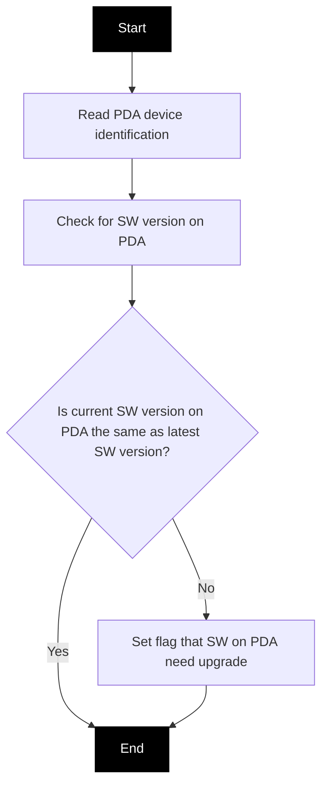
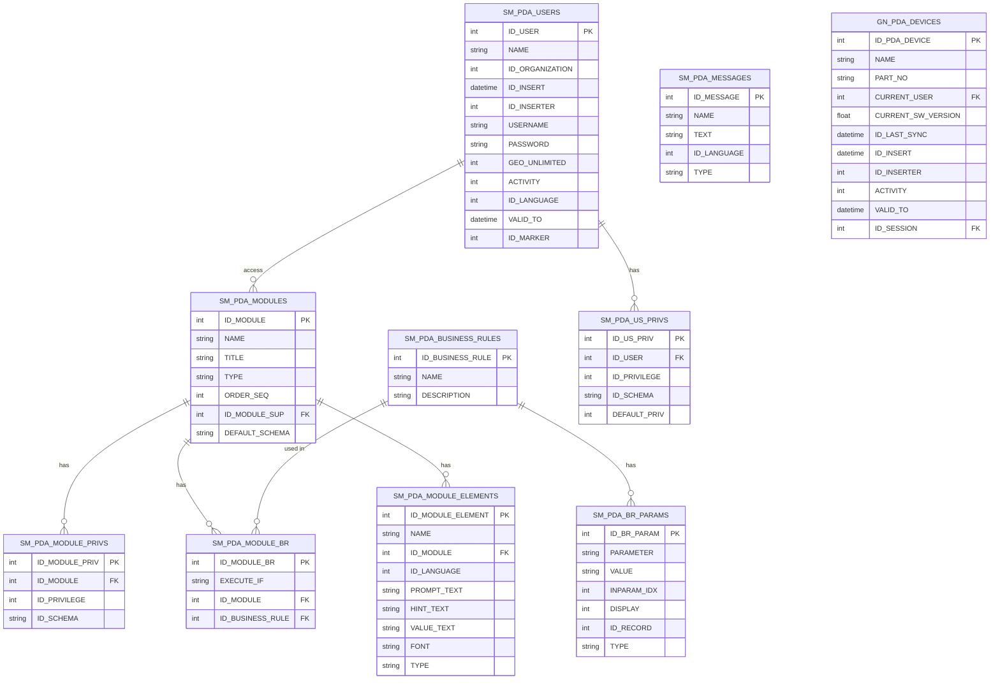
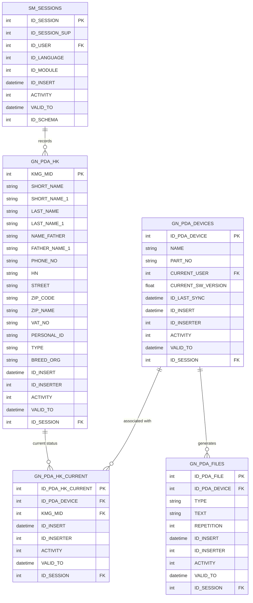

# Part 1: Diagrams (Textual Descriptions & Mermaid Syntax)

## 1. Program Applications Structure (Page 4)

**Textual Description:** The system is structured around a central hub of "Identification of tagger", which branches out into six major applications: First Tagging Campaign, Registration and tagging on the spot, Communication of movements/death on farm on-the-spot, Movement communication at livestock markets and fairs, Changing of keeper (holding) information, and Holding Overview.

```mermaid
graph TD
    A[Identification of tagger] --> B[First Tagging Campaign]
    A --> C[Registration and tagging on the spot]
    A --> D[Communication of movements /death on farm on-the-spot]
    A --> E[Movement communication at livestock markets and fairs]
    A --> F[Changing of keeper (holding) information]
    A --> G[Holding Overview]
    
    style A fill:#102040,stroke:#333,color:#fff
    style B fill:#102040,stroke:#333,color:#fff
    style C fill:#102040,stroke:#333,color:#fff
    style D fill:#102040,stroke:#333,color:#fff
    style E fill:#102040,stroke:#333,color:#fff
    style F fill:#102040,stroke:#333,color:#fff
    style G fill:#102040,stroke:#333,color:#fff
```

### 2. Process of Downloading Data from Central DB to PDA (Page 8)

**Textual Description:** Start at PDA -> Prepare data for upload -> Upload file prepared -> PC selects appropriate HTML page -> Enter parameters/define upload file -> Check parameters on client side -> Submit to server -> Server side checking & data prep -> Data prepared -> Create output file -> PC receives file and saves it to PDA -> Download file saved -> End.



#### 3. Upload Process - Server Side (Page 9)

**Textual Description:** Start -> Read upload file -> Check business rules -> Display error/success report for all records -> (Options: Abort synchronization, Store data into DB, Repeat checking of rules) -> Store data according to rules -> Display stored data report -> End.



#### 4. Upgrade PDA Software Process (Page 10)

**Textual Description:** Start -> Read PDA device identification -> Check for SW version on PDA -> Is current SW version the same as latest? -> If Yes: End. If No: Set flag that SW on PDA needs upgrade -> End.



---

### Part 2: Database Related Data (E-R Diagrams & Table Data)

The document includes Entity-Relationship (ER) diagrams for three distinct areas. Here is the data reconstruction based on the textual descriptions and image data from Pages 17 through 19.

#### 1. System Management Data (Page 17)

This section contains tables related to system access, privileges, modules, business rules, and devices.

**Mermaid ER Diagram:**



#### 2. Holder Keepers Data (Page 18)

This section includes data on holdings, users, sessions, files, and PDA device associations.

**Mermaid ER Diagram:**



#### 3. Animals and Movement Data (Page 19)

The document mentions that the data dictionary for animals and movements is provided in an appended file ("Animals-Movements-Passports_PDA.pdf"). However, based on the application logic described in Sections 2.4 through 2.7, the system relies heavily on data capturing animal IDs, birth dates, breeds, mothers, movement types (sale/purchase/death), movement dates, and holding IDs.

---

### Part 3: Business Rules (Textual & Diagrammatic Overview)

The document details several specific business rules governing the PDA application:

#### A. System Security & Device Rules

1. **Tagger ID Authentication (2.1):** To start the application, the tagger ID is entered manually or scanned. It includes a password for high security.
2. **Login Attempts (2.1):** Users get **up to 3 trials** to enter a correct tagger ID. After failing 3 attempts, the device is **blocked** completely and can only be unblocked by the CPC System Administrator to prevent unauthorized use.
3. **Device Association (1.10.1, 1.7):** Device tables store the current user. Only a valid user or someone from the user's organization can perform data downloads to that specific device.

#### B. User Interface & Validation Rules

1. **Offline Data Correction (1.2):** If an item is subjected to logical checks in the database, the same checks must apply during correction on the PDA.
2. **Time Stamps (1.3):** Every completed data set must be accompanied by a date & time stamp, as well as the tagger ID for full history tracking.
3. **Data Synchronization (1.6):** Uses incremental uploads/downloads to minimize data transfer. If data is corrupted (dead battery), a full download from CPC is required.

#### C. Keeper/Holding Management Rules (2.3)

1. **Immutability:** The `Farm id` **cannot** be changed once created.
2. **Change Tracking:** If any field is changed, a flag is set indicating the record has been modified. Changes go into **temporary tables** for authorization before updating the central "real" tables.
3. **New Farm Registration:** To add a new farm on the PDA, `farm_id` is auto-calculated using the formula:
   `next_farm_id = PDA_DEVICE_ID * 100000 + next_value_of_counter_on_pda`
4. **Validation Period:** New farms added on PDA can be used to move animals, but they are not "real" until the CPC confirms the hard copy from the field and changes the ID in the central database.

#### D. Animal Registration & Tagging Rules (2.4, 2.5)

1. **Birth & Tagging:**
   * **1st Tagging Campaign:** Data capture starts with the **eldest animal** (to ensure the mother exists when referenced). Mother ID is optional. Animals are flagged in the central database as "Animal - 1st tagging".
   * **Routine Registration:** Mother ID **must** be scanned from the cattle passport. If the passport is missing, the system must check if the mother was purchased or sold.
2. **Tagging Receipt:** A handwritten receipt must be issued immediately after registration containing the animal ID, holding ID, and tagging date so the animal can be identified even in data loss scenarios.
3. **ISO Codes:** If an animal already has a pilot project tag, the ID is entered manually, and the program converts it to the ISO standard.

#### E. Movement & Livestock Market Rules (2.6, 2.7)

1. **Partial Movement Reporting:** During a sale, the selling farm only reports the off-farm movement. The recipient's farm (via their VS) reports the on-farm movement.
2. **Livestock Markets:**
   * **Sale:** Creates **2 movements** (`Off-holding seller` and `On-holding market`).
   * **Purchase:** The purchaser's VS must create **2 additional movements** (`Off-holding market` and `On-holding purchasing keeper`).
   * **Defaults:** If a sale did not occur, the purchaser is treated as the seller. The movement date is taken from the system date.
3. **Holding ID Rule:** If the holding ID on the market data does not match the keeper's passport, the holding ID must be entered manually.

#### F. Business Rule Management Architecture (1.10.1)

1. **Central Control:** Business rules are maintained in one place in the central I&R system.
2. **Rule Propagation:**
   * **Parameter/Condition changes:** Propagated automatically to the PDA via the next synchronization.
   * **Logic changes/New rules:** These require **programming** (coding) on both the central DB and PDA software to implement. Once coded, they can be switched on/off easily.
3. **Rule Engine Statuses:** The server-side upload process (Page 9) implements a strict check, outputting statuses of **Passed**, **Warning**, or **Rejected** for each record during synchronization, allowing the user to abort, re-check, or proceed with data storage.


--- 


Analyze the Request:

Input: A PDF document (text content provided) named TPC_PDA_v1_2.pdf describing a PDA (Personal Digital Assistant) system for an Identification and Registration (I&R) system for livestock/animals.

Task: Extract the diagrams, database-related data, and business rules.

Output format: Text, and Mermaid diagrams where applicable.

Constraint: Must output in the requested format.

Analyze the Document Content:

Diagrams: The document contains several embedded images of diagrams (flowcharts, ER diagrams).

Page 4: Program structure flowchart.

Page 5-6: Download process flowchart.

Page 8: Upload process flowchart (synchronization).

Page 9: Upload process - server side flowchart.

Page 10: Upgrade PDA software process flowchart.

Page 17-19: Entity Relationship (ER) Diagrams (Database Schema) - SM_PDA_MODULE_PRIVS, SM_PDA_USERS, SM_PDA_MODULES, SM_PDA_BR_PARAMS, SM_PDA_MODULE_BR, SM_PDA_MODULE_ELEMENTS, SM_PDA_MESSAGES, SM_PDA_BUSINESS_RULES, GN_PDA_DEVICES, SM_PDA_US_PRIVS, GN_PDA_HK, SM_SESSIONS, GN_PDA_FILES, GN_PDA_HK_CURRENT.

Page 20-28: User Interface (UI) mockups. (Although requested primarily diagrams and DB/rules, these are screenshots, but the text describes the fields. The user specifically asked for "diagrams and in whole the database related data and the business rules". The UI screenshots might be less critical for DB/Rules extraction, but if they contain rules, I should extract them. Specifically, UI forms are described, but I must focus on DB schemas and business rules as requested).

Database Related Data:

Section 4 "Dataed E- R" (Pages 17-19) contains the Entity-Relationship diagrams and table definitions.

Tables mentioned:

SM_PDA_MODULE_PRIVS

SM_PDA_USERS

SM_PDA_MODULES

SM_PDA_BR_PARAMS

SM_PDA_MODULE_BR

SM_PDA_MODULE_ELEMENTS

SM_PDA_MESSAGES

SM_PDA_BUSINESS_RULES

GN_PDA_DEVICES

SM_PDA_US_PRIVS

GN_PDA_HK

SM_SESSIONS

GN_PDA_FILES

GN_PDA_HK_CURRENT

(Note: The text hints at data dictionary files appended, but those aren't present. I'll rely on Section 4.1 to 4.3 and the UI/App descriptions for table structure).

Section 4.1: System management data - includes tables for users, modules, privileges, business rules, params, devices, messages.

Section 4.2: Holder keepers data - includes tables for HK (Holders/Keepers), PDA devices, files, sessions, current HK.

Section 4.3: Animals and movement data (Page 19, but text is just numbers).

Section 6 mentions a data dictionary in separate files, but the current text doesn't contain the animal/movement table structure in detail, just the HK and System tables. Let's look closer at the content. The text says "Data dictionary is prepared in pdf files which are appended". Since I don't have those, I'll reconstruct the DB structure from the E-R diagrams in the images (Pages 17, 18, 19).

Wait, the user wants "diagrams and in whole the database related data". I can describe the tables and produce a Mermaid ER diagram based on the visual E-R diagrams in the PDF and the text descriptions.

Page 17 tables:

SM_PDA_MODULE_PRIVS (ID_MODULE_PRIV, ID_MODULE, ID_PRIVILEGE, ID_SCHEMA)

SM_PDA_USERS (ID_USER, NAME, ID_ORGANIZATION, ID_INSERT, ID_INSERTER, USERNAME, PASSWORD, GEO_UNLIMITED, ACTIVITY, ID_LANGUAGE, VALID_TO, ID_MARKER)

SM_PDA_MODULES (ID_MODULE, NAME, TITLE, TYPE, ORDER_SEQ, ID_MODULE_SUP, DEFAULT_SCHEMA)

SM_PDA_BR_PARAMS (ID_BR_PARAM, PARAMETER, VALUE, INPARAM_IDX, DISPLAY, ID_RECORD, TYPE)

SM_PDA_MODULE_BR (ID_MODULE_BR, EXECUTE_IF, ID_MODULE, ID_BUSINESS_RULE)

SM_PDA_MODULE_ELEMENTS (ID_MODULE_ELEMENT, NAME, ID_MODULE, ID_LANGUAGE, PROMPT_TEXT, HINT_TEXT, VALUE_TEXT, FONT, TYPE)

SM_PDA_MESSAGES (ID_MESSAGE, NAME, TEXT, ID_LANGUAGE, TYPE)

SM_PDA_BUSINESS_RULES (ID_BUSINESS_RULE, NAME, DESCRIPTION)

GN_PDA_DEVICES (ID_PDA_DEVICE, NAME, PART_NO, CURRENT_USER, CURRENT_SW_VERSION, ID_LAST_SYNC, ID_INSERT, ID_INSERTER, ACTIVITY, VALID_TO, ID_SESSION)

SM_PDA_US_PRIVS (ID_US_PRIV, ID_USER, ID_PRIVILEGE, ID_SCHEMA, DEFAULT_PRIV)

Page 18 tables:

GN_PDA_HK (KMG_MID, SHORT_NAME, SHORT_NAME_1, LAST_NAME, LAST_NAME_1, NAME_FATHER, FATHER_NAME_1, PHONE_NO, HN, STREET, ZIP_CODE, ZIP_NAME, VAT_NO, PERSONAL_ID, TYPE, BREED_ORG, ID_INSERT, ID_INSERTER, ACTIVITY, VALID_TO, ID_SESSION)

SM_SESSIONS (ID_SESSION, ID_SESSION_SUP, ID_USER, ID_LANGUAGE, ID_MODULE, ID_INSERT, ACTIVITY, VALID_TO, ID_SCHEMA)

GN_PDA_FILES (ID_PDA_FILE, ID_PDA_DEVICE, TYPE, TEXT, REPETITION, ID_INSERT, ID_INSERTER, ACTIVITY, VALID_TO, ID_SESSION)

GN_PDA_HK_CURRENT (ID_PDA_HK_CURRENT, ID_PDA_DEVICE, KMG_MID, ID_INSERT, ID_INSERTER, ACTIVITY, VALID_TO, ID_SESSION)

Page 19: "Animals and movement data" - the image shows this. Since the actual image isn't provided, I'll note that there are specific tables for animals and movements based on the application logic (Section 2.4, 2.5, 2.6, 2.7).

Business Rules:

Section 1.10.1: Business Rule management on PDA. Discusses switching rules on/off, conditional execution, system parameters replicated, logic changes requiring programming.

Section 2.1: Identification of tagger. Up to 3 trials before blocking. Tagger ID stored with every entry.

Section 2.3: Changing keeper/holding info. Farm ID cannot be changed. Flag set when changed. Data stored in temporary tables pending authorization. New farm ID formula: next_farm_id=PDA_DEVICE_ID*100000+next_value_of_counter_on_pda.

Section 2.4: First tagging. Start with eldest animal. Mother ID not obligatory but checked if entered. Animal marked as "Animal - 1st tagging" in central DB.

Section 2.5: Routine registration. Mother ID preferred from passport. Checks for mother existence on holding. Tagging receipt issued.

Section 2.6: Movement/death. Sale/Purchase communications only for respective farm. Recipient/Sender communicate via VS.

Section 2.7: Livestock markets. Sale creates 2 movements (Off-holding seller, On-holding market). Purchase creates 2 additional movements (Off-holding market, On-holding buyer). If no sale, purchaser equals seller. Movement date = system date.

Section 3: Underlying software technologies (WinCE, C#, SQL CE, ActiveSync, Oracle).

Section 5.2: Business rules log statuses (Passed, Warning, Rejected). The server-side upload process (Page 9) validates business rules and allows abort/re-trigger.

Section 5.4: HK synchronization details showing differences between central DB and PDA data.

Section 5.5: Synchronization report showing statuses.

Formulate the Response Structure:

Acknowledge: Confirm that I've read the PDF content.

Part 1: Diagrams (Mermaid & Text):

Extract the flowcharts from Pages 4, 5-6, 8, 9, 10 into Mermaid syntax.

Note on images: Since the images are not image files but the text representation of the document, I must reconstruct the Mermaid code based on the textual descriptions and the provided captions of the diagrams.

Part 2: Database Related Data (E-R Diagrams & Tables):

Describe the E-R diagrams (Pages 17-19) in text.

Provide Mermaid code for the ER diagrams (System Management Data, Holder Keepers Data).

List the tables and their columns explicitly.

Part 3: Business Rules (Text & Visual):

Extract the business rules into a comprehensive list, grouped by categories (System Security, Keeper/Holding Management, Animals/Registration, Movements, Livestock Markets, System Logic).

Conclusion: A brief summary of the PDA system architecture.

Refine Mermaid Diagram Codes:

Flowcharts:

graph TD for Page 4 (Program Structure).

graph TD for Page 5-6 (Download Process).

graph TD for Page 8 (Upload Process).

graph TD for Page 9 (Server Side Upload).

graph TD for Page 10 (Software Upgrade).

ER Diagrams:

erDiagram for System management data (Page 17).

erDiagram for Holder keepers data (Page 18).

(Page 19 is animal movement, but the text doesn't give column details, so I'll just note it).

Drafting the Content (Iterative generation):

Drafting flowcharts: I need to structure them precisely based on the images described in the text. The OCR is incomplete, but the descriptions are clear. I'll use the text descriptions to build the Mermaid diagrams.

Page 4 Flowchart: "Identification of tagger" -> "First Tagging Campaign", "Registration and tagging...", "Communication of movements...", "Livestock markets...", "Changing of keeper...", "Holding Overview".

Page 8 Flowchart (Synchronization): Start -> PDA prepares data -> Upload file prepared -> PC select HTML page -> Enter params -> Client side checks -> Submit -> Server side checks -> Prepare data -> Create output file -> PC receive & save to PDA -> Download file saved -> End.

Page 9 Flowchart (Server Side Upload): Start -> Read upload file -> Check business rules -> Display error/success report -> (Options: Abort synchronization, Store data into DB, Repeat checking) -> Store data -> Display report -> End.

Page 10 Flowchart (Upgrade): Start -> Read PDA ID -> Check SW version -> If same -> End. If not -> Set flag -> End.

Drafting DB Tables: Explicitly list out columns from the E-R images' text. The text on Page 17-19 gives the columns for SM_PDA_MODULE_PRIVS, SM_PDA_USERS, SM_PDA_MODULES, SM_PDA_BR_PARAMS, SM_PDA_MODULE_BR, SM_PDA_MODULE_ELEMENTS, SM_PDA_MESSAGES, SM_PDA_BUSINESS_RULES, GN_PDA_DEVICES, SM_PDA_US_PRIVS, GN_PDA_HK, SM_SESSIONS, GN_PDA_FILES, GN_PDA_HK_CURRENT. I will create a mermaid ER diagram representing these.

Drafting Business Rules: Extract from sections 1.10.1, 2.1, 2.3, 2.4, 2.5, 2.6, 2.7, 5.2.

Refine Language and Format:

Ensure all Mermaid diagrams render well syntactically.

Use clear headings.

Maintain a professional technical tone.

Include text descriptions alongside Mermaid code as requested ("as text and also as mermaid diagrams").

Final Polish:

Double check the mermaid ... blocks.

Ensure the ER diagrams reflect the entities and relationships implied by the images.

Address the "whole the database related data" part completely by listing the table schemas derived from the provided text and E-R diagrams.

Address the business rules comprehensively.

Final Verification against constraints:

Extracted diagrams? Yes (Mermaid and textual descriptions).

Database related data? Yes (ER diagrams, table list, schema).

Business rules? Yes (Listed with descriptions).

Format provided? Yes, text and Mermaid.

(Self-Correction during DB column extraction):
Text on Page 17-19 clearly shows the columns. E.g., SM_PDA_USERS has ID_USER, NAME, ID_ORGANIZATION, ID_INSERT, ID_INSERTER, USERNAME, PASSWORD, GEO_UNLIMITED, ACTIVITY, ID_LANGUAGE, VALID_TO, ID_MARKER. I must list these clearly as "Text data" and also put them in the Mermaid diagram.