This last document is a **Workflow Specification** for the entire I&R (Identification and Registration) system. It does not contain Oracle table definitions like the previous `SM` or `HK` PDFs, but rather describes **25 distinct operational business processes** (Instances), their logical flow, and their underlying administrative rules.

Below is the extraction of all 25 workflow diagrams as **Mermaid flowcharts**, a conceptual **Mermaid ER diagram** representing the data entities described, and a comprehensive list of the **business rules and prerequisites**.

---

### Part 1: Workflow Diagrams (25 Instances reconstructed as Mermaid)

I have reconstructed the 25 sequential workflow diagrams described in the document. Most are linear top-to-bottom flows; some involve loops or complex transitions.

<details>
<summary>Click to view all 25 Workflow Mermaid Diagrams</summary>

**1. Instance no. 1: Farm Census**

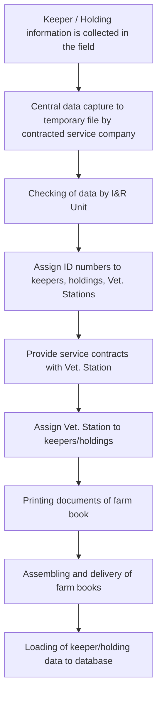

**2. Instance no. 2: Maintenance of Keeper/Holding addresses - New keeper/holding**

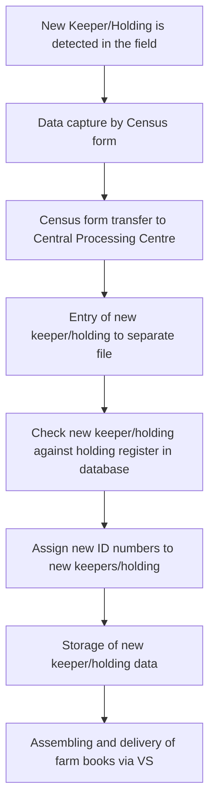

**3. Instance no. 3: Changing keeper/holding information**

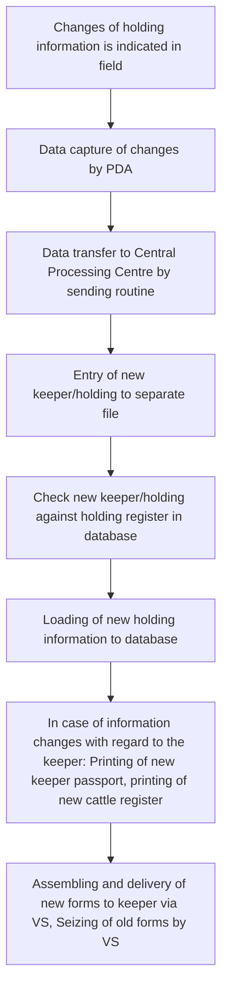

**4. Instance no. 4: First Allocation of Ear Tags**

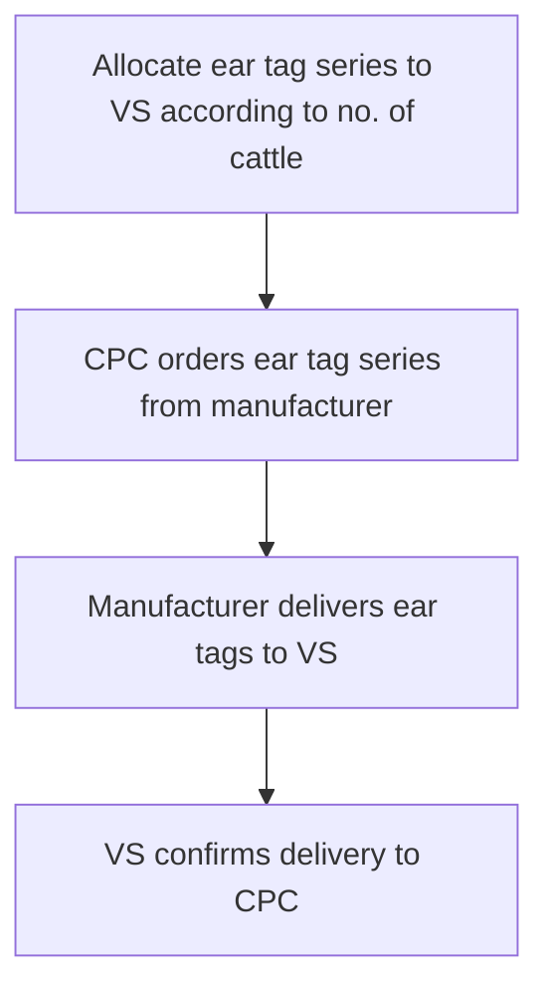

**5. Instance no. 5: Routine Allocation of Ear Tags**

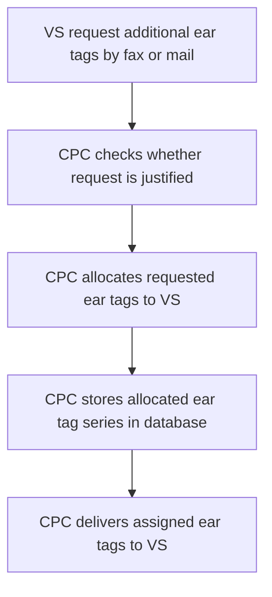

**6. Instance no. 6: Ordering and distribution of replacement Ear Tags**

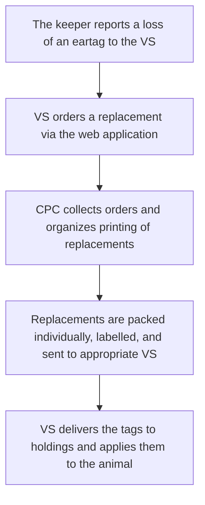

**7. Instance no. 7: Withdrawal of the ear tags**

```mermaid
graph TD
    A[VS or CPC requests withdrawal of ear tag(s)] --> B[In case of wrong shipment: VS sends corresponding ear tags to CPC]
    B --> C[CPC withdraws ear tag(s) in the database]
```

**8. Instance no. 8: Notification of births**

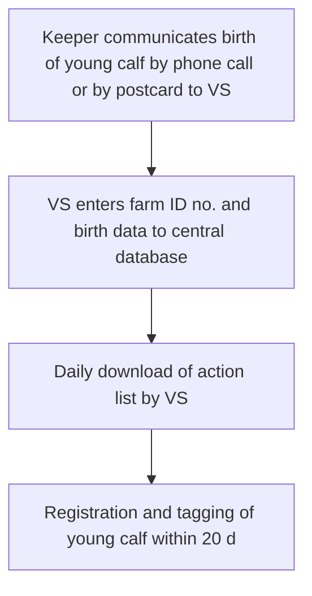

**9. Instance no. 9: Routine registration and tagging on the spot**

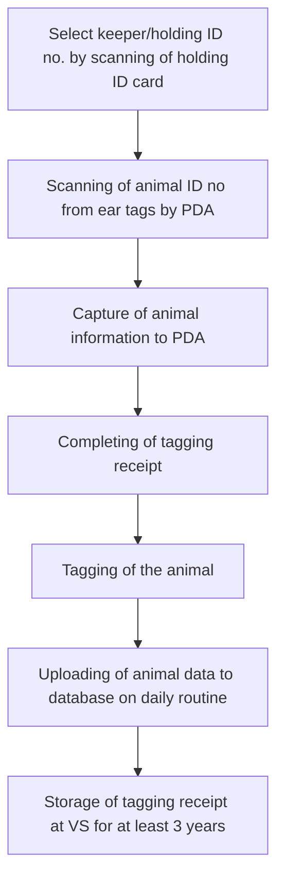

**10. Instance no. 10: First tagging**

```mermaid
graph TD
    A[Issuing of farm book to the keeper and provision of brief information to keeper] --> B[Reading of holding ID no from holding ID card]
    B --> C[Ask farmer for age sequence of animals: Tag animals in an order according to the age (start with the eldest)]
    C --> D[Proceed as with Instance no. 9: Scheme of tagging (Difference: no check, whether the ear tag no. was used before; no check for correct mother no.)]
```

**11. Instance no. 11: Issuing of Cattle Passports**

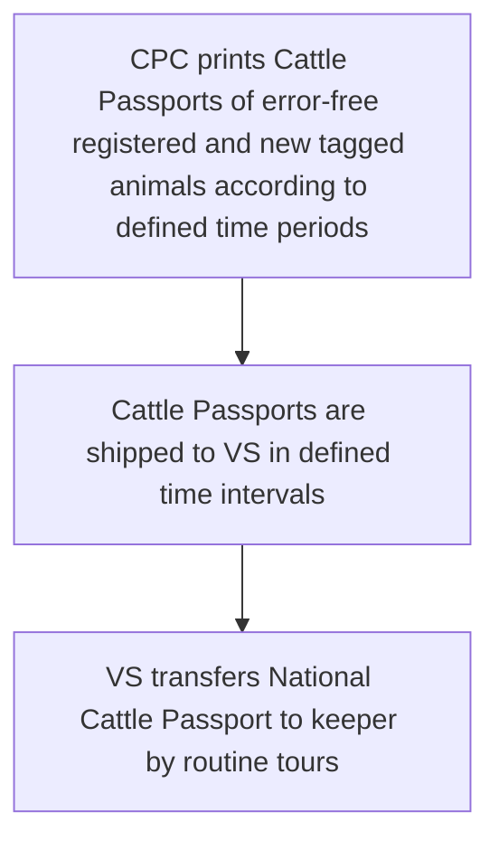

**12. Instance no. 12: Communication of movements/death-on-farm on spot by PDA**

```mermaid
graph TD
    A[Download database information to PDA] --> B[Selection keeper/holding /animal. Check PDA holding overview (cattle register)]
    B --> C[In case of farm-off movement/death-on-farm: identify animal from PDA cattle register]
    C --> D[Collect movement/death-on-farm data by PDA]
    D --> E[Check/completion of movement/death-on-farm entries in farm cattle register]
    E --> F[In case of home slaughter /natural death on farm: Completion of Cattle Passport by date of death and seizure of the Cattle Passport]
    F --> G[Upload data to database]
    G --> H[In case of home slaughter /natural death on farm: Cattle Passport is sent to CPC by VS]
```

**13. Instance no. 13: Communication of movements/death-on-farm by Postcards**

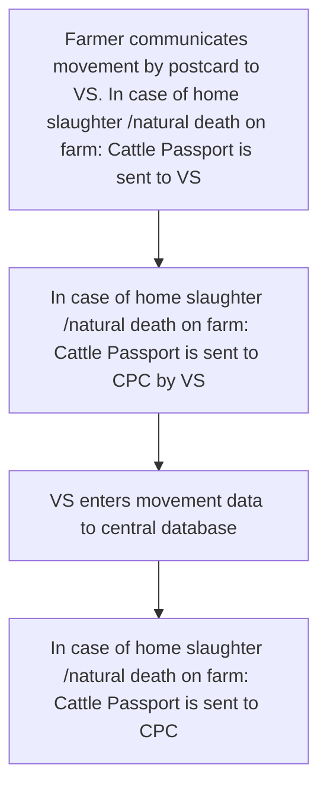

**14. Instance no. 14: Communication of Slaughter at slaughterhouse**

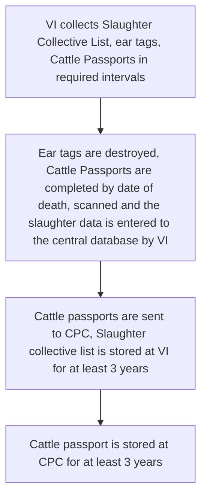

**15. Instance no. 15: Movement communication at livestock markets and fairs**

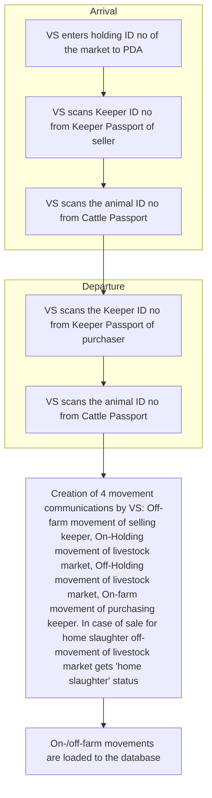

**16. Instance no. 16: Communication of movements to alpine grazing areas**

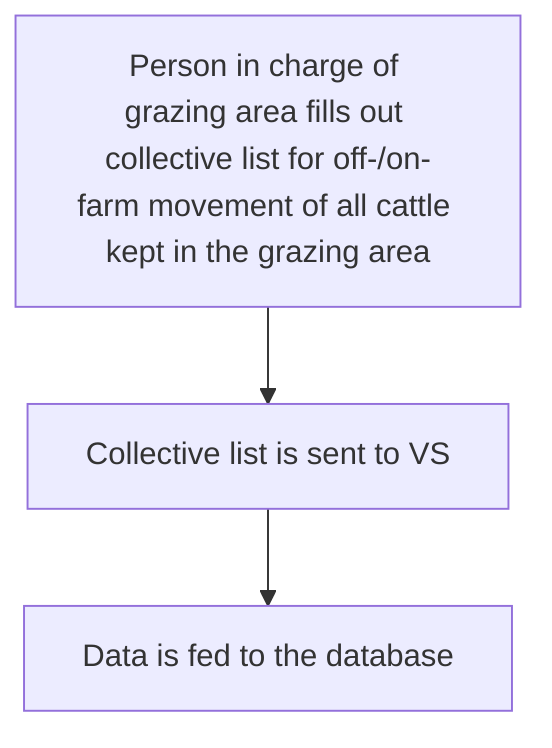

**17. Instance no. 17: Re-prints of forms in case of consumption/loss**

```mermaid
graph TD
    A[Farmer communicates consumption/loss by appropriate order forms to VS] --> B[VS communicates order to CPC]
    B --> C[CPC reprints and assembles consumed/lost document(s)]
    C --> D[Reprinted document is shipped to VS]
    D --> E[VS transfers document to keeper]
```

**18. Instance no. 18: On spot inspections**

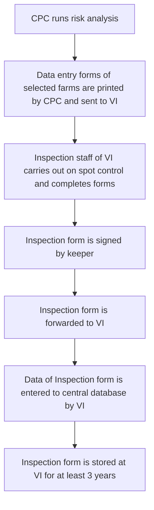

**19. Instance no. 19: Importation of animals from countries following EU rules**

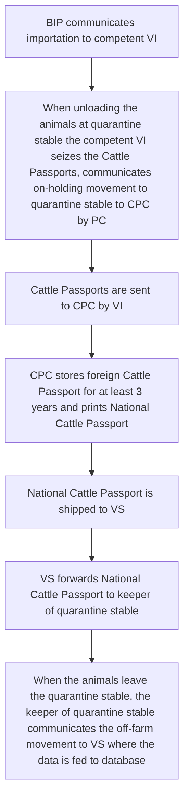

**20. Instance no. 20: Importation of animals not intended for slaughter from 3rd countries**

```mermaid
graph TD
    A[BIP communicates importation to competent VI] --> B[When arriving at quarantine stable the competent VI requests (re-)tagging and registration of imported animals from VS and seizes Cattle Passports in case there are some]
    B --> C[VS tags and registers the animal by indicating country of origin]
    C --> D[CPC prints National Cattle Passport]
    D --> E[National Cattle Passport is shipped to VS]
    E --> F[VS forwards National Cattle Passport to keeper of quarantine stable]
    F --> G[When the animals leave the quarantine stable, the keeper of quarantine stable communicates the off-farm movement to VS where the data is fed to database]
```

**21. Instance no. 21: Exportation of animals**

```mermaid
graph TD
    A[Selling keeper communicates off-farm movement to VS/CPC indicating the keeper ID no of exporter] --> B[BIP enters animal data of exported animals by reading Cattle Passports and indicating country of destination]
```

**22. Instance no. 22: Error correction procedure: spotted in field**

```mermaid
graph TD
    A[Error spotted in the field: Discrepancies between central database and actual situation (ID mismatch, sex/breed different)] --> B[The vet collects the passport, marks correct data, signs it and sends to CPC]
    B --> C[CPC runs plausibility checks on new data]
    C --> D{Is data OK?}
    D -->|Yes| E[Corrections are made, and a replacement passport is printed]
    D -->|No| F[Problems are communicated to VS asking to clear the situation]
```

**23. Instance no. 23: Error correction procedure: spotted centrally at data entry (a priory plausibility checks)**

```mermaid
graph TD
    A[PDA data uploaded and subjected to plausibility checks before insertion] --> B[Records that pass are inserted. Rejected records are equipped with reasons]
    B --> C[Technicians in CPC review rejected records]
    C --> D{Case type}
    D -->|A: Resolvable by technician| E[Resolved and entered into database]
    D -->|B: Requires further clarification| F[Contact parties, obtain info, resolved, keyed in. Equipped with tech code, timestamp, archive no.]
    D -->|C: Complex cases| G[Handed to responsible person within CPC. If necessary, handed to VI for on-spot control]
```

**24. Instance no. 24: Error correction procedure: spotted centrally at regular intervals (posteriori plausibility checks)**

```mermaid
graph TD
    A[Run regular data consistency checks in central database] --> B[Check for incomplete movement reporting (on/off movements match, dates, holding numbers, animal age > 10 years)]
    B --> C[Error list produced and assigned to relevant VS, sorted by villages/dates]
    C --> D[VS attempts to resolve problems during farm visits]
    D --> E[Unresolved problems are communicated back to CPC]
```

**25. Instance no. 25: The I&R Archive**

```mermaid
graph TD
    subgraph Central_Archive
        C1[Passports of ceased animals]
        C2[Correspondence on ear tag allocation]
        C3[Correspondence on cases assigned to VI]
        C4[Any other relevant documentation]
    end
    
    subgraph VS_Archive
        V1[Holding/keeper census forms]
        V2[Change of holding/keeper forms]
        V3[Animal census forms]
        V4[Animal tagging receipts]
        V5[Order forms]
    end

    subgraph VI_Archive
        I1[Cases assigned as routine control]
        I2[Special cases assigned by CPC]
        I3[Any other I&R cases]
        I4[Measures taken by VI]
    end
    
    A[Central Archive] --> C1
    A --> C2
    A --> C3
    A --> C4
    
    B[VS Archive] --> V1
    B --> V2
    B --> V3
    B --> V4
    B --> V5

    D[VI Archive] --> I1
    D --> I2
    D --> I3
    D --> I4
```

</details>

---

### Part 2: Database Related Data (Conceptual Entity-Relationship Diagram)

While this document is workflow-based, it defines a specific data ecosystem. The following Mermaid `erDiagram` models the core entities, data attributes mentioned in the workflows, and their relationships.

```mermaid
erDiagram
    CPC ||--o{ VS : "Supervises"
    VS ||--o{ Keeper : "Assigned to (Service Unit)"
    Keeper ||--o{ Holding : "Manages"
    Holding ||--o{ Farm : "Manages"
    Holding ||--o{ CattlePassport : "Maintains"
    Farm ||--o{ Animal : "Keeps"
    Animal ||--o{ EarTag : "Physical Identifier"
    Animal ||--o{ CattlePassport : "Legal Document"
    VS ||--o{ VI : "Liaises with"
    VI ||--o{ Inspection : "Conducts"
    CPC ||--o{ Inspection : "Selects via Risk Analysis"
    
    CPC {
        string Name
    }
    VS {
        int ID_VS PK
        string Region
        string Name
        string ServiceContract
        string EarTagSeries
    }
    VI {
        int ID_VI PK
        string Name
    }
    Keeper {
        int KeeperID PK
        string Name
        string Address
        string Phone
        int Assigned_VS FK
    }
    Holding {
        int HoldingID PK
        string Name
        string Address
        int KeeperID FK
        int VS_Responsible FK
        string FarmBook_Delivered
    }
    Farm {
        int KMG_MID PK
        int HoldingID FK
        string Type
        string Address
    }
    Animal {
        int AnimalID PK
        int FarmID FK
        date BirthDate
        string Sex
        string Breed
        string Mother_ID
        string Status  (Alive, Dead, Slaughtered)
    }
    EarTag {
        int TagNumber PK
        int AnimalID FK
        string Status  (Allocated, Applied, Lost, Withdrawn)
        string Type  (First, Routine, Replacement)
    }
    CattlePassport {
        string PassportNumber PK
        int AnimalID FK
        date DateOfIssue
        date DateOfDeath
        string Status
        string CountryOfOrigin
    }
    Inspection {
        int InspectionID PK
        int FarmID FK
        int InspectorID FK
        date InspectionDate
        string Result
        string RiskCriteria
    }
```

**Entities Description & Mentioned Data Fields:**

* **CPC (Central Processing Centre):** Allocates eartags, prints passports, runs risk analysis, manages archive.
* **VS (Veterinary Station):** Service Units. Has *EarTagSeries allocated*, *Service Contract*. Performs field data capture via PDA.
* **VI (Veterinary Inspector):** Conducts *On-spot inspections*, manages slaughterhouse data (`Slaughter Collective List`).
* **Keeper:** Manages `Holding`. Has *Keeper Passport*, *Keeper ID No*.
* **Holding/Farm:** Fixed spatial unit (`Holding ID No`, `Farm ID`). Contains `Farm Book`, `Cattle Register`.
* **Animal:** Tracked by `Animal ID No`, `Birth date`, `Sex`, `Breed`, `Mother`, `Date of death`.
* **EarTag:** `Tag Number`, `State`, `Status`.
* **Cattle Passport:** Unique document for each animal. Contains `Animal ID`, `Date of Birth`, `Date of Death`, `Country of Origin`.
* **Quarantine Stable / Livestock Market / Slaughterhouse / BIP (Border Inspection Post):** Specific types of locations/farms.
* **Archive:** Central CPC archive + Local VS/VI/BIP archives (`Census forms`, `Tagging receipts`, `Order forms`, `Slaughter lists`).

---

### Part 3: Operational Business Rules & Prerequisites

The document outlines specific business rules for data entry and operations:

**1. Time Constraints & Deadlines**

* **Birth Registration:** Keeper must communicate the birth event to the VS within **7 days**. The registration and tagging of the calf must be completed within **20 days** of birth. The system provides an alert if registration is missed after 20 days.
* **Slaughterhouse data:** VI must collect slaughter data, destroy ear tags, and complete/send passports to CPC at required intervals.
* **Document Storage:**
  * Tagging receipts must be stored at VS for at least **3 years**.
  * Cattle Passports and Slaughter Collective Lists must be stored at CPC / VI for at least **3 years**.
  * Inspection forms must be stored at VI for at least **3 years**.

**2. Ear Tag Rules**

* **Inspection:** VS are **not allowed** to exchange ear tags directly between themselves. They must request withdrawal or allocation via CPC.
* **Replacement Orders:** If a keeper loses an eartag, the VS orders a replacement via the web application. CPC organizes weekly printing and labels the package with the holding ID, bar code, and address.
* **Allocation Logic:** First tagging ear tag series are allocated per VS based on cattle numbers. Routine allocation covers semi-annual demand.

**3. Movement Rules (PDA / Postcard / Markets)**

* **Livestock Markets:** The PDA software automatically creates **4 movement communications**:
    1. Off-farm movement of the selling keeper.
    2. On-holding movement of the livestock market.
    3. Off-holding movement of the livestock market.
    4. On-farm movement of the purchasing keeper.
* **Fallback for Markets:** If an animal is not sold, the purchaser acts as the seller (reverses the movement to the origin farm).
* **Market Identifier:** If the Keeper ID does not match the Holding ID on the passport, the **Holding ID** printed on the passport must be used for the movement.

**4. Import & Export Rules**

* **EU Country Imports:** The animal's original ID remains unchanged. A *new* National Cattle Passport is printed, indicating the country of origin, and the foreign passport is stored for 3 years.
* **3rd Country Imports (Not for slaughter):** The animal is **re-tagged** with a national ear tag and fully registered as a new animal in the system. The country of origin is indicated in the registration.

**5. Validation and Error Correction Rules**

* **A Priori (Before insert):** When PDA data is uploaded, records failing plausibility checks get rejection reasons.
  * *Action:* Technicians review. Resolvable cases are entered; complex cases are escalated to the VI for on-spot control.
* **A Posteriori (Regular Checks):** The system runs consistency checks (e.g., "Does an on-movement have a corresponding off-movement?").
  * *Action:* An error list sorted by villages is sent to the relevant VS. The VS attempts resolution during farm visits. Unresolved issues go back to CPC.
* **Field Error Handling:** If a farmer or vet spots a discrepancy (ID mismatch, sex/breed error), the vet marks corrections on the passport, signs it, and sends it to CPC. CPC runs plausibility checks and issues a replacement passport if OK.

**6. Inspection Risk Analysis Rule**

* CPC runs a **Risk Analysis** to select **10%** of keepers/holdings to be inspected each year. The on-spot control software allows random selection of farms and animals and prints a form listing currently registered animals with checkboxes for tagging status and presence.

**7. Operational Prerequisites (Listed per Instance)**

* Tendering and awarding of services (data collection, ear tag manufacturing, printing, assembling farm books).
* Staff training (collection staff, VS, etc.).
* The Central Database must be operational and contain applications for allocation, comparison, and replacement ordering.
