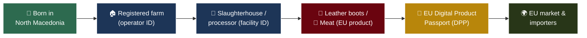
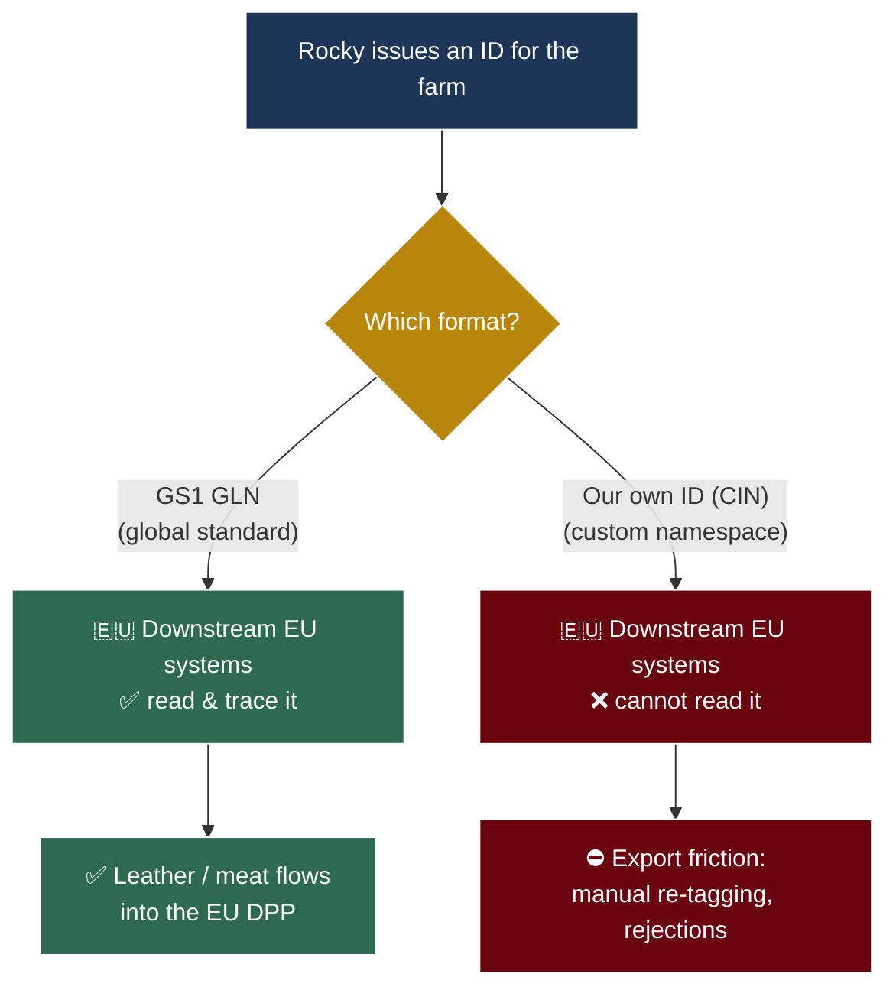
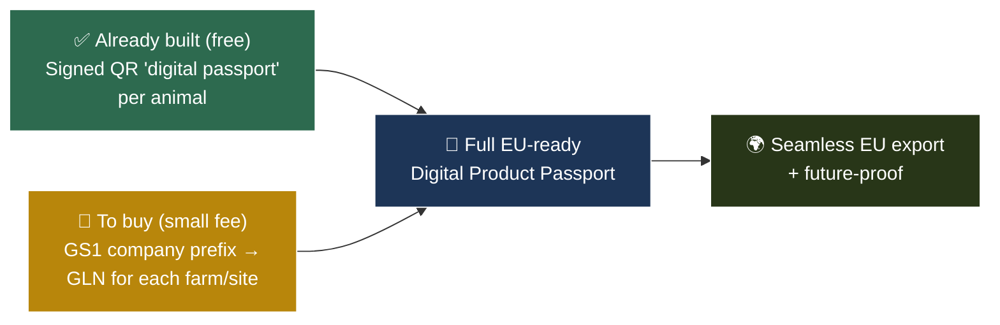

# Procurement Business Case — GS1 Company Prefix for the National Animal Traceability System (Rocky)

**Audience:** Procurement, Ministry of Agriculture / Food and Veterinary Agency leadership, and finance reviewers.
**Purpose:** Explain, in plain language, *what* we are asking you to buy, *why* it is needed, and *what the country gets in return*.
**Decision already taken (technical):** ADR-0087 — operator/facility identifiers will use the **GS1 GLN** standard; a self-issued national ID was rejected for production use. This document explains that decision to non-technical readers.

---

## 1. The short version (TL;DR)

| Question | Answer |
| --- | --- |
| **What are we buying?** | A **GS1 company prefix** (an annual membership with GS1, the global standards body). From it we issue **GLNs** — standard ID numbers — for every farm, slaughterhouse, and processing site. |
| **Why?** | When a Macedonian animal becomes leather or meat and is sold into the EU, the EU now requires a **Digital Product Passport (DPP)**. EU systems only read **GS1** ID numbers. Without GS1, our products hit a wall at the border of the European supply chain. |
| **What do we gain?** | Seamless export of leather and meat into the EU DPP; no manual re-labelling; readiness for when live animals are added to the law (~2030); and we avoid running our own national ID-issuing office. |
| **What does it cost?** | A **small annual membership fee** (contact GS1 Macedonia for the exact rate). It is tiny next to the value of uninterrupted EU export. |
| **Is the hard part already done?** | **Yes.** Rocky already produces a cryptographically signed QR "digital passport" for every animal. GS1 only fixes the *format* of the farm/site ID so everyone can read it. |

---

## 2. Background — the law that is changing the rules

The European Union passed a regulation called the **ESPR** (Ecodesign for Sustainable Products Regulation, Regulation (EU) 2024/1781). It introduces a **Digital Product Passport (DPP)**: a digital record, accessed by scanning a QR code, that tells the story of a product — where it came from, who handled it, and whether it meets the rules.

Important nuance for us:

- **Live animals (cattle) are currently *excluded*** from this law. The cow in the field is not directly regulated.
- **But the products made *from* animals are in scope.** Leather (used for shoes, bags, car seats) and footwear are among the **first** product groups covered. Meat and other animal-derived products are following.

So the moment a Macedonian cow becomes Italian leather boots, that leather needs a DPP — and the DPP must name the **farm and the facility** that handled the animal, using an ID the EU understands.

> **Plain-language takeaway:** We are not regulating cows. We are making sure that the *things cows become* can be sold into Europe without friction.

---

## 3. Diagram 1 — The journey from farm to EU consumer

Every step that handles the animal needs a standard ID. Those IDs are what feed the passport.

The two blue boxes — **the farm and the processor** — are where *our* identifiers live. If those identifiers are in a format the EU can read, the whole chain flows. If not, it stops at the border.

---

## 4. What is GS1, and what is a GLN?

**GS1** is a global, non-profit standards organisation. You already use its work every day — the **barcode** on any product in a shop is a GS1 standard.

A **GLN (Global Location Number)** is a standard number that identifies *a company or a physical location* — a farm, a warehouse, a slaughterhouse. Think of it as an **international phone number for a place of business**: unique, globally recognised, and understood by every trading partner that also uses GS1.

To issue GLNs, an organisation first obtains a **GS1 company prefix** — a block of numbers assigned to you. From that prefix you build as many GLNs as you need (one per site).

---

## 5. Why GS1 specifically — and not our own ID?

We *could* invent our own national ID system (the technical name is a "self-issued CIN"). It would work perfectly inside North Macedonia. The problem is the next step: **the downstream European systems that must read the passport were built to read GS1, and only GS1.**

This is the single most important point in this document.

---

## 6. Diagram 2 — Two paths at the EU border

A self-issued national ID is a **walled garden**: it works at home but is invisible abroad. GS1 is the **universal adapter** that lets our data travel. Choosing our own ID to "assert sovereignty" would, in practice, simply get our products quietly rejected by the very systems we need to reach.

---

## 7. What we have already built (the free part)

Rocky already produces, for every animal, a **cryptographically signed QR code** — a tamper-proof "digital passport" that proves the animal's identity and its farm of origin. The technology is finished and tested.

The *only* missing piece was the **format of the farm/site identifier**. GS1 supplies that format. There is no new engineering to do — we are buying a standard, not building a system.

---

## 8. Diagram 3 — What is built vs what we buy

---

## 9. What you gain by approving the purchase

1. **Uninterrupted EU export.** Leather and meat carry a passport the European supply chain can read automatically — no manual re-labelling, no border surprises.
2. **Future-proofing at no extra cost.** When the EU extends the law to live animals (widely expected around 2030), Rocky is already waiting for it. We will not scramble later.
3. **No national ID-issuing office to run.** GS1 operates the registry; we do not have to staff or secure our own issuing authority.
4. **Interoperability, not isolation.** Our data speaks the same language as every major trading partner, brand, and regulator that uses GS1 (essentially all of them).
5. **A small price for a large return.** The annual fee is negligible compared with the export value it protects.

---

## 10. The cost

GS1 membership is an **annual fee** set by the local GS1 member organisation (GS1 Macedonia). The exact rate depends on company size; for a public agency it is a **modest, predictable amount** — not a capital investment, not a multi-year lock-in. (Procurement to confirm the current rate with GS1 Macedonia.)

Compared with the cost of export friction — rejected shipments, manual re-tagging, lost contracts — the fee is insignificant.

---

## 11. The recommendation

**Approve the GS1 company-prefix membership for the national veterinary authority.** It is the low-cost, interoperable choice that keeps Macedonian animal products flowing into the EU Digital Product Passport ecosystem. The technical integration is already complete; this purchase is the final key that unlocks it.

The self-issued national ID remains only as a theoretical fallback, to be used solely if a GS1 prefix could not be obtained. For production and for trade, **GS1 is the decision.**

---

## 12. References (for technical readers)

- **ADR-0087** — the formal architecture decision that pins operator/facility IDs to GS1 GLN (companion technical document).
- **ADR-0086** — ESPR Digital Product Passport alignment (how Rocky maps onto the EU regulation).
- **Regulation (EU) 2024/1781 (ESPR)** — the source law: `docs/reference/OJ_L_202401781_EN_TXT.pdf` (live text: EUR-Lex `https://eur-lex.europa.eu/eli/reg/2024/1781/oj`).
- **GS1 resources** — `docs/reference/GS1-Enabling-DPP-White-Paper-1.pdf`; general guidance at `https://www.gs1.org/`.
- **ISO/IEC 15459** identifier standard — `docs/reference/iso-iec-15459-1-2014.yaml` (GS1 GLN is the ISO/IEC 15459 equivalent for locations).
