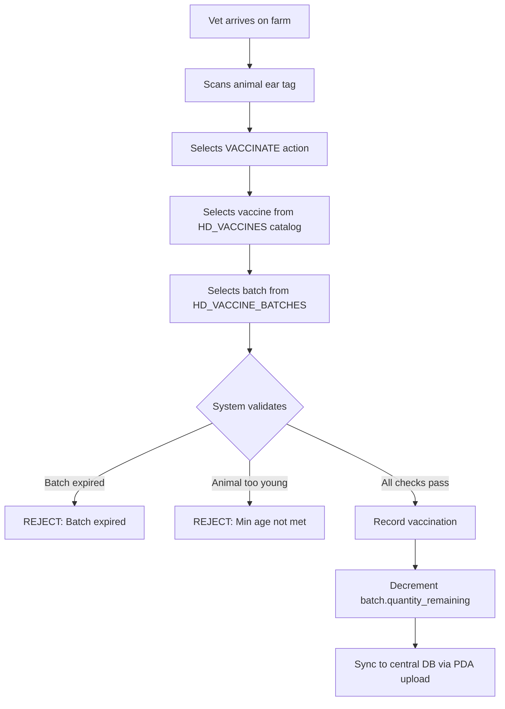
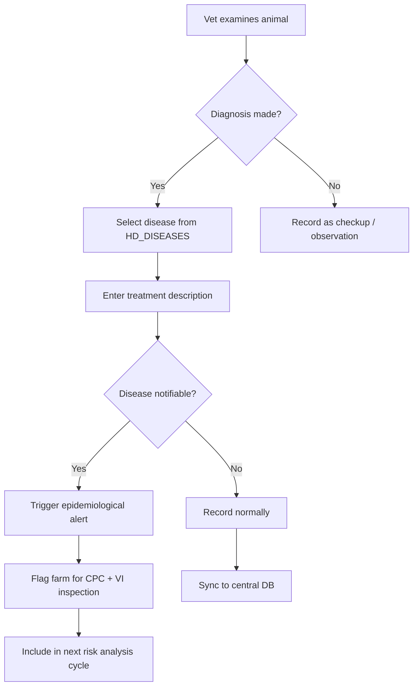
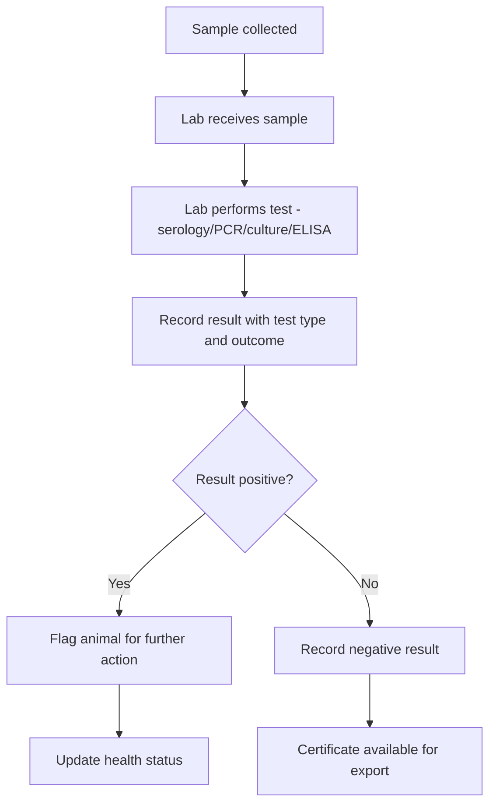
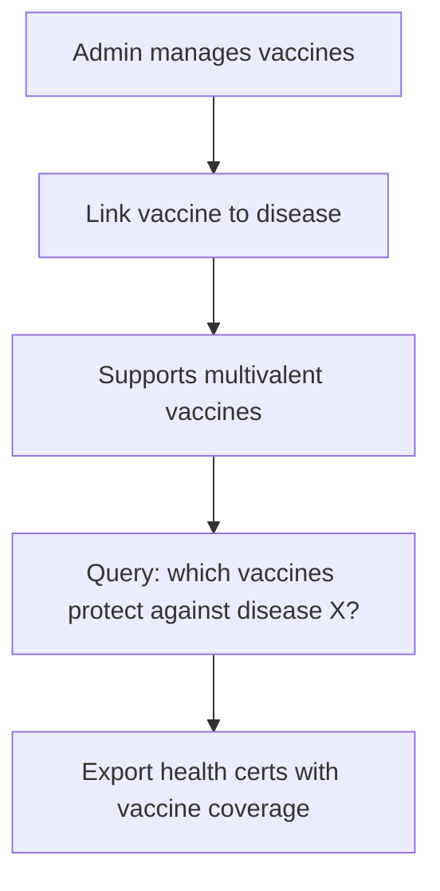

# Health Domain Service — Health Bot

**Scope:** `packages/domains/health/` — service, repository, errors
**Source spec:** `docs/old/deseases.md` — Diseases, Vaccinations, Treatments (Oracle legacy design)
**Status:** Implementation complete (Phases 1-3)

## Overview

The Animal Health module tracks **diseases**, **vaccinations**, **treatments**, **lab tests**, and **vaccine-disease links** across the national herd. Vets record health events on-farm (PDA or web), the system enforces business rules (batch expiry, age checks), and notifiable diseases trigger epidemiological alerts.

## Workflow: Vaccination



## Workflow: Treatment / Diagnosis



## Workflow: Laboratory Test



## Workflow: Vaccine-Disease Mapping



## New pgEnums

### `vaccine_type`

Created from `vaccine-type.ts` constant, consumed as `vaccineTypePgEnum` in Drizzle and `vaccineTypeSchema` in Zod validators.

| Constant | DB Value | Description |
|---|---|---|
| `VACCINE_TYPE.LIVE` | `live` | Live attenuated |
| `VACCINE_TYPE.INACTIVATED` | `inactivated` | Killed/inactivated |
| `VACCINE_TYPE.TOXOID` | `toxoid` | Toxoid (e.g. tetanus) |
| `VACCINE_TYPE.RECOMBINANT` | `recombinant` | Recombinant/subunit |
| `VACCINE_TYPE.OTHER` | `other` | Other/unspecified |

### `administration_route`

| Constant | DB Value | Description |
|---|---|---|
| `ADMIN_ROUTE.INTRAMUSCULAR` | `intramuscular` | IM injection |
| `ADMIN_ROUTE.SUBCUTANEOUS` | `subcutaneous` | SC injection |
| `ADMIN_ROUTE.INTRANASAL` | `intranasal` | Nasal spray/drop |
| `ADMIN_ROUTE.ORAL` | `oral` | Oral administration |
| `ADMIN_ROUTE.TOPICAL` | `topical` | Pour-on, spot-on |
| `ADMIN_ROUTE.OTHER` | `other` | Other routes |

### `test_type` (NEW)

| Constant | DB Value | Description |
|---|---|---|
| `TEST_TYPE.SEROLOGY` | `serology` | Antibody detection (rabies titration, TB, brucellosis) |
| `TEST_TYPE.PCR` | `pcr` | Polymerase chain reaction |
| `TEST_TYPE.CULTURE` | `culture` | Microbial culture |
| `TEST_TYPE.ELISA` | `elisa` | Enzyme-linked immunosorbent assay |
| `TEST_TYPE.NECROPSY` | `necropsy` | Post-mortem examination |
| `TEST_TYPE.OTHER` | `other` | Other methodologies |

### `test_result` (NEW)

| Constant | DB Value | Description |
|---|---|---|
| `TEST_RESULT.POSITIVE` | `positive` | Pathogen detected |
| `TEST_RESULT.NEGATIVE` | `negative` | Pathogen not detected |
| `TEST_RESULT.INCONCLUSIVE` | `inconclusive` | Inconclusive result |
| `TEST_RESULT.QUANTITATIVE` | `quantitative` | Quantitative value (e.g. 0.5 IU/ml) |

## Drizzle Schema Design

All tables in `packages/database/src/schema/hd/` — new schema directory parallel to `an/`, `sm/`, `hk/`.

### `hd/diseases.ts` — Master Disease Registry

| Column | Type | Constraints | Notes |
|---|---|---|---|
| `id` | `uuid PK` | `defaultRandom()` | |
| `name` | `varchar(100)` | `notNull`, `unique` | Disease name (e.g. "Bovine Tuberculosis") |
| `notifiable` | `boolean` | `notNull default(false)` | Triggers outbreak alert when `true` |
| `description` | `text` | nullable | Optional clinical description |
| `isActive` | `boolean` | `notNull default(true)` | |
| `createdAt` | `timestamp` | `notNull defaultNow()` | |
| `createdBy` | `uuid` | nullable | FK to users |
| `updatedAt` | `timestamp` | nullable | |
| `validTo` | `timestamp` | nullable | Soft-delete |

**Indexes:** `name` unique, `notifiable` filter index
**RLS:** Admins read/write all. Org roles read all (diseases are master data). No farm-scoped access needed for master data — exception: use `adminWrite` guard, not `rlsForFarmColumn`.

### `hd/vaccines.ts` — Master Vaccine Catalog

| Column | Type | Constraints | Notes |
|---|---|---|---|
| `id` | `uuid PK` | `defaultRandom()` | |
| `name` | `varchar(100)` | `notNull`, `unique` | Vaccine name |
| `manufacturer` | `varchar(100)` | nullable | Manufacturer name |
| `type` | `vaccine_type` pgEnum | `notNull` | live/inactivated/etc. |
| `isActive` | `boolean` | `notNull default(true)` | |
| `createdAt` | `timestamp` | `notNull defaultNow()` | |
| `createdBy` | `uuid` | nullable | |
| `updatedAt` | `timestamp` | nullable | |
| `validTo` | `timestamp` | nullable | |

**Indexes:** `name` unique
**RLS:** Same as diseases — admin-only write (`adminWrite`), org roles read.

### `hd/vaccine-batches.ts` — Batch Inventory

| Column | Type | Constraints | Notes |
|---|---|---|---|
| `id` | `uuid PK` | `defaultRandom()` | |
| `vaccineId` | `uuid` | `notNull` FK → `hd/vaccines.id` | |
| `batchNo` | `varchar(50)` | `notNull` | Manufacturer batch number |
| `productionDate` | `date` | nullable | |
| `expiryDate` | `date` | `notNull` | Must be checked before admin |
| `quantityReceived` | `integer` | `notNull` | Doses received |
| `quantityRemaining` | `integer` | `notNull` | Doses still available (decremented on use) |
| `isActive` | `boolean` | `notNull default(true)` | |
| `createdAt` | `timestamp` | `notNull defaultNow()` | |
| `createdBy` | `uuid` | nullable | |
| `updatedAt` | `timestamp` | nullable | |
| `validTo` | `timestamp` | nullable | |

**Indexes:** `vaccineId`, `batchNo`, `expiryDate`
**RLS:** Admins + org roles read/write all batches. No farm-scoping — batches are inventory at VS/CPC level.

### `hd/vaccinations.ts` — Vaccination Events

| Column | Type | Constraints | Notes |
|---|---|---|---|
| `id` | `uuid PK` | `defaultRandom()` | |
| `animalId` | `uuid` | `notNull` FK → `an/animals.id` | The vaccinated animal |
| `vaccineId` | `uuid` | `notNull` FK → `hd/vaccines.id` | Vaccine used |
| `batchId` | `uuid` | `notNull` FK → `hd/vaccine-batches.id` | Specific batch |
| `farmId` | `uuid` | `notNull` FK → `hk/farms.id` | Farm where vaccination occurred |
| `vetId` | `uuid` | `notNull` | FK to auth/users — the administering vet |
| `adminDate` | `date` | `notNull` | Date of administration |
| `route` | `administration_route` pgEnum | `notNull` | IM/SC/intranasal/etc. |
| `notes` | `text` | nullable | Vet's notes |
| `isActive` | `boolean` | `notNull default(true)` | |
| `createdAt` | `timestamp` | `notNull defaultNow()` | |
| `createdBy` | `uuid` | nullable | |
| `updatedAt` | `timestamp` | nullable | |
| `validTo` | `timestamp` | nullable | |

**Indexes:** `animalId`, `vaccineId`, `farmId`, `vetId`, `adminDate`
**RLS:** `rlsForFarmColumn(table.farmId)` for read, `adminAndVetWrite` for write.

### `hd/treatments.ts` — Treatment / Diagnosis Events

| Column | Type | Constraints | Notes |
|---|---|---|---|
| `id` | `uuid PK` | `defaultRandom()` | |
| `animalId` | `uuid` | `notNull` FK → `an/animals.id` | |
| `diseaseId` | `uuid` | nullable FK → `hd/diseases.id` | Nullable — routine checkups have no diagnosis |
| `farmId` | `uuid` | `notNull` FK → `hk/farms.id` | |
| `vetId` | `uuid` | `notNull` | FK to auth/users |
| `diagnosisDate` | `date` | `notNull` | |
| `treatmentDesc` | `text` | nullable | Free-text treatment notes |
| `isolated` | `boolean` | `notNull default(false)` | Animal isolated from herd |
| `isActive` | `boolean` | `notNull default(true)` | |
| `createdAt` | `timestamp` | `notNull defaultNow()` | |
| `createdBy` | `uuid` | nullable | |
| `updatedAt` | `timestamp` | nullable | |
| `validTo` | `timestamp` | nullable | |

**Indexes:** `animalId`, `diseaseId`, `farmId`, `vetId`, `diagnosisDate`
**RLS:** `rlsForFarmColumn(table.farmId)` for read, `adminAndVetWrite` for write.

### `hd/lab-tests.ts` — Laboratory Test Results (NEW)

| Column | Type | Constraints | Notes |
|---|---|---|---|
| `id` | `uuid PK` | `defaultRandom()` | |
| `animalId` | `uuid` | `notNull` FK → `an/animals.id` | Animal tested |
| `farmId` | `uuid` | `notNull` FK → `hk/farms.id` | Farm where test was conducted |
| `diseaseId` | `uuid` | `notNull` FK → `hd/diseases.id` | Disease/pathogen tested for |
| `testType` | `test_type` pgEnum | `notNull` | serology/pcr/culture/elisa/necropsy/other |
| `testMethod` | `varchar(100)` | nullable | Specific test methodology (e.g. "RFFIT", "SVANOVIR FMD-3AB") |
| `result` | `test_result` pgEnum | `notNull` | positive/negative/inconclusive/quantitative |
| `resultNumeric` | `numeric(10,3)` | nullable | Quantitative value (e.g. 0.5) |
| `resultUnit` | `varchar(20)` | nullable | Unit of measurement (e.g. "IU/ml", "TCID50") |
| `interpretation` | `text` | nullable | Clinical interpretation (e.g. "Pass — meets OIE standard ≥0.5 IU/ml") |
| `labName` | `varchar(200)` | nullable | Laboratory name |
| `labSampleId` | `varchar(50)` | nullable | Lab's internal sample reference |
| `sampleDate` | `date` | `notNull` | Date sample was collected |
| `resultDate` | `date` | `notNull` | Date result was issued |
| `certificateRef` | `varchar(50)` | nullable | Reference to health certificate for export |
| `isActive` | `boolean` | `notNull default(true)` | |
| `createdAt` | `timestamp` | `notNull defaultNow()` | |
| `createdBy` | `uuid` | nullable | |
| `updatedAt` | `timestamp` | nullable | |
| `validTo` | `timestamp` | nullable | |

**Indexes:** `animalId`, `farmId`, `diseaseId`, `testType`, `resultDate`
**RLS:** `rlsForFarmColumn(table.farmId)` for read, `adminAndVetWrite` for write.

### `hd/vaccine-diseases.ts` — Vaccine-to-Disease Mapping (NEW)

| Column | Type | Constraints | Notes |
|---|---|---|---|
| `id` | `uuid PK` | `defaultRandom()` | |
| `vaccineId` | `uuid` | `notNull` FK → `hd/vaccines.id` ON DELETE CASCADE | |
| `diseaseId` | `uuid` | `notNull` FK → `hd/diseases.id` ON DELETE CASCADE | |
| `createdAt` | `timestamp` | `notNull defaultNow()` | |
| `createdBy` | `uuid` | nullable | |

**Indexes:** Unique index on `(vaccineId, diseaseId)`, individual indexes on each FK
**RLS:** `adminWrite` — admin-only for managing mappings.

## Business Rules

| # | Rule | Check | Enforcement Layer | Status |
|-- |------|-------|-------------------|--------|
| 1 | **Batch not expired** — `adminDate <= batch.expiryDate` | Service | `HealthService.recordVaccination()` | ✅ |
| 2 | **Min age for vaccination** — animal age >= 30 days | Service | `HealthService.recordVaccination()` — `daysBetween(animal.birthDate, adminDate) < MIN_VACCINATION_AGE_DAYS` | ✅ (added 2026-07-05) |
| 3 | **Notifiable disease trigger** — if `disease.notifiable` and treatment recorded, flag farm for inspection | Service | `HealthService.recordTreatment()` → `InspectionRepository.flagFarmForInspection()` | ✅ |
| 4 | **Stock reconciliation** — `batch.quantityReceived = batch.quantityRemaining + SUM(doses from vaccinations)` | Report | Manual report or scheduled check | N/A |
| 5 | **Only VET role can record** — vetId must map to a user with VET role on the farm | Auth | `ProtectedMiddleware` + `RequirePermission` | ✅ |
| 6 | **No future dates** — adminDate, diagnosisDate, sampleDate <= today | Zod | `health.api.ts` refinement | ✅ |
| 7 | **Animal must be alive** — `animal.status == ALIVE` | Service | `HealthService.recordVaccination()` + `recordTreatment()` — `AnimalRepository.findById()` + `ANIMAL_STATUS.ALIVE` check | ✅ (added 2026-07-05) |
| 8 | **Batch quantity decrement** — `quantityRemaining -= 1` on each vaccination | Repo | `HealthRepository.decrementBatchQuantity()` in same transaction | ✅ |
| 9 | **Batch quantity non-negative** — `quantityRemaining >= 0` after decrement | DB | Check constraint `ck_quantity_non_negative` on `vaccine_batches` | ✅ (added 2026-07-05) |
| 10 | **Unique batchNo per vaccine** — same batchNo for different vaccines is allowed | DB | Partial unique index `(vaccineId, batchNo)` | ✅ |
| 11 | **Unique vaccine-disease link** — same pair cannot be linked twice | DB | Unique index `(vaccineId, diseaseId)` | ✅ |
| 12 | **Lab test result date >= sample date** | Zod | `recordLabTestRequestSchema` refinement | ✅ |

## RLS Strategy

| Table | USING (read) | WITH CHECK (write) |
|---|---|---|
| `diseases` | All authenticated users | `adminWrite` — only SUPER_ADMIN/ADMIN |
| `vaccines` | All authenticated users | `adminWrite` — only SUPER_ADMIN/ADMIN |
| `vaccine_batches` | Org-scoped (admin bypass) | `adminWrite` — batch management is CPC/VS level |
| `vaccinations` | `rlsForFarmColumn(farmId)` | `adminAndVetWrite` — admins + vets can record |
| `treatments` | `rlsForFarmColumn(farmId)` | `adminAndVetWrite` — admins + vets can record |
| `lab_tests` | `rlsForFarmColumn(farmId)` | `adminAndVetWrite` — admins + vets can record |
| `vaccine_diseases` | All authenticated users | `adminWrite` — admin-only for managing mappings |

## Error Codes (`HEALTH_ERRORS`)

> **Note:** All error codes use `HEALTH_` prefix in their string values (e.g., `HEALTH_NOT_FOUND`). The table below shows the short keys; the actual enum values are `HEALTH_{KEY}`.

| Code (key) | String Value | When |
|------|-------------|------|
| `NOT_FOUND` | `HEALTH_NOT_FOUND` | Disease/vaccine/animal not found |
| `VACCINE_EXPIRED` | `HEALTH_VACCINE_EXPIRED` | Batch expiry date has passed |
| `ANIMAL_TOO_YOUNG` | `HEALTH_ANIMAL_TOO_YOUNG` | Animal below minimum vaccination age |
| `BATCH_DEPLETED` | `HEALTH_BATCH_DEPLETED` | No remaining doses in batch |
| `ANIMAL_NOT_ALIVE` | `HEALTH_ANIMAL_NOT_ALIVE` | Cannot treat a dead animal |
| `INVALID_INPUT` | `HEALTH_INVALID_INPUT` | Validation failure |
| `FORBIDDEN` | `HEALTH_FORBIDDEN` | Permission denied |
| `LAB_TEST_NOT_FOUND` | `HEALTH_LAB_TEST_NOT_FOUND` | Lab test not found |
| `VACCINE_DISEASE_CONFLICT` | `HEALTH_VACCINE_DISEASE_CONFLICT` | Vaccine already linked to this disease |
| `VACCINE_DISEASE_NOT_FOUND` | `HEALTH_VACCINE_DISEASE_NOT_FOUND` | Vaccine-disease link not found |

## Dumb Zod (`packages/database/src/zod/hd.ts`)

```typescript
export const diseaseSelectSchema = createSelectSchema(diseases);
export const diseaseInsertSchema = createInsertSchema(diseases);
export const vaccineSelectSchema = createSelectSchema(vaccines);
export const vaccineInsertSchema = createInsertSchema(vaccines);
export const vaccineBatchSelectSchema = createSelectSchema(vaccineBatches);
export const vaccineBatchInsertSchema = createInsertSchema(vaccineBatches);
export const vaccinationSelectSchema = createSelectSchema(vaccinations);
export const vaccinationInsertSchema = createInsertSchema(vaccinations);
export const treatmentSelectSchema = createSelectSchema(treatments);
export const treatmentInsertSchema = createInsertSchema(treatments);
export const labTestSelectSchema = createSelectSchema(labTests);
export const labTestInsertSchema = createInsertSchema(labTests);
export const vaccineDiseaseSelectSchema = createSelectSchema(vaccineDiseases);
export const vaccineDiseaseInsertSchema = createInsertSchema(vaccineDiseases);
```

Note: Dumb Zod has NO `.strict()`, `.omit()`, `.extend()` — those go in `/validators`.

## Schema Directory: `packages/database/src/schema/hd/`

New `hd/` directory alongside existing `an/`, `sm/`, `hk/`. Distinct prefix avoids confusion with animal domain.

## Implementation Status

1. **Phase 1:** Constants + pgEnums + Drizzle schemas → generate → push ✅
2. **Phase 2:** Dumb Zod + validators (API schemas with guillotines) ✅
3. **Phase 3:** Health service + repository (CRUD + batch decrement + age check + animal alive check) ✅ (Rules 2 and 7 added 2026-07-05; Rule 9 check constraint added to schema)
4. **Phase 4:** Notifiable disease alert → InspectionRepository.flagFarmForInspection() ✅
5. **Phase 5:** PDA sync (download master data, upload vaccination/treatment records) ✅ (2026-07-05: `syncDownload()` + `syncUpload()` endpoints) |

## ✅ Missing tRPC Router Endpoints — FIXED (2026-07-05)

The health service has 20 methods, and the tRPC router (`apps/api/src/routers/health.router.ts`) now exposes **17** of them. All missing endpoints from the original audit have been added:

| Service Method | Router Endpoint | Status |
|---------------|----------------|--------|
| `recordLabTest()` | ✅ Added | ✅ |
| `getLabTest()` | ✅ Added | ✅ |
| `listLabTests()` | ✅ Added | ✅ |
| `linkVaccineDisease()` | ✅ Added | ✅ |
| `unlinkVaccineDisease()` | ✅ Added | ✅ |
| `getVaccineDiseases()` | ✅ Added | ✅ |
| `listBatches()` | ✅ Added | ✅ |

Corresponding validators were already present in `packages/validators/src/api/health.api.ts` and are now wired in the router. The 3 remaining unexposed methods (`createDisease`, `updateDisease`, `updateVaccine`) are intentionally admin-only and can be added when needed.

## Method Name Differences

The actual code uses slightly different method names than what earlier docs claimed:

| Earlier Claim | Actual Name |
|--------------|-------------|
| `getDiseaseById` | `getDisease` |
| `linkVaccineToDisease` | `linkVaccineDisease` |
| `unlinkVaccineFromDisease` | `unlinkVaccineDisease` |
| `decrementBatch` | `decrementBatchQuantity` |
