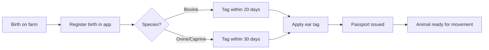
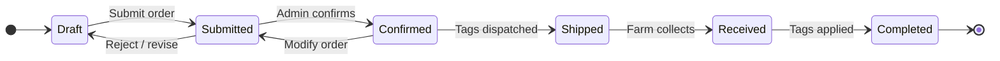
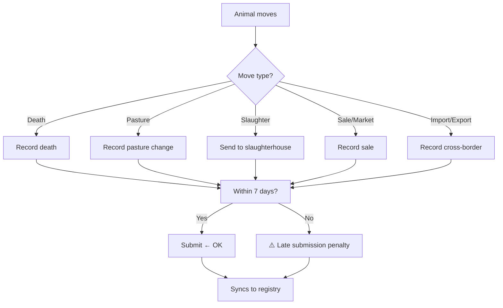
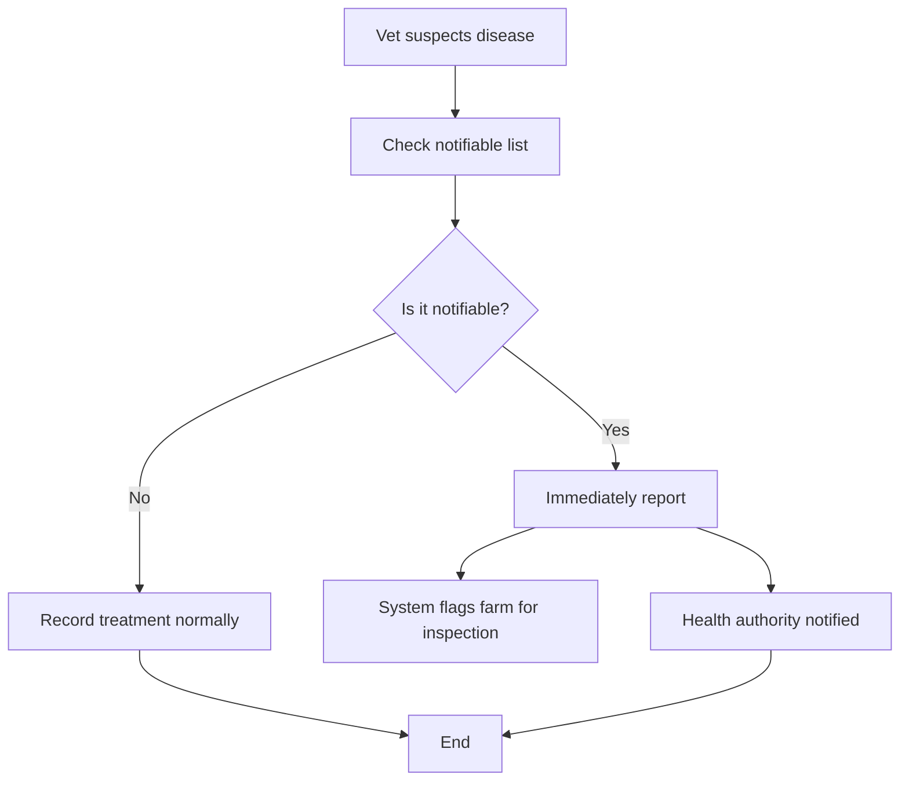
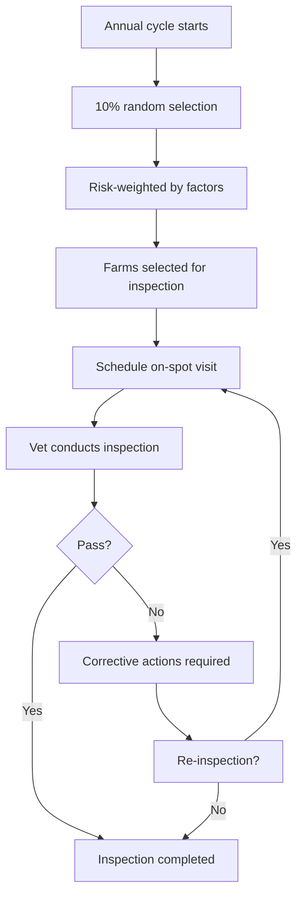
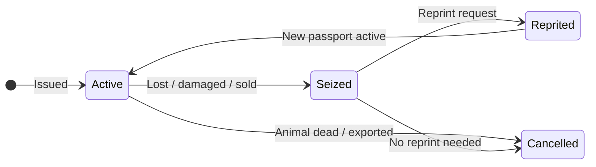

# Plan: Farmer & Veterinarian User Guide

## 1. Goal

Create a user-facing documentation section in the existing Nextra docs site (`apps/docs/`) that enables **farmers** and **veterinarians** in North Macedonia to use the Rocky livestock tracking system correctly, on time, and without regulatory penalties. **Secondary goal**: identify feature gaps by documenting what *should* exist and noting where the system does not yet support it.

## 2. Delivery & Constraints

| Dimension | Decision |
|-----------|----------|
| **Language** | English (MVP — Macedonian translation is a follow-up) |
| **Platform** | Same Nextra docs site; new directory `apps/docs/content/user-guide/` |
| **Format** | MDX pages with Mermaid diagrams for workflows & state machines |
| **No** | Landing pages, PDF export, separate site |
| **Audience** | Farmers (mobile app) + Vets (mobile + web admin) |

## 3. Content Architecture

### 3.1 Navigation Placement

Insert a new **User Guide** section in the site navigation, after "Get Started" and before the developer-oriented "Learn" section. This keeps user-facing content at the top of the sidebar — the farmer should see their guide before developer docs.

**`apps/docs/content/_meta.ts` — additions:**

```ts
import type { Meta } from 'nextra'

const meta: Meta = {
  // Landing
  index: 'Introduction',
  'get-started': 'Get Started',

  // --- User Guide (NEW) ---
  '###user-guide': { type: 'separator', title: 'User Guide' },
  'user-guide': 'Overview',

  // --- Learn (existing, unchanged) ---
  '###learn': { type: 'separator', title: 'Learn' },
  tutorials: 'Tutorials',

  // ... rest unchanged
}
```

### 3.2 Folder Structure

```
apps/docs/content/user-guide/
  _meta.ts                        # Sub-navigation config
  index.mdx                       # User Guide landing page

  # --- Section 1: Getting Started ---
  getting-started/
    _meta.ts
    index.mdx                     # Welcome & system overview
    account-setup.mdx             # Register / sign in / sign out
    navigation.mdx                 # App tour: tabs explained, offline indicator

  # --- Section 2: Animals & Ear Tags ---
  animals/
    _meta.ts
    index.mdx                     # Animals section overview
    birth-registration.mdx        # Register a new birth
    ear-tag-orders.mdx            # Order + collect ear tags
    managing-animals.mdx          # Search, view details, correct

  # --- Section 3: Movements ---
  movements/
    _meta.ts
    index.mdx                     # When must you record a movement?
    death.mdx                     # Record animal death (on-farm, in-transit, at slaughter)
    pasture.mdx                   # Pasture movement
    slaughter.mdx                 # Send to slaughter
    market.mdx                    # Market / sale movement
    import-export.mdx             # Cross-border movements

  # --- Section 4: Health ---
  health/
    _meta.ts
    index.mdx                     # Health management overview
    vaccinations.mdx              # Record a vaccination
    treatments.mdx                # Record treatment / diagnosis
    lab-tests.mdx                 # Lab test requests & results
    notifiable-diseases.mdx       # Disease alerts & mandatory reporting

  # --- Section 5: Passports ---
  passports/
    _meta.ts
    index.mdx                     # Cattle passport lifecycle
    apply.mdx                     # Request a passport
    seized.mdx                    # Seized / lost / damaged passport

  # --- Section 6: Inspections ---
  inspections/
    _meta.ts
    index.mdx                     # Inspection system overview
    risk-analysis.mdx             # How risk scoring works
    on-spot-inspection.mdx        # What happens during an inspection

  # --- Section 7: Corrections ---
  corrections/
    _meta.ts
    index.mdx                     # When & how to correct errors

  # --- Section 8: Account & Settings ---
  account/
    _meta.ts
    index.mdx                     # Profile, settings, notifications
    notifications.mdx             # Alert types & preferences
    offline-sync.mdx             # How offline mode works

  # --- Section 9: Web Admin Guide ---
  web-admin/
    _meta.ts
    index.mdx                     # Admin panel overview
    dashboard.mdx                 # Dashboard & KPIs
    managing-farms.mdx            # Farm CRUD & keeper management
    managing-users.mdx            # Subject roles & permissions
    audit-tools.mdx               # Audit log, compliance
    system-settings.mdx           # Feature flags, parameters
```

### 3.3 `_meta.ts` for `user-guide/`

```ts
// apps/docs/content/user-guide/_meta.ts
import type { Meta } from 'nextra'

const meta: Meta = {
  index: 'Overview',
  'getting-started': {
    title: 'Getting Started',
    type: 'menu',
    items: {
      index: 'Welcome',
      'account-setup': 'Account Setup',
      navigation: 'App Navigation',
    },
  },
  animals: {
    title: 'Animals & Ear Tags',
    type: 'menu',
    items: {
      index: 'Overview',
      'birth-registration': 'Birth Registration',
      'ear-tag-orders': 'Ear Tag Orders',
      'managing-animals': 'Managing Animals',
    },
  },
  movements: {
    title: 'Movements',
    type: 'menu',
    items: {
      index: 'Overview',
      death: 'Death',
      pasture: 'Pasture',
      slaughter: 'Slaughter',
      market: 'Market / Sale',
      'import-export': 'Import & Export',
    },
  },
  health: {
    title: 'Health',
    type: 'menu',
    items: {
      index: 'Overview',
      vaccinations: 'Vaccinations',
      treatments: 'Treatments & Diagnoses',
      'lab-tests': 'Lab Tests',
      'notifiable-diseases': 'Notifiable Diseases',
    },
  },
  passports: {
    title: 'Passports',
    type: 'menu',
    items: {
      index: 'Overview',
      apply: 'Apply for Passport',
      seized: 'Seized / Lost Passport',
    },
  },
  inspections: {
    title: 'Inspections',
    type: 'menu',
    items: {
      index: 'Overview',
      'risk-analysis': 'Risk Analysis',
      'on-spot-inspection': 'On-Spot Inspection',
    },
  },
  corrections: {
    title: 'Corrections',
    type: 'menu',
    items: {
      index: 'Overview',
    },
  },
  account: {
    title: 'Account & Settings',
    type: 'menu',
    items: {
      index: 'Overview',
      notifications: 'Notifications & Alerts',
      'offline-sync': 'Using the App Offline',
    },
  },
  'web-admin': {
    title: 'Web Admin Guide',
    type: 'menu',
    items: {
      index: 'Overview',
      dashboard: 'Dashboard',
      'managing-farms': 'Managing Farms',
      'managing-users': 'Managing Users & Permissions',
      'audit-tools': 'Audit & Compliance',
      'system-settings': 'System Settings',
    },
  },
}

export default meta
```

## 4. Mermaid Diagrams Specification

Every workflow page gets a Mermaid diagram. These are the primary way to explain the domain logic without walls of text.

### 4.1 Animals: Birth Registration → Tagging → Passport



### 4.2 Ear Tag Order Lifecycle



### 4.3 Movement Recording (with deadline awareness)



### 4.4 Health: Notifiable Disease Flow



### 4.5 Inspection Risk Analysis



### 4.6 Cattle Passport Lifecycle



## 5. Gap Analysis Framework

Every documentation page should include a **`<!-- GAP: -->` marker** at the bottom identifying features the page describes but the system does not yet implement:

| Gap ID | Where Identified | What's Missing | Severity |
|--------|-----------------|----------------|----------|
| GAP-001 | `animals/birth-registration.mdx` | Bulk birth registration (multiple calves) | Medium |
| GAP-002 | `animals/ear-tag-orders.mdx` | Tag re-order from farm without admin intervention | High |
| GAP-003 | `movements/index.mdx` | Dashboard showing pending movements with countdown to deadline | High |
| GAP-004 | `health/notifiable-diseases.mdx` | Push notification to vet when notifiable disease reported nearby | Medium |
| GAP-005 | `health/vaccinations.mdx` | Vaccination schedule / calendar view | Low |
| GAP-006 | `inspections/risk-analysis.mdx` | Farmer-facing dashboard showing their own risk score | Medium |
| GAP-007 | `corrections/index.mdx` | In-app correction request status tracking | Low |
| GAP-008 | `getting-started/navigation.mdx` | Role-based home screen (farmer vs vet see different dashboards) | High |
| GAP-009 | `movements/import-export.mdx` | Cross-border movement pre-approval workflow | Medium |
| GAP-010 | `account/offline-sync.mdx` | Offline queue status indicator showing pending items count | Low |

Each gap is documented as a comment in the MDX source and summarized per page so that when the feature is implemented, the docs site gives us a ready-made checklist.

## 6. Page Template

Every how-to page follows this structure:

```mdx
---
title: Page Title
sidebarTitle: Short Name
---

import { Mermaid } from 'nextra/mermaid'

# Page Title

<Mermaid chart={`
  // Mermaid diagram
`} />

## When to Do This

Brief context: what situation triggers this task.

## Requirements

- What you need before starting (e.g. "ear tag codes", "animal is registered")
- Legal deadlines / time windows

## Step-by-Step

1. Open the app → **Animals** tab
2. Tap **+** (add animal)
3. Enter the ear tag code
4. Select species from dropdown
5. Confirm

> **Tip:** The 7-day window starts from the date of movement, not the date you open the app.

## What Happens Next

- The system syncs to the national registry
- A passport is issued automatically (for cattle)
- You will receive a confirmation notification

---

### Feature Gap

<!-- GAP-001: The system does not yet support bulk registration of multiple calves from a single birth event. Currently each calf must be registered individually. -->

> **Note:** This page describes the current workflow. [GAP-001] Bulk birth registration is not yet available.
```

## 7. Implementation Todos

### Phase 1: Foundation (1-2 days)

- [TODO-farmer-vet-docs-001] Create folder structure: `apps/docs/content/user-guide/` with all subdirectories
- [TODO-farmer-vet-docs-002] Create `_meta.ts` for user-guide/ (navigation config)
- [TODO-farmer-vet-docs-003] Update root `apps/docs/content/_meta.ts` to add User Guide section
- [TODO-farmer-vet-docs-004] Create `user-guide/index.mdx` overview page
- [TODO-farmer-vet-docs-005] Create `user-guide/getting-started/` pages (index.mdx, account-setup.mdx, navigation.mdx)

### Phase 2: Core Workflows (3-5 days)

- [TODO-farmer-vet-docs-006] Create `user-guide/animals/` pages with Mermaid diagrams
- [TODO-farmer-vet-docs-007] Create `user-guide/movements/` pages with Mermaid diagram
- [TODO-farmer-vet-docs-008] Create `user-guide/health/` pages with Mermaid diagram
- [TODO-farmer-vet-docs-009] Create `user-guide/passports/` pages with Mermaid diagram
- [TODO-farmer-vet-docs-010] Create `user-guide/ear-tag-orders.mdx` (note: as standalone page or inside animals/)

### Phase 3: Secondary Workflows (2-3 days)

- [TODO-farmer-vet-docs-011] Create `user-guide/inspections/` pages with Mermaid diagram
- [TODO-farmer-vet-docs-012] Create `user-guide/corrections/` page
- [TODO-farmer-vet-docs-013] Create `user-guide/account/` pages (notifications.mdx, offline-sync.mdx)

### Phase 4: Web Admin Guide (2-3 days)

- [TODO-farmer-vet-docs-014] Create `user-guide/web-admin/` pages

### Phase 5: Review & Polish (1 day)

- [TODO-farmer-vet-docs-015] Verify all internal doc links resolve (`check:md-links`)
- [TODO-farmer-vet-docs-016] Verify all Mermaid diagrams render correctly
- [TODO-farmer-vet-docs-017] Run `pnpm build` to confirm no build errors

## 8. Dependencies

- **Nextra already installed** — Mermaid import via `import { Mermaid } from 'nextra/mermaid'` (available in Nextra 4)
- **MDX support** — already configured in `apps/docs/`
- **No new packages needed**

## 9. Risk Register

| Risk | Mitigation |
|------|------------|
| Domain changes mid-documentation (e.g. regulatory update) | Use ADR references in docs; update docs as part of the same commit as the domain change (RobotFarm rule) |
| Mermaid diagrams become stale | Diagrams should match code state machines in domain services; link to the source state machine definition |
| Gap analysis becomes noise | Start with real observed gaps; add `<!-- GAP: -->` markers only when confirmed by a developer |
| Content too technical for farmers | Review each page with a non-technical reader before publishing |
