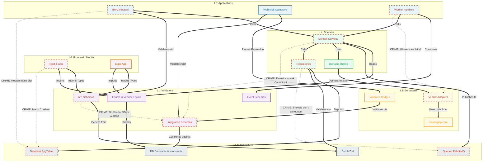

```mermaid
flowchart TD
    %% Define Styles
    classDef l6 fill:#f9f2f4,stroke:#d35400,stroke-width:2px,color:#d35400
    classDef l5 fill:#e8f4f8,stroke:#2980b9,stroke-width:2px,color:#2980b9
    classDef l4 fill:#eafaf1,stroke:#27ae60,stroke-width:2px,color:#27ae60
    classDef l3 fill:#fef9e7,stroke:#f39c12,stroke-width:2px,color:#f39c12
    classDef l1 fill:#f5eef8,stroke:#8e44ad,stroke-width:2px,color:#8e44ad
    classDef l2 fill:#eaeded,stroke:#34495e,stroke-width:2px,color:#34495e
    classDef crime color:#c0392b,stroke:#c0392b,stroke-width:2px,stroke-dasharray: 5 5

    %% Layer 6
    subgraph L6 [L6: Frontend / Mobile]
        WEB[Next.js App]
        MOB[Expo App]
    end
    class WEB,MOB l6

    %% Layer 5
    subgraph L5 [L5: Applications]
        ROUTER[tRPC Routers]
        GATEWAY[Webhook Gateways]
        HANDLER[Worker Handlers]
    end
    class ROUTER,GATEWAY,HANDLER l5

    %% Layer 4
    subgraph L4 [L4: Domains]
        SHARED[domains-shared]
        SERVICE[Domain Services]
        REPO[Repositories]
    end
    class SHARED,SERVICE,REPO l4

    %% Layer 3
    subgraph L3 [L3: Embassies]
        BRIDGE[Validated Bridges]
        ADAPTER[Vendor Adapters]
        MSGCORE[messaging-core]
    end
    class BRIDGE,ADAPTER,MSGCORE l3

    %% Layer 1
    subgraph L1 [L1: Validators]
        API_VAL[API Schemas]
        EVT_VAL[Event Schemas]
        INT_VAL[Integration Schemas]
        ENUM[Enums & Vendor-Enums]
    end
    class API_VAL,EVT_VAL,INT_VAL,ENUM l1

    %% Layer 2
    subgraph L2 [L2: Infrastructure]
        DB[Database / pgTable]
        DZOD[Dumb Zod]
        CONST[DB Constants & vconstants]
        QUEUE[Queue / RabbitMQ]
    end
    class DB,DZOD,CONST,QUEUE l2

    %% ==========================================
    %% ✅ ALLOWED IMPORTS (The Visa Matrix)
    %% ==========================================

    %% L6 Permissions
    WEB & MOB ==>|Imports Types| API_VAL
    WEB & MOB ==>|Imports| ENUM

    %% L5 Permissions
    ROUTER ==>|Calls| SERVICE
    ROUTER ==>|Validates with| API_VAL
    GATEWAY ==>|Passes Payload to| BRIDGE
    GATEWAY ==>|Validates with| INT_VAL
    HANDLER ==>|Consumes| EVT_VAL
    HANDLER ==>|Calls| SERVICE

    %% L4 Permissions
    SERVICE ==>|Reads| ENUM
    SERVICE ==>|Publishes to| QUEUE
    SERVICE ==>|Uses| SHARED
    SERVICE ==>|Calls| REPO
    REPO ==>|Digs into| DB
    REPO ==>|Validates via| DZOD
    SHARED ==>|Defines Ports for| ADAPTER

    %% L3 Permissions
    BRIDGE ==>|Validates via| INT_VAL
    ADAPTER ==>|Uses tools from| MSGCORE

    %% L1 Permissions
    API_VAL ==>|Derives from| DZOD
    INT_VAL ==>|Guillotines against| CONST
    ENUM ==>|Brands| CONST

    %% ==========================================
    %% ❌ FORBIDDEN IMPORTS (The Crimes)
    %% ==========================================

    %% Crime: Frontend touching DB
    WEB -.->|CRIME: Metro Crashes!| DB
    class WEB,DB crime

    %% Crime: Routers thinking/touching DB
    ROUTER -.->|CRIME: Routers don't dig!| DB
    class ROUTER,DB crime

    %% Crime: Repositories announcing things
    REPO -.->|CRIME: Shovels don't announce!| QUEUE
    class REPO,QUEUE crime

    %% Crime: Handlers playing diplomat
    HANDLER -.->|CRIME: Workers are blind!| ADAPTER
    class HANDLER,ADAPTER crime

    %% Crime: Domains knowing about Capitalism
    SERVICE -.->|CRIME: Domains speak Canonical!| INT_VAL
    class SERVICE,INT_VAL crime

    %% Crime: API schemas skipping the line
    API_VAL -.->|CRIME: No Vendor SDKs in APIs!| INT_VAL
    class API_VAL,INT_VAL crime

```
